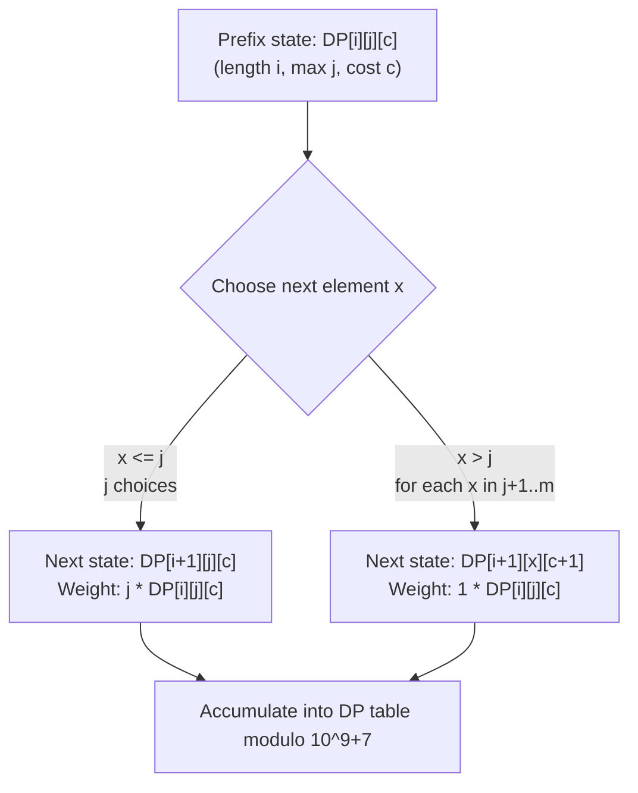

# Guided Example: Build Array Where You Can Find The Maximum Exactly K Comparisons

We trace the step-by-step execution of three-dimensional Dynamic Programming on a representative problem instance:

- **Input:** $n = 2, m = 3, k = 1$
- **Required Output:** $6$

This instance features non-trivial prefix maximum constraints, shows how new elements either preserve or update the running record, and demonstrates state accumulation across distinct peak values modulo $10^9 + 7$.

---

## 1. Instance & Teaching Goal

We are asked to construct an array `arr` of length $n$ whose elements are integers in the range $[1, m]$. When scanning the array from left to right to locate the global maximum:
- `maximum_value` starts at $-1$, and `search_cost` starts at $0$.
- Each time an element strictly exceeds `maximum_value`, `maximum_value` is updated to this element and `search_cost` increments by $1$.
- The final `search_cost` must equal exactly $k$.

We must return the total number of distinct arrays satisfying these properties modulo $10^9 + 7$.

For $n = 2, m = 3, k = 1$:
- The first element $arr[0]$ always updates `maximum_value` (since $arr[0] \ge 1 > -1$), setting `search_cost` to $1$.
- For the final cost to remain $k = 1$, the second element $arr[1]$ must **not** strictly exceed $arr[0]$ ($arr[1] \le arr[0]$).
- If $arr[0] = 1$: $arr[1] \in \{1\} \implies [1, 1]$ ($1$ array).
- If $arr[0] = 2$: $arr[1] \in \{1, 2\} \implies [2, 1], [2, 2]$ ($2$ arrays).
- If $arr[0] = 3$: $arr[1] \in \{1, 2, 3\} \implies [3, 1], [3, 2], [3, 3]$ ($3$ arrays).
- Total valid arrays: $1 + 2 + 3 = 6$.

The primary teaching goal is to formulate a 3D dynamic programming recurrence tracking $(i, j, c)$—prefix length, current maximum, and accumulated comparison cost—and understand the dual branch transitions when appending a new element.

---

## 2. Conceptual Foundation & Invariants

Let $DP[i][j][c]$ denote the number of valid prefixes of length $i$ ($1 \le i \le n$) whose maximum element is $j$ ($1 \le j \le m$) and whose prefix search cost is $c$ ($1 \le c \le k$).

### Base Case ($i = 1$)
The first element can be any integer $j \in [1, m]$. It always establishes maximum $j$ with search cost $1$:
$$
DP[1][j][1] = 1 \quad \forall j \in [1, m]
$$
All other entries for $i = 1$ with $c \neq 1$ are $0$.

### Transitions to Length $i + 1$
When appending an element $x \in [1, m]$ to a prefix of length $i$ having maximum $j$ and cost $c$:
1. **No New Maximum ($x \le j$):**
   The running maximum remains $j$, and cost remains $c$.
   There are $j$ valid choices for $x$ ($x \in \{1, 2, \dots, j\}$):
   $$
   DP[i + 1][j][c] \mathrel{+}= j \cdot DP[i][j][c]
   $$
2. **New Maximum Established ($x > j$):**
   The new maximum becomes $x$, and cost increments to $c + 1$.
   Summing over all prior lower maximums $j \in [1, x - 1]$:
   $$
   DP[i + 1][x][c + 1] \mathrel{+}= \sum_{j = 1}^{x - 1} DP[i][j][c]
   $$

### Final Answer
$$
\text{Total Ways} = \sum_{j = 1}^m DP[n][j][k] \pmod{10^9 + 7}
$$

```
Prefix DP Branching for n = 2, m = 3, k = 1:
i = 1:
  [1] (max 1, cost 1) ---> Append x in {1}:      [1, 1] (max 1, cost 1) [1 way]
  [2] (max 2, cost 1) ---> Append x in {1, 2}:   [2, 1], [2, 2] (max 2, cost 1) [2 ways]
  [3] (max 3, cost 1) ---> Append x in {1, 2, 3}: [3, 1], [3, 2], [3, 3] (max 3, cost 1) [3 ways]

Total at i = 2 with cost 1: 1 + 2 + 3 = 6
```

We establish tracking parameters for the dynamic programming grid:

| Parameter | Domain | Role in Recurrence |
|---|---|---|
| Prefix Length ($i$) | $1 \dots n$ | Current number of array elements placed |
| Current Max ($j$) | $1 \dots m$ | Highest numerical value present in prefix |
| Search Cost ($c$) | $1 \dots k$ | Number of running strict maximum updates incurred |
| State Value $DP[i][j][c]$ | Non-negative integer | Count of valid prefixes satisfying $(i, j, c) \pmod{10^9 + 7}$ |

> **Invariant.** At prefix length $i$, $DP[i][j][c]$ accurately counts all assignments of $i$ elements from $[1, m]$ such that the maximum element is $j$ and exactly $c$ strict left-to-right maximum updates occur.



---

## 3. Step-by-Step Worked Execution

### Step 1: Base Case Initialization at Length $i = 1$

For length $i = 1$, the first element is placed. Any value $j \in \{1, 2, 3\}$ has cost $c = 1$:
- $DP[1][1][1] = 1$ (represents `[1]`)
- $DP[1][2][1] = 1$ (represents `[2]`)
- $DP[1][3][1] = 1$ (represents `[3]`)
- All other combinations for $i = 1$ are $0$.

| Prefix Length ($i$) | Current Max ($j$) | Current Cost ($c$) | Represented Prefix | Array Count $DP[1][j][c]$ |
|---|---|---|---|---|
| $1$ | $1$ | $1$ | `[1]` | $1$ |
| $1$ | $2$ | $1$ | `[2]` | $1$ |
| $1$ | $3$ | $1$ | `[3]` | $1$ |

---

### Step 2: Transitions to Length $i = 2$ with Target Cost $c = 1$

Since the target cost is $k = 1$, the second element $x$ cannot trigger a new maximum. Thus, we only evaluate the non-updating branch ($x \le j$):

1. **Prior Max $j = 1$:**
   - Valid next elements: $x \in \{1\}$ ($1$ choice).
   - $DP[2][1][1] = 1 \cdot DP[1][1][1] = 1 \cdot 1 = 1$.
   - Array produced: `[1, 1]`.
2. **Prior Max $j = 2$:**
   - Valid next elements: $x \in \{1, 2\}$ ($2$ choices).
   - $DP[2][2][1] = 2 \cdot DP[1][2][1] = 2 \cdot 1 = 2$.
   - Arrays produced: `[2, 1]`, `[2, 2]`.
3. **Prior Max $j = 3$:**
   - Valid next elements: $x \in \{1, 2, 3\}$ ($3$ choices).
   - $DP[2][3][1] = 3 \cdot DP[1][3][1] = 3 \cdot 1 = 3$.
   - Arrays produced: `[3, 1]`, `[3, 2]`, `[3, 3]`.

| Target Max ($j$) | Candidate $x$ Range | Multiplier ($j$) | Prior State $DP[1][j][1]$ | Resulting State $DP[2][j][1]$ | Resulting Arrays |
|---|---|---|---|---|---|
| $1$ | $\{1\}$ | $1$ | $1$ | $1 \times 1 = 1$ | `[1, 1]` |
| $2$ | $\{1, 2\}$ | $2$ | $1$ | $2 \times 1 = 2$ | `[2, 1]`, `[2, 2]` |
| $3$ | $\{1, 2, 3\}$ | $3$ | $1$ | $3 \times 1 = 3$ | `[3, 1]`, `[3, 2]`, `[3, 3]` |

---

### Step 3: Final Aggregation Across Maximum Values

At target length $n = 2$ and target cost $k = 1$, we sum across all terminal maximums $j \in \{1, 2, 3\}$:
$$
\text{Total} = DP[2][1][1] + DP[2][2][1] + DP[2][3][1] = 1 + 2 + 3 = 6
$$
Final emitted answer is $6$.

---

## 4. Complete Execution Trace

| Step Phase | State Evaluated | Transition Rule | Formula Applied | Subtotal |
|---|---|---|---|---|
| Base Length 1 | $DP[1][1][1]$ | Initial placement | Single element `[1]` | $1$ |
| Base Length 1 | $DP[1][2][1]$ | Initial placement | Single element `[2]` | $1$ |
| Base Length 1 | $DP[1][3][1]$ | Initial placement | Single element `[3]` | $1$ |
| Extend Length 2 | $DP[2][1][1]$ | Append $x \le 1$ | $1 \times DP[1][1][1] = 1$ | $1$ |
| Extend Length 2 | $DP[2][2][1]$ | Append $x \le 2$ | $2 \times DP[1][2][1] = 2$ | $2$ |
| Extend Length 2 | $DP[2][3][1]$ | Append $x \le 3$ | $3 \times DP[1][3][1] = 3$ | $3$ |
| Final Sum | All $j \in \{1, 2, 3\}$ | Sum over $j$ | $1 + 2 + 3$ | $6$ |

---

## 5. Algorithmic Correctness

**Soundness.** Every counted array strictly adheres to the length constraint $n$, value domain $[1, m]$, and exact search cost $k$. The decomposition partitions the state space by the current maximum $j$ and search cost $c$. Because transitions cleanly separate non-updating choices ($x \le j$) from updating choices ($x > j$), no array can be counted multiple times or misclassified in comparison cost.

**Completeness.** Any valid array of length $n$ must end with some maximum value $j \in [1, m]$. Working forwards from base single-element states to length $n$ accounts for all possible combinations of assignments. Summing $DP[n][j][k]$ across all $j \in [1, m]$ exhaustively aggregates every valid sequence.

---

## 6. Traps This Instance Exposes

- **Infeasible Parameter Guard:** If $k = 0$, $k > n$, or $k > m$, no valid array can exist, and the algorithm must return $0$ immediately.
- **Neglecting the Scaling Multiplier:** When appending $x \le j$, forgetting to multiply by $j$ treats all smaller choices as a single possibility rather than $j$ distinct choices.
- **Cubic vs Quadratic Inner Loop:** Naively computing $\sum_{j=1}^{x-1} DP[i][j][c-1]$ takes $\mathcal{O}(m)$ per state, totaling $\mathcal{O}(n \cdot m^2 \cdot k)$. Maintaining running prefix sums over $j$ optimizes this transition to $\mathcal{O}(1)$, reducing total time to $\mathcal{O}(n \cdot m \cdot k)$.
- **Modulo Overflows:** Intermediate multiplications and additions must be reduced modulo $10^9 + 7$ at each step to avoid integer overflow.

---

## 7. Complexity Derivation

- **Time Complexity:** $\mathcal{O}(n \cdot m \cdot k)$ with prefix sum optimization over the prior maximums. For each step $i \in [1, n - 1]$ and cost $c \in [1, k]$, running prefix sums allow the update $\sum_{p=1}^{x-1} DP[i][p][c-1]$ to be retrieved in $\mathcal{O}(1)$ time. With $n \le 50, m \le 100, k \le 50$, total operations are bounded by $50 \times 100 \times 50 = 2.5 \cdot 10^5$, well within real-time limits.
- **Auxiliary Space Complexity:** $\mathcal{O}(n \cdot m \cdot k)$ for the full 3D dynamic programming table, or $\mathcal{O}(m \cdot k)$ using two rolling 2D tables across step $i$.