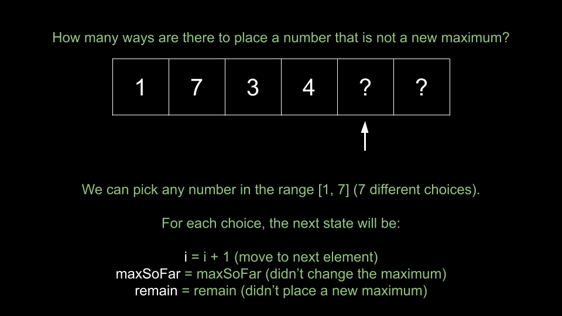
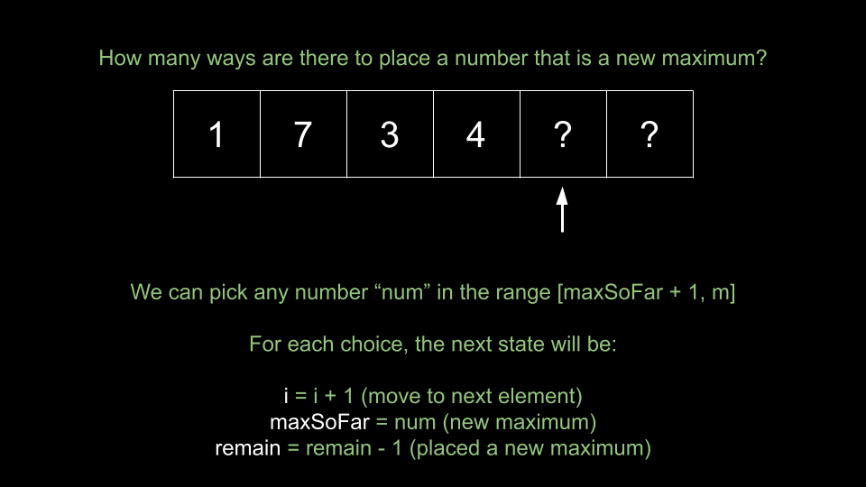
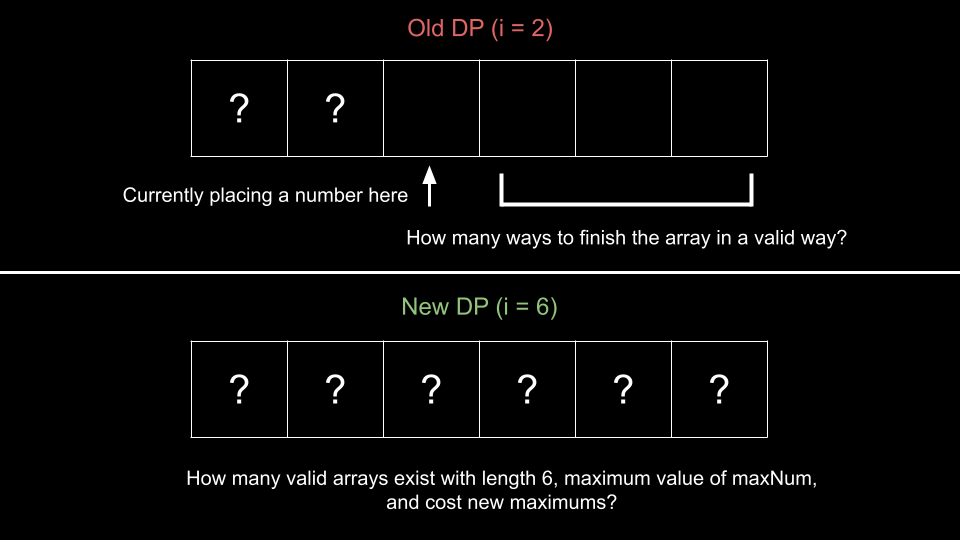

## Solution

---

### Approach 1: Top-Down Dynamic Programming

**Intuition**

> **Note.** For this approach, we assume that you already know the fundamentals of dynamic programming and are figuring out how to apply it to a wide range of problems, such as this one. If you are not yet at this stage, we recommend checking out our relevant [Explore Card content on dynamic programming](https://leetcode.com/explore/featured/card/dynamic-programming/) before coming back to this problem.

Before we start solving the problem, let's carefully read the algorithm given in the problem description to try to figure out exactly what the problem is asking for. Upon careful inspection, we can deduce that the problem is asking:

> How many arrays of length `n` with values in the range `[1, m]` exist, such that you will find exactly `k` **new maximums** when traversing from left to right?

Given the massive number of possibilities, it seems impossible to actually try to build the arrays. Can we break the problem down?

Let's say you are currently building a candidate array. We don't need to know the exact contents of the array, but we need to know the following:

1. How many elements have we placed so far? Suppose we add elements to the array in order. We can represent this with an index `i` that indicates the index of the next element we will place. For example, if the current array is `[1, 6, 4]`, the next element we will place is at $i = 3$.

2. The maximum element in the array. We can represent this with an integer `maxSoFar`. In the example of `[1, 6, 4]`, we have $maxSoFar = 6$.

3. How many remaining **new maximums** must we encounter before the end? We can represent this with an integer `remain`. In the example of `[1, 6, 4]`, both `1` and `6` are maximums, so if we need a total of `x` maximums, we have $remain = x - 2$.

Given a state `i, maxSoFar, remain`, can we come up with a recursive way to solve the problem? Let's define a function `dp(i, maxSoFar, remain)` that returns the number of ways to build a valid array if we have already placed `i` elements, the maximum element we have placed so far is `maxSoFar`, and we need to place `remain` more new maximums. Then, the answer to the original problem would be `dp(0, 0, k)`. We start with an empty array and need to place `k` new maximums.

What would our base cases be?

- If $i = n$, we have filled the array. The array is valid if $remain = 0$ and we will return `1` in that case, or `0` otherwise.
- If `remain < 0`, then we have placed too many new maximums. We should immediately return `0` as it is impossible to form a valid array from this point forward.

Now that we have the base cases, how do we calculate a given state `i, maxSoFar, remain`? We will attempt to place a new element at index `i`. There are 2 possibilities:

- We place a number that is not a new maximum. How many ways are there to do this? The range of numbers we could choose from is `[1, maxSoFar]`. The size of this range is $maxSoFar - 1 + 1 = maxSoFar$. After placing a number, the next state is $i + 1, maxSoFar, remain$. We move to the next index, and `maxSoFar` and `remain` are unchanged since we didn't place a new maximum. Thus, the total possibilities is $maxSoFar * dp(i + 1, maxSoFar, remain)$.


<br>

- We place a number that is a new maximum. How many ways are there to do this? The range of numbers we could choose from is `[maxSoFar + 1, m]`. Let's say that we choose a number `num` from this range. The state would be $i + 1, num, remain - 1$. We move to the next index, `maxSoFar` is updated, and we placed a new maximum. We need to try all possibilities in the range `[maxSoFar + 1, m]`.


<br>

This gives us a recursive solution. Unfortunately, this solution is too slow as many states will be visited an exponential number of times. To solve this, we will memoize our `dp` function. The first time we solve a state, we will save the result in memory. The next time we visit the same state, we will refer to the result we saved instead of recalculating it. Also, remember that we need to perform operations modulo $10^9 + 7$ to avoid integer overflow.

**Algorithm**

All arithmetic operations should be done mod $10^9 + 7$.

1. Define a memoized function `dp(i, maxSoFar, remain)`:
- If $i = n$, return `1` if $remain = 0$, and `0` otherwise.
- If `remain < 0`, return `0`.
- Initialize `ans` as $maxSoFar * dp(i + 1, maxSoFar, remain)$.
- Iterate `num` in the range `[maxSoFar + 1, m]`:
- Add $dp(i + 1, num, remain - 1)$ to `ans`.
- Return `ans`.
2. Return `dp(0, 0, k)`, the answer to the original problem.

**Implementation**

> Implementation notes: Python doesn't overflow, so we can simply calculate the case of not placing a new maximum as $maxSoFar * dp(i + 1, maxSoFar, remain)$ directly. In Java and C++, this will result in overflow, so we will calculate the modulo on the fly during the summation over the range `[1, maxSoFar]` to prevent integer overflow, which is commonly referred to as "modular arithmetic".
>
> In Python, we also use [@functools.cache](https://docs.python.org/3/library/functools.html#functools.cache) to memoize our function.

```python
class Solution:
    def numOfArrays(self, n: int, m: int, k: int) -> int:
        @cache
        def dp(i, max_so_far, remain):
            if i == n:
                if remain == 0:
                    return 1

                return 0

            ans = (max_so_far * dp(i + 1, max_so_far, remain)) % MOD
            for num in range(max_so_far + 1, m + 1):
                ans = (ans + dp(i + 1, num, remain - 1)) % MOD

            return ans

        MOD = 10 ** 9 + 7
        return dp(0, 0, k)
```

**Complexity Analysis**

* Time complexity: $O(n \cdot m^2 \cdot k)$

    There are $n \cdot m \cdot k$ possible states of `dp`. Because of memoization, we never calculate a state more than once. To calculate a given state, we have for loops that iterate $O(m)$ times. Thus, to calculate $O(n \cdot m \cdot k)$ states costs $O(n \cdot m^2 \cdot k)$.

* Space complexity: $O(n \cdot m \cdot k)$

    The recursion call stack uses some space, but it will be dominated by the memoization of `dp`. We are storing the results of $O(n \cdot m \cdot k)$ states.

<br/>

---

### Approach 2: Bottom-Up Dynamic Programming

**Intuition**

We can also implement this dynamic programming algorithm iteratively. In top-down, we start at the answer state $i = 0, maxSoFar = 0, remain = k$ and make recursive calls until we reach our base cases. In bottom-up, we will iterate starting from the base cases toward our answer state.

Instead of using a recursive function, we will use a 3d table also called `dp`. Here, $\text{dp}[i][maxSoFar][remain]$ is equal to `dp(i, maxSoFar, remain)` from the previous approach. To convert a top-down algorithm to a bottom-up one, we can do the following:

First, set the base cases in your `dp` table. As we initialize `dp` with values of `0`, we need to manually set the base case of `1` when $i = n$ and $remain = 0$. We can set $\text{dp}[n][...][0] = 1$, where `...` represents all indices.

Next, we need to configure our for loops. We want one nested for loop per state variable, and we want the innermost loop to represent one state, analogous to a function call from the previous approach. We will iterate starting **away** from the answer state, moving toward it.

1. Our loop for `i` will start at $n - 1$ and iterate until `0`.
2. Our loop for `maxSoFar` will start at `m` and iterate until `0`.
3. Our loop for `remain` will start at `0` and iterate until `k`.

Now, within each iteration of the innermost loop, we will calculate the state `i, maxSoFar, remain` just like we did in the previous approach. Note that we need to be careful here - if $remain = 0$, we should not consider the case of placing a new maximum at all, since $remain - 1$ will be a negative index.

Finally, we can return $\text{dp}[0][0][k]$, analogous to `dp(0, 0, k)`, the answer to the original problem.

**Algorithm**

All arithmetic operations should be done mod $10^9 + 7$.

1. Initialize a 3d array $dp[n + 1][m + 1][k + 1]$.
2. Set the base cases: $\text{dp}[n][...][0] = 1$.
3. Iterate using the nested loops: `i` from $n - 1$ until `0`, `maxSoFar` from `m` until `0`, `remain` from `0` until `k`:
- Initialize $ans = maxSoFar * dp[i + 1][maxSoFar][remain]$.
- If `remain > 0`, iterate `num` from $maxSoFar + 1$ until `m`:
- Add $dp[i + 1][num][remain - 1]$ to `ans`.
- Set $\text{dp}[i][maxSoFar][remain] = ans$.
4. Return $\text{dp}[0][0][k]$, the answer to the original problem.

**Implementation**

```python
class Solution:
    def numOfArrays(self, n: int, m: int, k: int) -> int:
        dp = [[[0] * (k + 1) for _ in range(m + 1)] for __ in range(n + 1)]
        MOD = 10 ** 9 + 7

        for num in range(len(dp[0])):
            dp[n][num][0] = 1

        for i in range(n - 1, -1, -1):
            for max_so_far in range(m, -1, -1):
                for remain in range(k + 1):
                    ans = (max_so_far * dp[i + 1][max_so_far][remain]) % MOD

                    if remain > 0:
                        for num in range(max_so_far + 1, m + 1):
                            ans = (ans + dp[i + 1][num][remain - 1]) % MOD

                    dp[i][max_so_far][remain] = ans

        return dp[0][0][k]
```

**Complexity Analysis**

* Time complexity: $O(n \cdot m^2 \cdot k)$

    There are $n \cdot m \cdot k$ possible states of `dp`. We iterate over each state in our nested for loops. To calculate a given state, we have for loops that iterate $O(m)$ times. Thus, to calculate $O(n \cdot m \cdot k)$ states costs $O(n \cdot m^2 \cdot k)$.

* Space complexity: $O(n \cdot m \cdot k)$

    Our `dp` table is of size $O(n \cdot m \cdot k)$.

<br/>

---

### Approach 3: Space-Optimized Dynamic Programming

**Intuition**

Notice that in the previous two approaches, when we calculate a state `i, max_so_far, remain`, we only depend on values of $dp[i + 1]$. For example, when the outermost for loop has $i = 6$, we only reference values in $\text{dp}[7]$. Values that we previously calculated in $\text{dp}[8], \text{dp}[9], \text{dp}[10]$ etc. are no longer required.

We can use this observation to improve our space complexity. We only need to store the current row $\text{dp}[i]$ and previous row $dp[i + 1]$. We will resize `dp` so that it has dimensions $m * k$, and use a second array (of the same size) `prevDp`. At any given iteration, `dp` is analogous to $\text{dp}[i]$ from the previous approach, and `prevDp` is analogous to $dp[i + 1]$ from the previous approach.

We will reset `dp` whenever we move to a new value of `i`. When we finish calculating `dp` for a value of `i`, we update $prevDp = dp$ so that on the next iteration, `prevDp` holds the correct values.

Because our first value of `i` is $n - 1$, `prevDp` initially holds $\text{dp}[n]$ from the previous approach. This means we must initialize our base case in `prevDp`. The final value of `i` is `0`, so `dp` will represent $\text{dp}[0]$ from the previous approach. We can return $\text{dp}[0][k]$ as the answer to the original problem.

**Algorithm**

All arithmetic operations should be done mod $10^9 + 7$.

1. Initialize two 2d arrays $dp[m + 1][k + 1]$ and $prevDp[m + 1][k + 1]$.
2. Set the base cases: $prevDp[...][0] = 1$.
3. Iterate using the nested loops: `i` from $n - 1$ until `0`:
- Reset `dp`.
- `maxSoFar` from `m` until `0`:
- `remain` from `0` until `k`:
- Initialize $ans = maxSoFar * \text{prevDp}[maxSoFar][remain]$.
- If `remain > 0`, iterate `num` from $maxSoFar + 1$ until `m`:
- Add $\text{prevDp}[num][remain - 1]$ to `ans`.
- Set $\text{dp}[maxSoFar][remain] = ans$.
- Update $prevDp = dp$.
4. Return $\text{dp}[0][k]$, the answer to the original problem.

**Implementation**

```python
class Solution:
    def numOfArrays(self, n: int, m: int, k: int) -> int:
        dp = [[0] * (k + 1) for _ in range(m + 1)]
        prev_dp = [[0] * (k + 1) for _ in range(m + 1)]
        MOD = 10 ** 9 + 7

        for num in range(len(prev_dp)):
            prev_dp[num][0] = 1

        for i in range(n - 1, -1, -1):
            dp = [[0] * (k + 1) for _ in range(m + 1)]
            for max_so_far in range(m, -1, -1):
                for remain in range(k + 1):
                    ans = (max_so_far * prev_dp[max_so_far][remain]) % MOD

                    if remain > 0:
                        for num in range(max_so_far + 1, m + 1):
                            ans = (ans + prev_dp[num][remain - 1]) % MOD

                    dp[max_so_far][remain] = ans

            prev_dp = dp

        return dp[0][k]
```

**Complexity Analysis**

* Time complexity: $O(n \cdot m^2 \cdot k)$

    There are $n \cdot m \cdot k$ possible states of `dp`. We iterate over each state in our nested for loops. To calculate a given state, we have for loops that iterate $O(m)$ times. Thus, to calculate $O(n \cdot m \cdot k)$ states costs $O(n \cdot m^2 \cdot k)$.

* Space complexity: $O(m \cdot k)$

    We have improved our space complexity by only requiring our tables to be of size $O(m \cdot k)$.

<br/>

---

### Approach 4: A Different DP + Prefix Sums

**Intuition**

Let's look at the dynamic programming in a different way. It will allow us to optimize the time complexity through prefix sums. In the previous two approaches, we had $O(n \cdot m \cdot k)$ states and each state required $O(m)$ to calculate. Is there a way that we can rid of this extra $O(m)$?

In our original DP, our state `i, maxSoFar, remain` represented the following idea:

- We have placed `i` elements so far.
- The maximum element we placed so far is `maxSoFar`.
- We must place `remain` more new maximums.
- Given this information, how many ways could we place elements such that we will eventually place `n` elements with $remain = 0$?

Let's change the DP to represent this idea, replacing `maxSoFar -> maxNum` and `remain -> cost`:

- There is an array of length `i`.
- The maximum element in this array is `maxNum`.
- If you were to move from left to right, you would encounter `cost` new maximums.
- How many ways can you build this array?

As you can see, our original DP was in the context of "Given the state of an array we are building, how many ways can we finish?", while this new DP is in the context of "How many ways can we build an array that looks like this?".


<br>

The answer to this new DP will be the sum of $\text{dp}[n][maxNum][k]$ for all values of `maxNum` in the range `[1, m]`. It represents all possible arrays of length `n` with `k` new maximums.

What is our base case? If $i = 1$, it means the array only has one element. It is valid if `cost` is also equal to `1`, because any array of length `1` that goes through the algorithm in the problem description will have $\text{search}_{cost} = 1$ (the number itself is a new maximum).

To calculate a given state `i, maxNum, cost`, we have two cases, similar to the previous DP:

1. The most recently added number to the array was not a new maximum. That means it could have any value from `[1, maxNum]`. The size of this range is `maxNum`. Any of these numbers could have been added to an array with size $i - 1$, maximum value `maxNum`, and `cost` new maximums. Thus, there are $maxNum * dp[i - 1][maxNum][cost]$ ways we could have reached this state.
2. The most recently added number to the array was a new maximum. The previous maximum value in the array must have been in the range `[1, maxNum - 1]`. Let's say it was `num`. Then we must have arrived at this state from an array of length $i - 1$, with a maximum value of `num`, and $cost - 1$ new maximums. The total number of ways we could have reached this state is the sum of $dp[i - 1][num][cost - 1]$ for all `num` in the range `[1, maxNum - 1]`.

As you can see, the recurrence relation in this DP is quite similar to our old one. Here is an example recursive implementation of this new DP in Python to help you visualize the algorithm:

```python
class Solution:
    def numOfArrays(self, n: int, m: int, k: int) -> int:
        # @cache memoizes the function for us
        @cache
        def dp(i, max_num, cost):
            if i == 1:
                return cost == 1

            # current number was not a new maximum
            ans = (max_num * dp(i - 1, max_num, cost)) % MOD

            # current number was a new maximum
            for num in range(1, max_num):
                ans = (ans + dp(i - 1, num, cost - 1)) % MOD

            return ans

        MOD = 10 ** 9 + 7
        ans = 0

        for num in range(1, m + 1):
            ans = (ans + dp(n, num, k)) % MOD

        return ans
```

Here is the bottom-up version:

```python
class Solution:
    def numOfArrays(self, n: int, m: int, k: int) -> int:
        dp = [[[0] * (k + 1) for _ in range(m + 1)] for __ in range(n + 1)]
        MOD = 10 ** 9 + 7

        for num in range(1, m + 1):
            dp[1][num][1] = 1

        for i in range(1, n + 1):
            for max_num in range(1, m + 1):
                for cost in range(1, k + 1):
                    ans = (max_num * dp[i - 1][max_num][cost]) % MOD

                    for num in range(1, max_num):
                        ans = (ans + dp[i - 1][num][cost - 1]) % MOD

                    dp[i][max_num][cost] += ans
                    dp[i][max_num][cost] %= MOD

        ans = 0
        for num in range(1, m + 1):
            ans = (ans + dp[n][num][k]) % MOD

        return ans
```

> But what was the point of this? We still have an $O(m)$ for loop when calculating a state.

The expensive part of the recurrence relation is iterating from `1` to `maxNum` to find all $dp[i - 1][...][cost - 1]$. We can optimize this using prefix sums to achieve an $O(1)$ complexity.

We will have a `prefix` sum array which is the same size as `dp`. We will have:

$\text{prefix}[i][maxNum][cost] = \text{dp}[i][0][cost] + \text{dp}[i][1][cost] + ... + \text{dp}[i][maxNum][cost]$

Essentially, for a given `i, cost` pair, we can query a value of `maxNum` and find the sum of all $\text{dp}[i][num][cost]$ where `num` is in the range `[0, maxNum]`. You may notice that this is almost exactly what we are calculating in the for loop for each state!

For each state `i, maxNum, cost`, we can replace the for loop with $prefix[i - 1][maxNum - 1][cost - 1]$, which is $O(1)$!

How do we maintain `prefix`? To calculate $\text{prefix}[i]$ for a given `maxNum, cost` pair, we simply reference $\text{prefix}[i][maxNum - 1][cost]$ and add it to $\text{dp}[i][maxNum][cost]$. Remember that this is a prefix sum on the `maxNum` dimension, so $\text{prefix}[i][maxNum - 1][cost]$ is the previous element, and $\text{dp}[i][maxNum][cost]$ is the current value.

For each iteration of `i`, we require $prefix[i - 1]$ to calculate $\text{dp}[i]$. To ensure the convenient calculation of $dp[i + 1]$ for the subsequent index $i + 1$, we can build $\text{prefix}[i]$ while calculating $\text{dp}[i]$. Once we move to the next index $i + 1$, $\text{prefix}[i]$ will hold the necessary information. For example, when $i = 7$, we require data from $\text{prefix}[6]$. We calculate $\text{prefix}[7]$ during this iteration. Then, in the next iteration when $i = 8$, we require data from $\text{prefix}[7]$, which we have just calculated.

When the algorithm is finished running, we can return $\text{prefix}[n][m][k]$, which represents the answer to the original problem (the sum of all $\text{dp}[n][...][k]$).

**Algorithm**

All arithmetic operations should be done mod $10^9 + 7$.

1. Initialize two 3d arrays $dp[n + 1][m + 1][k + 1]$ and $prefix[n + 1][m + 1][k + 1]$.
2. Set the base cases: $\text{dp}[1][...][1] = 1$. Also initialize $\text{prefix}[1][...][1]$.
3. Iterate using the nested loops: `i` from `1` until `n`, `maxNum` from `1` until `m`, `cost` from `1` until `k`:
- Initialize $ans = maxNum * dp[i - 1][maxNum][cost]$.
- Add $prefix[i - 1][maxNum - 1][cost - 1]$ to `ans`.
- Add `ans` to $\text{dp}[i][maxNum][cost]$.
- Update $\text{prefix}[i][maxNum][cost]$ with $\text{prefix}[i][maxNum - 1][cost] + \text{dp}[i][maxNum][cost]$.
4. Return $\text{prefix}[n][m][k]$.

**Implementation**

> Note: Recall that in the previous 3 approaches, in Java and C++, we needed an $O(m)$ iteration to calculate the multiplication term to avoid overflow. If we want to improve the time complexity, we must perform the multiplication directly. Here, we use `long` in Java and `long long` in C++ to avoid overflow. In Python, there's no risk of overflow, so we can perform the multiplication directly without any issues.

```python
class Solution:
    def numOfArrays(self, n: int, m: int, k: int) -> int:
        dp = [[[0] * (k + 1) for _ in range(m + 1)] for __ in range(n + 1)]
        prefix = [[[0] * (k + 1) for _ in range(m + 1)] for __ in range(n + 1)]
        MOD = 10 ** 9 + 7

        for num in range(1, m + 1):
            dp[1][num][1] = 1
            prefix[1][num][1] = prefix[1][num - 1][1] + 1

        for i in range(1, n + 1):
            for max_num in range(1, m + 1):
                for cost in range(1, k + 1):
                    ans = (max_num * dp[i - 1][max_num][cost]) % MOD
                    ans = (ans + prefix[i - 1][max_num - 1][cost - 1]) % MOD

                    dp[i][max_num][cost] += ans
                    dp[i][max_num][cost] %= MOD

                    prefix[i][max_num][cost] = (prefix[i][max_num - 1][cost] + dp[i][max_num][cost]) % MOD

        return prefix[n][m][k]
```

**Complexity Analysis**

* Time complexity: $O(n \cdot m \cdot k)$

    There are $n \cdot m \cdot k$ possible states of `dp`. We iterate over each state in our nested for loops. Calculating a state now costs $O(1)$, and we also maintain `prefix` while calculating the states of `dp`.

* Space complexity: $O(n \cdot m \cdot k)$

    Our `dp` and `prefix` tables are of size $O(n \cdot m \cdot k)$.

<br/>

---

### Approach 5: Space-Optimized Better DP

**Intuition**

Just like approach 3, we can optimize space by realizing that $\text{dp}[i]$ only depends on $dp[i - 1]$ and $prefix[i - 1]$. We will use four arrays, all sized $m * k$. At any given iteration of `i`,

1. `dp` is analogous to $\text{dp}[i]$
2. `prefix` is analogous to $\text{prefix}[i]$
3. `prevDp` is analogous to $dp[i - 1]$
4. `prevPrefix` is analogous to $prefix[i - 1]$

For more details on how exactly this idea works, please read approach 3 carefully. We are applying the exact same process here.

**Algorithm**

All arithmetic operations should be done mod $10^9 + 7$.

1. Initialize 4 arrays of size `[m + 1][k + 1]`: `dp`, `prefix`, `prevDp`, `prevPrefix`.
2. Set the base cases: $dp[...][1] = 1$.
3. Iterate using the nested loops: `i` from `1` until `n`:
- If `i > 1`, reset `dp`. Always reset `prefix`.
- `maxNum` from `1` until `m`:
- `cost` from `1` until `k`:
- Initialize $ans = maxNum * \text{prevDp}[maxNum][cost]$.
- Add $prevPrefix[maxNum - 1][cost - 1]$ to `ans`.
- Add `ans` to $\text{dp}[maxNum][cost]$.
- Update $\text{prefix}[maxNum][cost]$ with $prefix[maxNum - 1][cost] + \text{dp}[maxNum][cost]$.
- Update $prevDp = dp$ and $prevPrefix = prefix$.
4. Return $\text{prefix}[m][k]$.

**Implementation**

```python
class Solution:
    def numOfArrays(self, n: int, m: int, k: int) -> int:
        dp = [[0] * (k + 1) for _ in range(m + 1)]
        prefix = [[0] * (k + 1) for _ in range(m + 1)]
        prevDp = [[0] * (k + 1) for _ in range(m + 1)]
        prevPrefix = [[0] * (k + 1) for _ in range(m + 1)]
        MOD = 10 ** 9 + 7

        for num in range(1, m + 1):
            dp[num][1] = 1

        for i in range(1, n + 1):
            if i > 1:
                dp = [[0] * (k + 1) for _ in range(m + 1)]

            prefix = [[0] * (k + 1) for _ in range(m + 1)]
            for max_num in range(1, m + 1):
                for cost in range(1, k + 1):
                    ans = (max_num * prevDp[max_num][cost]) % MOD
                    ans = (ans + prevPrefix[max_num - 1][cost - 1]) % MOD

                    dp[max_num][cost] += ans
                    dp[max_num][cost] %= MOD

                    prefix[max_num][cost] = (prefix[max_num - 1][cost] + dp[max_num][cost]) % MOD

            prevDp = dp
            prevPrefix = prefix

        return prefix[m][k]
```

**Complexity Analysis**

* Time complexity: $O(n \cdot m \cdot k)$

    There are $n \cdot m \cdot k$ possible states of `dp`. We iterate over each state in our nested for loops. Calculating a state now costs $O(1)$, and we also maintain `prefix` while calculating the states of `dp`.

* Space complexity: $O(m \cdot k)$

    Our `dp` and `prefix` tables are of size $O(m \cdot k)$.

<br/>

---