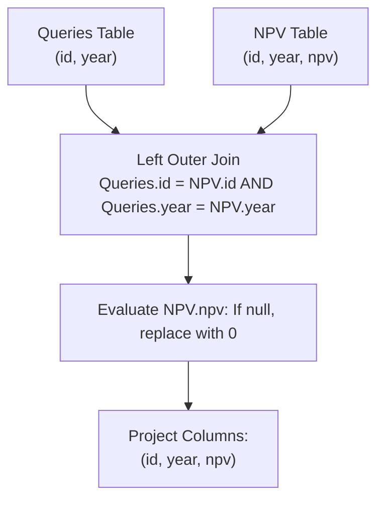

# Guided Example: NPV Queries

We trace the step-by-step execution of relational left outer join with composite-key matching and null coalescing on a representative database instance:

- **Input Tables:**
  - `NPV`:
    - `(1, 2018, 100)`
    - `(7, 2020, 30)`
    - `(13, 2019, 40)`
    - `(1, 2019, 113)`
    - `(2, 2008, 121)`
    - `(3, 2009, 12)`
    - `(11, 2020, 99)`
    - `(7, 2019, 0)`
  - `Queries`:
    - `(1, 2019)`
    - `(2, 2008)`
    - `(3, 2009)`
    - `(7, 2018)`
    - `(7, 2019)`
    - `(7, 2020)`
    - `(13, 2019)`
- **Required Output:**
  - `(1, 2019, 113)`
  - `(2, 2008, 121)`
  - `(3, 2009, 12)`
  - `(7, 2018, 0)`
  - `(7, 2019, 0)`
  - `(7, 2020, 30)`
  - `(13, 2019, 40)`

This instance features multiple records sharing the same `id` across different years ($1$ in $2018$ and $2019$; $7$ in $2018, 2019, 2020$), a query with an explicit recorded NPV of $0$ ($7$ in $2019$), and an unrecorded query requiring default fallback to $0$ ($7$ in $2018$).

---

## 1. Instance & Teaching Goal

We are given two relational entities:
1. `NPV` with composite primary key `(id, year)` and an associated integer value `npv`.
2. `Queries` with composite primary key `(id, year)` representing requested inventory evaluations.

We must produce a relation containing each query's `id`, `year`, and corresponding `npv`. If a requested pair `(id, year)` exists in `NPV`, we return its stored net present value. If no matching record exists in `NPV`, the resulting `npv` must default to $0$.

In this instance:
- `(1, 2019)` matches stored NPV $113$.
- `(2, 2008)` matches stored NPV $121$.
- `(3, 2009)` matches stored NPV $12$.
- `(7, 2018)` does not exist in `NPV`; its value defaults to $0$.
- `(7, 2019)` exists in `NPV` with an explicit stored value of $0$.
- `(7, 2020)` matches stored NPV $30$.
- `(13, 2019)` matches stored NPV $40$.

The primary teaching goal is to model optional attribute attribution using a composite left outer join ($\bowtie_{\text{left}}$) where `Queries` is the preserved relation, combined with null-coalescing projection ($\text{coalesce}(npv, 0)$).

---

## 2. Conceptual Foundation & Invariants

In relational algebra, preserving all query requests while augmenting each with optional data from `NPV` is formalized as:
$$
\mathcal{T} = \text{Queries} \bowtie_{\text{left}, \, \text{Queries.id} = \text{NPV.id} \land \text{Queries.year} = \text{NPV.year}} \text{NPV}
$$
$$
\mathcal{R} = \Pi_{\text{Queries.id} \to \text{id}, \, \text{Queries.year} \to \text{year}, \, \text{coalesce}(\text{NPV.npv}, 0) \to \text{npv}}(\mathcal{T})
$$

Because `(id, year)` is a composite key, both columns must match simultaneously:
- An inventory item in year $2018$ is logically distinct from the same inventory item in year $2019$.
- When a query tuple has no match in `NPV`, the left outer join produces a tuple where the `NPV.npv` attribute is null. Applying $\text{coalesce}(\text{npv}, 0)$ replaces null with $0$.

```
Queries (Preserved Driving Relation)    NPV Table (Lookup Relation)        Result Tuple
------------------------------------    ---------------------------        ------------
(1,  2019)  --------------------------> Matches (1, 2019, 113)         ->  (1,  2019, 113)
(2,  2008)  --------------------------> Matches (2, 2008, 121)         ->  (2,  2008, 121)
(3,  2009)  --------------------------> Matches (3, 2009, 12)          ->  (3,  2009,  12)
(7,  2018)  --------------------------> [No Match in NPV -> null]      ->  (7,  2018,   0)
(7,  2019)  --------------------------> Matches (7, 2019, 0)           ->  (7,  2019,   0)
(7,  2020)  --------------------------> Matches (7, 2020, 30)          ->  (7,  2020,  30)
(13, 2019)  --------------------------> Matches (13, 2019, 40)         ->  (13, 2019,  40)
```

We establish relational tracking parameters:

| Relational Parameter | Representation | Role in Join |
|---|---|---|
| Query Tuple ($q$) | $\langle q[\text{id}], q[\text{year}] \rangle \in \text{Queries}$ | Base record that must be retained in output |
| Lookup Key | Pair $(q[\text{id}], q[\text{year}])$ | Composite hash probe key |
| Lookup Match | Tuple in $\text{NPV}$ or $\emptyset$ | Supplies recorded `npv` if present |
| Projected Value | $\text{coalesce}(\text{npv}, 0)$ | Emitted integer attribute |

> **Invariant.** For every tuple in `Queries`, exactly one output tuple is generated with the query's `id` and `year`. If `(id, year)` exists in `NPV`, its associated `npv` is emitted; otherwise $0$ is emitted.



---

## 3. Step-by-Step Worked Execution

### Step 1: Construct In-Memory Hash Index on `NPV`

We index `NPV` by composite key `(id, year)`:
$$
\mathcal{M}_{\text{NPV}} = \{
  (1, 2018) \mapsto 100, \,
  (7, 2020) \mapsto 30, \,
  (13, 2019) \mapsto 40, \,
  (1, 2019) \mapsto 113, \,
  (2, 2008) \mapsto 121, \,
  (3, 2009) \mapsto 12, \,
  (11, 2020) \mapsto 99, \,
  (7, 2019) \mapsto 0
\}
$$

---

### Step 2: Probe Each Query Tuple in `Queries`

1. **Query $(1, 2019)$:**
   - Probe $(1, 2019)$ in $\mathcal{M}_{\text{NPV}}$: match found with value $113$.
   - Emitted tuple: $(1, 2019, 113)$.
2. **Query $(2, 2008)$:**
   - Probe $(2, 2008)$ in $\mathcal{M}_{\text{NPV}}$: match found with value $121$.
   - Emitted tuple: $(2, 2008, 121)$.
3. **Query $(3, 2009)$:**
   - Probe $(3, 2009)$ in $\mathcal{M}_{\text{NPV}}$: match found with value $12$.
   - Emitted tuple: $(3, 2009, 12)$.
4. **Query $(7, 2018)$:**
   - Probe $(7, 2018)$ in $\mathcal{M}_{\text{NPV}}$: not found ($\emptyset$).
   - Apply fallback: $\text{coalesce}(\text{null}, 0) = 0$.
   - Emitted tuple: $(7, 2018, 0)$.
5. **Query $(7, 2019)$:**
   - Probe $(7, 2019)$ in $\mathcal{M}_{\text{NPV}}$: match found with value $0$.
   - Emitted tuple: $(7, 2019, 0)$.
6. **Query $(7, 2020)$:**
   - Probe $(7, 2020)$ in $\mathcal{M}_{\text{NPV}}$: match found with value $30$.
   - Emitted tuple: $(7, 2020, 30)$.
7. **Query $(13, 2019)$:**
   - Probe $(13, 2019)$ in $\mathcal{M}_{\text{NPV}}$: match found with value $40$.
   - Emitted tuple: $(13, 2019, 40)$.

| Query Index | Key $(id, year)$ | Probe Outcome | Coalesced NPV | Emitted Result Tuple |
|---|---|---|---|---|
| $1$ | $(1, 2019)$ | Found $113$ | $113$ | $(1, 2019, 113)$ |
| $2$ | $(2, 2008)$ | Found $121$ | $121$ | $(2, 2008, 121)$ |
| $3$ | $(3, 2009)$ | Found $12$ | $12$ | $(3, 2009, 12)$ |
| $4$ | $(7, 2018)$ | Missing | $0$ (Fallback) | $(7, 2018, 0)$ |
| $5$ | $(7, 2019)$ | Found $0$ | $0$ (Stored) | $(7, 2019, 0)$ |
| $6$ | $(7, 2020)$ | Found $30$ | $30$ | $(7, 2020, 30)$ |
| $7$ | $(13, 2019)$ | Found $40$ | $40$ | $(13, 2019, 40)$ |

---

## 4. Complete Execution Trace

| Stage | Operation | Relation State |
|---|---|---|
| Indexing | Read `NPV` into hash index on $(id, year)$ | $8$ stored index entries |
| Query Probe 1 | Key $(1, 2019)$ probed | Match found $\implies 113$ |
| Query Probe 2 | Key $(2, 2008)$ probed | Match found $\implies 121$ |
| Query Probe 3 | Key $(3, 2009)$ probed | Match found $\implies 12$ |
| Query Probe 4 | Key $(7, 2018)$ probed | Missing $\implies$ Default $0$ |
| Query Probe 5 | Key $(7, 2019)$ probed | Match found $\implies 0$ |
| Query Probe 6 | Key $(7, 2020)$ probed | Match found $\implies 30$ |
| Query Probe 7 | Key $(13, 2019)$ probed | Match found $\implies 40$ |
| Projection | Project $(id, year, npv)$ | Emitted relation of $7$ rows |

---

## 5. Algorithmic Correctness

**Soundness.** Because `Queries` is the preserved relation in the left outer join, every input query row produces exactly one output row. Using both `id` and `year` in the join condition guarantees that inventory measurements from different calendar years are never conflated.

**Completeness.** Every query tuple in `Queries` is inspected. If a match exists in `NPV`, its exact stored value is retrieved; if absent, $\text{coalesce}(\text{null}, 0)$ reliably substitutes $0$, fulfilling all contractual guarantees.

---

## 6. Traps This Instance Exposes

- **Inner Join Data Loss:** Using an inner join instead of a left outer join silently discards query `(7, 2018)`, producing only $6$ rows instead of the expected $7$.
- **Single-Column Join Predicate:** Joining solely on `id` without checking `year` causes multiple ambiguous matches across different years (e.g. associating year $2018$ data with year $2020$ queries).
- **Null Value Leakage:** Omitting the coalesce fallback leaves `(7, 2018)` with `npv = null` instead of the required `0`.
- **Conflating Fallback Zero with Stored Zero:** Query `(7, 2019)` has an authentic recorded value of $0$, whereas `(7, 2018)` uses the missing fallback. Both must evaluate cleanly to $0$.

---

## 7. Complexity Derivation

- **Time Complexity:** $\mathcal{O}(|P| + |Q|)$, where $|P|$ is the number of rows in `NPV` and $|Q|$ is the number of rows in `Queries`. Building the hash index over `NPV` requires $\mathcal{O}(|P|)$ time, and probing each row of `Queries` takes $\mathcal{O}(1)$ average time per query.
- **Auxiliary Space Complexity:** $\mathcal{O}(|P|)$ to maintain the hash index on `(id, year)`.
