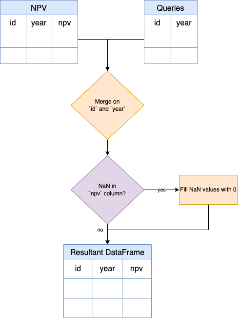

[TOC]

# Solution

---

### Overview

Suppose you're managing the financials of various inventories, each identified by a unique ID and year. You're interested in understanding the net present value (NPV) of these inventories. The NPV helps in determining the profitability of an investment or project.

You have two tables:

1. **NPV**: This contains known NPV values for specific inventory IDs and years.
2. **Queries**: This contains a list of inventory IDs and years for which you want to retrieve NPV values.

However, not all inventory-year combinations in the `Queries` table might have a corresponding NPV value in the `NPV` table. In such cases, it's assumed that the NPV is 0.

Your task is to fetch the NPV values for each entry in the Queries table. If a particular combination doesn't exist in the NPV table, it should return 0 for that entry.

---

## pandas
### Approach 1: Merging DataFrames

#### Intuition

**Flowchart: Finding NPV for Each Query**


This task involves aligning entries from the `queries` DataFrame with their respective NPV values from the `npv` DataFrame.

Original `queries` DataFrame:

<table>
  <tr>
    <th>id</th>
    <th>year</th>
  </tr>
  <tr>
    <td>1</td>
    <td>2019</td>
  </tr>
  <tr>
    <td>2</td>
    <td>2008</td>
  </tr>
  <tr>
    <td>3</td>
    <td>2009</td>
  </tr>
  <tr>
    <td>7</td>
    <td>2018</td>
  </tr>
  <tr>
    <td>7</td>
    <td>2019</td>
  </tr>
<tr>
    <td>7</td>
    <td>2020</td>
  </tr>
<tr>
    <td>13</td>
    <td>2019</td>
  </tr>
</table>
<br>

Original `npv` DataFrame:

<table>
  <tr>
    <th>id</th>
    <th>year</th>
    <th>npv</th>
  </tr>
  <tr>
    <td>1</td>
    <td>2018</td>
    <td>100</td>
  </tr>
  <tr>
    <td>7</td>
    <td>2020</td>
    <td>30</td>
  </tr>
  <tr>
    <td>13</td>
    <td>2019</td>
    <td>40</td>
  </tr>
  <tr>
    <td>1</td>
    <td>2019</td>
    <td>113</td>
  </tr>
  <tr>
    <td>2</td>
    <td>2008</td>
    <td>121</td>
  </tr>
<tr>
    <td>3</td>
    <td>2009</td>
    <td>12</td>
  </tr>
<tr>
    <td>11</td>
    <td>2020</td>
    <td>99</td>
  </tr>
<tr>
    <td>7</td>
    <td>2019</td>
    <td>0</td>
  </tr>
</table>
<br>

The primary objective is to find the NPV for each `id`-`year` combination specified in the `queries` DataFrame. To achieve this, we can combine the `queries` DataFrame with the `npv` DataFrame.

We do this in Pandas using the `merge` operation.

```python
result = pd.merge(queries, npv, on=['id', 'year'], how='left')
```
<br>

Resulting DataFrame `result`:
<table>
  <tr>
    <th>id</th>
    <th>year</th>
    <th>npv</th>
  </tr>
  <tr>
    <td>1</td>
    <td>2019</td>
    <td>113</td>
  </tr>
  <tr>
    <td>2</td>
    <td>2008</td>
    <td>121</td>
  </tr>
  <tr>
    <td>3</td>
    <td>2009</td>
    <td>12</td>
  </tr>
  <tr>
    <td>7</td>
    <td>2018</td>
    <td>NaN</td>
  </tr>
  <tr>
    <td>7</td>
    <td>2019</td>
    <td>0</td>
  </tr>
<tr>
    <td>7</td>
    <td>2020</td>
    <td>30</td>
  </tr>
<tr>
    <td>13</td>
    <td>2019</td>
    <td>40</td>
  </tr>
</table>
<br>

By specifying `how='left'`, we ensure that all rows from the `queries` DataFrame are retained, and whenever there's no match in the `npv` DataFrame, Pandas will fill in NaN for the missing values.

After the merge, there may be cases where the `queries` DataFrame has `id`-`year` combinations that are not present in the `npv` DataFrame. In such scenarios, the NPV values will be NaN. We replace these NaN values to make our output consistent and interpretable. By using the `fillna()` method, we can replace all NaN values in the 'npv' column with 0.

```python
result['npv'].fillna(0, inplace=True)
```

Updated DataFrame `result`:
<table>
  <tr>
    <th>id</th>
    <th>year</th>
    <th>npv</th>
  </tr>
  <tr>
    <td>1</td>
    <td>2019</td>
    <td>113</td>
  </tr>
  <tr>
    <td>2</td>
    <td>2008</td>
    <td>121</td>
  </tr>
  <tr>
    <td>3</td>
    <td>2009</td>
    <td>12</td>
  </tr>
  <tr>
    <td>7</td>
    <td>2018</td>
    <td>0</td>
  </tr>
  <tr>
    <td>7</td>
    <td>2019</td>
    <td>0</td>
  </tr>
<tr>
    <td>7</td>
    <td>2020</td>
    <td>30</td>
  </tr>
<tr>
    <td>13</td>
    <td>2019</td>
    <td>40</td>
  </tr>
</table>
<br>

#### Implementation

```python
import pandas as pd

def npv_queries(npv: pd.DataFrame, queries: pd.DataFrame) -> pd.DataFrame:
    result = pd.merge(queries, npv, on=['id', 'year'], how='left')
    result['npv'].fillna(0, inplace=True)
    return result
```

---

## Database
### Approach 1: JOIN with a fallback to DEFAULT

#### Intuition

The goal is to match rows from the `Queries` table with the `NPV` table and retrieve the NPV for each query.

SQL provides the `LEFT JOIN` operation, which we use when we want to match rows from two tables based on certain columns and want to keep all rows from the left table, regardless of whether there's a match in the right table.

```sql
SELECT Q.id,
       Q.year,
       N.npv
FROM Queries Q
LEFT JOIN NPV N ON Q.id = N.id AND Q.year = N.year;
```

The `LEFT JOIN` ensures that all entries from `Queries` are displayed in the output. When there's no match in `NPV`, the NPV value will be `NULL`.

Next, we need to handle situations where a row from `Queries` doesn't have a corresponding match in the `NPV` table. To manage such instances effectively, SQL provides functions such as `COALESCE` and `IFNULL`.

Both of these functions help in replacing NULL with a default value:

 - `COALESCE` function returns the first non-null value from its list of arguments.

    ```sql
    COALESCE(N.npv, 0) AS npv
    ```

    In the code snippet above, if `N.npv` is `NULL`, the `COALESCE` function will use `0` as the default value.

- `IFNULL` is another useful function that can be used as an alternative. It returns the first argument if it is not NULL, otherwise, it returns the second argument.

    ```sql
    IFNULL(N.npv, 0) AS npv
    ```

#### Implementation

Based on the understanding above, the solution can be implemented as:

```sql
SELECT
  Q.id,
  Q.year,
  COALESCE(N.npv, 0) AS npv
FROM
  Queries Q
  LEFT JOIN NPV N ON Q.id = N.id
  AND Q.year = N.year;
```

Alternatively, using `IFNULL`:

```sql
SELECT
  Q.id,
  Q.year,
  IFNULL(N.npv, 0) AS npv
FROM
  Queries Q
  LEFT JOIN NPV N ON Q.id = N.id
  AND Q.year = N.year;
```