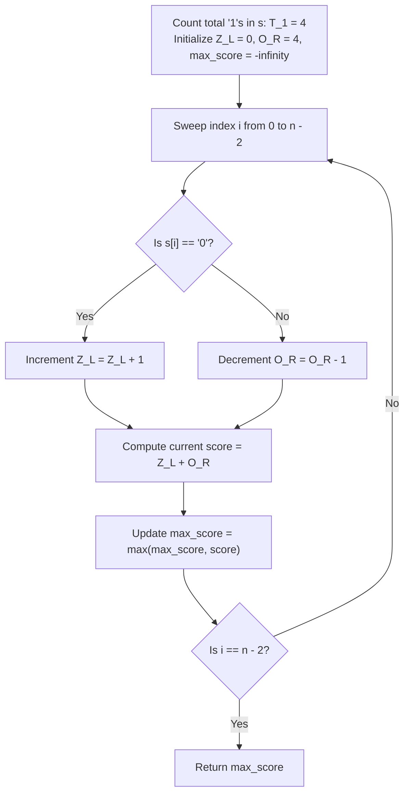

# Guided Example: Maximum Score After Splitting a String

We trace the step-by-step execution of prefix-zero and suffix-one dynamic partition scoring on a representative problem instance:

- **Input:** $s = \text{"011101"}$
- **Required Output:** $5$

This instance features alternating blocks of zeros and ones, evaluates all valid split points across non-empty substrings, and demonstrates linear running-counter updates without quadratic recalculations.

---

## 1. Instance & Teaching Goal

We are given a binary string $s$ consisting of characters `'0'` and `'1'`. We must partition $s$ into two **non-empty** substrings, $left = s[0 \dots i]$ and $right = s[i + 1 \dots n - 1]$, for some split index $i \in [0, n - 2]$.

The score of a split is defined as:
$$
\text{score}(i) = \text{count}_{\text{'0'}}(left) + \text{count}_{\text{'1'}}(right)
$$
We must return the maximum score achievable across all valid partition boundaries.

For $s = \text{"011101"}$ (length $n = 6$):
- Split $0$: $left = \text{"0"}$, $right = \text{"11101"} \implies 1 + 4 = 5$.
- Split $1$: $left = \text{"01"}$, $right = \text{"1101"} \implies 1 + 3 = 4$.
- Split $2$: $left = \text{"011"}$, $right = \text{"101"} \implies 1 + 2 = 3$.
- Split $3$: $left = \text{"0111"}$, $right = \text{"01"} \implies 1 + 1 = 2$.
- Split $4$: $left = \text{"01110"}$, $right = \text{"1"} \implies 2 + 1 = 3$.
- Maximum score across all valid splits is $5$.

The primary teaching goal is to recognize running balance: instead of counting zeros and ones naively for each cut in $\mathcal{O}(n^2)$ time, we precompute total ones and update left zeros and right ones in $\mathcal{O}(1)$ time per cut, completing the search in a single $\mathcal{O}(n)$ pass.

---

## 2. Conceptual Foundation & Invariants

Let $T_1$ be the total number of `'1'`s in string $s$.
At any split boundary $i \in [0, n - 2]$:
- Let $Z_L(i)$ be the number of `'0'`s in $s[0 \dots i]$.
- Let $O_L(i)$ be the number of `'1'`s in $s[0 \dots i]$.
- The number of `'1'`s remaining in the right substring $s[i + 1 \dots n - 1]$ is:
  $$
  O_R(i) = T_1 - O_L(i)
  $$
The score at cut $i$ is therefore:
$$
\text{score}(i) = Z_L(i) + O_R(i) = Z_L(i) + T_1 - O_L(i)
$$

```
String s = "0 1 1 1 0 1", Total '1's (T_1) = 4

Split i = 0: [0] | [1 1 1 0 1]
  Left Zeros = 1, Right Ones = 4 ===> Score = 1 + 4 = 5 (Max!)

Split i = 1: [0 1] | [1 1 0 1]
  Left Zeros = 1, Right Ones = 3 ===> Score = 1 + 3 = 4

Split i = 2: [0 1 1] | [1 0 1]
  Left Zeros = 1, Right Ones = 2 ===> Score = 1 + 2 = 3

Split i = 3: [0 1 1 1] | [0 1]
  Left Zeros = 1, Right Ones = 1 ===> Score = 1 + 1 = 2

Split i = 4: [0 1 1 1 0] | [1]
  Left Zeros = 2, Right Ones = 1 ===> Score = 2 + 1 = 3
```

We establish tracking parameters across the partition sweep:

| Parameter | Domain | Role in Search |
|---|---|---|
| Split Boundary ($i$) | $0 \dots n - 2$ | Rightmost index included in $left$ substring |
| Left Zeros ($Z_L$) | $0 \dots n$ | Running tally of `'0'`s encountered in $left$ |
| Right Ones ($O_R$) | $0 \dots T_1$ | Running tally of `'1'`s remaining in $right$ |
| Global Max Score | Integer $\ge 0$ | Best score identified among all valid cuts |

> **Invariant.** At cut $i$, $Z_L$ equals the exact count of `'0'`s in $s[0 \dots i]$ and $O_R$ equals the exact count of `'1'`s in $s[i + 1 \dots n - 1]$. The cut is guaranteed to produce non-empty substrings since $0 \le i \le n - 2$.



---

## 3. Step-by-Step Worked Execution

### Step 1: Precompute Total Ones

Scan string $s = \text{"011101"}$:
- Characters at indices $1, 2, 3, 5$ are `'1'`.
- Total ones $T_1 = 4$.
- Initial running counters: $Z_L = 0, O_R = 4, max\_score = 0$.

---

### Step 2: Evaluate Split $i = 0$ ($s[0] = \text{'0'}$)

- Incorporate $s[0]$ into left substring:
  - $s[0] == \text{'0'} \implies Z_L \leftarrow 0 + 1 = 1$.
  - $O_R$ remains $4$.
- Score at cut $0$:
  $$
  \text{score}(0) = Z_L + O_R = 1 + 4 = 5
  $$
- Update: $max\_score = \max(0, 5) = 5$.

| Split Index ($i$) | Character $s[i]$ | Left Substring | Right Substring | $(Z_L, O_R)$ | Score | Best Score |
|---|---|---|---|---|---|---|
| $0$ | `'0'` | `"0"` | `"11101"` | $(1, 4)$ | $1 + 4 = 5$ | $5$ |

---

### Step 3: Evaluate Split $i = 1$ ($s[1] = \text{'1'}$)

- Incorporate $s[1]$ into left substring:
  - $s[1] == \text{'1'} \implies O_R \leftarrow 4 - 1 = 3$.
  - $Z_L$ remains $1$.
- Score at cut $1$:
  $$
  \text{score}(1) = 1 + 3 = 4
  $$
- Update: $max\_score = \max(5, 4) = 5$.

| Split Index ($i$) | Character $s[i]$ | Left Substring | Right Substring | $(Z_L, O_R)$ | Score | Best Score |
|---|---|---|---|---|---|---|
| $1$ | `'1'` | `"01"` | `"1101"` | $(1, 3)$ | $1 + 3 = 4$ | $5$ |

---

### Step 4: Evaluate Split $i = 2$ ($s[2] = \text{'1'}$)

- Incorporate $s[2]$:
  - $s[2] == \text{'1'} \implies O_R \leftarrow 3 - 1 = 2$.
  - $Z_L$ remains $1$.
- Score at cut $2$:
  $$
  \text{score}(2) = 1 + 2 = 3
  $$
- Update: $max\_score = \max(5, 3) = 5$.

| Split Index ($i$) | Character $s[i]$ | Left Substring | Right Substring | $(Z_L, O_R)$ | Score | Best Score |
|---|---|---|---|---|---|---|
| $2$ | `'1'` | `"011"` | `"101"` | $(1, 2)$ | $1 + 2 = 3$ | $5$ |

---

### Step 5: Evaluate Split $i = 3$ ($s[3] = \text{'1'}$)

- Incorporate $s[3]$:
  - $s[3] == \text{'1'} \implies O_R \leftarrow 2 - 1 = 1$.
  - $Z_L$ remains $1$.
- Score at cut $3$:
  $$
  \text{score}(3) = 1 + 1 = 2
  $$
- Update: $max\_score = \max(5, 2) = 5$.

| Split Index ($i$) | Character $s[i]$ | Left Substring | Right Substring | $(Z_L, O_R)$ | Score | Best Score |
|---|---|---|---|---|---|---|
| $3$ | `'1'` | `"0111"` | `"01"` | $(1, 1)$ | $1 + 1 = 2$ | $5$ |

---

### Step 6: Evaluate Split $i = 4$ ($s[4] = \text{'0'}$)

- Incorporate $s[4]$:
  - $s[4] == \text{'0'} \implies Z_L \leftarrow 1 + 1 = 2$.
  - $O_R$ remains $1$.
- Score at cut $4$:
  $$
  \text{score}(4) = 2 + 1 = 3
  $$
- Update: $max\_score = \max(5, 3) = 5$.

| Split Index ($i$) | Character $s[i]$ | Left Substring | Right Substring | $(Z_L, O_R)$ | Score | Best Score |
|---|---|---|---|---|---|---|
| $4$ | `'0'` | `"01110"` | `"1"` | $(2, 1)$ | $2 + 1 = 3$ | $5$ |

Note: Split $i = 5$ is not evaluated because $right$ must be non-empty ($i \le n - 2$).
Final maximum score is $5$.

---

## 4. Complete Execution Trace

| Cut Index ($i$) | Character Shifted | Left Zeros ($Z_L$) | Right Ones ($O_R$) | Partition Formed | Score Formula | Running Max |
|---|---|---|---|---|---|---|
| Initial | — | $0$ | $4$ | Boundary setup | — | $0$ |
| $0$ | `'0'` | $1$ | $4$ | `"0" \mid "11101"` | $1 + 4 = 5$ | $5$ |
| $1$ | `'1'` | $1$ | $3$ | `"01" \mid "1101"` | $1 + 3 = 4$ | $5$ |
| $2$ | `'1'` | $1$ | $2$ | `"011" \mid "101"` | $1 + 2 = 3$ | $5$ |
| $3$ | `'1'` | $1$ | $1$ | `"0111" \mid "01"` | $1 + 1 = 2$ | $5$ |
| $4$ | `'0'` | $2$ | $1$ | `"01110" \mid "1"` | $2 + 1 = 3$ | $5$ |

---

## 5. Algorithmic Correctness

**Soundness.** Every evaluated split index $i \in [0, n - 2]$ divides string $s$ into two substrings of lengths $i + 1 \ge 1$ and $n - 1 - i \ge 1$, strictly honoring the non-empty requirement. Maintaining $Z_L$ by adding $1$ for `'0'` and $O_R$ by decrementing $1$ for `'1'` matches the exact counts of zeros in the prefix and ones in the suffix.

**Completeness.** Since an array of length $n$ admits exactly $n - 1$ distinct binary cuts, and the loop iterates across all $i \in [0, n - 2]$, no legal partition is overlooked. The maximum score over this exhaustive domain is guaranteed to be optimal.

---

## 6. Traps This Instance Exposes

- **Allowing Empty Substrings:** Evaluating up to $i = n - 1$ produces an empty right substring, violating the non-empty requirement (e.g. for `"00"`, cut at $1$ would give $2 + 0 = 2$, but valid cut at $0$ gives $1 + 0 = 1$).
- **Inverting Zero and One Targets:** Counting ones on the left and zeros on the right inverts the problem contract.
- **Quadratic Counting:** Slicing the string and using `.count()` in a loop runs in $\mathcal{O}(n^2)$ time; maintaining running tallies achieves $\mathcal{O}(n)$ runtime.
- **String of All Ones or All Zeros:** For inputs like `"1111"`, left contains zero `'0'`s, so the score is purely right ones; correctly restricting cuts to $i \le n - 2$ gives maximum score $3$, not $4$.

---

## 7. Complexity Derivation

- **Time Complexity:** $\mathcal{O}(n)$, where $n$ is the length of string $s$. Counting total ones takes one pass of $\mathcal{O}(n)$ time. Sweeping split points from $0$ to $n - 2$ takes another pass of $\mathcal{O}(n)$ time with $\mathcal{O}(1)$ work per step. Total time is strictly linear.
- **Auxiliary Space Complexity:** $\mathcal{O}(1)$. Only a fixed number of scalar variables ($T_1, Z_L, O_R, max\_score$) are maintained.
