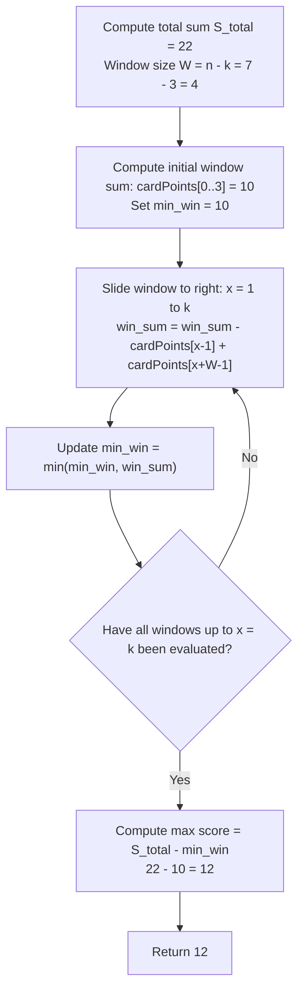

# Guided Example: Maximum Points You Can Obtain from Cards

We trace the step-by-step execution of complementary fixed-size sliding window minimization on a representative problem instance:

- **Input:** $cardPoints = [1, 2, 3, 4, 5, 6, 1], k = 3$
- **Required Output:** $12$

This instance illustrates the failure of myopic greedy choice (both ends start with $1$), shows how taking $k$ cards from the extremities is equivalent to leaving behind a contiguous subarray of length $n - k$, and demonstrates linear sliding window minimization.

---

## 1. Instance & Teaching Goal

We are given an array `cardPoints` of $n$ cards arranged in a row. In each step, we can take one card from the beginning or from the end of the row. We must take exactly $k$ cards ($1 \le k \le n$) to maximize the sum of points collected.

In $cardPoints = [1, 2, 3, 4, 5, 6, 1]$ with $k = 3$:
- Both the leftmost card ($1$) and rightmost card ($1$) offer identical immediate value.
- If we look at the right end, taking cards $6, 5, 1$ yields a score of $5 + 6 + 1 = 12$.
- The cards left unpicked are the contiguous block $[1, 2, 3, 4]$ of length $n - k = 7 - 3 = 4$, with sum $1 + 2 + 3 + 4 = 10$.
- Total array sum is $22$. The collected score is $22 - 10 = 12$.

The primary teaching goal is to recognize the complementary duality: taking $k$ cards from the two ends leaves behind a contiguous interior block of exactly $n - k$ cards. Because the total array sum is constant, **maximizing the points taken from the ends is mathematically equivalent to minimizing the sum of a contiguous window of size $n - k$**.

---

## 2. Conceptual Foundation & Invariants

Let $n = |cardPoints|$. Taking $x$ cards from the left and $k - x$ cards from the right ($0 \le x \le k$) leaves behind a contiguous subarray of length:
$$
W = n - k
$$
starting at index $x$ and ending at index $x + W - 1$.
The total sum of all cards in the array is:
$$
S_{\text{total}} = \sum_{i=0}^{n-1} cardPoints[i]
$$
The points collected from the chosen ends equals:
$$
\text{Score}(x) = S_{\text{total}} - \sum_{j = x}^{x + W - 1} cardPoints[j]
$$
To maximize $\text{Score}(x)$, we minimize the window sum:
$$
\max_{0 \le x \le k} \text{Score}(x) = S_{\text{total}} - \min_{0 \le x \le k} \left( \sum_{j = x}^{x + W - 1} cardPoints[j] \right)
$$
When $k = n$, $W = 0$, meaning all cards are taken and the answer is $S_{\text{total}}$.

```
Array of 7 cards: [1, 2, 3, 4, 5, 6, 1], Total Sum = 22
k = 3 cards to take  ===> Window of unpicked cards W = 7 - 3 = 4

Candidate Windows of Size 4:
Window 0: [1, 2, 3, 4] | 5, 6, 1  ===> Win Sum = 10, Score = 22 - 10 = 12 (Optimal!)
Window 1: 1 | [2, 3, 4, 5] | 6, 1  ===> Win Sum = 14, Score = 22 - 14 = 8
Window 2: 1, 2 | [3, 4, 5, 6] | 1  ===> Win Sum = 18, Score = 22 - 18 = 4
Window 3: 1, 2, 3 | [4, 5, 6, 1]  ===> Win Sum = 16, Score = 22 - 16 = 6
```

We establish tracking parameters across the sliding window sweep:

| Parameter | Mathematical Meaning | Initial Value |
|---|---|---|
| Window Length ($W$) | Unpicked contiguous segment length $n - k$ | $4$ |
| Total Sum ($S_{\text{total}}$) | Sum of all elements in `cardPoints` | $22$ |
| Current Window Sum | Sum of elements in current slice $cardPoints[x \dots x + W - 1]$ | $cardPoints[0..3] = 10$ |
| Min Window Sum | Minimum window sum observed across all $x \in [0, k]$ | $10$ |

> **Invariant.** For each window offset $x \in [0, k]$, the current window sum strictly equals $\sum_{j=x}^{x + W - 1} cardPoints[j]$, and the points obtained by taking the remaining extremities equals $S_{\text{total}} - \text{current window sum}$.



---

## 3. Step-by-Step Worked Execution

### Step 1: Precompute Total Sum and Window Dimension

- Input array: $cardPoints = [1, 2, 3, 4, 5, 6, 1]$, length $n = 7$.
- Cards to pick: $k = 3$.
- Unpicked window size:
  $$
  W = n - k = 7 - 3 = 4
  $$
- Total sum:
  $$
  S_{\text{total}} = 1 + 2 + 3 + 4 + 5 + 6 + 1 = 22
  $$

---

### Step 2: Initialize Base Window ($x = 0$)

- Window slice: $cardPoints[0 \dots 3] = [1, 2, 3, 4]$.
- Initial window sum:
  $$
  win\_sum = 1 + 2 + 3 + 4 = 10
  $$
- Running minimum: $min\_win = 10$.

| Offset ($x$) | Window Slice | Elements Removed / Added | Window Sum | Candidate Score ($S_{\text{total}} - win$) | Best Window Sum |
|---|---|---|---|---|---|
| $0$ | $cardPoints[0..3]$ | Initial base window | $10$ | $22 - 10 = 12$ | $10$ |

---

### Step 3: Slide Window to $x = 1$

- Subtract outgoing element $cardPoints[0] = 1$.
- Add incoming element $cardPoints[0 + 4] = cardPoints[4] = 5$.
- Updated window sum:
  $$
  win\_sum = 10 - 1 + 5 = 14
  $$
- Update minimum: $min\_win = \min(10, 14) = 10$.

| Offset ($x$) | Window Slice | Elements Removed / Added | Window Sum | Candidate Score ($S_{\text{total}} - win$) | Best Window Sum |
|---|---|---|---|---|---|
| $1$ | $cardPoints[1..4]$ | $-1, +5$ | $14$ | $22 - 14 = 8$ | $10$ |

---

### Step 4: Slide Window to $x = 2$

- Subtract outgoing element $cardPoints[1] = 2$.
- Add incoming element $cardPoints[1 + 4] = cardPoints[5] = 6$.
- Updated window sum:
  $$
  win\_sum = 14 - 2 + 6 = 18
  $$
- Update minimum: $min\_win = \min(10, 18) = 10$.

| Offset ($x$) | Window Slice | Elements Removed / Added | Window Sum | Candidate Score ($S_{\text{total}} - win$) | Best Window Sum |
|---|---|---|---|---|---|
| $2$ | $cardPoints[2..5]$ | $-2, +6$ | $18$ | $22 - 18 = 4$ | $10$ |

---

### Step 5: Slide Window to $x = 3$

- Subtract outgoing element $cardPoints[2] = 3$.
- Add incoming element $cardPoints[2 + 4] = cardPoints[6] = 1$.
- Updated window sum:
  $$
  win\_sum = 18 - 3 + 1 = 16
  $$
- Update minimum: $min\_win = \min(10, 16) = 10$.

| Offset ($x$) | Window Slice | Elements Removed / Added | Window Sum | Candidate Score ($S_{\text{total}} - win$) | Best Window Sum |
|---|---|---|---|---|---|
| $3$ | $cardPoints[3..6]$ | $-3, +1$ | $16$ | $22 - 16 = 6$ | $10$ |

All $k + 1 = 4$ windows evaluated. The minimum window sum is $10$.
Final maximum score:
$$
\text{Score} = 22 - 10 = 12
$$

---

## 4. Complete Execution Trace

| Step | Window Offset ($x$) | Subarray Inside Window | Subarray Sum | Extracted Score ($22 - win$) | Record Status |
|---|---|---|---|---|---|
| Setup | — | Compute full sum | $S_{\text{total}} = 22$ | — | — |
| 1 | $x = 0$ | $[1, 2, 3, 4]$ | $10$ | $12$ | Minimum window $= 10$ |
| 2 | $x = 1$ | $[2, 3, 4, 5]$ | $14$ | $8$ | Exceeds minimum |
| 3 | $x = 2$ | $[3, 4, 5, 6]$ | $18$ | $4$ | Exceeds minimum |
| 4 | $x = 3$ | $[4, 5, 6, 1]$ | $16$ | $6$ | Exceeds minimum |
| Result | — | Global minimum: $10$ | — | Final: $22 - 10 = 12$ | Confirmed optimal |

---

## 5. Algorithmic Correctness

**Soundness.** Any selection of $k$ cards from the endpoints leaves exactly $n - k$ unpicked cards. Since cards are drawn exclusively from the leftmost and rightmost positions, the unpicked cards must remain contiguously adjacent. Summing all cards yields a fixed total $S_{\text{total}}$. Thus, any valid choice of end cards has sum $S_{\text{total}} - W_{\text{sum}}$.

**Completeness.** There are exactly $k + 1$ distinct ways to choose $k$ cards from the ends (from $0$ left cards up to $k$ left cards). These correspond bijectively to the $k + 1$ contiguous windows of size $n - k$ starting at indices $0, 1, \dots, k$. Because the sliding window inspects all $k + 1$ configurations, the minimal interior sum is guaranteed to be found.

---

## 6. Traps This Instance Exposes

- **Greedy End Choice:** Picking $\max(cardPoints[left], cardPoints[right])$ at each step fails completely. For $[1, 2, 3, 4, 5, 6, 1]$, greedy choice at step 1 sees $1$ vs $1$ and cannot foresee that taking from the right unlocks $6$ and $5$.
- **Recursive Branching Timeout:** Using depth-first search or dynamic programming branching on both ends explores $\mathcal{O}(2^k)$ paths, which times out for $k = 10^5$.
- **Boundary Case $k = n$:** When $k = n$, the window size $W = n - k = 0$. Sliding window logic must handle $W = 0$ cleanly by immediately returning $S_{\text{total}}$.
- **Sliding Offset Errors:** Forgetting to subtract the element leaving the left side of the window leads to incorrect cumulative sums.

---

## 7. Complexity Derivation

- **Time Complexity:** $\mathcal{O}(n)$, where $n$ is the length of `cardPoints`. Computing the total sum takes $\mathcal{O}(n)$ time. The window of size $n - k$ slides $k$ times, performing one subtraction, one addition, and one comparison per step in $\mathcal{O}(1)$ time. Overall runtime is strictly linear.
- **Auxiliary Space Complexity:** $\mathcal{O}(1)$. Only a few scalar variables ($S_{\text{total}}, W, win\_sum, min\_win$) are used.
