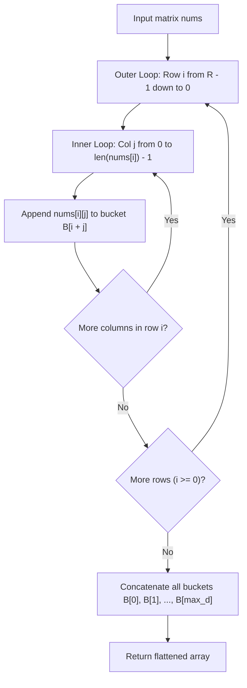

# Guided Example: Diagonal Traverse II

We trace the step-by-step execution of diagonal index grouping and bottom-up bucket aggregation on a representative problem instance:

- **Input:** $nums = [[1, 2, 3], [4, 5, 6], [7, 8, 9]]$
- **Required Output:** $[1, 4, 2, 7, 5, 3, 8, 6, 9]$

This instance features complete coordinate coverage across all anti-diagonals, demonstrates the bottom-left to top-right diagonal traversal order, and illustrates how reverse-row scanning naturally yields correct intra-diagonal ordering without sorting.

---

## 1. Instance & Teaching Goal

We are given a 2D integer array $nums$ whose rows can be jagged (having varying lengths). We must traverse all elements along anti-diagonals, where:
- The first diagonal contains elements with index sum $i + j = 0$.
- The second diagonal contains elements with $i + j = 1$.
- In general, the $d$-th diagonal contains all elements whose coordinates satisfy $i + j = d$.
- Within each diagonal, elements are visited from **bottom to top** (i.e. from larger row index $i$ to smaller row index $i$).

For $nums = [[1, 2, 3], [4, 5, 6], [7, 8, 9]]$:
- Diagonal $0$ ($i + j = 0$): $(0, 0) \implies [1]$
- Diagonal $1$ ($i + j = 1$): $(1, 0), (0, 1) \implies [4, 2]$
- Diagonal $2$ ($i + j = 2$): $(2, 0), (1, 1), (0, 2) \implies [7, 5, 3]$
- Diagonal $3$ ($i + j = 3$): $(2, 1), (1, 2) \implies [8, 6]$
- Diagonal $4$ ($i + j = 4$): $(2, 2) \implies [9]$
- Concatenated result: $[1, 4, 2, 7, 5, 3, 8, 6, 9]$.

The primary teaching goal is to recognize the coordinate sum invariant $d = i + j$, avoid rectangular bounding-box exploration on jagged rows, and use reverse-row iteration to populate diagonal buckets in exact output order in $\mathcal{O}(N)$ time.

---

## 2. Conceptual Foundation & Invariants

In any 2D grid, cells sharing the same anti-diagonal have an identical coordinate sum:
$$
d = i + j
$$
Because elements within each diagonal must be ordered from bottom to top, within diagonal $d$, a cell $(i_1, j_1)$ must precede $(i_2, j_2)$ whenever $i_1 > i_2$.

If we iterate through the rows in **reverse order** from $i = R - 1$ down to $0$, and within each row iterate columns from $j = 0$ to $|nums[i]| - 1$:
- For any two cells $(i_1, j_1)$ and $(i_2, j_2)$ with $i_1 + j_1 = i_2 + j_2 = d$ and $i_1 > i_2$, the reverse row scan visits row $i_1$ before row $i_2$.
- Appending $nums[i][j]$ to bucket $B[i + j]$ automatically places $nums[i_1][j_1]$ before $nums[i_2][j_2]$.
- No secondary sorting or list reversal is required!

```
Matrix Coordinates & Values:
Row 0:  (0,0)=1   (0,1)=2   (0,2)=3
Row 1:  (1,0)=4   (1,1)=5   (1,2)=6
Row 2:  (2,0)=7   (2,1)=8   (2,2)=9

Coordinate Sums (i + j):
Row 0:     0         1         2
Row 1:     1         2         3
Row 2:     2         3         4

Reverse Row Ingestion (Row 2 -> Row 1 -> Row 0):
Scan Row 2:  Bucket 2 <- 7, Bucket 3 <- 8, Bucket 4 <- 9
Scan Row 1:  Bucket 1 <- 4, Bucket 2 <- 5, Bucket 3 <- 6
Scan Row 0:  Bucket 0 <- 1, Bucket 1 <- 2, Bucket 2 <- 3

Final Buckets:
B[0]: [1]
B[1]: [4, 2]
B[2]: [7, 5, 3]
B[3]: [8, 6]
B[4]: [9]
```

We establish tracking parameters across the traversal:

| Parameter | Type & Domain | Role in Pipeline |
|---|---|---|
| Row Index ($i$) | $R - 1 \dots 0$ | Decreasing outer loop index |
| Column Index ($j$) | $0 \dots \lvert nums[i] \rvert - 1$ | Increasing inner loop index |
| Diagonal Index ($d$) | $i + j \in [0, R + C - 2]$ | Target bucket key |
| Bucket Table ($B$) | Array of lists | Dynamic arrays accumulating elements per diagonal |
| Output List | Flattened array of size $N$ | Final sequence of all elements |

> **Invariant.** After scanning rows from $R - 1$ down to $i$, for every completed diagonal $d$, bucket $B[d]$ contains elements with $r + c = d$ arranged in strictly decreasing row order (increasing column order).



---

## 3. Step-by-Step Worked Execution

### Step 1: Initialize Bucket Collection

- Rows in matrix: $R = 3$.
- Columns per row: $C = 3$.
- Maximum possible diagonal index: $(R - 1) + (C - 1) = 2 + 2 = 4$.
- Initialize buckets $B[0 \dots 4]$ as empty lists.

---

### Step 2: Ingest Row $i = 2$ ($nums[2] = [7, 8, 9]$)

- $j = 0$: value $7$, diagonal $d = 2 + 0 = 2 \implies B[2]$ appends $7$.
- $j = 1$: value $8$, diagonal $d = 2 + 1 = 3 \implies B[3]$ appends $8$.
- $j = 2$: value $9$, diagonal $d = 2 + 2 = 4 \implies B[4]$ appends $9$.

| Row ($i$) | Col ($j$) | Value | Coordinate Sum ($i + j$) | Targeted Bucket | Bucket Content Snapshot |
|---|---|---|---|---|---|
| $2$ | $0$ | $7$ | $2$ | $B[2]$ | $B[2] = [7]$ |
| $2$ | $1$ | $8$ | $3$ | $B[3]$ | $B[3] = [8]$ |
| $2$ | $2$ | $9$ | $4$ | $B[4]$ | $B[4] = [9]$ |

---

### Step 3: Ingest Row $i = 1$ ($nums[1] = [4, 5, 6]$)

- $j = 0$: value $4$, diagonal $d = 1 + 0 = 1 \implies B[1]$ appends $4$.
- $j = 1$: value $5$, diagonal $d = 1 + 1 = 2 \implies B[2]$ appends $5$.
- $j = 2$: value $6$, diagonal $d = 1 + 2 = 3 \implies B[3]$ appends $6$.

| Row ($i$) | Col ($j$) | Value | Coordinate Sum ($i + j$) | Targeted Bucket | Bucket Content Snapshot |
|---|---|---|---|---|---|
| $1$ | $0$ | $4$ | $1$ | $B[1]$ | $B[1] = [4]$ |
| $1$ | $1$ | $5$ | $2$ | $B[2]$ | $B[2] = [7, 5]$ |
| $1$ | $2$ | $6$ | $3$ | $B[3]$ | $B[3] = [8, 6]$ |

---

### Step 4: Ingest Row $i = 0$ ($nums[0] = [1, 2, 3]$)

- $j = 0$: value $1$, diagonal $d = 0 + 0 = 0 \implies B[0]$ appends $1$.
- $j = 1$: value $2$, diagonal $d = 0 + 1 = 1 \implies B[1]$ appends $2$.
- $j = 2$: value $3$, diagonal $d = 0 + 2 = 2 \implies B[2]$ appends $3$.

| Row ($i$) | Col ($j$) | Value | Coordinate Sum ($i + j$) | Targeted Bucket | Bucket Content Snapshot |
|---|---|---|---|---|---|
| $0$ | $0$ | $1$ | $0$ | $B[0]$ | $B[0] = [1]$ |
| $0$ | $1$ | $2$ | $1$ | $B[1]$ | $B[1] = [4, 2]$ |
| $0$ | $2$ | $3$ | $2$ | $B[2]$ | $B[2] = [7, 5, 3]$ |

---

### Step 5: Flatten Buckets into Output Sequence

Concatenating buckets $B[0]$ through $B[4]$ in ascending order of $d$:
- $B[0] = [1]$
- $B[1] = [4, 2]$
- $B[2] = [7, 5, 3]$
- $B[3] = [8, 6]$
- $B[4] = [9]$

Final assembled sequence:
$$
[1, 4, 2, 7, 5, 3, 8, 6, 9]
$$

---

## 4. Complete Execution Trace

| Processing Phase | Inspected Cell $(i, j)$ | Cell Value | Target Diagonal Key | Bucket State After Insertion |
|---|---|---|---|---|
| Row 2 Scan | $(2, 0)$ | $7$ | $2$ | $B[2]: [7]$ |
| Row 2 Scan | $(2, 1)$ | $8$ | $3$ | $B[3]: [8]$ |
| Row 2 Scan | $(2, 2)$ | $9$ | $4$ | $B[4]: [9]$ |
| Row 1 Scan | $(1, 0)$ | $4$ | $1$ | $B[1]: [4]$ |
| Row 1 Scan | $(1, 1)$ | $5$ | $2$ | $B[2]: [7, 5]$ |
| Row 1 Scan | $(1, 2)$ | $6$ | $3$ | $B[3]: [8, 6]$ |
| Row 0 Scan | $(0, 0)$ | $1$ | $0$ | $B[0]: [1]$ |
| Row 0 Scan | $(0, 1)$ | $2$ | $1$ | $B[1]: [4, 2]$ |
| Row 0 Scan | $(0, 2)$ | $3$ | $2$ | $B[2]: [7, 5, 3]$ |
| Assembly | Buckets $0 \dots 4$ | — | — | $[1, 4, 2, 7, 5, 3, 8, 6, 9]$ |

---

## 5. Algorithmic Correctness

**Soundness.** Every cell $(i, j)$ present in $nums$ is routed to bucket $d = i + j$. Because rows are visited in descending order ($R - 1, R - 2, \dots, 0$), any cell $(i_1, j_1)$ with higher row index is appended before $(i_2, j_2)$ with lower row index, preserving the bottom-to-top traversal requirement.

**Completeness.** Every entry in every row of $nums$ is visited exactly once. Concatenating all buckets in ascending order of key $d$ ensures that all anti-diagonals are processed without omission or duplication, regardless of row raggedness.

---

## 6. Traps This Instance Exposes

- **Dense Matrix Bounding Box:** Looping $i \in [0, R)$ and $j \in [0, \max |nums[i]|)$ and checking `if j < len(nums[i])` wastes $\mathcal{O}(R \cdot \max C)$ time. If one row has $10^5$ items and $10^5$ rows have $1$ item, this causes Time Limit Exceeded ($10^{10}$ operations).
- **Sorting Overhead:** Storing all tuples $(i + j, -i, val)$ and sorting them takes $\mathcal{O}(N \log N)$ time; bucket insertion achieves linear $\mathcal{O}(N)$ time.
- **Alternating Direction Confusion:** Unlike LeetCode 498 ("Diagonal Traverse"), which flips direction back and forth, this problem traverses **every** diagonal in the same bottom-to-top direction.
- **Top-Down Insertion Without Reversal:** Scanning top-to-bottom ($i = 0, 1, 2$) and appending directly yields top-to-bottom order within each diagonal ($[1, 2, 4, 3, 5, 7, 6, 8, 9]$), which is inverted.

---

## 7. Complexity Derivation

- **Time Complexity:** $\mathcal{O}(N)$, where $N = \sum |nums[i]|$ is the total count of numbers across all rows ($N \le 10^5$). Iterating each row takes $\mathcal{O}(|nums[i]|)$ time, appending to dynamic arrays is $\mathcal{O}(1)$ amortized, and concatenating all buckets takes $\mathcal{O}(N)$ time.
- **Auxiliary Space Complexity:** $\mathcal{O}(N)$ to store elements across the diagonal buckets and form the final output list.
