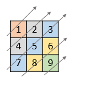
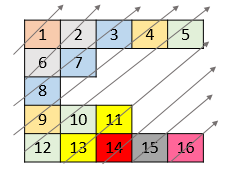

### 1. Description

Given a 2D integer array `nums`, return *all elements of *`nums`* in diagonal order as shown in the below images*.

### 2. Function Contract

- `n`: Input parameter.
- Returns expected result.

### 3. Examples

#### Example 1

- **Input:** `nums = [[1,2,3],[4,5,6],[7,8,9]]`
- **Output:** `[1,4,2,7,5,3,8,6,9]`
#### Example 2

- **Input:** `nums = [[1,2,3,4,5],[6,7],[8],[9,10,11],[12,13,14,15,16]]`
- **Output:** `[1,6,2,8,7,3,9,4,12,10,5,13,11,14,15,16]`

### 4. Constraints

- $1 \le \text{nums.length} \le 10^{5}$

- $1 \le \text{nums}[i].length \le 10^{5}$

- $1 \le sum(\text{nums}[i].length) \le 10^{5}$

- $1 \le \text{nums}[i][j] \le 10^{5}$