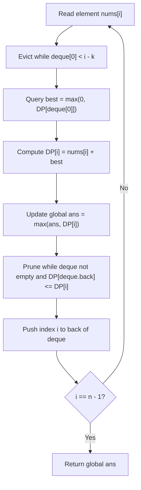

# Guided Example: Constrained Subsequence Sum

We trace the step-by-step execution of Monotonic Deque accelerated Dynamic Programming on a representative problem instance:

- **Input:** $nums = [10, 2, -10, 5, 20], k = 2$
- **Required Output:** $37$

This instance features positive numbers, a negative value requiring selective jumping, multiple valid predecessors within sliding window constraint $k = 2$, and demonstrates how a monotonic deque maintains the sliding maximum in amortized $\mathcal{O}(1)$ time per step.

---

## 1. Instance & Teaching Goal

We are given an integer array $nums$ and an integer $k$. We must select a **non-empty** subsequence of $nums$ such that for any two adjacent selected elements with original array indices $i < j$, the jump distance satisfies:
$$
j - i \le k
$$
We seek to maximize the total sum of the chosen subsequence.

In $nums = [10, 2, -10, 5, 20]$ with $k = 2$:
- Choosing $10$ (index $0$), $2$ (index $1$), $5$ (index $3$), and $20$ (index $4$) satisfies:
  - Jump $1 - 0 = 1 \le 2$
  - Jump $3 - 1 = 2 \le 2$
  - Jump $4 - 3 = 1 \le 2$
- The negative number $-10$ at index $2$ is skipped by jumping directly from index $1$ to index $3$.
- Total subsequence sum: $10 + 2 + 5 + 20 = 37$.

The primary teaching goal is to formulate $DP[i]$ as the maximum sum ending at index $i$, and accelerate the transition $\max_{i - k \le j < i} DP[j]$ from quadratic $\mathcal{O}(n \cdot k)$ to linear $\mathcal{O}(n)$ using a double-ended queue that maintains indices in strictly decreasing order of their DP values.

---

## 2. Conceptual Foundation & Invariants

Let $DP[i]$ be the maximum possible sum of a valid constrained subsequence whose final element is $nums[i]$.
To form such a subsequence:
1. It can either consist solely of $nums[i]$ (starting a new subsequence).
2. Or it can extend a valid subsequence ending at some prior index $j \in [\max(0, i - k), i - 1]$.

Thus:
$$
DP[i] = nums[i] + \max\left(0, \, \max_{\max(0, i - k) \le j < i} DP[j]\right)
$$
The global answer is the maximum over all non-empty endings:
$$
\text{Answer} = \max_{0 \le i < n} DP[i]
$$

### Monotonic Deque Acceleration
To query $\max_{i - k \le j < i} DP[j]$ in $\mathcal{O}(1)$ time, we maintain a deque storing indices $j$ such that:
1. **Window Validity:** All indices satisfy $i - k \le j < i$. Any index $< i - k$ is popped from the front.
2. **Decreasing Monotonicity:** $DP[deque[0]] \ge DP[deque[1]] \ge \dots \ge DP[deque[-1]]$.
   Before inserting index $i$, any index $j$ at the back with $DP[j] \le DP[i]$ is permanently dominated and popped.
3. **Optimal Query:** The front of the deque, $deque[0]$, always stores the index of the maximum DP value in the current window.

```
Sliding Window DP Evaluation at Step i:
nums:   [ 10,   2,  -10,   5,  20 ]
DP:     [ 10,  12,    2,  17,  37 ]
                  ^
Window [i-k .. i-1] for i = 4 (k = 2): indices [2, 3]
DP values in window: DP[2] = 2, DP[3] = 17
Best prior choice = max(2, 17) = 17 (stored at deque front)
DP[4] = nums[4] + 17 = 20 + 17 = 37
```

We establish tracking parameters across the array:

| Parameter | Domain | Role in Recurrence |
|---|---|---|
| Index ($i$) | $0 \dots n - 1$ | Current terminal element evaluated |
| Monotonic Deque | Array of indices | Window indices sorted in decreasing order of $DP$ |
| Optimal Prior ($best$) | Integer $\ge 0$ | $\max(0, DP[deque[0]])$ |
| Current State $DP[i]$ | Integer | Best sum ending at index $i$ |
| Global Maximum ($ans$) | Integer | Running maximum of all computed $DP[i]$ |

> **Invariant.** At the start of step $i$, $deque[0]$ contains the index $j \in [\max(0, i - k), i - 1]$ that maximizes $DP[j]$. After updating $DP[i]$, the deque maintains decreasing DP values, guaranteeing $\mathcal{O}(1)$ amortized operations per element.



---

## 3. Step-by-Step Worked Execution

We process $nums = [10, 2, -10, 5, 20]$ with $k = 2$:

### Step 1: Element $i = 0$ ($nums[0] = 10$)
- Window $[0 - 2, -1]$ is empty; deque is empty.
- Prior contribution: $best = 0$.
- $DP[0] = 10 + 0 = 10$.
- Deque push $0$. Deque: $[0]$ (with DP value $10$).
- Global maximum: $ans = 10$.

| Step ($i$) | $nums[i]$ | Active Window | Deque Front ($j$) | $DP[j]$ | $DP[i] = nums[i] + \max(0, DP[j])$ | Deque State | Running Max |
|---|---|---|---|---|---|---|---|
| $0$ | $10$ | $\emptyset$ | None | $0$ | $10 + 0 = 10$ | $[0]$ | $10$ |

---

### Step 2: Element $i = 1$ ($nums[1] = 2$)
- Window $[1 - 2, 0] = [0]$. Deque front $0 \ge -1$ is valid.
- Prior contribution: $best = \max(0, DP[0]) = 10$.
- $DP[1] = 2 + 10 = 12$.
- Maintain monotonicity: compare $DP[1] = 12$ against back element $DP[0] = 10$.
  - Since $10 \le 12$, index $0$ is dominated and popped!
- Push index $1$. Deque: $[1]$ (DP value $12$).
- Global maximum: $ans = \max(10, 12) = 12$.

| Step ($i$) | $nums[i]$ | Active Window | Deque Front ($j$) | $DP[j]$ | $DP[i] = nums[i] + \max(0, DP[j])$ | Deque State | Running Max |
|---|---|---|---|---|---|---|---|
| $1$ | $2$ | $[0]$ | $0$ | $10$ | $2 + 10 = 12$ | $[1]$ | $12$ |

---

### Step 3: Element $i = 2$ ($nums[2] = -10$)
- Window $[2 - 2, 1] = [0, 1]$. Deque front $1 \ge 0$ is valid.
- Prior contribution: $best = \max(0, DP[1]) = 12$.
- $DP[2] = -10 + 12 = 2$.
- Maintain monotonicity: compare $DP[2] = 2$ against back element $DP[1] = 12$.
  - $12 > 2$, so index $1$ is retained.
- Push index $2$. Deque: $[1, 2]$ (DP values $12, 2$).
- Global maximum: $ans = \max(12, 2) = 12$.

| Step ($i$) | $nums[i]$ | Active Window | Deque Front ($j$) | $DP[j]$ | $DP[i] = nums[i] + \max(0, DP[j])$ | Deque State | Running Max |
|---|---|---|---|---|---|---|---|
| $2$ | $-10$ | $[0, 1]$ | $1$ | $12$ | $-10 + 12 = 2$ | $[1, 2]$ | $12$ |

---

### Step 4: Element $i = 3$ ($nums[3] = 5$)
- Window $[3 - 2, 2] = [1, 2]$. Deque front $1 \ge 1$ is valid.
- Prior contribution: $best = \max(0, DP[1]) = 12$.
- $DP[3] = 5 + 12 = 17$.
- Maintain monotonicity:
  - Back is index $2$ with $DP[2] = 2 \le 17 \implies$ pop $2$.
  - Next back is index $1$ with $DP[1] = 12 \le 17 \implies$ pop $1$.
- Push index $3$. Deque: $[3]$ (DP value $17$).
- Global maximum: $ans = \max(12, 17) = 17$.

| Step ($i$) | $nums[i]$ | Active Window | Deque Front ($j$) | $DP[j]$ | $DP[i] = nums[i] + \max(0, DP[j])$ | Deque State | Running Max |
|---|---|---|---|---|---|---|---|
| $3$ | $5$ | $[1, 2]$ | $1$ | $12$ | $5 + 12 = 17$ | $[3]$ | $17$ |

---

### Step 5: Element $i = 4$ ($nums[4] = 20$)
- Window $[4 - 2, 3] = [2, 3]$. Deque front $3 \ge 2$ is valid.
- Prior contribution: $best = \max(0, DP[3]) = 17$.
- $DP[4] = 20 + 17 = 37$.
- Maintain monotonicity:
  - Back is index $3$ with $DP[3] = 17 \le 37 \implies$ pop $3$.
- Push index $4$. Deque: $[4]$ (DP value $37$).
- Global maximum: $ans = \max(17, 37) = 37$.

| Step ($i$) | $nums[i]$ | Active Window | Deque Front ($j$) | $DP[j]$ | $DP[i] = nums[i] + \max(0, DP[j])$ | Deque State | Running Max |
|---|---|---|---|---|---|---|---|
| $4$ | $20$ | $[2, 3]$ | $3$ | $17$ | $20 + 17 = 37$ | $[4]$ | $37$ |

Final optimal answer is $37$.

---

## 4. Complete Execution Trace

| Phase | Token ($nums[i]$) | Deque Expulsion | Best Prior DP | Computed $DP[i]$ | Deque Insertion | Active Deque Content |
|---|---|---|---|---|---|---|
| Init | $10$ (pos 0) | None | $0$ | $10$ | Push $0$ | $[0 \ (10)]$ |
| Pass 1 | $2$ (pos 1) | None | $10$ | $12$ | Pop $0$, push $1$ | $[1 \ (12)]$ |
| Pass 2 | $-10$ (pos 2) | None | $12$ | $2$ | Push $2$ | $[1 \ (12), 2 \ (2)]$ |
| Pass 3 | $5$ (pos 3) | None | $12$ | $17$ | Pop $2, 1$, push $3$ | $[3 \ (17)]$ |
| Pass 4 | $20$ (pos 4) | None | $17$ | $37$ | Pop $3$, push $4$ | $[4 \ (37)]$ |
| Summary | — | Max overall: $37$ | — | Subsequence: $[10, 2, 5, 20]$ | — | Output: $37$ |

---

## 5. Algorithmic Correctness

**Soundness.** Any valid subsequence must end at some index $i$. By definition, the penultimate element must reside at an index $j \ge i - k$. Taking the maximum of $DP[j]$ over this exact window ensures that all step gaps satisfy $i - j \le k$. Clamping negative sums with $\max(0, \dots)$ ensures that starting a new subsequence is chosen whenever all predecessors would decrease the sum.

**Completeness.** Since every element enters the deque once and leaves the deque at most once, and the front strictly provides the maximum DP value in the window $[i - k, i - 1]$, no potentially superior predecessor is ever discarded prematurely. Pruned elements are strictly smaller than newer elements, so they could never become the maximum in any future window.

---

## 6. Traps This Instance Exposes

- **All-Negative Arrays:** If all elements are negative (e.g. $[-1, -2, -3]$), initializing the global answer to $0$ would return $0$, which is invalid because the subsequence must be non-empty. The global answer must be initialized to $\max(nums)$ or $DP[0]$.
- **Window Eviction Neglect:** Forgetting to pop indices with $j < i - k$ from the deque allows illegal jumps larger than $k$.
- **Adding Negative DP Values:** If all prior DP values are negative, extending them reduces the sum; the recurrence must use $\max(0, DP[j])$ so that an element can start a fresh subsequence.
- **Quadratic Window Scan:** Finding the window maximum via a linear loop takes $\mathcal{O}(n \cdot k)$ time, which times out when $n = k = 10^5$.

---

## 7. Complexity Derivation

- **Time Complexity:** $\mathcal{O}(n)$, where $n$ is the length of `nums`. Each index is pushed onto the deque exactly once and popped from the front or back at most once. Hence, total deque operations across the entire algorithm are bounded by $2n$, yielding strict $\mathcal{O}(n)$ runtime independent of $k$.
- **Auxiliary Space Complexity:** $\mathcal{O}(n)$ to store the DP array and the monotonic deque of size at most $k + 1$.
