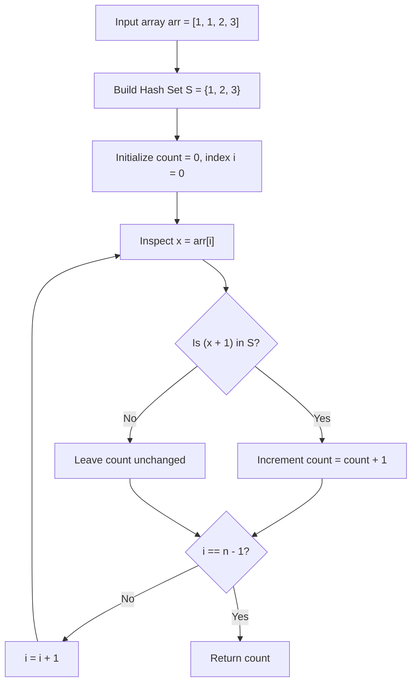

# Guided Example: Counting Elements

We trace the step-by-step execution of Hash Set membership verification on a representative problem instance:

- **Input:** $arr = [1, 1, 2, 3]$
- **Required Output:** $3$

This instance features duplicate elements ($1$ appears twice), multiple valid successor pairs ($1 \to 2$ and $2 \to 3$), and an unfulfillable terminal boundary ($3 \to 4 \notin arr$), clearly distinguishing multi-instance occurrence counting from set deduplication.

---

## 1. Instance & Teaching Goal

We are given an integer array $arr$. We must count how many elements $x$ exist such that $x + 1$ is also present in $arr$. If an element value appears multiple times in $arr$, each instance is evaluated and counted independently.

In $arr = [1, 1, 2, 3]$:
- For the first $1$ (at index $0$): $1 + 1 = 2$ is in $arr \implies$ counts as $1$.
- For the second $1$ (at index $1$): $1 + 1 = 2$ is in $arr \implies$ counts as $1$.
- For $2$ (at index $2$): $2 + 1 = 3$ is in $arr \implies$ counts as $1$.
- For $3$ (at index $3$): $3 + 1 = 4$ is not in $arr \implies$ does not count.
- Total count: $1 + 1 + 1 = 3$.

The primary teaching goal is to recognize the distinction between element frequency and presence testing: while successor existence ($x + 1 \in arr$) is a set membership query requiring $\mathcal{O}(1)$ average lookup, the outer iteration must traverse the original array with full multiplicity rather than deduplicating the elements.

---

## 2. Conceptual Foundation & Invariants

Let $S = \text{Set}(arr)$ be the set of unique values present anywhere in $arr$.
For each index $i \in [0, n - 1]$ with value $x = arr[i]$:
$$
\mathbf{1}_{\{x + 1 \in S\}} = \begin{cases} 1 & \text{if } x + 1 \in S \\ 0 & \text{otherwise} \end{cases}
$$
The total count is:
$$
\text{Total} = \sum_{i = 0}^{n - 1} \mathbf{1}_{\{arr[i] + 1 \in S\}}
$$

Notice:
1. One occurrence of $x + 1$ in $S$ suffices to validate all duplicate copies of $x$ in $arr$.
2. Multiple occurrences of $x + 1$ in $arr$ do not multiply the score of a single $x$.
3. Precomputing $S$ in a hash set enables each lookup $x + 1 \in S$ to execute in $\mathcal{O}(1)$ average time.

```
Array (Evaluated with duplicates):
Index:       0         1         2         3
Element:     1         1         2         3
Target:     1+1=2     1+1=2     2+1=3     3+1=4
             |         |         |         |
             v         v         v         v
Lookup:   In Set?   In Set?   In Set?   In Set?
Outcome:   YES       YES       YES       NO
Contrib:   +1        +1        +1        +0

Hash Set S: {1, 2, 3}  (Deduplicated lookup authority)
Total Count = 1 + 1 + 1 + 0 = 3
```

We establish tracking parameters across the linear scan:

| Parameter | Type & Domain | Role in Algorithm |
|---|---|---|
| Hash Set ($S$) | Collection of unique integers | Constant-time lookup structure |
| Current Index ($i$) | $0 \dots n - 1$ | Position in original multiset array |
| Element Value ($x$) | $arr[i]$ | Base candidate tested for successor presence |
| Successor ($x + 1$) | Integer | Target value probed in $S$ |
| Valid Count | Integer $\ge 0$ | Accumulated count of qualifying elements |

> **Invariant.** Before evaluating index $i$, `count` accurately reflects the number of elements in $arr[0 \dots i - 1]$ whose successor $x + 1$ exists in $S$. The contents of $S$ remain static throughout the query pass.



---

## 3. Step-by-Step Worked Execution

### Step 1: Construct Unique Value Hash Set

We insert all values of $arr = [1, 1, 2, 3]$ into hash set $S$:
- Insert $arr[0] = 1 \implies S = \{1\}$.
- Insert $arr[1] = 1 \implies S = \{1\}$ (duplicate ignored by set).
- Insert $arr[2] = 2 \implies S = \{1, 2\}$.
- Insert $arr[3] = 3 \implies S = \{1, 2, 3\}$.
Resulting set: $S = \{1, 2, 3\}$.

---

### Step 2: Sequential Evaluation Across $arr$

We iterate through $arr$ from index $0$ to $3$:

1. **Index $0$ ($arr[0] = 1$):**
   - Target successor: $1 + 1 = 2$.
   - Probe: $2 \in S \implies$ Found!
   - Action: $count \leftarrow 0 + 1 = 1$.
2. **Index $1$ ($arr[1] = 1$):**
   - Target successor: $1 + 1 = 2$.
   - Probe: $2 \in S \implies$ Found!
   - Action: $count \leftarrow 1 + 1 = 2$.
3. **Index $2$ ($arr[2] = 2$):**
   - Target successor: $2 + 1 = 3$.
   - Probe: $3 \in S \implies$ Found!
   - Action: $count \leftarrow 2 + 1 = 3$.
4. **Index $3$ ($arr[3] = 3$):**
   - Target successor: $3 + 1 = 4$.
   - Probe: $4 \in S \implies$ Missing.
   - Action: No change. $count = 3$.

| Index ($i$) | Element ($x$) | Target Successor ($x + 1$) | Set Presence ($x + 1 \in S$) | Action | Running Count |
|---|---|---|---|---|---|
| $0$ | $1$ | $2$ | Present in $S$ | $count \leftarrow count + 1$ | $1$ |
| $1$ | $1$ | $2$ | Present in $S$ | $count \leftarrow count + 1$ | $2$ |
| $2$ | $2$ | $3$ | Present in $S$ | $count \leftarrow count + 1$ | $3$ |
| $3$ | $3$ | $4$ | Absent from $S$ | None | $3$ |

All elements processed. Final result is $3$.

---

## 4. Complete Execution Trace

| Pass Stage | Item Evaluated | Lookup Key | Set Response | Contribution | Accumulator |
|---|---|---|---|---|---|
| Precompute | Full array | Deduplicate | $S = \{1, 2, 3\}$ | — | $0$ |
| Item 0 | $arr[0] = 1$ | $2$ | True | $+1$ | $1$ |
| Item 1 | $arr[1] = 1$ | $2$ | True | $+1$ | $2$ |
| Item 2 | $arr[2] = 2$ | $3$ | True | $+1$ | $3$ |
| Item 3 | $arr[3] = 3$ | $4$ | False | $+0$ | $3$ |
| Result | — | — | — | Total valid | Output: $3$ |

---

## 5. Algorithmic Correctness

**Soundness.** For every index $i$ where the counter increments, $arr[i] + 1$ has been certified to reside in $S = \text{Set}(arr)$, guaranteeing that a matching element exists somewhere in the array.

**Completeness.** Every element in the original array is examined. Because lookups in a hash set reflect global array presence regardless of relative index order, no qualifying element is missed.

---

## 6. Traps This Instance Exposes

- **Counting Unique Keys Only:** Iterating over `set(arr)` instead of `arr` would evaluate value $1$ only once, giving $1 + 1 = 2$ instead of the correct answer $3$.
- **Bipartite Matching Fallback:** Treating the problem as matching pairs (consuming an element once matched) is incorrect; multiple elements can share the same successor in $arr$.
- **Quadratic Linear Scan:** Performing a linear search in the array for $x + 1$ on each element results in $\mathcal{O}(n^2)$ time; precomputing the set provides $\mathcal{O}(1)$ lookups.
- **Off-by-One Predicate:** Searching for $x - 1$ instead of $x + 1$ inverts the predecessor/successor direction.

---

## 7. Complexity Derivation

- **Time Complexity:** $\mathcal{O}(n)$, where $n$ is the length of `arr`. Building the hash set takes $\mathcal{O}(n)$ time. The second pass evaluates $n$ elements, performing an $\mathcal{O}(1)$ average-time hash lookup per element. Total time is strictly linear.
- **Auxiliary Space Complexity:** $\mathcal{O}(n)$ auxiliary space to store the hash set $S$ containing at most $n$ unique integers.
