## Solution

---

### Approach 1: Search with Array

**Intuition**

The simplest way of solving this problem is to loop through each integer, `x`, checking whether or not it should be counted. This requires checking whether or not $x + 1$ is in `arr`.

```
define function count_elements(arr):
    count = 0
    for each x in arr:
        if integer_in_array(arr, x + 1):
            count = count + 1
    return count
```

To implement the `integer_in_array` function in the above algorithm, we can use **linear search**. To do a linear search, we need to loop through each integer of `arr`. If we find the integer that we're looking for, then return `true`. If we get to the end of `arr`, then we know the integer is not there, and so should return `false`.

```
define function integer_in_array(arr, target):
    for each x in arr:
        if target is equal to x:
            return true
    return false
```

Many programming languages have a built in function for checking whether or not an integer is in `arr`, e.g. Python.

**Algorithm**

```python
class Solution:
    def countElements(self, arr: List[int]) -> int:
        count = 0
        for x in arr:
            if x + 1 in arr:
                count += 1
        return count

# Note that we could also do this as a one-liner generator comprehension.
# return sum(1 for x in arr if x + 1 in arr)
```

**Complexity Analysis**

Let $N$ be the length of the input array, `arr`.

- Time complexity : $O(N^2)$.

    We loop through each of the $N$ integers `x`, checking whether or not $x + 1$ is also in `arr`. Checking whether or not $x + 1$ is in `arr` is done using linear search, which requires checking through all $N$ integers in `arr`. Because we're doing $N$ operations $N$ times, we get a time complexity of $O(N^2)$.

- Space complexity : $O(1)$.

    We are only using a constant number of single-value variables (e.g. `count`), giving us a space complexity of $O(1)$.

<br/>

---

### Approach 2: Search with HashSet

**Intuition**

If you're not familiar with the `HashSet` data structure, check out our [Hash Tables Explore Card](https://leetcode.com/explore/learn/card/hash-table/) to get up to speed.

The above algorithm will work fine for the maximum array length we're given here. However, we can do a lot better than $O(N^2)$, and an interviewer will no doubt expect you to come up with a better way.

The reason why the algorithm above was so inefficient is because we're performing $N$ linear searches, each with a cost of $O(N)$. When we have an algorithm that is performing many linear searches to check for item existence, we should instead be looking to change the way the data is stored so that the time complexity of doing each search is less.

Recall that looking up items in a `HashSet` has a cost of $O(1)$. Creating a `HashSet` from an array of $N$ items has a cost of $O(N)$. We only need to create the `HashSet` *once*. After that, we can then replace all $O(N)$ linear searches with $O(1)$ `HashSet` lookups.

Before we go any further, here is an algorithm that is *incorrect*. Try to spot what the problem is; we'll discuss it just below.

```
define function count_elements(arr):
    hash_set = a new HashSet
    add all integers of arr to hash_set
    count = 0
    for each x in hash_set:
        if hash_set contains x + 1:
            count = count + 1
    return count
```

Did you spot the bug? If there were duplicates in `arr`, then the `count` returned will be too low!

Recall that a `HashSet` removes duplicates. Consider a case like `arr = [1, 1, 2]`. The `HashSet` will be `{1, 2}`. Therefore, the above code will loop over each integer in the `HashSet`, which is only *one* copy of `1`. Yet `arr` had *two* copies of `1`.

To fix it, we need to loop over `arr`, but do the existence checks using the `HashSet`.

```
define function count_elements(arr):
    hash_set = a new HashSet
    add all integers of arr to hash_set
    count = 0
    for each x in arr:
        if hash_set contains x + 1:
            count = count + 1
    return count
```

**Algorithm**

```python
class Solution:
    def countElements(self, arr: List[int]) -> int:
        hash_set = set(arr)
        count = 0
        for x in arr:
            if x + 1 in hash_set:
                count += 1
        return count
```

**Complexity Analysis**

Let $N$ be the length of the input array, `arr`.

- Time complexity : $O(N)$.

    Creating a `HashSet` from $N$ integers takes $O(N)$ time. We then need to loop over each of the $N$ integers like before, except this time we check for $x + 1$ by seeing if it is in the `HashSet`; an $O(1)$ operation. This gives us a total time complexity of $O(N) + N \cdot$\mathcal{O}(1)$=$\mathcal{O}(N)$+$\mathcal{O}(N)$= O(N)$.

- Space complexity : $O(N)$.

    The `HashSet` needs to store each unique integer from `arr`. In the worst case, all the integers in `arr` will be unique, meaning that the `HashSet` has a space complexity of $O(N)$.

It's interesting to note that $O(N)$ is an *upper bound* on the space complexity. If $U$ is the number of unique integers in `arr`, then the space complexity could more accurately be represented as $O(U)$.

<br/>

---

### Approach 3: Search with Sorted Array

**Intuition**

Another way of changing the data storage to allow for more efficient searching is to sort it. Sorting has a time complexity of $O(N \, \log \, N)$, and searching for integers in a sorted array, using binary search, has a cost of $O(\log \, N)$. This will give us a total time complexity of $O(N \, \log \, N)$.

```
define function countElements(arr):
    sort arr
    count = 0
    for each x in arr:
        binary search for x + 1 in arr
        if x + 1 is in arr:
            count = count + 1
    return count
```

The main challenge of this approach would be needing to implement your own binary search.

However, we don't actually need to use binary search! If we iterate over the sorted `arr`, then we know that if $x + 1$ exists, it will be after all the copies of `x`.

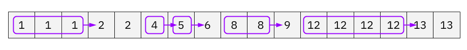

Each copy of `x` should be counted if at least one copy of $x + 1$ exists. Therefore, we can iterate down the sorted `arr`, keeping track of how many times the current `x` has appeared. When we get to a different integer, we can check if it's $x + 1$, and if it is, then the number of `x` we saw should be added to `count`.

```
define function countElements(arr):
    sort arr
    count = 0
    run_length = 1
    for each i in range 1 to arr.length - 1:
        if arr[i - 1] is not equal to arr[i]:
            if arr[i - 1] + 1 is equal to arr[i]:
                count = count + run_length
            run_length = 0
        run_length = run_length + 1
    return count
```

Here is an animation of this approach.

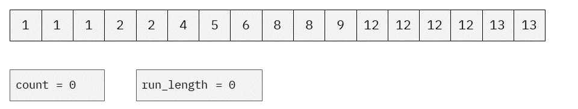

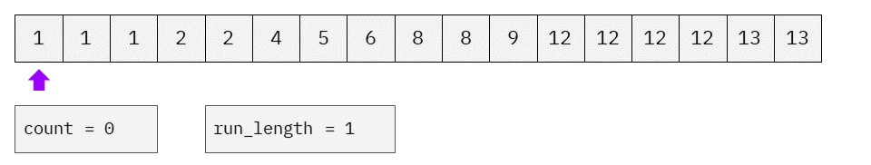

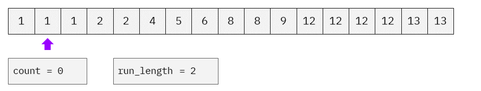

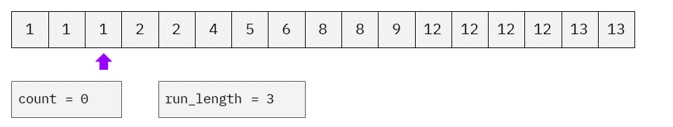

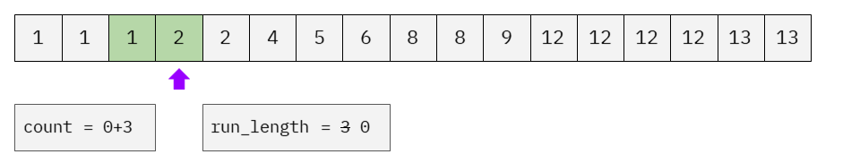

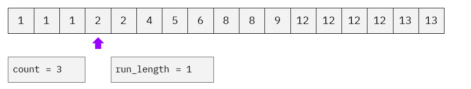

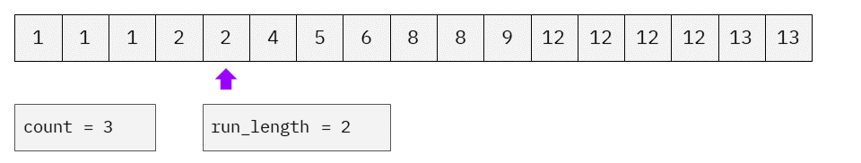

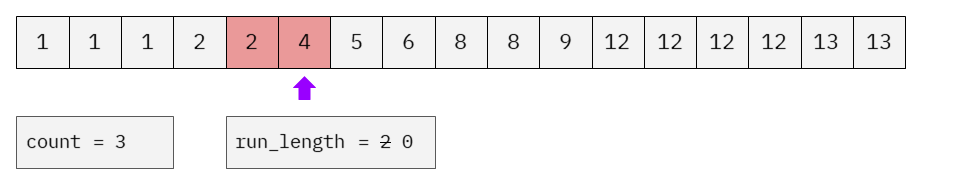

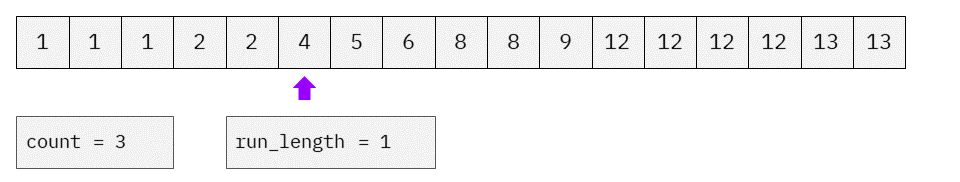

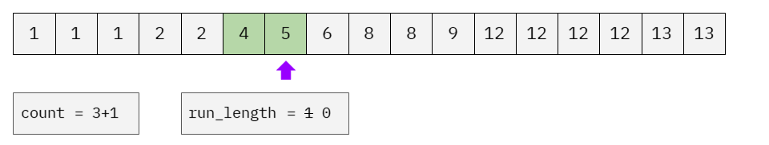

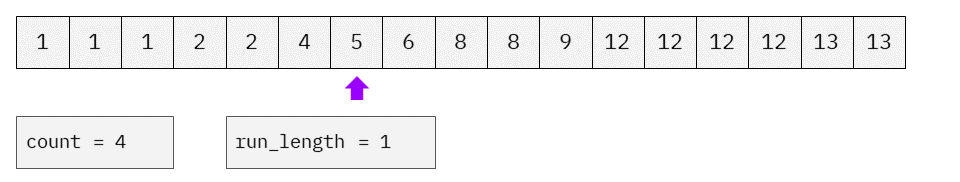

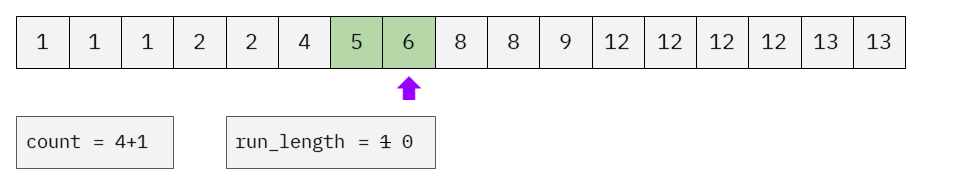

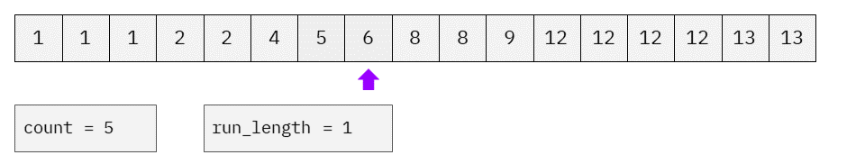

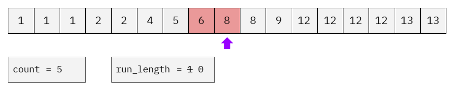

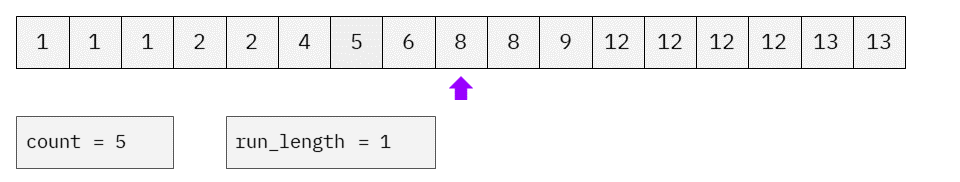

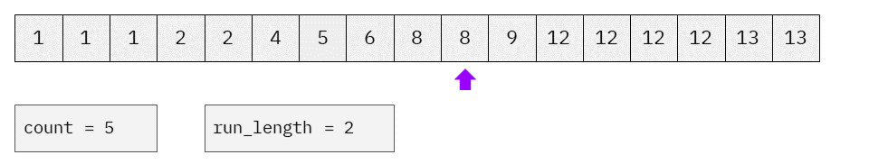

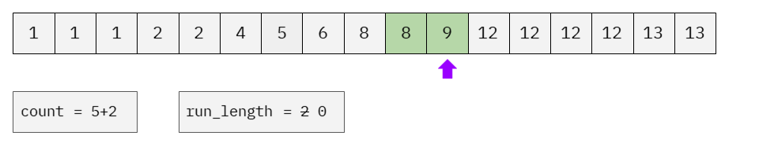

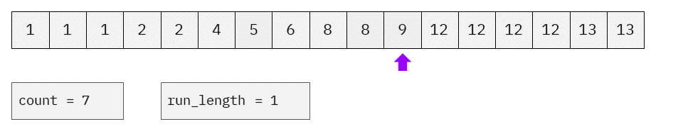

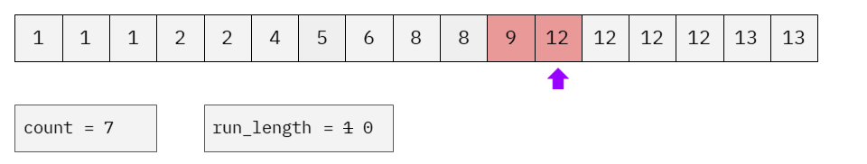

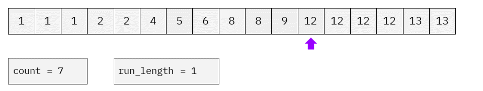

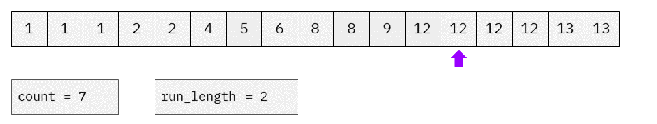

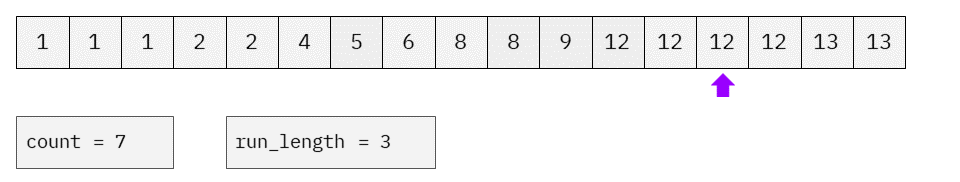

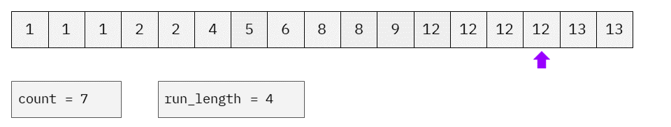

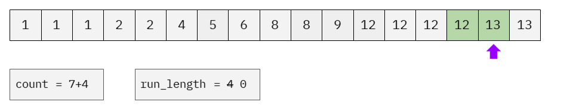

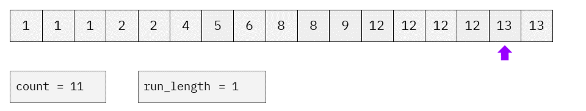

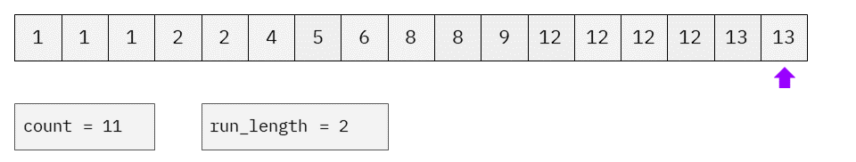

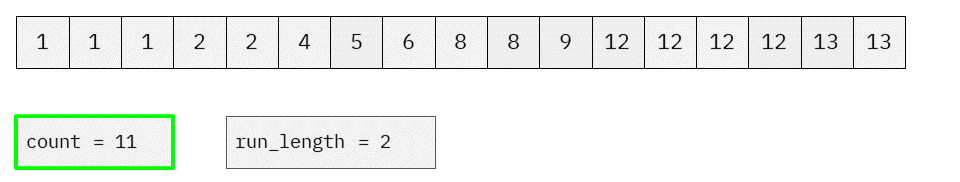

**Algorithm**

```python
class Solution:
    def countElements(self, arr: List[int]) -> int:
        arr.sort()
        count = 0
        run_length = 1
        for i in range(1, len(arr)):
            if arr[i - 1] != arr[i]:
                if arr[i - 1] + 1 == arr[i]:
                    count += run_length
                run_length = 0
            run_length += 1
        return count
```

**Complexity Analysis**

- Time complexity : $O(N \, \log \, N)$.

    Sorting using a built-in sorting algorithm has a cost of $O(N \, \log \, N)$. After that, we do a single pass through `arr`, which has a cost of $O(N)$, giving us a total time complexity of $O(N \, \log \, N) +$\mathcal{O}(N)$= O(N \, \log \, N)$.

- Space complexity : varies from $O(N)$ to $O(1)$.

    The space complexity of this approach is dependent on the space complexity of the sorting algorithm you're using. The space complexity of sorting algorithms built into programming languages is generally anywhere from $O(N)$ to $O(1)$.

    Notice that you could implement your own $O(N \, \log \, N)$ time complexity, $O(1)$ space complexity, sorting algorithm if needed. In practice, $O(N \, \log \, N)$ is not much worse than $O(N)$, and so this approach provides an interesting contrast to Approach 2 (which had a space complexity of $O(N)$).

<br/>