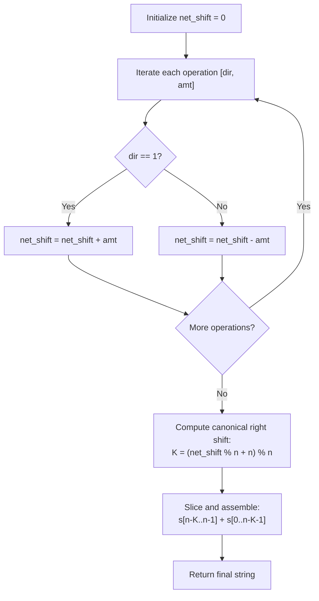

# Guided Example: Perform String Shifts

We trace the step-by-step execution of net cyclic shift accumulation on a representative problem instance:

- **Input:** $s = \text{"abc"}, shift = [[0, 1], [1, 2]]$
- **Required Output:** `"cab"`

This instance features opposing shift directions (a left shift of $1$ followed by a right shift of $2$), demonstrates cancellation in cyclic modular arithmetic, and illustrates single-slice string transformation without intermediate allocations.

---

## 1. Instance & Teaching Goal

We are given a string $s$ of length $n$ and a matrix $shift$ where each row $[dir, amt]$ represents a cyclic shift operation:
- $dir = 0$: Left shift by $amt$ positions (the first character is moved to the end $amt$ times).
- $dir = 1$: Right shift by $amt$ positions (the last character is moved to the beginning $amt$ times).

We must return the final string after all shift operations have been executed.

In $s = \text{"abc"}$ ($n = 3$) with $shift = [[0, 1], [1, 2]]$:
- Op 0: Left shift by $1 \implies \text{"abc"} \to \text{"bca"}$.
- Op 1: Right shift by $2 \implies \text{"bca"} \to \text{"cab"}$.
- Output: `"cab"`.

The primary teaching goal is to recognize that cyclic shifts on a string of length $n$ form a cyclic group isomorphic to $\mathbb{Z}_n$. Instead of executing each shift physically in $\mathcal{O}(|shift| \cdot n)$ time, all operations collapse commutatively into a single signed net shift $\Delta \pmod n$, requiring only a single final slice of the string in $\mathcal{O}(|shift| + n)$ time.

---

## 2. Conceptual Foundation & Invariants

Let right shifts represent positive displacement and left shifts represent negative displacement.
For each operation $[dir_i, amt_i]$:
$$
\delta_i = \begin{cases} +amt_i & \text{if } dir_i = 1 \text{ (right shift)} \\ -amt_i & \text{if } dir_i = 0 \text{ (left shift)} \end{cases}
$$
The cumulative net right shift across all $m$ operations is:
$$
\Delta = \sum_{i=0}^{m-1} \delta_i
$$
Because shifting a string of length $n$ by $n$ positions returns the string to its original state:
$$
K = (\Delta \pmod n + n) \pmod n \in [0, n - 1]
$$
where $K$ represents the equivalent canonical right shift:
- The last $K$ characters of $s$ rotate to the front: $s[n - K \dots n - 1]$.
- The first $n - K$ characters of $s$ shift right: $s[0 \dots n - K - 1]$.
- The final transformed string is:
  $$
  s_{\text{final}} = s[n - K \dots n - 1] + s[0 \dots n - K - 1]
  $$

```
String: "a b c", Length n = 3
Shift operations:
  1. [0, 1] (Left 1)   ---> delta = -1
  2. [1, 2] (Right 2)  ---> delta = +2

Net Displacement:
  Delta = -1 + 2 = +1
  Canonical Right Shift K = 1 % 3 = 1

Single Slice Recombination:
  Suffix of length K=1:  "c"   (indices 2..2)
  Prefix of length n-K=2: "ab" (indices 0..1)
  Result: "c" + "ab" = "cab"
```

We establish tracking parameters across the transformation:

| Parameter | Domain | Mathematical Role |
|---|---|---|
| Net Displacement ($\Delta$) | Integer $\in \mathbb{Z}$ | Algebraic sum of signed shift amounts |
| String Length ($n$) | Integer $\ge 1$ | Modulo modulus for cyclic period |
| Canonical Shift ($K$) | $0 \dots n - 1$ | Equivalent effective right rotation |
| Split Index | $n - K$ | Boundary dividing suffix from prefix |

> **Invariant.** The permutation of character positions after applying operations $0 \dots i$ is identical to a single cyclic right shift by $(\sum_{j=0}^i \delta_j) \pmod n$.



---

## 3. Step-by-Step Worked Execution

### Step 1: Accumulate Signed Net Shift

We process the operations in $shift = [[0, 1], [1, 2]]$:
1. **Operation $0$ ($[0, 1]$):**
   - Direction is $0$ (left shift).
   - Value: $-1$.
   - $\Delta = 0 - 1 = -1$.
2. **Operation $1$ ($[1, 2]$):**
   - Direction is $1$ (right shift).
   - Value: $+2$.
   - $\Delta = -1 + 2 = +1$.

| Step ($i$) | Operation $[dir, amt]$ | Direction Type | Signed Delta ($\delta_i$) | Cumulative Net Shift ($\Delta$) |
|---|---|---|---|---|
| Initial | — | — | — | $0$ |
| $0$ | $[0, 1]$ | Left | $-1$ | $-1$ |
| $1$ | $[1, 2]$ | Right | $+2$ | $+1$ |

---

### Step 2: Canonical Reduction Modulo $n = 3$

- String length $n = 3$.
- Raw net shift: $\Delta = 1$.
- Canonical right shift:
  $$
  K = (1 \pmod 3 + 3) \pmod 3 = 1
  $$
- Split index:
  $$
  n - K = 3 - 1 = 2
  $$

| Metric | Calculation | Result |
|---|---|---|
| String Length ($n$) | $|s| = |\text{"abc"}|$ | $3$ |
| Net Shift ($\Delta$) | $-1 + 2$ | $1$ |
| Canonical Right Shift ($K$) | $(1 \pmod 3 + 3) \pmod 3$ | $1$ |
| Suffix Boundary ($n - K$) | $3 - 1$ | $2$ |

---

### Step 3: Single-Slice Recombination

- Suffix of length $K = 1$:
  $$
  s[2 \dots 2] = \text{"c"}
  $$
- Prefix of length $n - K = 2$:
  $$
  s[0 \dots 1] = \text{"ab"}
  $$
- Concatenation:
  $$
  s_{\text{final}} = \text{"c"} + \text{"ab"} = \text{"cab"}
  $$

| Component | Slice Range | Extracted Substring | Role in Output |
|---|---|---|---|
| Right-shifted Tail | $s[2 \dots 2]$ | `"c"` | Placed at head of string |
| Left Body | $s[0 \dots 1]$ | `"ab"` | Appended after tail |
| Combined Result | $s[2..2] + s[0..1]$ | `"cab"` | Final string returned |

---

## 4. Complete Execution Trace

| Phase | Input Entity | Evaluated Formula | Computed Result | State / Output |
|---|---|---|---|---|
| Ingestion | Op 0: $[0, 1]$ | $\Delta \leftarrow \Delta - 1$ | $\Delta = -1$ | Running net $=-1$ |
| Ingestion | Op 1: $[1, 2]$ | $\Delta \leftarrow \Delta + 2$ | $\Delta = +1$ | Running net $=+1$ |
| Normalization | Modulo $n = 3$ | $K = (1 \pmod 3 + 3) \pmod 3$ | $K = 1$ | Effective right shift $=1$ |
| Split | Partition at $n - K = 2$ | Suffix: $s[2..2]$, Prefix: $s[0..1]$ | `"c"`, `"ab"` | Slices isolated |
| Splicing | Recombine | `"c" + "ab"` | `"cab"` | Final string emitted |

---

## 5. Algorithmic Correctness

**Soundness.** Cyclic shifts form a group under composition. Right shifting by $a$ followed by left shifting by $b$ is mathematically equivalent to a net right shift of $a - b$. Because the position of character $s[i]$ changes to $(i + \Delta) \pmod n$, computing the canonical offset $K = \Delta \pmod n$ accurately places every character in its exact destination index.

**Completeness.** Every operation in matrix $shift$ contributes additively to the scalar accumulator $\Delta$. The reduction modulo $n$ maps any arbitrary integer displacement into the exact canonical range $[0, n - 1]$, ensuring all shift quantities (including $amt > n$) are processed correctly.

---

## 6. Traps This Instance Exposes

- **Iterative String Concatenation:** Slicing and reallocating strings for each row in $shift$ takes $\mathcal{O}(|shift| \cdot n)$ time and creates unnecessary garbage collection pressure; summing deltas takes $\mathcal{O}(|shift|)$ time with a single $\mathcal{O}(n)$ slice at the end.
- **Negative Modulo Semantics:** In many programming languages, `-1 % 3` evaluates to `-1` rather than `2`. Adding $n$ before the modulo ($(\Delta \pmod n + n) \pmod n$) guarantees a non-negative offset in $[0, n - 1]$.
- **Shift Amounts Exceeding Length:** When $amt > n$ (e.g. $amt = 100$ on string of length $3$), failure to apply modulo reduction would cause index out-of-bounds errors during slicing.
- **Direction Reversal:** Confusing $0$ (left) with $1$ (right) inverts the sign of the displacement.

---

## 7. Complexity Derivation

- **Time Complexity:** $\mathcal{O}(|shift| + n)$, where $|shift|$ is the number of shift commands and $n$ is the length of string $s$. Accumulating net displacement takes $\mathcal{O}(|shift|)$ time. Computing the final string slice takes $\mathcal{O}(n)$ time.
- **Auxiliary Space Complexity:** $\mathcal{O}(n)$ to construct and return the final reformatted string.
