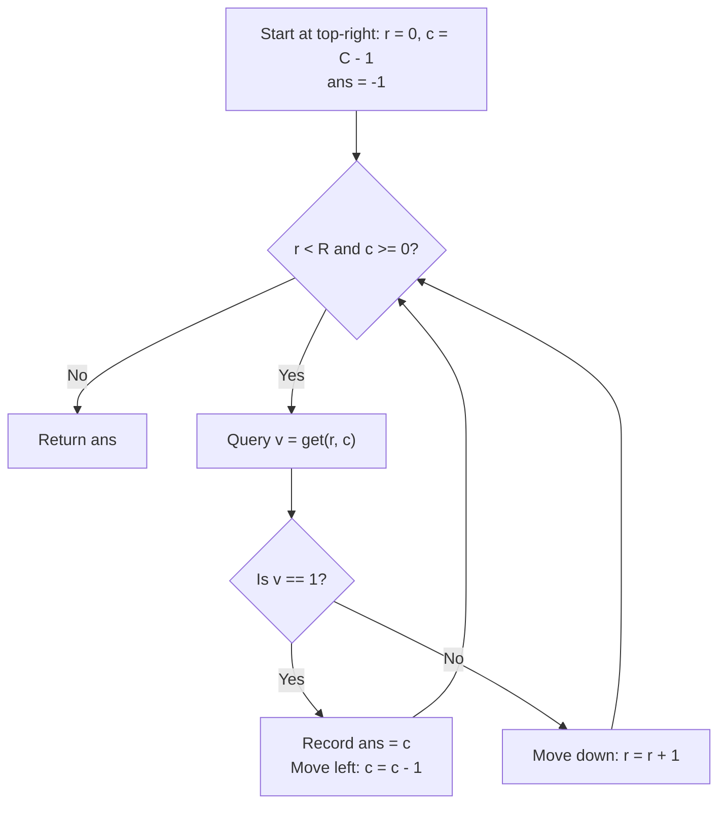

# Guided Example: Leftmost Column with at Least a One

We trace the step-by-step execution of top-right staircase search on a representative problem instance:

- **Input:**
  $$
  mat = \begin{pmatrix}
  0 & 0 & 0 & 1 \\
  0 & 0 & 1 & 1 \\
  0 & 1 & 1 & 1
  \end{pmatrix}
  $$
- **Required Output:** $1$

This instance features multiple rows with ones at varying starting columns, demonstrates monotonic elimination of rows and columns, and illustrates how the top-right staircase traversal locates the global leftmost one within $R + C$ API queries, staying far below the $1000$-call limit.

---

## 1. Instance & Teaching Goal

We are given a read-only interface `BinaryMatrix` representing an $R \times C$ binary matrix whose rows are each sorted in non-decreasing order (all zeros precede all ones in every row). We must find the index ($0$-based) of the leftmost column that contains at least one `1`. If no `1` exists in the entire matrix, return `-1`.

Direct access to the matrix is forbidden; all queries must use `BinaryMatrix.get(row, col)`. Making more than $1000$ calls to `get` results in immediate disqualification.

In the provided matrix ($R = 3, C = 4$):
- Row 0 has ones starting at column $3$.
- Row 1 has ones starting at column $2$.
- Row 2 has ones starting at column $1$.
- Column $0$ contains only zeros.
- The global leftmost column with a `1` is column $1$ (found in Row 2).

The primary teaching goal is to exploit the 2D monotonicity: starting at the top-right corner $(0, C - 1)$, observing a `1` means the current column is a candidate (we move left to see if an earlier column has a `1`), while observing a `0` means no `1` can exist in the remainder of the current row (we move down). This eliminates a row or a column at each step, bounding total queries by $R + C \le 200 \ll 1000$.

---

## 2. Conceptual Foundation & Invariants

Let $(r, c)$ be the current pointer position in the matrix.
We initialize the search at the top-right corner:
$$
r = 0, \quad c = C - 1, \quad ans = -1
$$
At each step, query value $v = \text{get}(r, c)$:
1. **If $v = 1$:**
   Column $c$ contains a `1`. Record $ans = c$. Because we seek the **leftmost** column with a `1`, no future answer can be $\ge c$. We step **left**:
   $$
   c \leftarrow c - 1
   $$
2. **If $v = 0$:**
   Because each row is sorted non-decreasingly, all cells to the left of $(r, c)$ in row $r$ are also `0`:
   $$
   mat[r][k] = 0 \quad \forall k \le c
   $$
   No `1` can possibly exist in row $r$ at or to the left of $c$. We step **down** to inspect the next row:
   $$
   r \leftarrow r + 1
   $$

```
Matrix Traversal Staircase:
Col:      0    1    2    3
Row 0:   [0,   0,   0,   1] <--- Start at (0, 3): Value = 1 -> Move Left to (0, 2)
Row 1:   [0,   0,   1,   1]      (0, 2): Value = 0 -> Move Down to (1, 2)
Row 2:   [0,   1,   1,   1]      (1, 2): Value = 1 -> Move Left to (1, 1)
                                 (1, 1): Value = 0 -> Move Down to (2, 1)
                                 (2, 1): Value = 1 -> Move Left to (2, 0)
                                 (2, 0): Value = 0 -> Move Down to (3, 0) [Terminates]

Recorded Candidates: c = 3 -> c = 2 -> c = 1 (Leftmost answer = 1)
Total Queries = 6 (<= 3 + 4 = 7)
```

We establish tracking parameters across the staircase traversal:

| Parameter | Domain | Role in Search |
|---|---|---|
| Row Pointer ($r$) | $0 \dots R$ | Current row under inspection |
| Column Pointer ($c$) | $-1 \dots C - 1$ | Current column under inspection |
| Best Column ($ans$) | $-1 \dots C - 1$ | Leftmost column confirmed to contain a `1` |
| Query Budget | $[0, 1000]$ | Number of API calls consumed |

> **Invariant.** At any step $(r, c)$, all cells in rows $< r$ at indices $\le c$ have been verified to be $0$. If any column contains a `1` at an index $< ans$, that `1` must reside in row $\ge r$ and column $\le c$.



---

## 3. Step-by-Step Worked Execution

### Step 1: Initialization at Top-Right Corner

- Dimensions: $R = 3, C = 4$.
- Initial cursor: $r = 0, c = 3$.
- Candidate result: $ans = -1$.

---

### Step 2: Query $(0, 3)$

- Call `get(0, 3)`. Return value is $1$.
- Record candidate: $ans \leftarrow 3$.
- Step left to search for earlier ones: $c \leftarrow 3 - 1 = 2$.

| Query Step | Position $(r, c)$ | Returned Bit | Action Taken | Best Column ($ans$) |
|---|---|---|---|---|
| $1$ | $(0, 3)$ | $1$ | $ans = 3$, move left to $c = 2$ | $3$ |

---

### Step 3: Query $(0, 2)$

- Call `get(0, 2)`. Return value is $0$.
- Since row $0$ is sorted, all elements to the left of $(0, 2)$ in row $0$ are also $0$.
- Step down to row $1$: $r \leftarrow 0 + 1 = 1$.

| Query Step | Position $(r, c)$ | Returned Bit | Action Taken | Best Column ($ans$) |
|---|---|---|---|---|
| $2$ | $(0, 2)$ | $0$ | Row exhausted at $\le 2$; move down to $r = 1$ | $3$ |

---

### Step 4: Query $(1, 2)$

- Call `get(1, 2)`. Return value is $1$.
- Column $2$ contains a `1`! Update candidate: $ans \leftarrow 2$.
- Step left: $c \leftarrow 2 - 1 = 1$.

| Query Step | Position $(r, c)$ | Returned Bit | Action Taken | Best Column ($ans$) |
|---|---|---|---|---|
| $3$ | $(1, 2)$ | $1$ | $ans = 2$, move left to $c = 1$ | $2$ |

---

### Step 5: Query $(1, 1)$

- Call `get(1, 1)`. Return value is $0$.
- All elements left of $(1, 1)$ in row $1$ are $0$.
- Step down to row $2$: $r \leftarrow 1 + 1 = 2$.

| Query Step | Position $(r, c)$ | Returned Bit | Action Taken | Best Column ($ans$) |
|---|---|---|---|---|
| $4$ | $(1, 1)$ | $0$ | Row exhausted at $\le 1$; move down to $r = 2$ | $2$ |

---

### Step 6: Query $(2, 1)$

- Call `get(2, 1)`. Return value is $1$.
- Column $1$ contains a `1`! Update candidate: $ans \leftarrow 1$.
- Step left: $c \leftarrow 1 - 1 = 0$.

| Query Step | Position $(r, c)$ | Returned Bit | Action Taken | Best Column ($ans$) |
|---|---|---|---|---|
| $5$ | $(2, 1)$ | $1$ | $ans = 1$, move left to $c = 0$ | $1$ |

---

### Step 7: Query $(2, 0)$

- Call `get(2, 0)`. Return value is $0$.
- Step down: $r \leftarrow 2 + 1 = 3$.
- Condition $r < R$ ($3 < 3$) evaluates to False. Search terminates.

| Query Step | Position $(r, c)$ | Returned Bit | Action Taken | Best Column ($ans$) |
|---|---|---|---|---|
| $6$ | $(2, 0)$ | $0$ | Move down to $r = 3$ (Out of bounds) | $1$ |

Final result: $ans = 1$.
Total queries made: $6$. Budget remaining: $994$.

---

## 4. Complete Execution Trace

| Pass | Query Cell | Value Observed | State Update | New Coordinate | Monotonic Elimination |
|---|---|---|---|---|---|
| $1$ | $(0, 3)$ | $1$ | $ans \leftarrow 3$ | $(0, 2)$ | Exclude columns $\ge 3$ from future search |
| $2$ | $(0, 2)$ | $0$ | Unchanged | $(1, 2)$ | Exclude row $0$ columns $\le 2$ |
| $3$ | $(1, 2)$ | $1$ | $ans \leftarrow 2$ | $(1, 1)$ | Exclude column $2$ from future search |
| $4$ | $(1, 1)$ | $0$ | Unchanged | $(2, 1)$ | Exclude row $1$ columns $\le 1$ |
| $5$ | $(2, 1)$ | $1$ | $ans \leftarrow 1$ | $(2, 0)$ | Exclude column $1$ from future search |
| $6$ | $(2, 0)$ | $0$ | Unchanged | $(3, 0)$ | Exclude row $2$ columns $\le 0$ |
| Done | — | — | Halt ($r = 3$) | — | Final leftmost column: $1$ |

---

## 5. Algorithmic Correctness

**Soundness.** Every time $ans$ is updated to $c$, `get(r, c)` has returned `1`, certifying that column $c$ contains an authentic `1`. Moving left preserves the smallest column seen so far.

**Completeness.** Whenever a cell $(r, c)$ returns `0`, non-decreasing row sorting guarantees that all cells $(r, k)$ for $k \le c$ are also `0`. Therefore, advancing $r \leftarrow r + 1$ discards only cells that are provably `0`, ensuring no `1` in column $\le c$ can be missed. The search terminates only when all rows or columns have been exhausted.

---

## 6. Traps This Instance Exposes

- **Exceeding Query Limit:** Querying all cells naively makes $R \times C = 100 \times 100 = 10^4$ calls, exceeding the $1000$-call threshold by a factor of 10.
- **Starting at Top-Left $(0, 0)$:** Moving from $(0, 0)$ does not allow monotonic path elimination because a `0` does not tell you how far right you must travel, and a `1` does not tell you if earlier columns in other rows have ones.
- **All-Zero Matrix:** If the matrix contains only zeros, $ans$ is never updated; the initial value of $-1$ must be returned correctly.
- **Off-by-One Boundary Terminations:** Ensuring the loop continues while $c \ge 0$ allows checking column $0$.

---

## 7. Complexity Derivation

- **Time Complexity:** $\mathcal{O}(R + C)$ queries to `BinaryMatrix.get`. In each step, the pointer either moves one column left ($c$ decrements) or one row down ($r$ increments). Since $c$ can decrement at most $C$ times and $r$ can increment at most $R$ times, the total number of calls is at most $R + C$. For $R, C \le 100$, maximum queries are $200 \ll 1000$.
- **Auxiliary Space Complexity:** $\mathcal{O}(1)$ auxiliary memory; only scalar coordinates ($r, c$) and best answer ($ans$) are stored.
