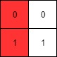
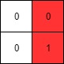
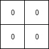

### 1. Description

A **row-sorted binary matrix** means that all elements are `0` or `1` and each row of the matrix is sorted in non-decreasing order.

Given a **row-sorted binary matrix** `binaryMatrix`, return *the index (0-indexed) of the **leftmost column** with a 1 in it*. If such an index does not exist, return `-1`.

**You can't access the Binary Matrix directly.** You may only access the matrix using a `BinaryMatrix` interface:

- `BinaryMatrix.get(row, col)` returns the element of the matrix at index `(row, col)` (0-indexed).

- `BinaryMatrix.dimensions()` returns the dimensions of the matrix as a list of 2 elements `[rows, cols]`, which means the matrix is `rows x cols`.

Submissions making more than `1000` calls to `BinaryMatrix.get` will be judged *Wrong Answer*. Also, any solutions that attempt to circumvent the judge will result in disqualification.

For custom testing purposes, the input will be the entire binary matrix `mat`. You will not have access to the binary matrix directly.

### 2. Function Contract

**Input**

- `binaryMatrix`: a read-only `BinaryMatrix` representing an $m \times n$ row-sorted binary matrix.

The available methods are:

- `binaryMatrix.get(row, col)`: return the value at the valid zero-based position `(row, col)`;
- `binaryMatrix.dimensions()`: return `[m, n]`.

The solution may call `get` at most 1,000 times and may not inspect the hidden matrix directly.

**Return value**

Return the smallest column index containing a `1` in any row. Return `-1` if every cell is `0`.

### 3. Examples

#### Example 1

- **Input:** $mat = [[0,0],[1,1]]$
- **Output:** `0`

#### Example 2

- **Input:** $mat = [[0,0],[0,1]]$
- **Output:** `1`

#### Example 3

- **Input:** $mat = [[0,0],[0,0]]$
- **Output:** `-1`

### 4. Constraints

- $rows = \text{mat.length}$

- $cols = \text{mat}[i].length$

- $1 \le rows, cols \le 100$

- $\text{mat}[i][j]$ is either `0` or `1`.

- $\text{mat}[i]$ is sorted in non-decreasing order.
