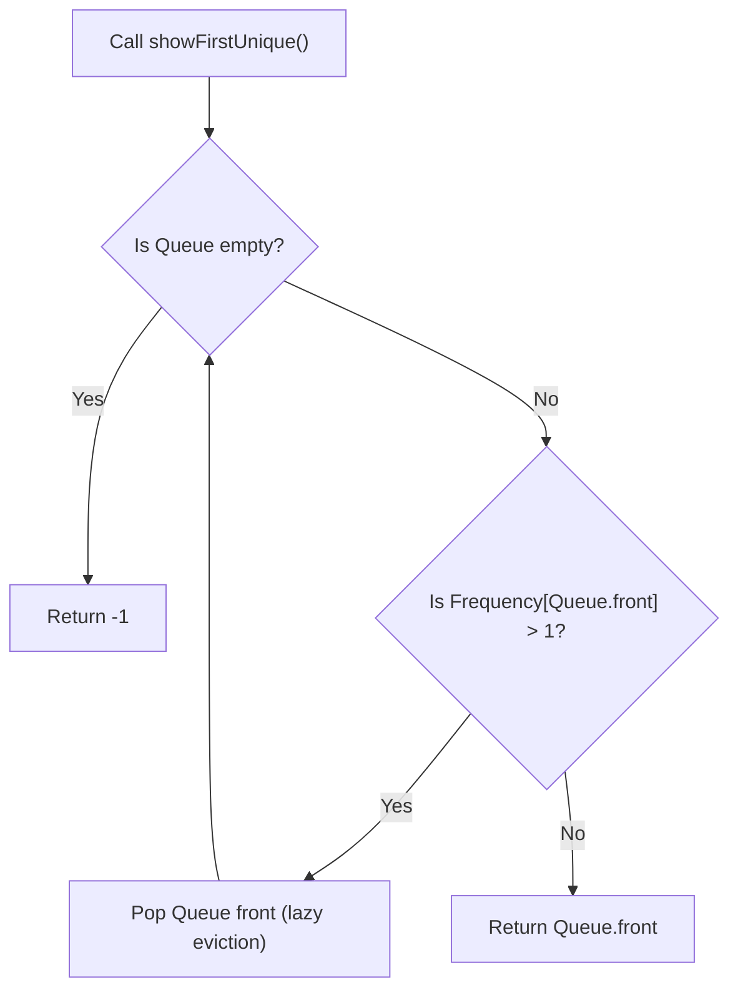

# Guided Example: First Unique Number

We trace the step-by-step execution of queue-based stream processing with frequency tracking and lazy eviction on a representative problem instance:

- **Input:**
  - Operations: `["FirstUnique", "showFirstUnique", "add", "showFirstUnique", "add", "showFirstUnique", "add", "showFirstUnique"]`
  - Arguments: `[[[2, 3, 5]], [], [5], [], [2], [], [3], []]`
- **Required Output:**
  `[null, 2, null, 2, null, 3, null, -1]`

This instance features multiple duplicate insertions, shows the transition of previously unique elements becoming invalid, demonstrates lazy queue head eviction, and ends with an exhausted empty queue returning `-1`.

---

## 1. Instance & Teaching Goal

We are tasked with designing a data structure `FirstUnique` that supports three operations on a dynamic integer sequence:
1. `FirstUnique(nums)`: Initializes the structure with an initial array of numbers.
2. `showFirstUnique()`: Returns the first unique integer in the queue (the earliest inserted number whose current total frequency is exactly $1$), or returns `-1` if no unique integer exists.
3. `add(value)`: Appends an integer to the data structure.

In the example sequence:
- Initialize with $[2, 3, 5]$: all three values are initially unique; the earliest is $2$.
- `showFirstUnique()` returns $2$.
- `add(5)`: $5$ now has frequency $2$ (no longer unique). Earliest unique is still $2$.
- `showFirstUnique()` returns $2$.
- `add(2)`: $2$ now has frequency $2$ (no longer unique).
- `showFirstUnique()`: head element $2$ is discarded; the next unique element is $3$.
- `add(3)`: $3$ now has frequency $2$ (no longer unique).
- `showFirstUnique()`: both $3$ and $5$ are discarded; all elements are now duplicates, returning `-1`.

The primary teaching goal is to implement **lazy deletion**: instead of searching for and removing duplicates from an arbitrary position in a queue during `add()` in $\mathcal{O}(n)$ time, we record frequencies in a hash map and prune non-unique elements from the front of the queue only when `showFirstUnique()` is invoked, achieving amortized $\mathcal{O}(1)$ time per operation.

---

## 2. Conceptual Foundation & Invariants

The data structure maintains two components:
1. **Frequency Hash Map ($M$):** Maps each integer value to its total occurrence count.
2. **FIFO Queue ($Q$):** Stores candidate unique values in the order they were first observed.

### Operation Rules
- **`add(x)`:**
  - Increment frequency: $M[x] \leftarrow M[x] + 1$.
  - If $M[x] == 1$ (first time $x$ is seen): push $x$ to the back of $Q$.
  - If $M[x] > 1$: $x$ is already in the queue or has been evicted; do not push it again.
- **`showFirstUnique()`:**
  - While $Q$ is not empty and $M[Q.\text{front()}] > 1$:
    - The element at the front has become a duplicate. Pop it from $Q$ (lazy eviction).
  - If $Q$ is empty: return $-1$.
  - Otherwise: return $Q.\text{front()}$.

```
Stream Processing & Lazy Eviction Model:
Initial: Q = [2, 3, 5], Freq = {2: 1, 3: 1, 5: 1}  ===> Front is 2 (Freq 1) -> Return 2

Add(5):  Q = [2, 3, 5], Freq = {2: 1, 3: 1, 5: 2}  ===> 5 becomes duplicate
Query:   Front is 2 (Freq 1)                       ---> Return 2

Add(2):  Q = [2, 3, 5], Freq = {2: 2, 3: 1, 5: 2}  ===> 2 becomes duplicate
Query:   Front 2 has Freq 2! Pop 2!
         Next front is 3 (Freq 1)                   ---> Return 3

Add(3):  Q = [3, 5], Freq = {2: 2, 3: 2, 5: 2}     ===> 3 becomes duplicate
Query:   Front 3 has Freq 2! Pop 3!
         Front 5 has Freq 2! Pop 5!
         Queue is empty!                            ---> Return -1
```

We establish tracking parameters across the operation sequence:

| Parameter | Type & Representation | Role in State |
|---|---|---|
| Frequency Map ($M$) | Hash map: $\text{value} \to \text{count}$ | Global occurrence count per distinct value |
| Candidate Queue ($Q$) | FIFO queue of integers | Preserves insertion order of unique candidates |
| Queue Front ($Q.\text{front()}$) | Integer value | Earliest remaining candidate |
| Return Value | Integer | Confirmed earliest unique or $-1$ |

> **Invariant.** At any moment, every value currently unique in the stream appears in $Q$. When `showFirstUnique()` returns, $Q.\text{front()}$ is guaranteed to have frequency strictly equal to $1$, representing the earliest unique value in the stream, or $Q$ is empty.



---

## 3. Step-by-Step Worked Execution

### Step 1: Constructor `FirstUnique([2, 3, 5])`

- Process $2$: $M[2] = 1 \implies$ push $2$ to $Q$.
- Process $3$: $M[3] = 1 \implies$ push $3$ to $Q$.
- Process $5$: $M[5] = 1 \implies$ push $5$ to $Q$.
- State: $Q = [2, 3, 5]$, $M = \{2: 1, 3: 1, 5: 1\}$.
- Output: `null`.

---

### Step 2: Query `showFirstUnique()`

- Inspect $Q.\text{front()} = 2$.
- Check $M[2] = 1$ (unique!).
- Return $2$.

---

### Step 3: `add(5)`

- Element $5$ already exists in $M$.
- Increment frequency: $M[5] \leftarrow 1 + 1 = 2$.
- Since $M[5] > 1$, do not push to $Q$.
- State: $Q = [2, 3, 5]$, $M = \{2: 1, 3: 1, 5: 2\}$.
- Output: `null`.

---

### Step 4: Query `showFirstUnique()`

- Inspect $Q.\text{front()} = 2$.
- Check $M[2] = 1$ (unique!).
- Return $2$.

---

### Step 5: `add(2)`

- Element $2$ already exists in $M$.
- Increment frequency: $M[2] \leftarrow 1 + 1 = 2$.
- Since $M[2] > 1$, do not push to $Q$.
- State: $Q = [2, 3, 5]$, $M = \{2: 2, 3: 1, 5: 2\}$.
- Output: `null`.

---

### Step 6: Query `showFirstUnique()`

- Inspect $Q.\text{front()} = 2$.
- $M[2] = 2 > 1 \implies$ stale duplicate! Pop $2$ from $Q$.
- Inspect new $Q.\text{front()} = 3$.
- $M[3] = 1$ (unique!).
- State: $Q = [3, 5]$, $M = \{2: 2, 3: 1, 5: 2\}$.
- Return $3$.

---

### Step 7: `add(3)`

- Element $3$ already exists in $M$.
- Increment frequency: $M[3] \leftarrow 1 + 1 = 2$.
- State: $Q = [3, 5]$, $M = \{2: 2, 3: 2, 5: 2\}$.
- Output: `null`.

---

### Step 8: Query `showFirstUnique()`

- Inspect $Q.\text{front()} = 3$.
  - $M[3] = 2 > 1 \implies$ pop $3$.
- Inspect new $Q.\text{front()} = 5$.
  - $M[5] = 2 > 1 \implies$ pop $5$.
- Queue $Q$ is now empty ($\emptyset$).
- Return $-1$.

| Op Index | Operation Called | Argument | Frequency Map State | Queue State After Action | Return Value |
|---|---|---|---|---|---|
| $0$ | `FirstUnique` | $[2, 3, 5]$ | $\{2: 1, 3: 1, 5: 1\}$ | $[2, 3, 5]$ | `null` |
| $1$ | `showFirstUnique` | `[]` | $\{2: 1, 3: 1, 5: 1\}$ | $[2, 3, 5]$ | $2$ |
| $2$ | `add` | $[5]$ | $\{2: 1, 3: 1, 5: 2\}$ | $[2, 3, 5]$ | `null` |
| $3$ | `showFirstUnique` | `[]` | $\{2: 1, 3: 1, 5: 2\}$ | $[2, 3, 5]$ | $2$ |
| $4$ | `add` | $[2]$ | $\{2: 2, 3: 1, 5: 2\}$ | $[2, 3, 5]$ | `null` |
| $5$ | `showFirstUnique` | `[]` | $\{2: 2, 3: 1, 5: 2\}$ | $[3, 5]$ (popped 2) | $3$ |
| $6$ | `add` | $[3]$ | $\{2: 2, 3: 2, 5: 2\}$ | $[3, 5]$ | `null` |
| $7$ | `showFirstUnique` | `[]` | $\{2: 2, 3: 2, 5: 2\}$ | $[]$ (popped 3, 5) | $-1$ |

---

## 4. Complete Execution Trace

| Step | Invocations | Action Taken | Queue Head Inspection | Action on Head | Emitted Result |
|---|---|---|---|---|---|
| Start | Constructor | Ingest $2, 3, 5$ | Head is $2$ | Valid | `null` |
| 1 | `showFirstUnique` | Query | Head $2$, count $1$ | Keep | $2$ |
| 2 | `add(5)` | Update count | Count of $5$ becomes $2$ | Duplicate flag | `null` |
| 3 | `showFirstUnique` | Query | Head $2$, count $1$ | Keep | $2$ |
| 4 | `add(2)` | Update count | Count of $2$ becomes $2$ | Duplicate flag | `null` |
| 5 | `showFirstUnique` | Query | Head $2$, count $2$ | Pop $2 \to$ new head $3$ | $3$ |
| 6 | `add(3)` | Update count | Count of $3$ becomes $2$ | Duplicate flag | `null` |
| 7 | `showFirstUnique` | Query | Head $3$, count $2$<br/>Head $5$, count $2$ | Pop $3$, pop $5 \to$ empty | $-1$ |

---

## 5. Algorithmic Correctness

**Soundness.** When `showFirstUnique()` returns a value, the while loop guarantees that $M[\text{head}] == 1$, certifying that the returned value appears exactly once across all past insertions. Because items were enqueued in first-seen order, the frontmost surviving unique item is guaranteed to be the earliest.

**Completeness.** Every value added to the structure is tracked in the frequency map. A unique item is never removed from the queue until its frequency strictly exceeds $1$. Thus, if any unique element exists, it must reside in $Q$, and the earliest such element will be reached once all preceding duplicates at the front are discarded.

---

## 6. Traps This Instance Exposes

- **Eager Queue Deletion:** Searching the entire queue during `add(x)` to delete duplicates takes $\mathcal{O}(|Q|)$ per insertion, which degrades to $\mathcal{O}(Q^2)$ and causes Time Limit Exceeded; lazy deletion defers pruning until query time.
- **Enqueueing Duplicates:** Pushing $x$ to $Q$ every time `add(x)` is called even when $x$ is already known to be a duplicate allows the queue size to explode uncontrollably; only elements with frequency $1$ should ever enter the queue.
- **Empty Queue Null Pointer:** Querying `front()` on an empty queue without checking `!empty()` causes runtime exceptions.
- **Returning Frequency Instead of Value:** Conflating the map's count with the integer value itself.

---

## 7. Complexity Derivation

- **Time Complexity:**
  - `FirstUnique(nums)`: $\mathcal{O}(N)$ where $N = |nums|$, inserting each number into the map and candidate queue.
  - `add(value)`: $\mathcal{O}(1)$ average time, performing a hash map increment and at most one queue push.
  - `showFirstUnique()`: Amortized $\mathcal{O}(1)$ time. Although a single call may pop multiple elements, every unique value is pushed into the queue at most once and popped at most once over its entire lifetime. Across $Q$ operations, the total number of pops cannot exceed $N + Q$.
- **Auxiliary Space Complexity:** $\mathcal{O}(N + Q)$ to store the frequency map and candidate queue.
