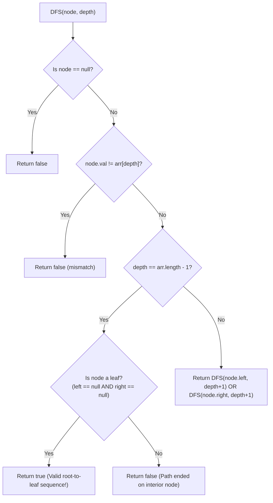

# Guided Example: Check If a String Is a Valid Sequence from Root to Leaves Path in a Binary Tree

We trace the step-by-step execution of Depth-First Search with depth-anchored prefix matching and leaf validation on a representative problem instance:

- **Input:**
  - `root`: Binary tree represented by level-order `[0, 1, 0, 0, 1, 0, null, null, 1, 0, 0]`
  - `arr`: `[0, 1, 0, 1]`
- **Required Output:** `true`

This instance features branching binary paths, identical node values at different depths, an interior matching path that fails the leaf requirement (`[0, 1, 1]`), and a valid full root-to-leaf path matching `[0, 1, 0, 1]`.

---

## 1. Instance & Teaching Goal

We are given a binary tree with root node `root` and an array of integers `arr`. A path is a **valid sequence** if and only if:
1. It begins at the `root` node.
2. The sequence of node values visited along the path exactly matches `arr` in order.
3. The path terminates at a **leaf node** (a node with neither a left nor a right child).
4. The length of the path equals the exact length of `arr`.

In the given tree:
- The path $0 \to 1 \to 0 \to 1$ begins at root ($0$), visits left child ($1$), right child ($0$), and right child ($1$).
- The terminal node with value $1$ has no left and no right child; it is a leaf.
- Length is $4$, exactly matching $|arr| = 4$. The path is a valid sequence.
- By contrast, the path $0 \to 1 \to 1$ matches the prefix `[0, 1, 1]`, but the node with value $1$ has child nodes ($0$), making it an interior node rather than a leaf, so `[0, 1, 1]` is invalid.

The primary teaching goal is to formulate recursive DFS with coupled depth indexing $(node, depth)$, terminating early upon value mismatch and verifying the leaf criterion strictly at $depth = |arr| - 1$.

---

## 2. Conceptual Foundation & Invariants

Let $m = |arr|$. We define a recursive search predicate $\text{DFS}(node, depth)$:
1. **Null Guard:** If $node$ is null, return `false`.
2. **Depth Bound:** If $depth \ge m$, return `false` (path length exceeded).
3. **Value Match:** If $node.val \neq arr[depth]$, return `false` (sequence diverged).
4. **Terminal Condition ($depth == m - 1$):**
   If we have matched the final element of `arr`, the path is valid if and only if $node$ is a leaf:
   $$
   \text{is\_leaf}(node) = (node.left == \text{null} \land node.right == \text{null})
   $$
5. **Recursive Branching ($depth < m - 1$):**
   If $node$ is an interior node matching $arr[depth]$, continue searching in either subtree:
   $$
   \text{DFS}(node.left, depth + 1) \lor \text{DFS}(node.right, depth + 1)
   $$

```
Tree Topology:
               0 (depth 0)
             /   \
  (depth 1) 1     0
           / \   /
(depth 2) 0   1 0
           \
(depth 3)   1 [LEAF!]

Target Sequence arr = [0, 1, 0, 1]:
Depth 0: node.val = 0 == arr[0] (0) -> Match!
Depth 1: node.val = 1 == arr[1] (1) -> Match!
Depth 2: node.val = 0 == arr[2] (0) -> Match!
Depth 3: node.val = 1 == arr[3] (1) -> Match!
Terminal check: node has no children -> Leaf confirmed! -> Return true!
```

We establish tracking parameters across the traversal:

| State Parameter | Type & Domain | Role in Search |
|---|---|---|
| $node$ | Tree node reference | Current node under evaluation |
| $depth$ | Integer $\in [0, m - 1]$ | Index of the target value in $arr$ |
| Target Value | $arr[depth]$ | Expected numeric value at current depth |
| Leaf Status | Boolean | True if $node.left = \text{null}$ and $node.right = \text{null}$ |

> **Invariant.** A call to $\text{DFS}(node, depth)$ returns `true` if and only if the path from the root to $node$ has matched $arr[0 \dots depth - 1]$ and there exists a path from $node$ to a leaf in its subtree matching $arr[depth \dots m - 1]$.



---

## 3. Step-by-Step Worked Execution

### Step 1: Root Evaluation at $depth = 0$

- Node: `root` with value $0$.
- $depth = 0$, target $arr[0] = 0$.
- Value match: $0 == 0$ (Pass).
- $depth = 0 < 3 \implies$ not terminal.
- Branch to left child ($node_L$) and right child ($node_R$).

| Call Frame | Node Value | Target $arr[depth]$ | Comparison | Action |
|---|---|---|---|---|
| $\text{DFS}(root, 0)$ | $0$ | $arr[0] = 0$ | $0 == 0$ (Match) | Explore left child $\text{DFS}(node_L, 1)$ |

---

### Step 2: Left Child at $depth = 1$

- Node: left child of root, value $1$.
- $depth = 1$, target $arr[1] = 1$.
- Value match: $1 == 1$ (Pass).
- $depth = 1 < 3 \implies$ not terminal.
- Branch to its left child ($node_{LL}$, val $0$) and right child ($node_{LR}$, val $1$).

| Call Frame | Node Value | Target $arr[depth]$ | Comparison | Action |
|---|---|---|---|---|
| $\text{DFS}(node_L, 1)$ | $1$ | $arr[1] = 1$ | $1 == 1$ (Match) | Explore its left child $\text{DFS}(node_{LL}, 2)$ |

---

### Step 3: Branch $node_{LL}$ at $depth = 2$

- Node: left-left child, value $0$.
- $depth = 2$, target $arr[2] = 0$.
- Value match: $0 == 0$ (Pass).
- $depth = 2 < 3 \implies$ not terminal.
- Inspect children of $node_{LL}$:
  - Left child is null.
  - Right child exists ($node_{LLR}$, val $1$).
- Recurse into right child: $\text{DFS}(node_{LLR}, 3)$.

| Call Frame | Node Value | Target $arr[depth]$ | Comparison | Action |
|---|---|---|---|---|
| $\text{DFS}(node_{LL}, 2)$ | $0$ | $arr[2] = 0$ | $0 == 0$ (Match) | Explore right child $\text{DFS}(node_{LLR}, 3)$ |

---

### Step 4: Terminal Leaf at $depth = 3$

- Node: $node_{LLR}$, value $1$.
- $depth = 3$, target $arr[3] = 1$.
- Value match: $1 == 1$ (Pass).
- Terminal index reached: $depth = 3 == |arr| - 1$.
- Leaf inspection:
  - $node_{LLR}.left == \text{null}$
  - $node_{LLR}.right == \text{null}$
  - Node is verified to be a leaf!
- Return `true`.

| Call Frame | Node Value | Target $arr[depth]$ | Comparison | Terminal Leaf Verification | Return Value |
|---|---|---|---|---|---|
| $\text{DFS}(node_{LLR}, 3)$ | $1$ | $arr[3] = 1$ | $1 == 1$ (Match) | $left = \text{null} \land right = \text{null}$ | `true` |

The `true` signal bubbles up through Step 3, Step 2, and Step 1. Final result is `true`.

---

## 4. Complete Execution Trace

| Call Depth | Evaluated Node | Node Value | Target $arr[depth]$ | Leaf Status | Subtree Result |
|---|---|---|---|---|---|
| $0$ | Root | $0$ | $0$ | Interior | `true` (from left subtree) |
| $1$ | Left child | $1$ | $1$ | Interior | `true` (from left subtree) |
| $2$ | Left-left child | $0$ | $0$ | Interior | `true` (from right child) |
| $3$ | Left-left-right child | $1$ | $1$ | Leaf | `true` (Valid sequence confirmed!) |

---

## 5. Algorithmic Correctness

**Soundness.** A `true` return requires that every ancestor on the path matched the corresponding index in $arr$, that the recursion reached $depth = |arr| - 1$, and that the final node is confirmed to have neither a left nor a right child. This guarantees that the matched sequence forms a complete, valid root-to-leaf path.

**Completeness.** DFS systematically explores all valid candidate branches. When a node value does not match $arr[depth]$, that subtree is pruned because no extension can alter the ancestor mismatch. If any qualifying root-to-leaf path exists in the tree, DFS will visit its leaf and return `true`.

---

## 6. Traps This Instance Exposes

- **Interior Node False Positives:** In Example 3 (`arr = [0, 1, 1]`), the path $0 \to 1 \to 1$ matches all values, but the terminal node has child $0$. Forgetting the leaf check ($left = \text{null} \land right = \text{null}$) would return `true` on non-leaf paths.
- **Premature Leaf Termination:** If a leaf is encountered when $depth < |arr| - 1$, the path ended prematurely; the algorithm must return `false`.
- **Depth Out-of-Bounds:** Proceeding to recurse after $depth = |arr| - 1$ causes array index out-of-bounds exceptions.
- **Null Reference on Empty Tree:** Passing an empty tree where `root == null` must return `false` without throwing null pointer exceptions.

---

## 7. Complexity Derivation

- **Time Complexity:** $\mathcal{O}(N)$ in the worst case, where $N$ is the number of nodes in the tree. Because mismatches prune immediately, only paths sharing valid prefixes with $arr$ are explored. Each node is visited at most once.
- **Auxiliary Space Complexity:** $\mathcal{O}(h)$, where $h$ is the height of the binary tree ($h \le N$), representing the maximum depth of the call stack. For balanced trees, space is $\mathcal{O}(\log N)$.