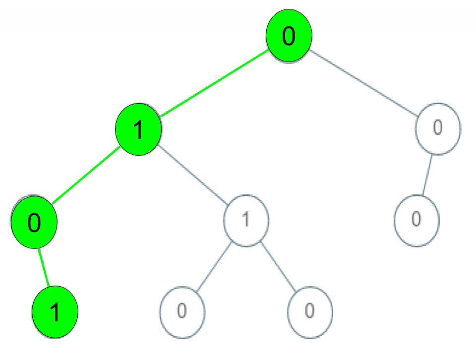
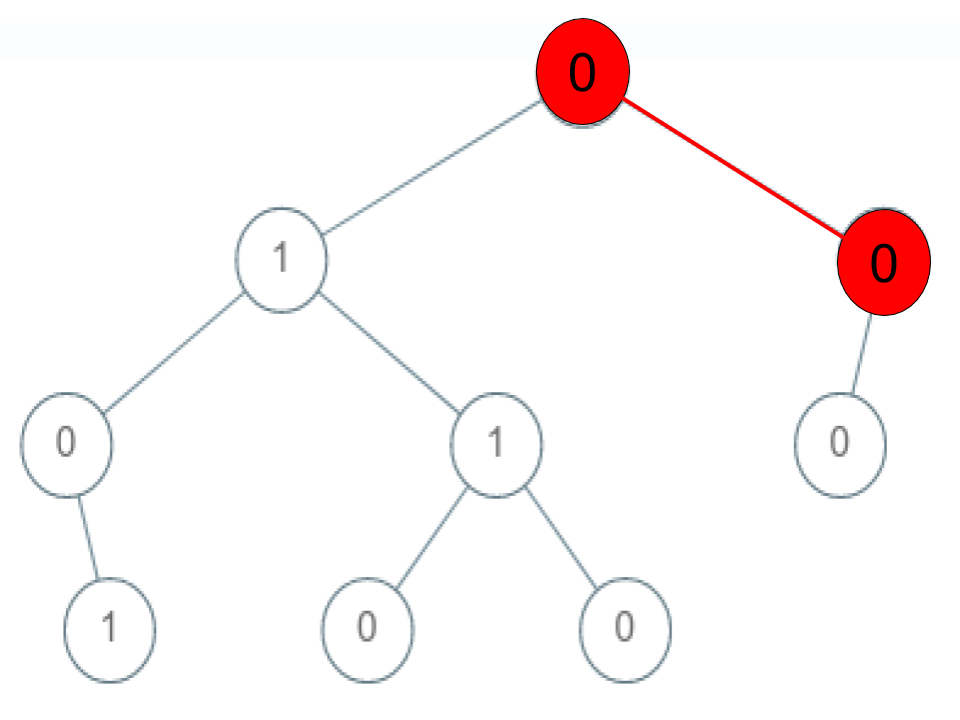
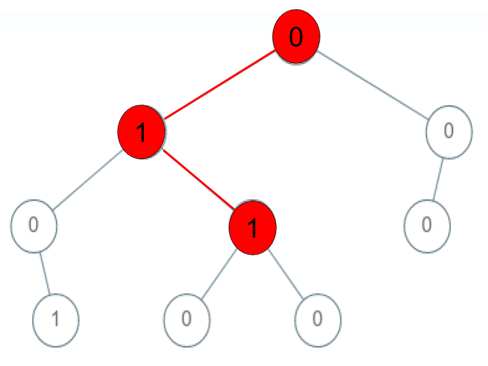

## Description

Given a binary tree where each path going from the root to any leaf form a **valid sequence**, check if a given string is a **valid sequence** in such binary tree.

We get the given string from the concatenation of an array of integers `arr` and the concatenation of all values of the nodes along a path results in a **sequence** in the given binary tree.
### Function Contract

**Inputs**

- `root`: the root of the binary tree;
- `arr`: the nonempty target sequence of node values.

Let $N$ be the number of tree nodes and let $h$ be the tree height. A leaf is a node with neither a left nor a right child.

**Return value**

Return `true` if some connected path starts at `root`, ends at a leaf, and has exactly the values of `arr` in the same order. Return `false` otherwise.

### Examples
#### Example 1

**

**

- **Input:** `root = [0,1,0,0,1,0,null,null,1,0,0], arr = [0,1,0,1]`
- **Output:** `true`
- **Explanation:**
**The path 0 -> 1 -> 0 -> 1 is a valid sequence (green color in the figure).
Other valid sequences are:
0 -> 1 -> 1 -> 0
0 -> 0 -> 0
#### Example 2

**

**

- **Input:** `root = [0,1,0,0,1,0,null,null,1,0,0], arr = [0,0,1]`
- **Output:** `false`
- **Explanation:** The path 0 -> 0 -> 1 does not exist, therefore it is not even a sequence.
#### Example 3

**

**

- **Input:** `root = [0,1,0,0,1,0,null,null,1,0,0], arr = [0,1,1]`
- **Output:** `false`
- **Explanation:** The path 0 -> 1 -> 1 is a sequence, but it is not a valid sequence.
### Constraints

- $1 \le \text{arr.length} \le 5000$

- $0 \le \text{arr}[i] \le 9$

- Each node's value is between [0 - 9].