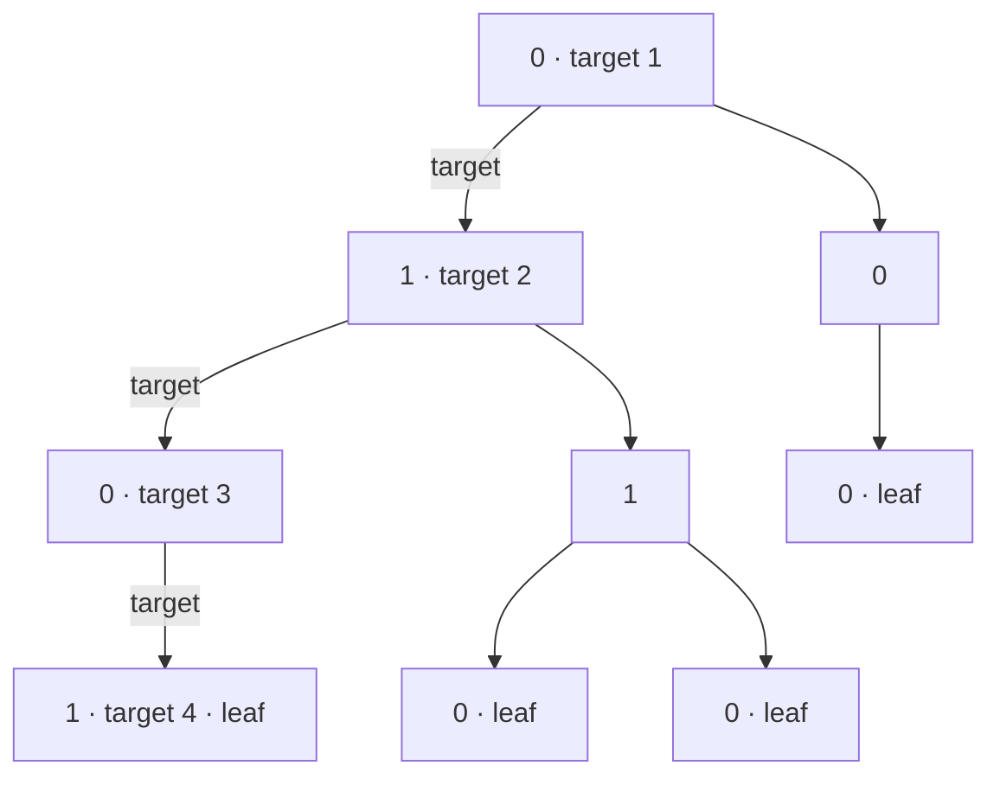
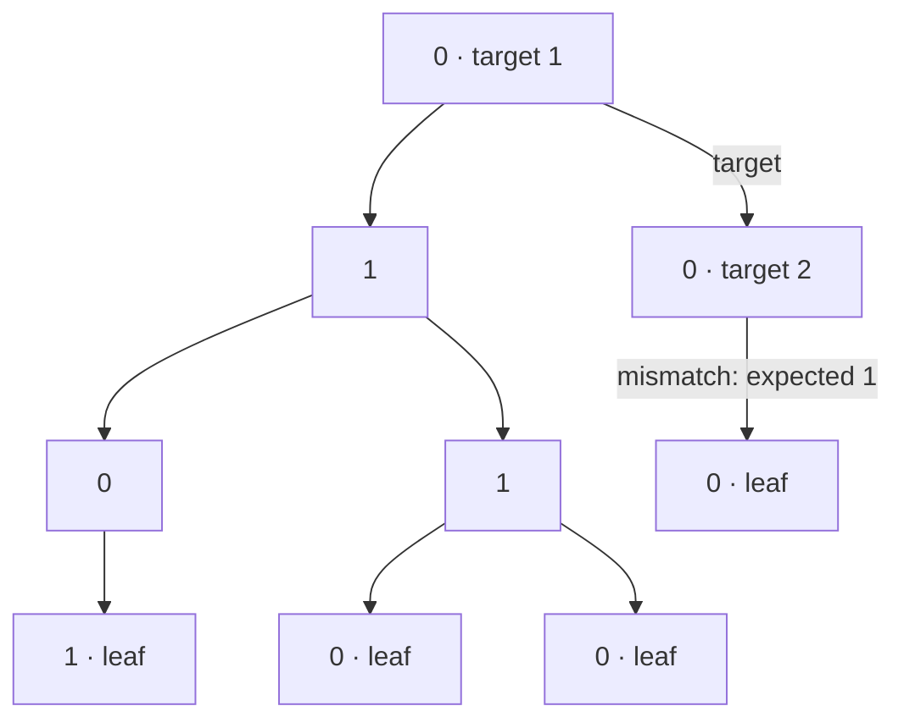
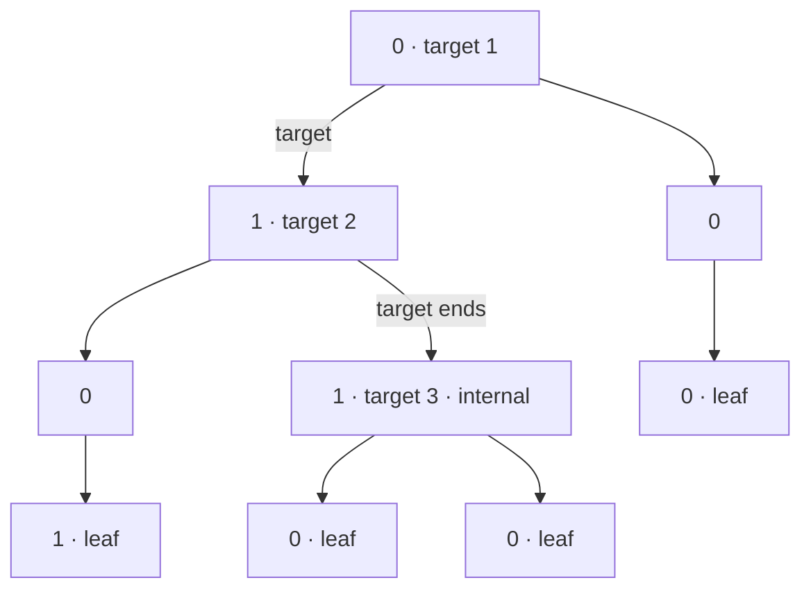

## Examples

**Example 1**

- **Input:** `root = [0,1,0,0,1,0,null,null,1,0,0], arr = [0,1,0,1]`
- **Output:** `true`
- **Explanation:** The connected path `0 -> 1 -> 0 -> 1` starts at the root and ends at a leaf, so it is a valid sequence. The same tree also has valid sequences `0 -> 1 -> 1 -> 0` and `0 -> 0 -> 0`.

**Example 2**

- **Input:** `root = [0,1,0,0,1,0,null,null,1,0,0], arr = [0,0,1]`
- **Output:** `false`
- **Explanation:** The prefix `0 -> 0` reaches the right child of the root, but its only child has value `0`, not the required `1`. Therefore `0 -> 0 -> 1` is not even a sequence in this tree.

**Example 3**

- **Input:** `root = [0,1,0,0,1,0,null,null,1,0,0], arr = [0,1,1]`
- **Output:** `false`
- **Explanation:** The values `0 -> 1 -> 1` do form a connected sequence, but the last `1` is an internal node with two children. Because the target does not end at a leaf, it is not a valid sequence.

