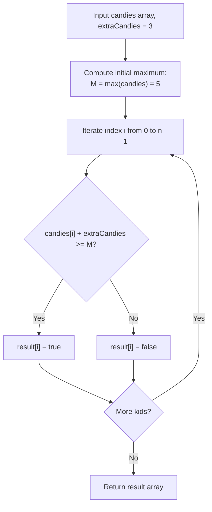

# Guided Example: Kids With the Greatest Number of Candies

We trace the step-by-step execution of baseline threshold precomputation on a representative problem instance:

- **Input:** $candies = [2, 3, 5, 1, 3], extraCandies = 3$
- **Required Output:** `[true, true, true, false, true]`

This instance features a clear initial maximum ($5$), kids who reach the maximum exactly through the extra candies ($2 + 3 = 5$), kids who strictly surpass it ($3 + 3 = 6, 5 + 3 = 8$), and a kid who falls short ($1 + 3 = 4 < 5$).

---

## 1. Instance & Teaching Goal

We are given an array $candies$ where $candies[i]$ denotes the initial number of candies held by the $i$-th child, and an integer $extraCandies$. For each child $i$ independently, we must decide if giving them **all** $extraCandies$ allows them to have the greatest number of candies among all children (ties are permitted). We must return a boolean array of length $n$.

In $candies = [2, 3, 5, 1, 3]$ with $extraCandies = 3$:
- The baseline maximum in the group is $M = 5$.
- Kid 0 has $2 + 3 = 5 \ge 5 \implies$ `true` (ties with Kid 2).
- Kid 1 has $3 + 3 = 6 \ge 5 \implies$ `true` (surpasses Kid 2).
- Kid 2 has $5 + 3 = 8 \ge 5 \implies$ `true` (extends lead).
- Kid 3 has $1 + 3 = 4 < 5 \implies$ `false` (remains below Kid 2).
- Kid 4 has $3 + 3 = 6 \ge 5 \implies$ `true` (surpasses Kid 2).
- Result: `[true, true, true, false, true]`.

The primary teaching goal is to recognize the static benchmark principle: the comparison baseline is simply the initial maximum of the array $M = \max(candies)$. A child achieves the greatest count if and only if their augmented total satisfies $candies[i] + extraCandies \ge M$. Precomputing $M$ once eliminates redundant $\mathcal{O}(n^2)$ comparisons.

---

## 2. Conceptual Foundation & Invariants

Let $n = |candies|$. We define the global baseline maximum:
$$
M = \max_{0 \le j < n} candies[j]
$$
When evaluating child $i$, only child $i$ receives the $extraCandies$; all other children retain their original candy counts:
$$
\text{Augmented count of kid } i = candies[i] + extraCandies
$$
Because the other children's counts remain unchanged, the highest candy count held by any other child is at most $M$.
Therefore, child $i$ will have the greatest number of candies (or tie for the greatest) if and only if:
$$
candies[i] + extraCandies \ge M
$$

```
Benchmark M = max([2, 3, 5, 1, 3]) = 5

Kid 0: [2] + 3 extra = 5  === (5 >= 5) ===> TRUE
Kid 1: [3] + 3 extra = 6  === (6 >= 5) ===> TRUE
Kid 2: [5] + 3 extra = 8  === (8 >= 5) ===> TRUE
Kid 3: [1] + 3 extra = 4  === (4 <  5) ===> FALSE
Kid 4: [3] + 3 extra = 6  === (6 >= 5) ===> TRUE

Threshold Line (M = 5):
Value:   1   2   3   4   5   6   7   8
--------------------------------------
Kid 0:   *---*---*---*---* (5) [Meets threshold]
Kid 1:   *---*---*---*---*---* (6) [Exceeds]
Kid 2:   *---*---*---*---*---*---*---* (8) [Exceeds]
Kid 3:   *---*---*---* (4) [Below threshold!]
Kid 4:   *---*---*---*---*---* (6) [Exceeds]
```

We establish tracking parameters across the linear pass:

| Parameter | Domain | Role in Algorithm |
|---|---|---|
| Benchmark $M$ | Integer $\ge 0$ | Global maximum of initial candy counts |
| Kid Index ($i$) | $0 \dots n - 1$ | Current child evaluated |
| Base Count ($candies[i]$) | Integer $\ge 0$ | Initial candies held by child $i$ |
| Augmented Count | $candies[i] + extraCandies$ | Candies child $i$ would hold |
| Result Array | Boolean array of length $n$ | Output flags |

> **Invariant.** For each index $i \in [0, n - 1]$, $result[i]$ is `true` if and only if $candies[i] + extraCandies \ge M$, accurately reflecting whether kid $i$ can match or exceed every other kid's original count.



---

## 3. Step-by-Step Worked Execution

### Step 1: Precompute Benchmark Maximum $M$

Given $candies = [2, 3, 5, 1, 3]$:
- Compare all elements: $\max(2, 3, 5, 1, 3) = 5$.
- Baseline threshold is $M = 5$.

---

### Step 2: Evaluate Each Child Against Threshold

1. **Kid $0$ ($candies[0] = 2$):**
   - Augmented: $2 + 3 = 5$.
   - Test: $5 \ge 5 \implies$ `true`.
2. **Kid $1$ ($candies[1] = 3$):**
   - Augmented: $3 + 3 = 6$.
   - Test: $6 \ge 5 \implies$ `true`.
3. **Kid $2$ ($candies[2] = 5$):**
   - Augmented: $5 + 3 = 8$.
   - Test: $8 \ge 5 \implies$ `true`.
4. **Kid $3$ ($candies[3] = 1$):**
   - Augmented: $1 + 3 = 4$.
   - Test: $4 \ge 5 \implies$ `false`.
5. **Kid $4$ ($candies[4] = 3$):**
   - Augmented: $3 + 3 = 6$.
   - Test: $6 \ge 5 \implies$ `true`.

| Kid ($i$) | Initial Candies | Augmented Total ($+ 3$) | Benchmark Comparison ($\ge 5$) | Boolean Outcome |
|---|---|---|---|---|
| $0$ | $2$ | $2 + 3 = 5$ | $5 \ge 5$ | `true` |
| $1$ | $3$ | $3 + 3 = 6$ | $6 \ge 5$ | `true` |
| $2$ | $5$ | $5 + 3 = 8$ | $8 \ge 5$ | `true` |
| $3$ | $1$ | $1 + 3 = 4$ | $4 < 5$ | `false` |
| $4$ | $3$ | $3 + 3 = 6$ | $6 \ge 5$ | `true` |

Final boolean array: `[true, true, true, false, true]`.

---

## 4. Complete Execution Trace

| Processing Pass | Evaluated Child | Arithmetic Calculation | Decision Rule | Emitted Element |
|---|---|---|---|---|
| Precomputation | All children | $\max(2, 3, 5, 1, 3)$ | Sets $M = 5$ | — |
| Evaluation 0 | Kid 0 | $2 + 3 = 5$ | $5 \ge 5 \implies$ True | `true` |
| Evaluation 1 | Kid 1 | $3 + 3 = 6$ | $6 \ge 5 \implies$ True | `true` |
| Evaluation 2 | Kid 2 | $5 + 3 = 8$ | $8 \ge 5 \implies$ True | `true` |
| Evaluation 3 | Kid 3 | $1 + 3 = 4$ | $4 < 5 \implies$ False | `false` |
| Evaluation 4 | Kid 4 | $3 + 3 = 6$ | $6 \ge 5 \implies$ True | `true` |
| Finalization | Output vector | Collect flags | — | `[true, true, true, false, true]` |

---

## 5. Algorithmic Correctness

**Soundness.** If $candies[i] + extraCandies \ge M$, then child $i$'s total is at least as large as the original count of every other child in the group. Because all other children retain their original amounts, child $i$ holds the greatest (or tied greatest) count.

**Completeness.** If $candies[i] + extraCandies < M$, then the child who originally held $M$ candies strictly exceeds child $i$'s augmented total ($M > candies[i] + extraCandies$). Therefore, child $i$ cannot have the greatest count, proving that the condition is both necessary and sufficient.

---

## 6. Traps This Instance Exposes

- **Strict Inequality Fallacy:** Requiring $candies[i] + extraCandies > M$ rather than $\ge M$ would wrongly classify Kid 0 as `false`, even though Kid 0 ties for the greatest count ($5 = 5$).
- **Partitioning Extra Candies:** Distributing portions of $extraCandies$ among multiple kids misinterprets the scenario; each child receives the entire allotment of extra candies in separate hypothetical trials.
- **Quadratic Re-computation:** Searching the entire array for the maximum on each iteration runs in $\mathcal{O}(n^2)$ time; precomputing $M$ once takes $\mathcal{O}(n)$ time.

---

## 7. Complexity Derivation

- **Time Complexity:** $\mathcal{O}(n)$, where $n$ is the length of `candies`. Finding the maximum element takes one pass of $\mathcal{O}(n)$ comparisons. Constructing the boolean array takes a second pass of $n$ operations in $\mathcal{O}(1)$ time each. Overall time is strictly linear.
- **Auxiliary Space Complexity:** $\mathcal{O}(1)$ auxiliary space beyond the output array of length $n$.
