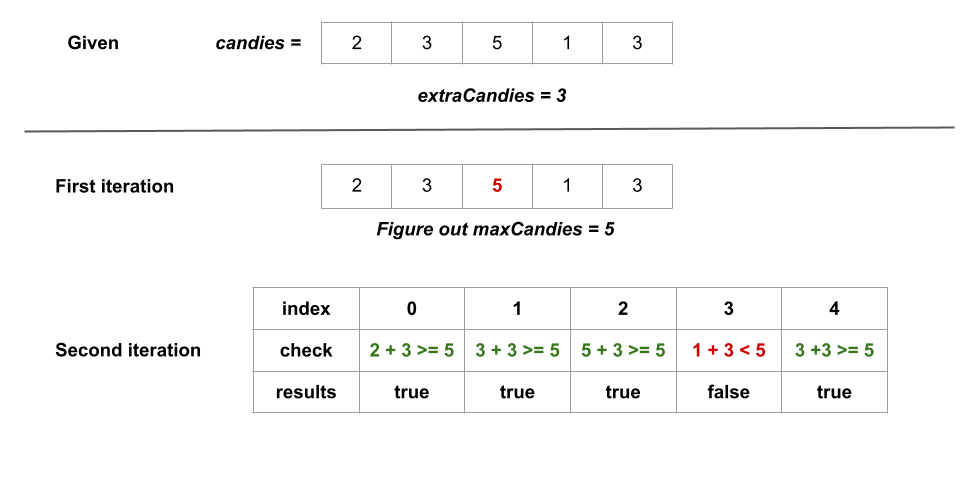

## Solution

---

### Overview

We are given an integer array `candies`, where each $\text{candies}[i]$ represents the number of candies the $i^{th}$ kid has, and an integer `extraCandies`, denoting the number of extra candies that you have.

Our task is to return a boolean array `result` of length `n`, where $\text{result}[i]$ is true if, after giving the $i^{th}$ kid all the `extraCandies`, they will have the greatest number of candies among all the kids, or `false` otherwise.

---

### Approach: Ad Hoc

#### Intuition

We precompute the greatest number of candies that any kid(s) has, let's call it `maxCandies`.

Following the precomputation, we iterate over `candies`, checking whether the total candies that the current kid has exceeds `maxCandies` after giving `extraCandies` to the kid. For every kid, we perform $\text{candies}[i] + extraCandies \ge maxCandies$ and push it into a boolean list called `result`.

In the end, we return `result`.

Here's a visual representation of how the approach works in the first example given in the problem description:



#### Algorithm

1. Create an integer variable called `maxCandies` to store the greatest number of candies in `candies`. We initialize it with `0`.
2. We iterate over `candies` and for each kid who has `candy` candies, we perform $maxCandies = max(maxCandies, candy)$ to get the greatest number of candies in `candies`.
3. Create a boolean list `result`.
4. We iterate over `candies` once more, and for each kid who has `candy` candies, we add $candy + extraCandies \ge maxCandies$ to `result`.
5. Return `result`.

#### Implementation

```python
class Solution(object):
    def kidsWithCandies(self, candies, extraCandies):
        # Find out the greatest number of candies among all the kids.
        maxCandies = max(candies)
        # For each kid, check if they will have greatest number of candies
        # among all the kids.
        result = []
        for i in range(len(candies)):
            result.append(candies[i] + extraCandies >= maxCandies)
        return result
```

#### Complexity Analysis

Here, $n$ is the number of kids.

* Time complexity: $O(n)$

- We iterate over the `candies` array to find out `maxCandies` which takes $O(n)$ time.
- We iterate over the `candies` array once more. We check for each kid whether they will have the most candies among all the children after receiving `extraCandies` and push the result in `result` which takes $O(1)$ time. It requires $O(n)$ time for $n$ kids.

* Space complexity: $O(1)$

- Without counting the space of input and output, we are not using any space except for some integers like `maxCandies` and `candy`.