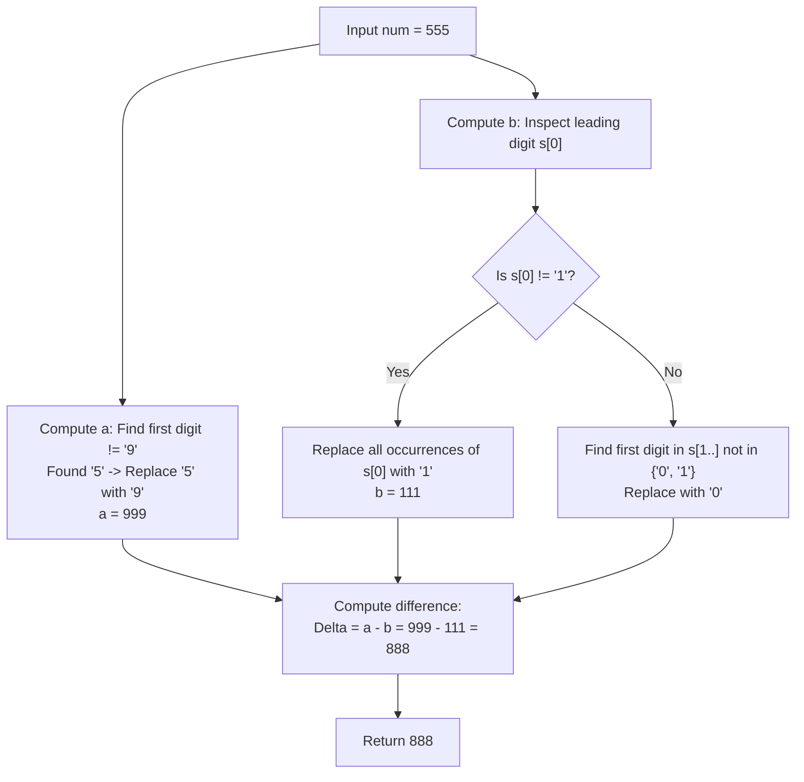

# Guided Example: Max Difference You Can Get From Changing an Integer

We trace the step-by-step execution of independent greedy digit substitution on a representative problem instance:

- **Input:** $num = 555$
- **Required Output:** $888$

This instance features multiple occurrences of the same digit, demonstrates the maximization policy (promoting to $9$) and minimization policy (demoting to $1$ while avoiding leading zeros), and illustrates simultaneous multi-position substitution.

---

## 1. Instance & Teaching Goal

We are given a positive integer $num$. We perform the digit-substitution operation two separate times independently:
1. Pick a digit $x \in [0, 9]$ and replace all occurrences of $x$ in $num$ with another digit $y \in [0, 9]$ to obtain an integer $a$.
2. Pick a digit $x' \in [0, 9]$ and replace all occurrences of $x'$ in $num$ with another digit $y' \in [0, 9]$ to obtain an integer $b$.

The constraints dictate that:
- Neither $a$ nor $b$ may contain leading zeros.
- Neither $a$ nor $b$ may equal $0$.

We seek to maximize the difference:
$$
\Delta = a - b
$$
which is equivalent to independently maximizing $a$ and minimizing $b$.

In $num = 555$:
- To maximize $a$: the most significant digit is $5$. Replacing all occurrences of $5$ with $9$ yields $a = 999$.
- To minimize $b$: the leading digit is $5$. Replacing it with $0$ would produce leading zeros, which is forbidden; the smallest valid non-zero digit is $1$. Replacing all occurrences of $5$ with $1$ yields $b = 111$.
- Maximum difference: $a - b = 999 - 111 = 888$.

The primary teaching goal is to establish positional greedy policies for both extrema: targeting the highest-order replaceable digit for maximum weight, while strictly adhering to leading-zero boundary constraints.

---

## 2. Conceptual Foundation & Invariants

Let $s$ be the decimal string representation of $num$ with length $n = |s|$.

### Maximization Policy (Computing $a$)
To make $a$ as large as possible:
- Scan digits from left to right ($i = 0 \dots n - 1$).
- Locate the first digit $s[i] \neq \text{'9'}$.
- If such a digit $x$ exists: replace every occurrence of $x$ in $s$ with `'9'`.
- If all digits are already `'9'`, no increase is possible; set $a = num$.

### Minimization Policy (Computing $b$)
To make $b$ as small as possible while preventing leading zeros:
- **Case 1: Leading digit $s[0] \neq \text{'1'}$:**
  The most significant position can be minimized to `'1'`. Set $x = s[0]$ and replace all occurrences of $x$ in $s$ with `'1'`.
- **Case 2: Leading digit $s[0] == \text{'1'}$:**
  The leading digit is already minimally optimal ($1$). We scan remaining digits $i = 1 \dots n - 1$ for the first digit $x$ that is neither `'0'` nor `'1'`:
  $$
  x \notin \{\text{'0'}, \text{'1'}\}
  $$
  We cannot pick $x = \text{'1'}$ because replacing `'1'` with `'0'` would also turn the leading digit $s[0]$ into `'0'`.
  Replace every occurrence of this selected digit $x$ with `'0'`.
  If no such digit exists (e.g. $s = \text{"1000"}$), set $b = num$.

```
Maximization Branch (Target: largest possible a):
s = "5 5 5"
First digit != '9' is '5' at index 0.
Replace all '5' -> '9':
a = "9 9 9" = 999

Minimization Branch (Target: smallest valid b):
s = "5 5 5"
Leading digit s[0] = '5' != '1'.
Replace all '5' -> '1' (cannot use '0' due to leading zero rule):
b = "1 1 1" = 111

Max Difference:
Delta = a - b = 999 - 111 = 888
```

We establish tracking parameters across both branches:

| State Variable | Domain | Role in Optimization |
|---|---|---|
| String $s$ | Digits string of length $n$ | Base decimal representation of $num$ |
| Maximization Target ($x_a$) | Digit $\in [0, 8]$ | First non-9 digit chosen for replacement |
| Minimization Target ($x_b$) | Digit $\in [0, 9]$ | First reducible digit chosen for replacement |
| Maximized Value ($a$) | Integer $\ge num$ | Optimal upper substitution |
| Minimized Value ($b$) | Positive integer $\le num$ | Optimal lower substitution |

> **Invariant.** The greedy substitutions for $a$ and $b$ independently maximize and minimize the decimal value of $num$ across all valid single-digit substitutions without producing leading zeros.



---

## 3. Step-by-Step Worked Execution

### Step 1: Maximizing $a$

- Decimal representation: $s = \text{"555"}$.
- Scan from left:
  - Index $0$: $s[0] = \text{'5'} \neq \text{'9'}$.
  - Target digit identified: $x = \text{'5'}$.
- Replace all occurrences of `'5'` with `'9'`:
  $$
  \text{"555"} \xrightarrow{'5' \to '9'} \text{"999"}
  $$
- Maximized value: $a = 999$.

| Scan Index ($i$) | Digit Inspected | Condition Check ($\neq '9'$) | Chosen $x \to y$ | Resulting String | Integer Value ($a$) |
|---|---|---|---|---|---|
| $0$ | `'5'` | True ($5 \neq 9$) | `'5' \to '9'` | `"999"` | $999$ |

---

### Step 2: Minimizing $b$

- Decimal representation: $s = \text{"555"}$.
- Inspect leading digit:
  - $s[0] = \text{'5'} \neq \text{'1'}$.
  - Because it is the leading digit, replacing with `'0'` would yield `"000"`, which has leading zeros and equals $0$ (strictly forbidden).
  - The minimal valid non-zero digit is `'1'`.
- Target digit identified: $x = \text{'5'}, y = \text{'1'}$.
- Replace all occurrences of `'5'` with `'1'`:
  $$
  \text{"555"} \xrightarrow{'5' \to '1'} \text{"111"}
  $$
- Minimized value: $b = 111$.

| Step Component | Digit Evaluated | Leading Zero Constraint | Chosen $x \to y$ | Resulting String | Integer Value ($b$) |
|---|---|---|---|---|---|
| Leading Digit | $s[0] = \text{'5'}$ | Cannot replace with `'0'` | `'5' \to '1'` | `"111"` | $111$ |

---

### Step 3: Compute Difference

- Values obtained: $a = 999$, $b = 111$.
- Arithmetic difference:
  $$
  \Delta = a - b = 999 - 111 = 888
  $$

| Operand | String Representation | Numeric Value |
|---|---|---|
| Maximized $a$ | `"999"` | $999$ |
| Minimized $b$ | `"111"` | $111$ |
| Difference ($a - b$) | — | $888$ |

---

## 4. Complete Execution Trace

| Phase | Target Variable | Input String | Scan Decision | Replacement Rule | Resulting Value |
|---|---|---|---|---|---|
| Upper Bound | $a$ | `"555"` | First non-9 at index 0 | `'5' \implies '9'` | $999$ |
| Lower Bound | $b$ | `"555"` | Leading digit is not 1 | `'5' \implies '1'` | $111$ |
| Subtraction | $\Delta$ | — | $a - b$ | $999 - 111$ | $888$ |

---

## 5. Algorithmic Correctness

**Soundness.** Every transformation replaces all occurrences of a single chosen digit $x$ with another digit $y$. The leading digit is never set to $0$, ensuring that neither $a$ nor $b$ has leading zeros or evaluates to $0$.

**Completeness.** Since decimal place value decreases exponentially from left to right ($10^k > \sum_{j=0}^{k-1} 9 \cdot 10^j$), altering the most significant available position maximizes the arithmetic impact. For $a$, changing the earliest non-9 digit to 9 gives the greatest possible increase. For $b$, reducing the leading digit to 1 (or the earliest interior digit $\notin \{0, 1\}$ to 0) achieves the minimal legal value.

---

## 6. Traps This Instance Exposes

- **Leading Zero Invalidation:** Changing the first digit to $0$ creates an invalid number (e.g. turning $555$ into $000$). The first digit can only be reduced to $1$.
- **Cascading Leading Zero Trap:** If the leading digit is already $1$ (e.g. $123456$), attempting to minimize an interior digit that equals $1$ to $0$ will also change the leading digit to $0$. Interior reduction to $0$ is only permitted for digits $x \notin \{0, 1\}$.
- **Partial Replacement:** Replacing only the first occurrence of digit $x$ instead of all occurrences violates the problem contract.
- **Already Optimal Numbers:** If a number is already $999$, $a = 999$; if a number is $1000$, $b = 1000$. The logic must handle no-op cases gracefully.

---

## 7. Complexity Derivation

- **Time Complexity:** $\mathcal{O}(\log_{10} num)$, where $\log_{10} num$ is the number of decimal digits in $num$. Since $num \le 10^8$, the string has at most $9$ digits. Scanning and replacing digits takes at most a few dozen operations, running in sub-microsecond time.
- **Auxiliary Space Complexity:** $\mathcal{O}(\log_{10} num)$ to store the string representation of $num$ and its substituted variations.
