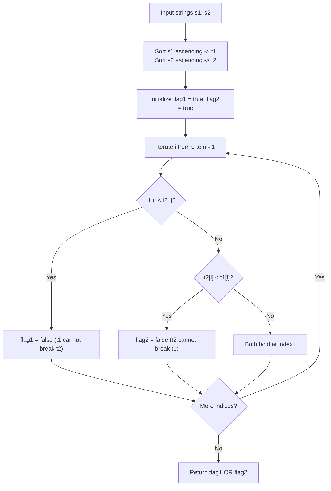

# Guided Example: Check If a String Can Break Another String

We trace the step-by-step execution of sorted coordinate dominance verification on a representative problem instance:

- **Input:** $s_1 = \text{"abc"}, s_2 = \text{"xya"}$
- **Required Output:** `true`

This instance features scrambled letter orders, identical characters (`'a'`), strict alphabetical inequalities (`'b' < 'x'`, `'c' < 'y'`), and demonstrates why sorting both strings in ascending order provides a canonical, necessary and sufficient test for mutual permutation dominance.

---

## 1. Instance & Teaching Goal

We are given two strings $s_1$ and $s_2$ of equal length $n$. A string $x$ is said to **break** a string $y$ if and only if $x[i] \ge y[i]$ in alphabetical order for all positions $0 \le i < n$. We must determine whether there exists some permutation of $s_1$ that can break some permutation of $s_2$, or vice-versa (some permutation of $s_2$ breaks some permutation of $s_1$).

In $s_1 = \text{"abc"}$ and $s_2 = \text{"xya"}$:
- Sorting $s_1$ gives $t_1 = \text{"abc"}$.
- Sorting $s_2$ gives $t_2 = \text{"axy"}$.
- Comparing aligned characters:
  - At $i = 0$: $t_2[0] = \text{'a'} \ge t_1[0] = \text{'a'}$ (Equal).
  - At $i = 1$: $t_2[1] = \text{'x'} \ge t_1[1] = \text{'b'}$ (True).
  - At $i = 2$: $t_2[2] = \text{'y'} \ge t_1[2] = \text{'c'}$ (True).
- Because $t_2[i] \ge t_1[i]$ holds across all indices, a permutation of $s_2$ breaks a permutation of $s_1$, yielding `true`.

The primary teaching goal is to recognize the sorted canonical pairing invariant: evaluating $n!$ permutations is intractable, but if *any* permutation pair satisfies coordinate-wise dominance, then the pair obtained by sorting both strings in ascending order is guaranteed to satisfy it.

---

## 2. Conceptual Foundation & Invariants

Let $t_1$ and $t_2$ be the sorted character arrays of $s_1$ and $s_2$ in ascending order:
$$
t_1[0] \le t_1[1] \le \dots \le t_1[n - 1]
$$
$$
t_2[0] \le t_2[1] \le \dots \le t_2[n - 1]
$$

### The Canonical Sorting Theorem
By the rearrangement inequality and greedy matroid exchange, sorting both sequences pairs the $k$-th smallest element of one multiset with the $k$-th smallest element of the other. If there exists *any* permutation mapping $\pi$ such that $s_1[\pi(i)] \ge s_2[i]$ for all $i$, then the monotonically sorted sequences must also satisfy:
$$
t_1[i] \ge t_2[i] \quad \forall 0 \le i < n
$$
Similarly, for $s_2$ to break $s_1$, it is necessary and sufficient that:
$$
t_2[i] \ge t_1[i] \quad \forall 0 \le i < n
$$

Thus, the problem reduces to two independent boolean checks on the sorted strings:
$$
\text{Result} = \left(\bigwedge_{i=0}^{n-1} (t_1[i] \ge t_2[i])\right) \lor \left(\bigwedge_{i=0}^{n-1} (t_2[i] \ge t_1[i])\right)
$$

```
Sorted Comparison Alignment:
Index (i):        0         1         2
t_1 (from s1):   'a'       'b'       'c'
t_2 (from s2):   'a'       'x'       'y'
Comparison:    'a' <= 'a' 'b' <= 'x' 'c' <= 'y'

Dominance Verdict:
Hypothesis 1 (t_1 >= t_2): FAILS at i = 1 ('b' < 'x')
Hypothesis 2 (t_2 >= t_1): HOLDS for all i in [0, 2]
Result = FALSE or TRUE = TRUE
```

We establish tracking parameters across the aligned pass:

| Parameter | Domain | Role in Predicate |
|---|---|---|
| Sorted $t_1$ | Character array of length $n$ | Canonical sorted representation of $s_1$ |
| Sorted $t_2$ | Character array of length $n$ | Canonical sorted representation of $s_2$ |
| Flag $s_1 \ge s_2$ | Boolean | Tracks whether $t_1$ dominates $t_2$ universally |
| Flag $s_2 \ge s_1$ | Boolean | Tracks whether $t_2$ dominates $t_1$ universally |

> **Invariant.** After checking indices $0 \dots i$, `flag_1` is true if and only if $t_1[j] \ge t_2[j]$ for all $j \le i$, and `flag_2` is true if and only if $t_2[j] \ge t_1[j]$ for all $j \le i$.



---

## 3. Step-by-Step Worked Execution

### Step 1: Sorting Both Strings

- String $s_1 = \text{"abc"}$ is already sorted:
  $$
  t_1 = [\text{'a'}, \text{'b'}, \text{'c'}]
  $$
- String $s_2 = \text{"xya"}$ is sorted alphabetically:
  $$
  t_2 = [\text{'a'}, \text{'x'}, \text{'y'}]
  $$

---

### Step 2: Parallel Coordinate-Wise Comparison

We initialize two feasibility flags:
- $flag_1 = \text{true}$ (testing if $t_1 \ge t_2$ everywhere)
- $flag_2 = \text{true}$ (testing if $t_2 \ge t_1$ everywhere)

1. **Index $i = 0$ ($t_1[0] = \text{'a'}, t_2[0] = \text{'a'}$):**
   - $t_1[0] \ge t_2[0]$ ('a' $\ge$ 'a') is True.
   - $t_2[0] \ge t_1[0]$ ('a' $\ge$ 'a') is True.
   - Flags remain: $flag_1 = \text{true}, flag_2 = \text{true}$.
2. **Index $i = 1$ ($t_1[1] = \text{'b'}, t_2[1] = \text{'x'}$):**
   - $t_1[1] \ge t_2[1]$ ('b' $\ge$ 'x') is False $\implies flag_1 \leftarrow \text{false}$.
   - $t_2[1] \ge t_1[1]$ ('x' $\ge$ 'b') is True $\implies flag_2$ remains $\text{true}$.
3. **Index $i = 2$ ($t_1[2] = \text{'c'}, t_2[2] = \text{'y'}$):**
   - $t_1[2] \ge t_2[2]$ ('c' $\ge$ 'y') is False.
   - $t_2[2] \ge t_1[2]$ ('y' $\ge$ 'c') is True $\implies flag_2$ remains $\text{true}$.

| Index ($i$) | Character $t_1[i]$ | Character $t_2[i]$ | $t_1[i] \ge t_2[i]$ | $t_2[i] \ge t_1[i]$ | $flag_1$ ($s_1 \ge s_2$) | $flag_2$ ($s_2 \ge s_1$) |
|---|---|---|---|---|---|---|
| $0$ | `'a'` | `'a'` | True | True | True | True |
| $1$ | `'b'` | `'x'` | False | True | **False** | True |
| $2$ | `'c'` | `'y'` | False | True | False | **True** |

---

### Step 3: Combine Directional Outcomes

- Final status:
  $$
  flag_1 = \text{false}, \quad flag_2 = \text{true}
  $$
- Result:
  $$
  flag_1 \lor flag_2 = \text{false} \lor \text{true} = \text{true}
  $$

Because $flag_2$ held for all positions, string $s_2$ can break $s_1$. The answer is `true`.

---

## 4. Complete Execution Trace

| Processing Phase | Evaluated Pair $(t_1[i], t_2[i])$ | Local Dominance | Active Hypotheses |
|---|---|---|---|
| Setup | Form sorted arrays | — | Both hypotheses active |
| Pair 0 | $('a', 'a')$ | Equal ($a = a$) | $H_1: \text{Valid}, H_2: \text{Valid}$ |
| Pair 1 | $('b', 'x')$ | $x > b$ ($t_2$ dominates) | $H_1: \text{Falsified}, H_2: \text{Valid}$ |
| Pair 2 | $('c', 'y')$ | $y > c$ ($t_2$ dominates) | $H_1: \text{Falsified}, H_2: \text{Valid}$ |
| Termination | Evaluate $H_1 \lor H_2$ | $H_2$ satisfied everywhere | Output: `true` |

---

## 5. Algorithmic Correctness

**Soundness.** If $t_2[i] \ge t_1[i]$ for all $i$, then the identity permutation of $t_2$ breaks the identity permutation of $t_1$, which corresponds directly to valid permutations of the original strings $s_2$ and $s_1$.

**Completeness.** Suppose there exists some bijection $\pi$ such that $s_2[\pi(i)] \ge s_1[i]$ for all $i$. If the sorted versions violated $t_2[k] < t_1[k]$ for some index $k$, then $t_1$ would contain at least $n - k$ elements $\ge t_1[k]$, while $t_2$ could contain at most $n - k - 1$ elements $\ge t_1[k]$. By the pigeonhole principle, any matching would force at least one element of $t_1$ to be paired with a strictly smaller element of $t_2$, rendering a breaking pairing impossible. Hence, the sorted condition is strictly necessary.

---

## 6. Traps This Instance Exposes

- **Factorial Search Space:** Attempting to generate and test all $n!$ permutations will crash or time out for $n > 10$; sorted alignment tests all configurations in $\mathcal{O}(n \log n)$ time.
- **Unidirectional Assumption:** Testing only whether $s_1$ can break $s_2$ and forgetting to test whether $s_2$ can break $s_1$ would incorrectly return `false` on this instance.
- **Mixed Dominance Conflict:** In an input like $s_1 = \text{"abe"}, s_2 = \text{"acd"}$, sorted arrays are `"abe"` and `"acd"`. At index $1$, $t_2[1] = 'c' > t_1[1] = 'b'$, but at index $2$, $t_1[2] = 'e' > t_2[2] = 'd'$. Because neither string dominates everywhere, both flags become false, correctly returning `false`.

---

## 7. Complexity Derivation

- **Time Complexity:** $\mathcal{O}(n \log n)$ using comparison sorting on $s_1$ and $s_2$, followed by a single linear pass of $n$ comparisons in $\mathcal{O}(n)$ time. (Using counting sort over the alphabet $\Sigma$ of size $26$, runtime reduces to $\mathcal{O}(n + |\Sigma|) = \mathcal{O}(n)$).
- **Auxiliary Space Complexity:** $\mathcal{O}(n)$ auxiliary memory to store the sorted character arrays.
