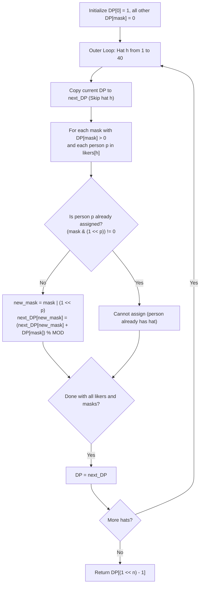

# Guided Example: Number of Ways to Wear Different Hats to Each Other

We trace the step-by-step execution of inverted-dimension Bitmask Dynamic Programming on a representative problem instance:

- **Input:** $hats = [[3, 5, 1], [3, 5]]$
- **Required Output:** $4$

This instance features shared hat preferences ($3$ and $5$ are liked by both people), an exclusive hat preference ($1$ is liked only by Person 0), and illustrates how assigning people to hats inverts an intractable $2^{40}$ state space into a compact $2^n = 4$ state machine modulo $10^9 + 7$.

---

## 1. Instance & Teaching Goal

We are given $n$ people and $40$ types of hats labeled from $1$ to $40$. The 2D array $hats[i]$ contains the list of all hats preferred by the $i$-th person. We must determine the number of distinct ways to assign hats such that:
1. Every person receives a hat they prefer.
2. No two people wear the same hat (all assigned hats are mutually distinct).
3. The result is returned modulo $10^9 + 7$.

In $hats = [[3, 5, 1], [3, 5]]$ ($n = 2$ people):
- Person 0 likes $\{1, 3, 5\}$. Person 1 likes $\{3, 5\}$.
- The $4$ valid pairings $\langle \text{Hat for Person 0}, \text{Hat for Person 1} \rangle$ are:
  1. $(1, 3)$
  2. $(1, 5)$
  3. $(3, 5)$
  4. $(5, 3)$
- Total valid ways = $4$.

The primary teaching goal is to recognize the **role inversion** strategy: tracking which hats have been used requires $2^{40} \approx 1.1 \times 10^{12}$ states (intractable). However, because $n \le 10$, tracking which *people* have received a hat requires only $2^n \le 2^{10} = 1024$ states. By iterating over hats $1 \dots 40$ and assigning each hat to at most one eligible person, the problem collapses into a polynomial bitmask DP.

---

## 2. Conceptual Foundation & Invariants

### Inverted Index Construction
We invert the preference relation to map each hat $h \in [1, 40]$ to the list of people who like it:
$$
\text{likers}[h] = \{ p \in [0, n - 1] \mid h \in hats[p] \}
$$

### Bitmask Dynamic Programming State
Let $mask \in [0, 2^n - 1]$ be a bitmask where the $p$-th bit is $1$ if person $p$ has already been assigned a hat, and $0$ otherwise.
Let $DP[h][mask]$ denote the number of ways to assign a subset of hats from $\{1, \dots, h\}$ to the exact subset of people encoded by $mask$.

### State Transitions for Hat $h$
For each hat $h \in [1, 40]$ and current subset $mask$:
1. **Option A (Skip Hat $h$):**
   Hat $h$ is given to nobody. The subset of assigned people remains $mask$:
   $$
   DP[h][mask] \mathrel{+}= DP[h - 1][mask]
   $$
2. **Option B (Assign Hat $h$ to Person $p$):**
   For each person $p \in \text{likers}[h]$ who has not yet received a hat ($(mask \mathbin{\&} (1 \ll p)) == 0$):
   $$
   DP[h][mask \mid (1 \ll p)] \mathrel{+}= DP[h - 1][mask]
   $$

All additions are performed modulo $10^9 + 7$.
The base state is $DP[0][0] = 1$ (zero people assigned using zero hats), and all other $DP[0][mask] = 0$.
The target is $DP[40][(1 \ll n) - 1]$, where all $n$ people have been assigned hats.

```
Inverted Preferences:
Hat 1: liked by {Person 0}
Hat 3: liked by {Person 0, Person 1}
Hat 5: liked by {Person 0, Person 1}

Bitmask States (n = 2 people):
Mask 00 (0): Nobody has a hat
Mask 01 (1): Person 0 has a hat
Mask 10 (2): Person 1 has a hat
Mask 11 (3): Both Person 0 and Person 1 have hats (Target!)

Transition Flow:
Base:            Mask 00 [1 way]
After Hat 1:     Mask 00 [1 way], Mask 01 [1 way]
After Hat 3:     Mask 00 [1 way], Mask 01 [2 ways], Mask 10 [1 way], Mask 11 [1 way]
After Hat 5:     Mask 11 reaches 4 ways!
```

We establish tracking parameters across the DP iterations:

| Parameter | Domain | Role in Recurrence |
|---|---|---|
| Hat Index ($h$) | $1 \dots 40$ | Hat being considered for assignment |
| People Mask ($mask$) | $0 \dots 2^n - 1$ | Binary subset of people currently wearing hats |
| Likers List ($\text{likers}[h]$) | Sublist of $[0, n - 1]$ | People eligible to receive hat $h$ |
| Full Mask Target | $(1 \ll n) - 1$ | Mask representing complete assignment |

> **Invariant.** After processing hats $1 \dots h$, $DP[mask]$ accurately counts all valid assignments of a subset of hats $\{1, \dots, h\}$ to the exact group of people represented by $mask$ such that each assigned person receives a preferred hat and no hat is reused.



---

## 3. Step-by-Step Worked Execution

### Step 1: Construct Inverted Index and Initialize Base State

- People preferences: Person 0 likes $\{1, 3, 5\}$, Person 1 likes $\{3, 5\}$.
- Inverted mapping:
  - $\text{likers}[1] = [0]$
  - $\text{likers}[3] = [0, 1]$
  - $\text{likers}[5] = [0, 1]$
  - All other hats $h \notin \{1, 3, 5\}$ have $\text{likers}[h] = \emptyset$.
- Initial table:
  $$
  DP[00_2] = 1, \quad DP[01_2] = 0, \quad DP[10_2] = 0, \quad DP[11_2] = 0
  $$

---

### Step 2: Process Hat $1$ ($\text{likers}[1] = [0]$)

- Skip Hat 1: $next\_DP[00] \mathrel{+}= DP[00] = 1$.
- Assign Hat 1 to Person 0:
  - From $mask = 00_2$: Person 0 is unassigned ($00 \mathbin{\&} 01 = 0$).
  - $new\_mask = 00_2 \mid 01_2 = 01_2$.
  - $next\_DP[01] \mathrel{+}= DP[00] = 1$.
- Resulting DP after Hat 1:
  $$
  DP = \{00_2: 1, \, 01_2: 1, \, 10_2: 0, \, 11_2: 0\}
  $$

| Mask ($mask$) | Decimal | Persons Assigned | Prior Ways | Contribution from Hat 1 | Updated Ways |
|---|---|---|---|---|---|
| $00_2$ | $0$ | None | $1$ | Retained (Skip Hat 1) | $1$ |
| $01_2$ | $1$ | Person 0 | $0$ | $+ DP[00]$ (Hat 1 $\to$ Person 0) | $1$ |
| $10_2$ | $2$ | Person 1 | $0$ | None | $0$ |
| $11_2$ | $3$ | Both | $0$ | None | $0$ |

---

### Step 3: Process Hat $3$ ($\text{likers}[3] = [0, 1]$)

- Inherit existing states (Skip Hat 3):
  $next\_DP = \{00_2: 1, \, 01_2: 1, \, 10_2: 0, \, 11_2: 0\}$.
- Assign Hat 3:
  - To Person 0:
    - From $mask = 00_2$: $00_2 \mid 01_2 = 01_2 \implies next\_DP[01] \mathrel{+}= DP[00] = 1$.
  - To Person 1:
    - From $mask = 00_2$: $00_2 \mid 10_2 = 10_2 \implies next\_DP[10] \mathrel{+}= DP[00] = 1$.
    - From $mask = 01_2$: Person 1 is unassigned ($01_2 \mathbin{\&} 10_2 = 0$).
      $01_2 \mid 10_2 = 11_2 \implies next\_DP[11] \mathrel{+}= DP[01] = 1$.
- Resulting DP after Hat 3:
  $$
  DP = \{00_2: 1, \, 01_2: 2, \, 10_2: 1, \, 11_2: 1\}
  $$

| Mask ($mask$) | Persons Assigned | Prior Ways | Hat 3 Assignment Transitions | New Total Ways |
|---|---|---|---|---|
| $00_2$ | None | $1$ | Retained | $1$ |
| $01_2$ | Person 0 | $1$ | $+ DP[00]$ (Hat 3 $\to$ Person 0) | $1 + 1 = 2$ |
| $10_2$ | Person 1 | $0$ | $+ DP[00]$ (Hat 3 $\to$ Person 1) | $0 + 1 = 1$ |
| $11_2$ | Both | $0$ | $+ DP[01]$ (Hat 3 $\to$ Person 1) | $0 + 1 = 1$ |

---

### Step 4: Process Hat $5$ ($\text{likers}[5] = [0, 1]$)

- Inherit existing states:
  $next\_DP = \{00_2: 1, \, 01_2: 2, \, 10_2: 1, \, 11_2: 1\}$.
- Assign Hat 5:
  - To Person 0:
    - From $mask = 00_2$: $00_2 \mid 01_2 = 01_2 \implies next\_DP[01] \mathrel{+}= DP[00] = 1$.
    - From $mask = 10_2$: $10_2 \mid 01_2 = 11_2 \implies next\_DP[11] \mathrel{+}= DP[10] = 1$.
  - To Person 1:
    - From $mask = 00_2$: $00_2 \mid 10_2 = 10_2 \implies next\_DP[10] \mathrel{+}= DP[00] = 1$.
    - From $mask = 01_2$: $01_2 \mid 10_2 = 11_2 \implies next\_DP[11] \mathrel{+}= DP[01] = 2$.
- Final ways in target mask $11_2$:
  $$
  next\_DP[11] = 1 \text{ (prior)} + 1 \text{ (Hat 5 to 0)} + 2 \text{ (Hat 5 to 1)} = 4
  $$

| Mask ($mask$) | Persons Assigned | Prior Ways | Hat 5 Assignment Transitions | Final Total Ways |
|---|---|---|---|---|
| $00_2$ | None | $1$ | Retained | $1$ |
| $01_2$ | Person 0 | $2$ | $+ DP[00]$ (Hat 5 $\to$ Person 0) | $2 + 1 = 3$ |
| $10_2$ | Person 1 | $1$ | $+ DP[00]$ (Hat 5 $\to$ Person 1) | $1 + 1 = 2$ |
| $11_2$ | Both | $1$ | $+ DP[10]$ (to Person 0) $+ DP[01]$ (to Person 1) | $1 + 1 + 2 = 4$ |

Target mask $11_2$ (both people covered) has exactly $4$ ways.

---

## 4. Complete Execution Trace

| Processing Stage | Active Hat | Evaluated Subset Transitions | Target Mask $11_2$ Accumulator |
|---|---|---|---|
| Initialization | None | $DP[00] = 1$ | $0$ |
| Hat 1 | Likers: $\{0\}$ | $00 \to 01$ ($+1$) | $0$ |
| Hat 3 | Likers: $\{0, 1\}$ | $00 \to 01$ ($+1$), $00 \to 10$ ($+1$), $01 \to 11$ ($+1$) | $1$ |
| Hat 5 | Likers: $\{0, 1\}$ | $10 \to 11$ ($+1$), $01 \to 11$ ($+2$) | $1 + 1 + 2 = 4$ |
| Non-preferred Hats | Others | Likers empty $\implies$ values unchanged | $4$ |
| Result | All $40$ Hats | Extract $DP[(1 \ll 2) - 1] = DP[3]$ | Final Output: $4$ |

---

## 5. Algorithmic Correctness

**Soundness.** Because hats are processed sequentially from $1$ to $40$, each hat is assigned to at most one person in any transition. The bitwise check $(mask \mathbin{\&} (1 \ll p)) == 0$ guarantees that no person is ever assigned more than one hat. Filtering by $\text{likers}[h]$ ensures that every person receives only a preferred hat.

**Completeness.** By mathematical induction on the hat index, after processing hat $h$, $DP[mask]$ accounts for all valid matchings between subsets of $\{1, \dots, h\}$ and the people in $mask$. Since all $40$ hats are evaluated, every valid assignment of distinct hats to all $n$ people is counted in $DP[(1 \ll n) - 1]$.

---

## 6. Traps This Instance Exposes

- **Bitmasking Hats Instead of People:** Choosing $mask$ over hats requires $2^{40} \approx 10^{12}$ states, which is impossible to compute; inverting to people bitmasks requires only $2^n \le 1024$ states.
- **In-Place Mutation Race Condition:** Updating $DP[mask]$ in-place without either a secondary `next_DP` buffer or iterating masks in reverse causes a single hat to be assigned multiple times within the same step.
- **Modulo Reduction Omission:** Failing to reduce by $10^9 + 7$ at each addition causes 64-bit integer overflow for large test cases ($n = 10$).
- **Unassigned Person Re-assignment:** Forgetting the guard $(mask \mathbin{\&} (1 \ll p)) == 0$ would assign hat $h$ to a person who already has a hat.

---

## 7. Complexity Derivation

- **Time Complexity:** $\mathcal{O}(H \cdot 2^n \cdot n)$, where $H = 40$ is the total number of hats and $n \le 10$ is the number of people. For each of the $40$ hats, we iterate through all $2^n$ bitmasks and check at most $n$ eligible people. The maximum number of operations is $40 \times 1024 \times 10 \approx 4 \times 10^5$, executing within milliseconds.
- **Auxiliary Space Complexity:** $\mathcal{O}(2^n)$ to store the DP table of size $2^{10} = 1024$ integers.