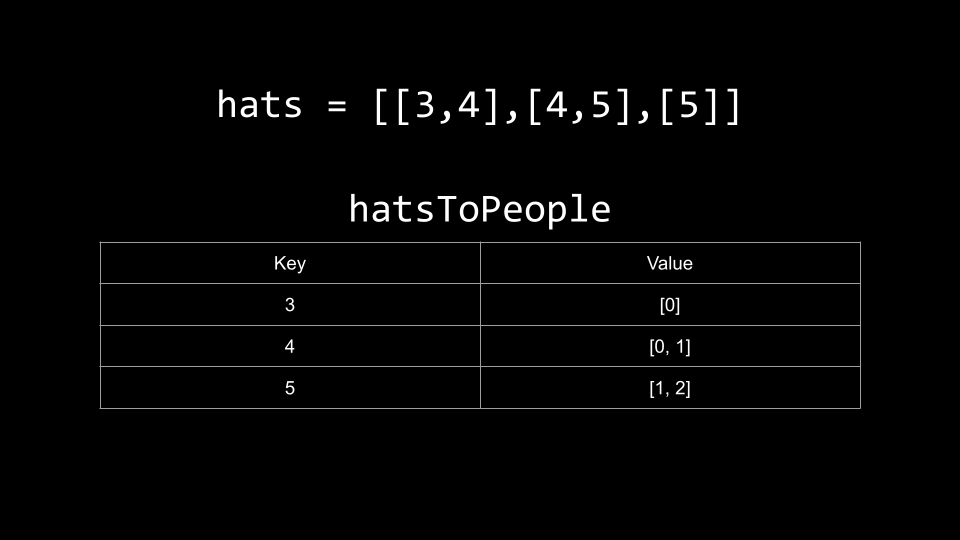

[TOC]

## Solution

---

### Approach 1: Top-Down Dynamic Programming + Bitmasks

**Intuition**

> In this editorial, we will assume that you are already familiar with the principles of dynamic programming, such as breaking problems into subproblems, base cases, and recurrence relations. If you are not already familiar with dynamic programming, we recommend checking out the [Dynamic Programming explore card](https://leetcode.com/explore/featured/card/dynamic-programming/) and practicing other DP problems first, as this problem is very difficult.

An intuitive way to solve this problem would be to iterate over the people, and for each person, select one of their preferred hats. We keep track of hats that have already been placed and only select a preferred hat if it is free. If we manage to select a hat for each person, we have found a way to place the hats.

The problem with this approach is that there can be up to $40$ hats. Each of the hats can either be taken or free, which means there would be $2^{40}$ states regarding the hats, which is over 1 trillion. This is way too big and will certainly TLE.

Notice that the constraints state that while there can be up to $40$ hats, there can only be up to $10$ people. How can we use this to our advantage?

Instead of tracking which hats are free, let's instead track which people don't have a hat yet. Instead of iterating over the people to select a hat, we will iterate over the hats and select people.

This would change our strategy. In the slow approach, we iterate over each person, and for the current person, select any hat that is preferred and free. In the new approach, we iterate over the hats, and for each hat, place it on any person that prefers it and does not already have a hat. The key difference is that in the slow approach, we need to track which hats are free, and in the new approach, we need to track which people don't already have a hat.

| Idea | Slow approach | New approach
|:---:|:---:|:---:|
| Strategy |  Iterate over people, select a free and preferred hat  | Iterate over hats, select a person that prefers the current hat and isn't already wearing one
| Tracking |  Keep track of which hats are free  |  Keep track of which people don't have a hat yet
| State space | $n \cdot 2^k \leq 10^{13}$ | $k \cdot 2^n \leq 40960$

<br>

Given $n \leq 10$ as the number of people and $k \leq 40$ as the number of hats, the new approach is many orders of magnitudes faster.

To implement this new approach, we will need to map each hat to a list of people that prefer the hat. Let's use a hash map `hatsToPeople` for this. It maps an integer `hat` to a list of integers that represents all the people that prefer `hat`.

 <br>

Now that we have `hatsToPeople`, we can delve into our DP strategy.

Let's define a function `dp(hat, mask)`. `hat` represents the current hat we are trying to place. `mask` is a bitmask that denotes which people are already wearing a hat. `dp` will return how many ways there are to place the hats in the range `[hat, 40]` such that everyone will end up wearing a hat. The answer to our problem will be `dp(1, 0)`. We start with the first hat, and nobody is wearing a hat initially. Here, the $i^{th}$ bit of `mask` is set if the $i^{th}$ person is wearing a hat.

<details>
    <summary>
        <b>   If you are not familiar with bit manipulation, click here to expand. </b>
    </summary>

<br />

Bit manipulation is the act of manipulating bits, like changing bits of an integer.
At the heart of bit manipulation are the bit-wise operators:

**NOT (~):** Bitwise NOT is a unary operator that flips the bits of the number i.e., if the current bit is $0$, it will change it to $1$ and vice versa.
```text
N = 5 = 101 (in binary)
~N = ~(101) = 010 = 2 (in decimal)
```

**AND (&):** In bitwise AND if both bits in the compared position of the bit patterns are $1$, the bit in the resulting bit pattern is $1$, otherwise $0$.
```text
A = 5 = 101 (in binary)
B = 1 = 001 (in binary)
A & B = 101 & 001 = 001 = 1 (in decimal)
```

**OR ( | ):** Bitwise OR is also similar to bitwise AND. If both bits in the compared position of the bit patterns are $0$, the bit in the resulting bit pattern is $0$, otherwise $1$.
```text
A = 5 = 101 (in binary)
B = 1 = 001 (in binary)
A | B = 101 | 001 = 101 = 5 (in decimal)
```

**XOR (^):** In bitwise XOR if both bits are $0$ or $1$, the result will be $0$, otherwise $1$.
```text
A = 5 = 101 (in binary)
B = 1 = 001 (in binary)
A ^ B = 101 ^ 001 = 100 = 4 (in decimal)
```

**Left Shift (<<):** Left shift operator is a binary operator which shifts some number of bits to the left and appends $0$ at the end. One left shift is equivalent to multiplying the bit pattern with $2$.
```text
A = 1 = 001 (in binary)
A << 1 = 001 << 1 = 010 = 2 (in decimal)
A << 2 = 001 << 2 = 100 = 4 (in decimal)

B = 5 = 00101 (in binary)
B << 1 = 00101 << 1 = 01010 = 10 (in decimal)
B << 2 = 00101 << 2 = 10100 = 20 (in decimal)
```

**Right Shift (>>):** Right shift operator is a binary operator which shifts some number of bits to the right and appends $0$ at the left side. One right shift is equivalent to dividing the bit pattern with $2$.
```text
A = 4 = 100 (in binary)
A >> 1 = 100 >> 1 = 010 = 2 (in decimal)
A >> 2 = 100 >> 2 = 001 = 1 (in decimal)
A >> 3 = 100 >> 3 = 000 = 0 (in decimal)

B = 5 = 00101 (in binary)
B >> 1 = 00101 >> 1 = 00010 = 2 (in decimal)
```
</details>

<br />

Let's talk about the recurrence relation now. Given a state `(hat, mask)`, we have two options. Place the hat on someone or skip it. If we skip it, there are $dp(hat + 1, mask)$ ways to solve the problem. We simply move on to the next hat without changing `mask`.

The other option is to place the hat. We iterate over $\text{hatsToPeople}[hat]$, which holds a list of all the people that prefer this hat. For each `person`, we check if the bit at position `person` is set in `mask`. If it's not set, it means `person` both prefers `hat` and is also not currently wearing a hat - therefore we could place `hat` on `person`. To do this, we need to set the bit in `mask`, which we can do with `mask | (1 << person)`. There are $dp(hat + 1, mask | (1 << person))$ ways to solve the problem after this decision.

The answer to a state `(hat, mask)` is the sum of all these possibilities.

Our `dp` function has two base cases.

First, if we manage to give everyone a hat, then we `return 1`. We can detect this by checking if all bits in `mask` are set. We initialize a value `done` which is equal to $2^n - 1$, where $n$ is the number of people. If $mask = done$, it means everyone has a hat.

Second, if `hat > 40`, we have run out of hats. It is impossible to complete the task now, so we `return 0`.

Don't forget to memoize the function and perform all arithmetic mod $10^9 + 7$.

**Algorithm**

1. Initialize a few variables:
- `n` as the number of people.
- `done` as $2^n - 1$.
- `MOD` as $10^9 + 7$.
- `memo` as a 2D array of size $41 * done$ (in Python we don't need to do this as we will use `@functools.cache` to memoize).
- `hatsToPeople` as a hash map that maps integers to lists of integers.
2. Fill `memo` with `-1` to denote that a given state has not yet been calculated.
3. Iterate over `hats` and populate `hatsToPeople` by mapping each `hat` to the people that prefer it.

Now, we can implement the `dp(hat, mask)` function.

- If $mask = done$, then `return 1`.
- If `hat > 40`, then `return 0`.
- If $\text{memo}[hat][mask] \neq -1$, then return it as we have already calculated this state.
- Otherwise, we need to calculate this state. Initialize $ans = dp(hat + 1, mask)$ which skips this hat.
- Iterate over $\text{hatsToPeople}[hat]$. For each `person` that prefers `hat`:
- Check if the bit at position `person` is set. You can do this with `mask & (1 << person)`.
- If it isn't set, then add $dp(hat + 1, mask | (1 << person))$ to `ans` and take it `% MOD`.
- Set $\text{memo}[hat][mask] = ans$ and return it.

4. Return `dp(1, 0)`.

**Implementation**

> We are using [@functools.cache](https://docs.python.org/3/library/functools.html) in Python for memoization.

```python
class Solution:
    def numberWays(self, hats: List[List[int]]) -> int:
        @cache
        def dp(hat, mask):
            if mask == done:
                return 1

            if hat > 40:
                return 0

            ans = dp(hat + 1, mask)

            for person in hats_to_people[hat]:
                if mask & (1 << person) == 0:
                    ans = (ans + dp(hat + 1, mask | (1 << person))) % MOD

            return ans

        hats_to_people = defaultdict(list)
        for i in range(len(hats)):
            for hat in hats[i]:
                hats_to_people[hat].append(i)

        n = len(hats)
        MOD = 10 ** 9 + 7
        done = 2 ** n - 1
        return dp(1, 0)
```

**Complexity Analysis**

Given $n$ as the number of people and $k$ as the number of hats,

* Time complexity: $O(k \cdot n \cdot 2^n)$

    There are $k$ states for `hat` and $2^n$ states for `mask`. This gives us $k \cdot 2^n$ states in total for our DP. We never calculate a state more than once due to memoization. For each state, we iterate over `hatsToPeople`, which in the worst-case scenario costs $O(n)$. This gives us a time complexity of $O(k \cdot n \cdot 2^n)$.

    Note that in this problem, $k = 40$ so one could argue the time complexity is $O(n \cdot 2^n)$. However, it's good to maintain generality in case a follow-up states that $k$ could be variable.

* Space complexity: $O(k \cdot 2^n)$

    For memoization, we store the answer to states. As mentioned above, there can be up to $O(k \cdot 2^n)$ states. We also use additional space for `hatsToPeople` and the recursion call stack, but both of these are dominated by memoization.

<br/>

---

### Approach 2: Bottom-Up Dynamic Programming

**Intuition**

This is the same algorithm as in the previous approach, except we will implement it iteratively.

To convert a top-down algorithm to a bottom-up one, we use the same recurrence relation and base cases. However, we must be careful about the order in which we calculate the states. We need to start at the base cases and work our way up to the final answer $(hat = 1, mask = 0)$.

We use a nested for loop to iterate over each state of `(hat, mask)`. For the `hat` for loop, we start at `40` and iterate until `1`. For the `mask` for loop, we start at `done` and iterate until `0`.

Each iteration inside this nested for loop represents a state `(hat, mask)` which is equivalent to a function call in the previous approach. As such, we can basically copy paste the same logic in, as you'll see in the implementation section.

Note: when sizing our 2D `dp` array, we will need to have a size of $42 * (done + 1)$. It needs to be `42` because for hat `40`, we will reference $hat + 1$ which is hat `41`. Of course, `dp` is 0-indexed, so accessing $\text{dp}[41]$ will require a size of `42`. Similarly, accessing `dp[...][done]` will require that the inner arrays are sized $done + 1$.

Before initializing the `dp` calculation, we compute `hatsToPeople` just like we did in the previous approach and also set the base cases: $\text{dp}[hat][done] = 1$ for all values of `hat`.

**Algorithm**

1. Initialize a few variables:
- `n` as the number of people.
- `done` as $2^n - 1$.
- `MOD` as $10^9 + 7$.
- `hatsToPeople` as a hash map that maps integers to lists of integers.
2. Iterate over `hats` and populate `hatsToPeople` by mapping each `hat` to the people that prefer it.
3. Initialize `dp` as a 2D array of size $42 * (done + 1)$. Fill in the base cases: $\text{dp}[hat][done] = 1$ for all values of `hat`.

Now, we can calculate `dp`. Use a nested for loop over `hat` and `mask`. Start `hat` at `40` and iterate until `1`. Start `mask` at `done` and iterate until `0`. For each iteration (`hat, mask`):

- Initialize $ans = dp[hat + 1][mask]$.
- Iterate over $\text{hatsToPeople}[hat]$. For each `person` that prefers `hat`:
- Check if the bit at position `person` is set. You can do this with `mask & (1 << person)`.
- If it isn't set, then add $dp[hat + 1][mask | (1 << person)]$ to `ans` and take it `% MOD`.
- Set $\text{dp}[hat][mask] = ans$.

4. Return $\text{dp}[1][0]$.

**Implementation**

```python
class Solution:
    def numberWays(self, hats: List[List[int]]) -> int:
        hats_to_people = defaultdict(list)
        for i in range(len(hats)):
            for hat in hats[i]:
                hats_to_people[hat].append(i)

        n = len(hats)
        MOD = 10 ** 9 + 7
        done = 2 ** n - 1

        dp = [[0] * (done + 1) for _ in range(42)]
        for i in range(len(dp)):
            dp[i][done] = 1

        for mask in range(done, -1, -1):
            for hat in range(40, 0, -1):
                ans = dp[hat + 1][mask]
                for person in hats_to_people[hat]:
                    if mask & (1 << person) == 0:
                        ans = (ans + dp[hat + 1][mask | (1 << person)]) % MOD

                dp[hat][mask] = ans

        return dp[1][0]
```

**Complexity Analysis**

Given $n$ as the number of people and $k$ as the number of hats,

* Time complexity: $O(k \cdot n \cdot 2^n)$

    The time complexity is the same as the previous approach for the same reason. We calculate each state at most once, and each state requires up to $O(n)$ to calculate.

* Space complexity: $O(k \cdot 2^n)$

    The space complexity is the same as the previous approach for the same reason. We are storing the answer to all the states.

<br/>

---