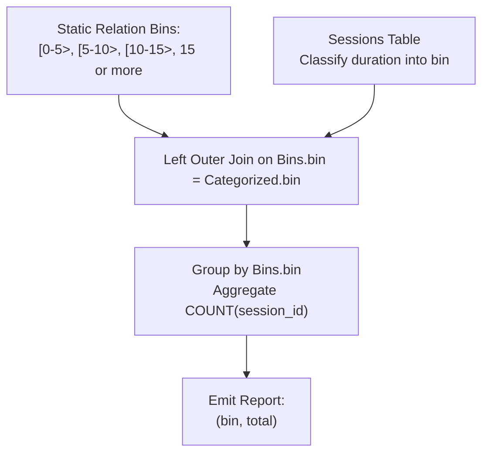

# Guided Example: Create a Session Bar Chart

We trace the step-by-step execution of static domain scaffolding, interval classification, and null-safe aggregation on a representative database instance:

- **Input Table:**
  - `Sessions`:
    - `(1, 30)`
    - `(2, 199)`
    - `(3, 299)`
    - `(4, 580)`
    - `(5, 1000)`
- **Required Output:**
  - `("[0-5>", 3)`
  - `("[5-10>", 1)`
  - `("[10-15>", 0)`
  - `("15 or more", 1)`

This instance features sessions populating multiple duration intervals, boundary durations near interval edges ($299$ seconds), and an entirely empty interval ($[10-15>$) that must be preserved in the output with a count of $0$.

---

## 1. Instance & Teaching Goal

We are given a database table `Sessions` with columns `session_id` (primary key) and `duration` (in seconds). We must generate a bar chart report summarizing the total number of sessions falling into each of four predefined duration intervals:
1. `"[0-5>"`: $0 \le \text{duration} < 300$ ($0$ to $< 5$ minutes).
2. `"[5-10>"`: $300 \le \text{duration} < 600$ ($5$ to $< 10$ minutes).
3. `"[10-15>"`: $600 \le \text{duration} < 900$ ($10$ to $< 15$ minutes).
4. `"15 or more"`: $\text{duration} \ge 900$ ($\ge 15$ minutes).

In the provided table:
- Sessions $1, 2, 3$ have durations $30, 199, 299 < 300$ seconds $\implies 3$ sessions in `"[0-5>"`.
- Session $4$ has duration $580$ seconds ($300 \le 580 < 600$) $\implies 1$ session in `"[5-10>"`.
- No session has duration in $[600, 900)$ $\implies 0$ sessions in `"[10-15>"`.
- Session $5$ has duration $1000 \ge 900$ seconds $\implies 1$ session in `"15 or more"`.

The primary teaching goal is to address the **empty bin problem**: grouping directly over `Sessions` drops bins with zero occurrences. To guarantee all four categories appear in the output, we construct a static domain relation $\text{Bins}$ and perform a relational left outer join ($\bowtie_{\text{left}}$), aggregating non-null session identifiers with $\text{count}(\text{session\_id})$ so that unmatched categories evaluate cleanly to $0$.

---

## 2. Conceptual Foundation & Invariants

In relational algebra, preserving all target categories proceeds in four stages:
1. **Define the Universal Bin Scaffolding:**
   $$
   \text{Bins} = \{ \text{"[0-5>"}, \, \text{"[5-10>"}, \, \text{"[10-15>"}, \, \text{"15 or more"} \}
   $$
2. **Classify Sessions into Bins:**
   Map each tuple $s \in \text{Sessions}$ to its corresponding category label:
   $$
   \text{bin}(duration) = \begin{cases}
   \text{"[0-5>"} & \text{if } 0 \le duration < 300 \\
   \text{"[5-10>"} & \text{if } 300 \le duration < 600 \\
   \text{"[10-15>"} & \text{if } 600 \le duration < 900 \\
   \text{"15 or more"} & \text{if } duration \ge 900
   \end{cases}
   $$
   $$
   \text{Categorized} = \Pi_{\text{session\_id}, \, \text{bin}(duration) \to \text{bin}}(\text{Sessions})
   $$
3. **Left Outer Join:**
   Preserve all four bins regardless of whether any session matched:
   $$
   \mathcal{T} = \text{Bins} \bowtie_{\text{left}, \, \text{Bins.bin} = \text{Categorized.bin}} \text{Categorized}
   $$
4. **Grouped Aggregation with Null-Safe Counting:**
   $$
   \mathcal{R} = \gamma_{\text{Bins.bin} \to \text{bin}, \, \text{count}(\text{session\_id}) \to \text{total}}(\mathcal{T})
   $$
   Because $\text{count}(\text{session\_id})$ counts only non-null values, the synthetic null row produced for `"[10-15>"` evaluates to $0$.

```
Static Bins Scaffolding (Preserved Left)     Categorized Sessions (Right)       Aggregated Bar Chart
----------------------------------------     ----------------------------       --------------------
"[0-5>"     -------------------------------> Matches: s1 (30), s2 (199), s3 (299) -> ("[0-5>",      3)
"[5-10>"    -------------------------------> Matches: s4 (580)                    -> ("[5-10>",     1)
"[10-15>"   -------------------------------> [No Match -> null]                   -> ("[10-15>",    0)
"15 or more"-------------------------------> Matches: s5 (1000)                   -> ("15 or more", 1)
```

We establish tracking parameters across the relational pipeline:

| Parameter | Relational Representation | Role in Query |
|---|---|---|
| Domain Scaffolding ($\text{Bins}$) | Static relation of $4$ tuples | Guarantees presence of all required categories |
| Duration Invariant | Time in seconds | $1 \text{ min} = 60 \text{ s} \implies 5 \text{m} = 300\text{s}, 10\text{m} = 600\text{s}, 15\text{m} = 900\text{s}$ |
| Left Join Match | Matched session tuple or null | Supplies `session_id` for aggregation |
| Column `total` | $\text{count}(\text{session\_id})$ | Non-null count resolving empty bins to $0$ |

> **Invariant.** For each of the $4$ bins in $\text{Bins}$, exactly one row is emitted in $\mathcal{R}$. The emitted `total` equals the exact count of sessions whose duration lies in the interval, evaluating to $0$ if no sessions match.



---

## 3. Step-by-Step Worked Execution

### Step 1: Session Duration Classification

We inspect each of the $5$ sessions in `Sessions`:
- **Session 1 ($duration = 30$):** $0 \le 30 < 300 \implies \text{"[0-5>"}$.
- **Session 2 ($duration = 199$):** $0 \le 199 < 300 \implies \text{"[0-5>"}$.
- **Session 3 ($duration = 299$):** $0 \le 299 < 300 \implies \text{"[0-5>"}$.
- **Session 4 ($duration = 580$):** $300 \le 580 < 600 \implies \text{"[5-10>"}$.
- **Session 5 ($duration = 1000$):** $1000 \ge 900 \implies \text{"15 or more"}$.

| Session ID | Duration (Seconds) | Interval Condition | Assigned Category Bin |
|---|---|---|---|
| $1$ | $30$ | $0 \le 30 < 300$ | `[0-5>` |
| $2$ | $199$ | $0 \le 199 < 300$ | `[0-5>` |
| $3$ | $299$ | $0 \le 299 < 300$ | `[0-5>` |
| $4$ | $580$ | $300 \le 580 < 600$ | `[5-10>` |
| $5$ | $1000$ | $1000 \ge 900$ | `15 or more` |

---

### Step 2: Left Outer Join Against Static Scaffolding

We join the $4$ fixed categories with the classified session rows:
1. `"[0-5>"` matches sessions $1, 2, 3$ ($3$ joined rows).
2. `"[5-10>"` matches session $4$ ($1$ joined row).
3. `"[10-15>"` has no matches $\implies 1$ joined row with `session_id = null`.
4. `"15 or more"` matches session $5$ ($1$ joined row).

| Scaffolding Bin | Matching Session ID | Matched Status | Joined Row Produced |
|---|---|---|---|
| `[0-5>` | $1$ | Matched | `("[0-5>", 1)` |
| `[0-5>` | $2$ | Matched | `("[0-5>", 2)` |
| `[0-5>` | $3$ | Matched | `("[0-5>", 3)` |
| `[5-10>` | $4$ | Matched | `("[5-10>", 4)` |
| `[10-15>` | $\text{null}$ | Unmatched | `("[10-15>", null)` |
| `15 or more` | $5$ | Matched | `("15 or more", 5)` |

---

### Step 3: Grouped Aggregation by Category

We compute `COUNT(session_id)` for each category group:
- `"[0-5>"`: group contains $\{1, 2, 3\} \implies \text{count} = 3$.
- `"[5-10>"`: group contains $\{4\} \implies \text{count} = 1$.
- `"[10-15>"`: group contains $\{\text{null}\} \implies \text{count} = 0$.
- `"15 or more"`: group contains $\{5\} \implies \text{count} = 1$.

| Group Category | Multiset of Session IDs | $\text{count}(\text{session\_id})$ Evaluation | Final Projected Row |
|---|---|---|---|
| `[0-5>` | $\{1, 2, 3\}$ | $3$ non-null values | `("[0-5>", 3)` |
| `[5-10>` | $\{4\}$ | $1$ non-null value | `("[5-10>", 1)` |
| `[10-15>` | $\{\text{null}\}$ | $0$ non-null values | `("[10-15>", 0)` |
| `15 or more` | $\{5\}$ | $1$ non-null value | `("15 or more", 1)` |

All $4$ rows emitted successfully.

---

## 4. Complete Execution Trace

| Step Phase | Target Relation | Operation Applied | Intermediate Result State |
|---|---|---|---|
| Scaffolding | $\text{Bins}$ | Instantiate constant set | $4$ domain categories established |
| Mapping | `Sessions` | Classify $5$ rows into bins | $[0-5> \times 3$, $[5-10> \times 1$, $15\text{ or more} \times 1$ |
| Join Probe | $\text{Bins} \bowtie_{\text{left}} \text{Sessions}$ | Match on bin label | $6$ joined tuples (including $1$ null tuple for $[10-15>$) |
| Aggregation | Partition by bin | Group and sum non-null keys | $[0-5> \to 3$, $[5-10> \to 1$, $[10-15> \to 0$, $15\text{ or more} \to 1$ |
| Emission | Output relation | Project columns `bin`, `total` | Final $4$-row summary table |

---

## 5. Algorithmic Correctness

**Soundness.** Every session is uniquely mapped to exactly one interval because the intervals $[0, 300)$, $[300, 600)$, $[600, 900)$, and $[900, \infty)$ partition non-negative numbers into pairwise disjoint sets. Using $\text{count}(\text{session\_id})$ rather than $\text{count}(*)$ guarantees that unmatched rows with null session IDs evaluate to $0$.

**Completeness.** By anchoring the left outer join to the static relation $\text{Bins}$, all four requested bins appear in the result relation regardless of whether any session data exists for them, satisfying the full reporting requirement.

---

## 6. Traps This Instance Exposes

- **Missing Zero-Count Bins:** Running a direct `GROUP BY` on `Sessions` omits `"[10-15>"` entirely, returning only 3 rows instead of the mandatory 4.
- **The `COUNT(*)` Null Trap:** Writing `COUNT(*)` instead of `COUNT(session_id)` counts the outer-joined null row as $1$ row, incorrectly reporting $1$ instead of $0$ for `"[10-15>"`.
- **Units Conversion Error:** Forgetting that `duration` is in seconds and comparing against $5, 10, 15$ instead of $300, 600, 900$ misclassifies all sessions.
- **Half-Open Interval Confusion:** The intervals are right-open ($[0-5>$ means $< 300$). A session of duration $299$ belongs to `"[0-5>"`, while $300$ belongs to `"[5-10>"`. Using $\le 300$ misplaces boundary points.

---

## 7. Complexity Derivation

- **Time Complexity:** $\mathcal{O}(|S| + |\mathcal{B}|)$, where $|S|$ is the number of session rows and $|\mathcal{B}| = 4$ is the fixed number of bin categories. Scanning and categorizing sessions takes $\mathcal{O}(|S|)$ time. The outer join and aggregation over $4$ categories take $\mathcal{O}(|S| + |\mathcal{B}|)$ time.
- **Auxiliary Space Complexity:** $\mathcal{O}(|S| + |\mathcal{B}|)$ to store the categorized session mappings and category scaffolding.
