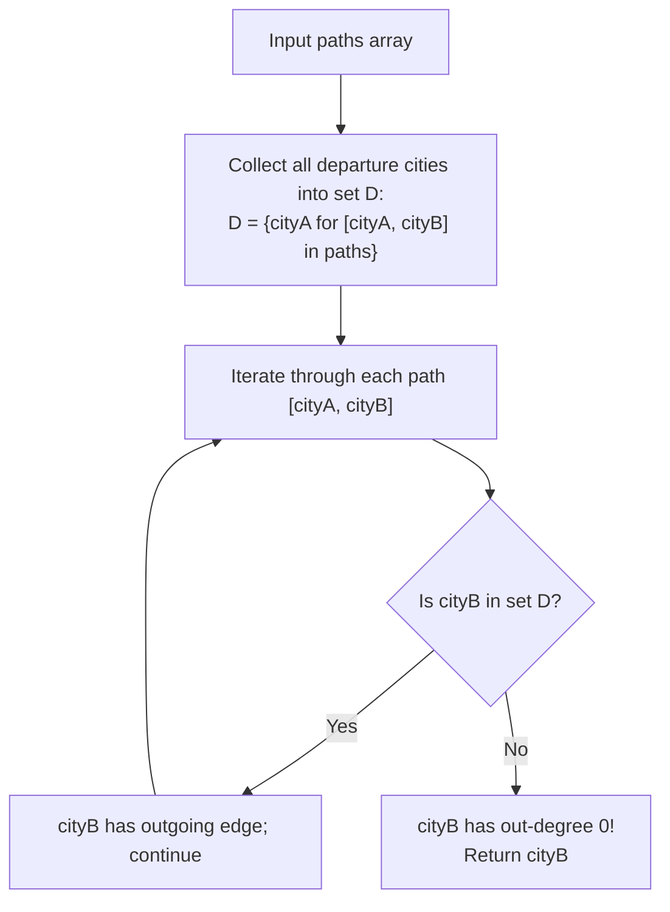

# Guided Example: Destination City

We trace the step-by-step execution of departure-set difference and zero-outdegree identification on a representative problem instance:

- **Input:** $paths = [[\text{"London"}, \text{"New York"}], [\text{"New York"}, \text{"Lima"}], [\text{"Lima"}, \text{"Sao Paulo"}]]$
- **Required Output:** `"Sao Paulo"`

This instance features a linear journey with multiple intermediate transit stops (New York, Lima), an origin city (London), and a unique terminating terminal city (Sao Paulo) having zero outgoing flights.

---

## 1. Instance & Teaching Goal

We are given an array $paths$ where each entry $paths[i] = [cityA_i, cityB_i]$ denotes a direct one-way route from $cityA_i$ to $cityB_i$. We must return the **destination city**—defined as the unique city that has no outgoing path to any other city.

In the provided instance:
- London connects to New York: London has out-degree $1$.
- New York connects to Lima: New York has in-degree $1$, out-degree $1$.
- Lima connects to Sao Paulo: Lima has in-degree $1$, out-degree $1$.
- Sao Paulo has an incoming route from Lima, but has zero outgoing routes: out-degree is $0$.
- The destination city is `"Sao Paulo"`.

The primary teaching goal is to model destination identification using graph degree properties: every non-destination city appears at least once as a source ($cityA$). By gathering all departure cities into a hash set $D$, the destination city is immediately identified as the unique arrival city ($cityB$) that does not belong to $D$.

---

## 2. Conceptual Foundation & Invariants

Let $G = (V, E)$ be the directed acyclic graph formed by the edges in $paths$. The problem guarantees that $G$ forms a simple directed line path with no cycles:
$$
v_0 \xrightarrow{} v_1 \xrightarrow{} v_2 \xrightarrow{} \dots \xrightarrow{} v_k
$$
In such a topology:
- Origin $v_0$ has in-degree $0$, out-degree $1$.
- Every intermediate node $v_j$ ($1 \le j < k$) has in-degree $1$, out-degree $1$.
- The unique destination $v_k$ has in-degree $1$, out-degree $0$.

Let $D$ be the set of all departure cities:
$$
D = \{ cityA \mid [cityA, cityB] \in paths \}
$$
Because the destination city $v_k$ has out-degree $0$, it never appears as a departure city ($v_k \notin D$). Conversely, every other city in the graph has an outgoing edge and therefore belongs to $D$.
Thus, the destination city is the unique element satisfying:
$$
\text{Destination} = \{ cityB \mid [cityA, cityB] \in paths \text{ and } cityB \notin D \}
$$

```
Flight Route Topology:
London --------> New York --------> Lima --------> Sao Paulo
(Out-degree 1)   (Out-degree 1)    (Out-degree 1)  (Out-degree 0!)

Departure Set D (Cities with outgoing routes):
D = {"London", "New York", "Lima"}

Candidate Arrival Probes:
"New York"  ---> in D? YES (Proceeds to Lima)
"Lima"      ---> in D? YES (Proceeds to Sao Paulo)
"Sao Paulo" ---> in D? NO  (Terminus reached! Out-degree = 0)
```

We establish tracking parameters across the algorithm:

| Parameter | Type & Domain | Role in Algorithm |
|---|---|---|
| Departure Set ($D$) | Hash set of city names | Contains all cities with out-degree $\ge 1$ |
| Candidate Arrival ($cityB$) | String | Destination candidate probed against $D$ |
| Out-degree Status | Boolean | True if $cityB \notin D$ (identifies terminus) |

> **Invariant.** A city is the destination if and only if it appears as an arrival city in at least one path and does not appear anywhere in the departure set $D$.



---

## 3. Step-by-Step Worked Execution

### Step 1: Collect Departure Cities

We scan the first element ($cityA$) of each path in $paths$:
1. `["London", "New York"]` $\implies$ Add `"London"` to $D$.
2. `["New York", "Lima"]` $\implies$ Add `"New York"` to $D$.
3. `["Lima", "Sao Paulo"]` $\implies$ Add `"Lima"` to $D$.

Resulting departure set:
$$
D = \{\text{"London"}, \, \text{"New York"}, \, \text{"Lima"}\}
$$

| Edge Index | Route $[cityA, cityB]$ | Source City ($cityA$) | Departure Set ($D$) State |
|---|---|---|---|
| $0$ | `["London", "New York"]` | `"London"` | `{"London"}` |
| $1$ | `["New York", "Lima"]` | `"New York"` | `{"London", "New York"}` |
| $2$ | `["Lima", "Sao Paulo"]` | `"Lima"` | `{"London", "New York", "Lima"}` |

---

### Step 2: Probe Arrival Cities Against Set $D$

We check the second element ($cityB$) of each path:

1. **Path $0$ (`["London", "New York"]`):**
   - Arrival city: `"New York"`.
   - Probe: $\text{"New York"} \in D$ is **True**.
   - Out-degree is at least $1$; not the destination.
2. **Path $1$ (`["New York", "Lima"]`):**
   - Arrival city: `"Lima"`.
   - Probe: $\text{"Lima"} \in D$ is **True**.
   - Out-degree is at least $1$; not the destination.
3. **Path $2$ (`["Lima", "Sao Paulo"]`):**
   - Arrival city: `"Sao Paulo"`.
   - Probe: $\text{"Sao Paulo"} \in D$ is **False**.
   - Out-degree is $0$. Destination confirmed!

| Edge Index | Arrival City ($cityB$) | Present in $D$? | Out-degree Interpretation | Decision |
|---|---|---|---|---|
| $0$ | `"New York"` | Yes | Has outgoing route | Continue |
| $1$ | `"Lima"` | Yes | Has outgoing route | Continue |
| $2$ | `"Sao Paulo"` | No | No outgoing route (Out-degree 0) | **Destination Found!** |

Final emitted destination: `"Sao Paulo"`.

---

## 4. Complete Execution Trace

| Pass Phase | Edge Evaluated | City Under Test | Action Taken | State Snapshot |
|---|---|---|---|---|
| Set Building | `["London", "New York"]` | `"London"` | Insert into $D$ | $D = \{\text{"London"}\}$ |
| Set Building | `["New York", "Lima"]` | `"New York"` | Insert into $D$ | $D = \{\text{"London"}, \text{"New York"}\}$ |
| Set Building | `["Lima", "Sao Paulo"]` | `"Lima"` | Insert into $D$ | $D = \{\text{"London"}, \text{"New York"}, \text{"Lima"}\}$ |
| Destination Probe | `["London", "New York"]` | `"New York"` | Probe $D$ | Match found $\implies$ transit city |
| Destination Probe | `["New York", "Lima"]` | `"Lima"` | Probe $D$ | Match found $\implies$ transit city |
| Destination Probe | `["Lima", "Sao Paulo"]` | `"Sao Paulo"` | Probe $D$ | Not found $\implies$ Terminus emitted |

---

## 5. Algorithmic Correctness

**Soundness.** Any city in $D$ has at least one outgoing path by construction. Because the destination city is defined as having zero outgoing paths, it cannot be an element of $D$.

**Completeness.** Since the paths form a finite, acyclic line graph, there is exactly one sink node (out-degree $0$). The sink node must appear as an arrival city at the end of the final edge. Because every other arrival city has an outgoing route and belongs to $D$, probing all arrival cities is guaranteed to identify the unique sink.

---

## 6. Traps This Instance Exposes

- **Order-Dependent Simulation:** Attempting to follow the journey from origin to destination by chaining pointers requires building a full adjacency map and finding the start node. When routes are given out of order (e.g. `[["B", "C"], ["D", "B"], ["C", "A"]]`), pointer chasing is more complex; set difference works in any order.
- **Inverting the Test:** Checking whether $cityA$ is in the arrival set finds the **origin** city instead of the destination city.
- **Quadratic Search:** Searching through all $paths$ with nested loops takes $\mathcal{O}(n^2)$ time; using a hash set provides $\mathcal{O}(1)$ lookups.

---

## 7. Complexity Derivation

- **Time Complexity:** $\mathcal{O}(N \cdot L)$, where $N$ is the number of routes ($N \le 100$) and $L$ is the maximum length of a city name ($L \le 10$). Building the set of departures takes $\mathcal{O}(N \cdot L)$ time. Probing each arrival city in the hash set takes $\mathcal{O}(L)$ string hashing time, totaling $\mathcal{O}(N \cdot L)$ time.
- **Auxiliary Space Complexity:** $\mathcal{O}(N \cdot L)$ to store at most $N$ departure city strings in the hash set.
