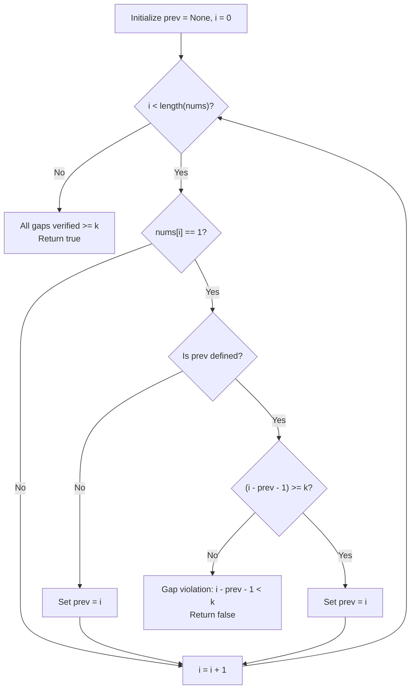

# Guided Example: Check If All 1's Are at Least Length K Places Away

We trace the step-by-step evaluation of spacing intervals between consecutive `1`s on a representative problem instance:

- **Input:** $nums = [1, 0, 0, 0, 1, 0, 0, 1]$, $k = 2$
- **Required Output:** `true`

This instance features multiple occurrences of the value `1` separated by varying quantities of zeros, allowing us to examine both intermediate spacing tests and boundary condition satisfaction.

---

## 1. Instance & Teaching Goal

We are given a binary array $nums$ and an integer $k$. We need to verify whether every pair of `1`s is separated by at least $k$ intervening zeros.

In the provided instance:
- The first `1` occurs at index $0$.
- The second `1` occurs at index $4$, yielding $4 - 0 - 1 = 3$ intervening zeros. Because $3 \ge 2$, this pair satisfies the requirement.
- The third `1` occurs at index $7$, yielding $7 - 4 - 1 = 2$ intervening zeros. Because $2 \ge 2$, this pair also satisfies the requirement.
- No other pairs exist, so the result is `true`.

The primary teaching goal is to model distance verification between consecutive sparse events using a single state cursor ($prev$) in a single linear scan, rather than collecting all indices into secondary structures or performing nested searches.

---

## 2. Conceptual Foundation & Invariants

Let $i$ and $j$ be two indices such that $nums[i] = 1$, $nums[j] = 1$, with $i < j$ and no intervening `1`s ($nums[m] = 0$ for all $i < m < j$). The count of zeros strictly between them is:

$$\text{gap}(i, j) = j - i - 1$$

The problem requires that for every consecutive pair:

$$\text{gap}(i, j) \ge k \iff j - i \ge k + 1$$

If any adjacent pair has $\text{gap}(i, j) < k$, the entire condition is violated, and the function terminates early with `false`.

```
Array indices:    0    1    2    3    4    5    6    7
Array values:    [1,   0,   0,   0,   1,   0,   0,   1]
                 ^                    ^               ^
                 i=0                  j=4             m=7
                 
Gap (0 -> 4): 4 - 0 - 1 = 3 zeros (>= 2, VALID)
Gap (4 -> 7): 7 - 4 - 1 = 2 zeros (>= 2, VALID)
```

We establish tracking parameters across the algorithm:

| Parameter | Type & Domain | Role in Algorithm |
|---|---|---|
| Current Index ($i$) | Integer $0 \le i < |nums|$ | Active index in single-pass traversal |
| Previous One Index ($prev$) | Integer $\{-1, 0, \dots, |nums|-1\}$ | Stores index of most recently encountered `1` |
| Computed Spacing | Integer $\ge 0$ | Evaluates $i - prev - 1$ against threshold $k$ |

> **Invariant.** At any index $i$, all pairs of consecutive `1`s strictly before $i$ have been verified to have an intervening gap of at least $k$ zeros, and $prev$ stores the index of the rightmost `1` observed in $nums[0 \dots i-1]$.



---

## 3. Step-by-Step Worked Execution

We walk through the representative instance $nums = [1, 0, 0, 0, 1, 0, 0, 1]$ with $k = 2$.

### Initialization
- Set $prev = \text{None}$ (no previous `1` recorded).

### Linear Traversal
1. **Index $0$ ($nums[0] = 1$):**
   - $prev$ is $\text{None}$. This is the initial anchor.
   - Set $prev = 0$.
2. **Index $1, 2, 3$ ($nums[i] = 0$):**
   - Zeros require no spacing check. Advance index.
3. **Index $4$ ($nums[4] = 1$):**
   - $prev = 0$.
   - Compute gap: $4 - 0 - 1 = 3$.
   - Test threshold: $3 \ge 2$ holds.
   - Update $prev = 4$.
4. **Index $5, 6$ ($nums[i] = 0$):**
   - Zeros skipped.
5. **Index $7$ ($nums[7] = 1$):**
   - $prev = 4$.
   - Compute gap: $7 - 4 - 1 = 2$.
   - Test threshold: $2 \ge 2$ holds.
   - Update $prev = 7$.
6. **End of array reached:**
   - No violations discovered; emit `true`.

| Step | Index $i$ | Value $nums[i]$ | Current $prev$ | Computed Gap | Condition ($gap \ge 2$) | Next $prev$ |
|---|---|---|---|---|---|---|
| 1 | 0 | 1 | $\text{None}$ | N/A | Satisfied (first anchor) | 0 |
| 2 | 1 | 0 | 0 | - | - | 0 |
| 3 | 2 | 0 | 0 | - | - | 0 |
| 4 | 3 | 0 | 0 | - | - | 0 |
| 5 | 4 | 1 | 0 | $4 - 0 - 1 = 3$ | $3 \ge 2$ (Valid) | 4 |
| 6 | 5 | 0 | 4 | - | - | 4 |
| 7 | 6 | 0 | 4 | - | - | 4 |
| 8 | 7 | 1 | 4 | $7 - 4 - 1 = 2$ | $2 \ge 2$ (Valid) | 7 |

---

## 4. Complete Execution Trace

Let us also trace a contrasting counter-example: $nums = [1, 0, 0, 1, 0, 1]$ with $k = 2$.

```
Counter-example index alignment:
Index:    0    1    2    3    4    5
Value:   [1,   0,   0,   1,   0,   1]
          ^              ^         ^
Gap (0 -> 3): 3 - 0 - 1 = 2 (>= 2, VALID)
Gap (3 -> 5): 5 - 3 - 1 = 1 (< 2, VIOLATION!)
```

| Traversal Step | Index $i$ | Entry $nums[i]$ | Prior $prev$ | Computed Distance | Decision / State |
|---|---|---|---|---|---|
| Step 1 | 0 | 1 | $\text{None}$ | - | Anchor first `1`: $prev \leftarrow 0$ |
| Step 2 | 1 | 0 | 0 | - | Zero element; proceed |
| Step 3 | 2 | 0 | 0 | - | Zero element; proceed |
| Step 4 | 3 | 1 | 0 | $3 - 0 - 1 = 2$ | Valid ($2 \ge 2$); update $prev \leftarrow 3$ |
| Step 5 | 4 | 0 | 3 | - | Zero element; proceed |
| Step 6 | 5 | 1 | 3 | $5 - 3 - 1 = 1$ | **Violation ($1 < 2$); early return false** |

---

## 5. Algorithmic Correctness

**Soundness.** Every time a `1` is encountered at index $i$, the algorithm measures the exact number of zeros between the most recent `1` at index $prev$ and index $i$. If $i - prev - 1 < k$, a concrete violation has occurred, so returning `false` is always correct.

**Completeness.** Suppose the array contains an invalid pair of consecutive `1`s at indices $a$ and $b$ with $a < b$ and no `1`s in between. When the linear scan reaches $b$, the most recent `1` recorded in $prev$ must be $a$. Thus the gap calculation $b - a - 1$ will trigger the check $b - a - 1 < k$ and terminate with `false`. If the scan finishes, no such pair exists, proving the array valid.

---

## 6. Traps This Instance Exposes

- **Index Difference vs. Zero Count:** Confusing coordinate difference $j - i \ge k$ with intervening element count $j - i - 1 \ge k$. If $k = 2$ and indices are $0$ and $2$, $2 - 0 = 2$, but there is only $1$ intervening zero ($2 - 0 - 1 = 1 < 2$), causing a false positive.
- **Handling $k = 0$:** When $k = 0$, adjacent `1`s are allowed ($j - i - 1 \ge 0$). The formula handles this naturally because $j > i \implies j - i - 1 \ge 0$.
- **Sparse vs. Dense Representation:** Storing all indices of `1` in a list requires $\mathcal{O}(n)$ auxiliary space. Tracking only the single most recent index $prev$ accomplishes the verification in $\mathcal{O}(1)$ space.

---

## 7. Complexity Derivation

- **Time Complexity:** $\mathcal{O}(n)$, where $n$ is the length of $nums$. The algorithm performs a single pass over the array from index $0$ to $n-1$. At each index, constant-time operations ($\mathcal{O}(1)$) are executed: checking the element value, computing integer subtractions, and updating scalar variables.
- **Auxiliary Space Complexity:** $\mathcal{O}(1)$. Only a single integer variable $prev$ and the iteration loop index are maintained, requiring constant auxiliary memory.
