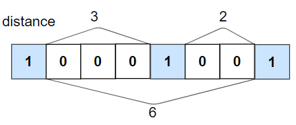
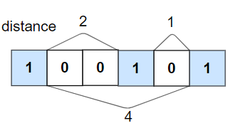

### 1. Description

Given an binary array `nums` and an integer `k`, return `true`* if all *`1`*'s are at least *`k`* places away from each other, otherwise return *`false`.

### 2. Function Contract

- `n`: Input parameter.
- Returns expected result.

### 3. Examples

#### Example 1

- **Input:** `nums = [1,0,0,0,1,0,0,1], k = 2`
- **Output:** `true`
- **Explanation:** Each of the 1s are at least 2 places away from each other.
#### Example 2

- **Input:** `nums = [1,0,0,1,0,1], k = 2`
- **Output:** `false`
- **Explanation:** The second 1 and third 1 are only one apart from each other.

### 4. Constraints

- $1 \le \text{nums.length} \le 10^{5}$

- $0 \le k \le \text{nums.length}$

- $\text{nums}[i]$ is `0` or `1`