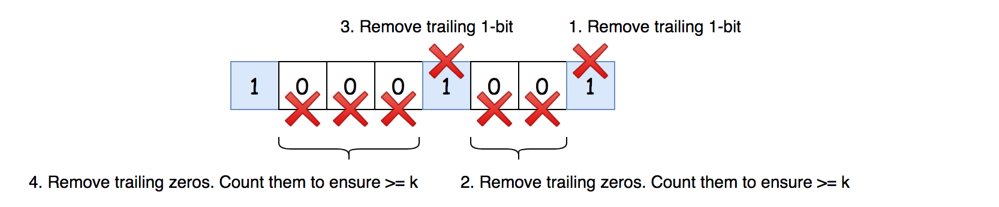

## Solution

---

### Approach 1: One Pass + Count

Let's first implement a pretty straightforward one-pass idea: to iterate over the array and count the number of zeros in between the
"neighbor" `1`s. Each two neighbors `1`s should have at least $k$ zeros in-between. If it's not the case, return false.


*Fig 1. One pass: count the number of zeros in-between the "neighbour" `1`s.*

**Implementation**

```python
class Solution:
    def kLengthApart(self, nums: List[int], k: int) -> bool:
        # initialize the counter of zeros to k
        # to pass the first 1 in nums
        count = k

        for num in nums:
            # if the current integer is 1
            if num == 1:
                # check that number of zeros in-between 1s
                # is greater than or equal to k
                if count < k:
                    return False
                # reinitialize counter
                count = 0
            # if the current integer is 0
            else:
                # increase the counter
                count += 1

        return True
```

**Complexity Analysis**

* Time complexity: $\mathcal{O}(N)$ to parse an array of $N$ elements.

* Space complexity: $\mathcal{O}(1)$ since we don't allocate any additional data structures here.
<br />
<br />

---
### Approach 2: Bit Manipulation

This approach would be more suitable for the Facebook variation of this problem when the input is not a binary array but an integer.

In this situation, the problem could be solved with the bitwise trick to remove trailing zeros in the binary representation:

```python
# remove trailing zeros
while x & 1 == 0:
    x = x >> 1
```


*Fig 2. Approach 2: use bit manipulations to work with the binary
representation of the integer.*

**Algorithm**

- Convert a binary array into integer `x`. Note that this conversion always works fine in Python where there is no limit on the value of integers. In Java, the usage of this approach is limited by the integer capacity.

- Consider the base cases: return true if $x = 0$ or $k = 0$.

- Remove trailing zeros in the binary representation of `x`. That ensures that the last bit of `x` is 1-bit.

- While `x` is greater than `1`:

- Remove trailing 1-bit with the right shift: $x >\ge 1$.

- Remove trailing zeros one by one, and count them using counter `count`. The number of zeros in-between 1-bits should be greater or equal to `k`. Hence, return false if `count < k`.

- We're here because all 1-bits are separated by more than `k` zeros. Return true.

**Implementation**

```python
class Solution:
    def kLengthApart(self, nums: List[int], k: int) -> bool:
        # convert binary array into int
        x = 0
        for num in nums:
            x = (x << 1) | num

        # base case
        if x == 0 or k == 0:
            return True

        # remove trailing zeros
        while x & 1 == 0:
            x = x >> 1

        while x != 1:
            # remove trailing 1-bit
            x = x >> 1

            # count trailing zeros
            count = 0
            while x & 1 == 0:
                x = x >> 1
                count += 1

            # number of zeros in-between 1-bits
            # should be greater than or equal to k
            if count < k:
                return False

        return True
```

**Complexity Analysis**

* Time complexity: $\mathcal{O}(N)$ to parse an array of $N$ elements.

* Space complexity: $\mathcal{O}(1)$ since we don't allocate any additional data structures here.
<br />
<br />

---