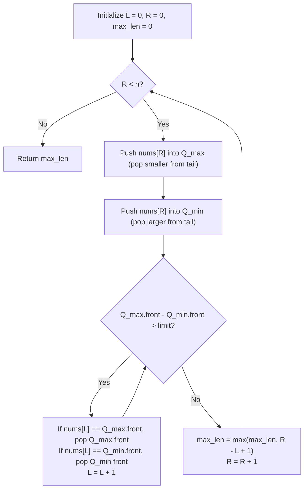

# Guided Example: Longest Continuous Subarray With Absolute Diff Less Than or Equal to Limit

We trace the step-by-step execution of dual monotonic deques driving a sliding window on a representative problem instance:

- **Input:** $nums = [10, 1, 2, 4, 7, 2]$, $limit = 5$
- **Required Output:** $4$

This instance contains rapid element drops, window invalidation, and a multi-element maximal valid subarray $[2, 4, 7, 2]$ where $\max - \min = 7 - 2 = 5 \le 5$.

---

## 1. Instance & Teaching Goal

We are given an integer array $nums$ and an integer $limit$. We must find the length of the longest continuous subarray such that the absolute difference between any two elements in that subarray is at most $limit$:

$$\max_{L \le i, j \le R} |nums[i] - nums[j]| \le limit$$

Because $|nums[i] - nums[j]|$ is maximized when one element is the subarray maximum and the other is the subarray minimum, the condition simplifies to:

$$\max_{L \le k \le R} nums[k] - \min_{L \le k \le R} nums[k] \le limit$$

In the representative instance:
- Subarray $[10]$ has range $10 - 10 = 0 \le 5$.
- Subarray $[10, 1]$ has range $10 - 1 = 9 > 5$ (invalid).
- Subarray $[1, 2, 4]$ has range $4 - 1 = 3 \le 5$ (length $3$).
- Subarray $[1, 2, 4, 7]$ has range $7 - 1 = 6 > 5$ (invalid).
- Subarray $[2, 4, 7, 2]$ has range $7 - 2 = 5 \le 5$ (length $4$).
- The maximum length achievable is $4$.

The primary teaching goal is to demonstrate how two monotonic deques maintain the window maximum and minimum in amortized $\mathcal{O}(1)$ time per step, enabling the sliding window to expand and contract in strictly linear $\mathcal{O}(n)$ total time.

---

## 2. Conceptual Foundation & Invariants

Let the sliding window span indices $[L, R]$. To verify validity in $\mathcal{O}(1)$ time without rescanning, we maintain two monotonic double-ended queues:
1. **Max-Deque ($Q_{\max}$):** Monotonically decreasing queue storing candidate maximums. The front element $Q_{\max}[0]$ always equals $\max_{L \le k \le R} nums[k]$.
2. **Min-Deque ($Q_{\min}$):** Monotonically increasing queue storing candidate minimums. The front element $Q_{\min}[0]$ always equals $\min_{L \le k \le R} nums[k]$.

When a new element $nums[R]$ enters the window:
- Evict all elements $< nums[R]$ from the tail of $Q_{\max}$ before appending $nums[R]$.
- Evict all elements $> nums[R]$ from the tail of $Q_{\min}$ before appending $nums[R]$.

If $Q_{\max}[0] - Q_{\min}[0] > limit$, the window is invalid. We contract from the left by advancing $L$:
- If $nums[L] == Q_{\max}[0]$, evict the front of $Q_{\max}$.
- If $nums[L] == Q_{\min}[0]$, evict the front of $Q_{\min}$.
- Increment $L$ by $1$.

```
Sliding Window State Progression:
Index:       0     1     2     3     4     5
Value:     [10,    1,    2,    4,    7,    2]
Window:                 [L=2 -------------- R=5]
Subarray:               [2,    4,    7,    2]

Q_max (Monotonic Decreasing): [7, 2]       --> Front is max: 7
Q_min (Monotonic Increasing): [2, 2]       --> Front is min: 2
Window Range: 7 - 2 = 5 <= 5 (VALID, Length = 4)
```

We establish tracking parameters across the algorithm:

| Parameter | Type & Domain | Role in Algorithm |
|---|---|---|
| Left Boundary ($L$) | Integer $0 \le L \le R$ | Start index of active continuous subarray |
| Right Boundary ($R$) | Integer $0 \le R < n$ | Expansion cursor scanning each element once |
| Max-Deque ($Q_{\max}$) | Monotonic decreasing queue | Tracks window maximum candidates; front is $\max$ |
| Min-Deque ($Q_{\min}$) | Monotonic increasing queue | Tracks window minimum candidates; front is $\min$ |
| Maximum Length | Integer $1 \le \text{len} \le n$ | Best valid window length discovered so far |

> **Invariant.** For every active window $[L, R]$, $Q_{\max}[0]$ is the maximum value in $nums[L \dots R]$, $Q_{\min}[0]$ is the minimum value in $nums[L \dots R]$, and the elements in both deques preserve their relative index order.



---

## 3. Step-by-Step Worked Execution

We walk through the representative instance $nums = [10, 1, 2, 4, 7, 2]$ with $limit = 5$.

### Step 1: Process $R = 0$ ($nums[0] = 10$)
- Insert $10$ into $Q_{\max} \implies [10]$.
- Insert $10$ into $Q_{\min} \implies [10]$.
- Diff: $10 - 10 = 0 \le 5$. Valid window $[0, 0]$.
- $\text{max\_len} = \max(0, 0 - 0 + 1) = 1$.

### Step 2: Process $R = 1$ ($nums[1] = 1$)
- Insert $1$ into $Q_{\max} \implies [10, 1]$.
- Tail $10 > 1$ in $Q_{\min}$, pop $10 \implies Q_{\min} = [1]$.
- Diff: $10 - 1 = 9 > 5$. Invalidation detected!
- Shrink left at $L = 0$: $nums[0] = 10 == Q_{\max}[0]$, so pop $10$ from $Q_{\max} \implies Q_{\max} = [1]$. $L$ advances to $1$.
- New diff: $1 - 1 = 0 \le 5$. Valid window $[1, 1]$.
- $\text{max\_len} = \max(1, 1 - 1 + 1) = 1$.

### Step 3: Process $R = 2$ ($nums[2] = 2$)
- Tail $1 < 2$ in $Q_{\max}$, pop $1 \implies Q_{\max} = [2]$.
- Insert $2$ into $Q_{\min} \implies [1, 2]$.
- Diff: $2 - 1 = 1 \le 5$. Valid window $[1, 2]$.
- $\text{max\_len} = \max(1, 2 - 1 + 1) = 2$.

### Step 4: Process $R = 3$ ($nums[3] = 4$)
- Tail $2 < 4$ in $Q_{\max}$, pop $2 \implies Q_{\max} = [4]$.
- Insert $4$ into $Q_{\min} \implies [1, 2, 4]$.
- Diff: $4 - 1 = 3 \le 5$. Valid window $[1, 3]$.
- $\text{max\_len} = \max(2, 3 - 1 + 1) = 3$.

### Step 5: Process $R = 4$ ($nums[4] = 7$)
- Tail $4 < 7$ in $Q_{\max}$, pop $4 \implies Q_{\max} = [7]$.
- Insert $7$ into $Q_{\min} \implies [1, 2, 4, 7]$.
- Diff: $7 - 1 = 6 > 5$. Invalidation detected!
- Shrink left at $L = 1$: $nums[1] = 1 == Q_{\min}[0]$, so pop $1$ from $Q_{\min} \implies Q_{\min} = [2, 4, 7]$. $L$ advances to $2$.
- New diff: $7 - 2 = 5 \le 5$. Valid window $[2, 4]$.
- $\text{max\_len} = \max(3, 4 - 2 + 1) = 3$.

### Step 6: Process $R = 5$ ($nums[5] = 2$)
- Insert $2$ into $Q_{\max} \implies [7, 2]$.
- Tail elements $7 > 2$ and $4 > 2$ in $Q_{\min}$ are popped $\implies Q_{\min} = [2, 2]$.
- Diff: $7 - 2 = 5 \le 5$. Valid window $[2, 5]$.
- $\text{max\_len} = \max(3, 5 - 2 + 1) = 4$.

| Index $R$ | Value $nums[R]$ | $Q_{\max}$ State | $Q_{\min}$ State | $L$ Before/After | Window Range ($\max - \min$) | Valid? | Max Length |
|---|---|---|---|---|---|---|---|
| 0 | 10 | $[10]$ | $[10]$ | $L = 0 \to 0$ | $10 - 10 = 0 \le 5$ | Yes | 1 |
| 1 | 1 | $[1]$ | $[1]$ | $L = 0 \to 1$ | $10 - 1 = 9 > 5 \to 0 \le 5$ | Adjusted | 1 |
| 2 | 2 | $[2]$ | $[1, 2]$ | $L = 1 \to 1$ | $2 - 1 = 1 \le 5$ | Yes | 2 |
| 3 | 4 | $[4]$ | $[1, 2, 4]$ | $L = 1 \to 1$ | $4 - 1 = 3 \le 5$ | Yes | 3 |
| 4 | 7 | $[7]$ | $[2, 4, 7]$ | $L = 1 \to 2$ | $7 - 1 = 6 > 5 \to 5 \le 5$ | Adjusted | 3 |
| 5 | 2 | $[7, 2]$ | $[2, 2]$ | $L = 2 \to 2$ | $7 - 2 = 5 \le 5$ | Yes | 4 |

---

## 4. Complete Execution Trace

```
Final Result Summary:
Optimal Subarray: nums[2..5] = [2, 4, 7, 2]
Elements: {2, 4, 7, 2}
Window Extrema: Min = 2, Max = 7
Absolute Difference: |7 - 2| = 5 <= 5
Total Length: 5 - 2 + 1 = 4
```

| Window State $[L, R]$ | Subarray Slice | $Q_{\max}[0]$ | $Q_{\min}[0]$ | Current Spread | Action / Decision |
|---|---|---|---|---|---|
| $[0, 0]$ | $[10]$ | 10 | 10 | 0 | Window valid; record length $1$ |
| $[0, 1] \to [1, 1]$ | $[1]$ | 1 | 1 | 0 | Spread $9 > 5$; evict $10$, advance $L \leftarrow 1$ |
| $[1, 2]$ | $[1, 2]$ | 2 | 1 | 1 | Window valid; record length $2$ |
| $[1, 3]$ | $[1, 2, 4]$ | 4 | 1 | 3 | Window valid; record length $3$ |
| $[1, 4] \to [2, 4]$ | $[2, 4, 7]$ | 7 | 2 | 5 | Spread $6 > 5$; evict $1$, advance $L \leftarrow 2$ |
| $[2, 5]$ | $[2, 4, 7, 2]$ | 7 | 2 | 5 | Window valid; record new maximum length $4$ |

---

## 5. Algorithmic Correctness

**Soundness.** For any window $[L, R]$, the monotonic invariant ensures that $Q_{\max}[0]$ and $Q_{\min}[0]$ precisely reflect the extreme values of the subarray. Hence, testing $Q_{\max}[0] - Q_{\min}[0] \le limit$ is necessary and sufficient to guarantee that every pair of elements in $[L, R]$ satisfies the limit constraint.

**Completeness.** Since both $L$ and $R$ advance monotonically from left to right, no valid subarray starting at any index is prematurely truncated before achieving its maximal contiguous extension for that start position. Each element is added once at $R$ and removed at most once at $L$, guaranteeing exhaustive coverage of all maximal valid intervals.

---

## 6. Traps This Instance Exposes

- **Rescanning for Extrema on Invalidation:** Recomputing the maximum and minimum across the current window from scratch takes $\mathcal{O}(R - L)$ time per contraction, leading to worst-case $\mathcal{O}(n^2)$ time on sorted arrays. Deques maintain extrema in amortized $\mathcal{O}(1)$ time.
- **Evicting by Value vs. Identity:** When duplicate values exist (such as the two `2`s in this instance), evicting simply because $nums[L] == Q[0]$ requires careful alignment: the deque front matches the element at index $L$ because elements are processed strictly in FIFO index order.
- **Sorted Multi-set Overhead:** While a balanced binary search tree (or multiset) also maintains window extrema, it incurs an $\mathcal{O}(\log n)$ factor per insertion/deletion, resulting in $\mathcal{O}(n \log n)$ time instead of the optimal $\mathcal{O}(n)$.

---

## 7. Complexity Derivation

- **Time Complexity:** $\mathcal{O}(n)$, where $n$ is the length of $nums$. Each element is pushed onto $Q_{\max}$ and $Q_{\min}$ exactly once. Each element is popped from the back of each deque at most once and popped from the front at most once. The pointer $L$ advances at most $n$ times and $R$ advances exactly $n$ times. Therefore, the total number of operations across all steps is bounded by $\mathcal{O}(n)$.
- **Auxiliary Space Complexity:** $\mathcal{O}(n)$ in the worst case to store indices or values inside the two monotonic deques when elements are arranged monotonically.
