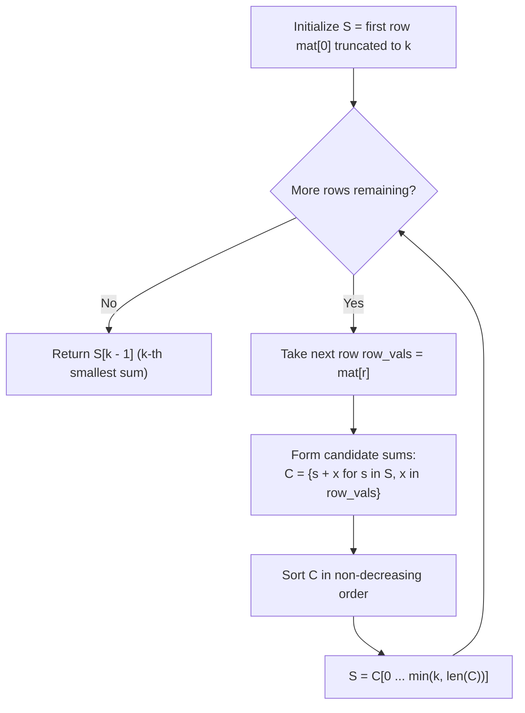

# Guided Example: Find the Kth Smallest Sum of a Matrix With Sorted Rows

We trace the step-by-step execution of row-by-row sum aggregation and priority truncation on a representative problem instance:

- **Input:** $mat = [[1, 3, 11], [2, 4, 6]]$, $k = 5$
- **Required Output:** $7$

This instance illustrates how combining elements across sorted rows creates combinatorial combinations, and how keeping only the smallest $k$ prefix sums at each row step prevents exponential state explosion.

---

## 1. Instance & Teaching Goal

We are given an $m \times n$ matrix $mat$ where each row is sorted in non-decreasing order. We must pick exactly one element from each of the $m$ rows, form their sum, and return the $k^{\text{th}}$ smallest sum across all $n^m$ possible choices.

In the provided instance:
- $m = 2$ rows, each with $n = 3$ elements.
- The total number of combinations is $3^2 = 9$.
- The $9$ possible sums formed by picking one item from row 0 and one from row 1 are:
  - $1 + 2 = 3$
  - $1 + 4 = 5$
  - $3 + 2 = 5$
  - $3 + 4 = 7$
  - $1 + 6 = 7$
  - $3 + 6 = 9$
  - $11 + 2 = 13$
  - $11 + 4 = 15$
  - $11 + 6 = 17$
- Arranged in sorted order: $[3, 5, 5, 7, 7, 9, 13, 15, 17]$.
- The $k = 5^{\text{th}}$ smallest sum (1-indexed) is $7$.

The primary teaching goal is to demonstrate that because we only require the $k^{\text{th}}$ smallest sum globally, we never need to retain more than $k$ smallest candidate sums when transitioning from row $r$ to row $r+1$. This keeps the working set bounded by $\min(k, n^r) \le 200$.

---

## 2. Conceptual Foundation & Invariants

Let $S_r$ be the sorted list of the smallest $\min(k, n^{r+1})$ sums achievable using one element from each of the first $r+1$ rows ($0 \le r < m$).

Base Case ($r = 0$):
$$S_0 = mat[0][0 \dots \min(k, n)-1]$$

Inductive Transition ($r \to r+1$):
For the next row $mat[r+1]$, every candidate sum using the first $r+2$ rows is formed by adding some value $mat[r+1][j]$ ($0 \le j < n$) to a sum $s \in S_r$. We generate all candidate pairs:
$$C = \{ s + mat[r+1][j] \mid s \in S_r, \, 0 \le j < n \}$$
We then sort $C$ and truncate to the smallest $k$ values:
$$S_{r+1} = \text{smallest}_k(C)$$

```
Row-by-Row Truncation Architecture:
Row 0: [1, 3, 11] --------------> S_0 = [1, 3, 11] (size <= k=5)
                                          |
                                   Cartesian Sums
                                          v
Row 1: [2, 4, 6] --------------> C = {1+2, 1+4, 1+6, 3+2, 3+4, 3+6, 11+2, 11+4, 11+6}
                                 C = [3, 5, 5, 7, 7, 9, 13, 15, 17]
                                          |
                                 Truncate to top k=5
                                          v
                                 S_1 = [3, 5, 5, 7, 7]
                                          |
                                     5th element is 7
```

We establish tracking parameters across the algorithm:

| Parameter | Type & Domain | Role in Algorithm |
|---|---|---|
| Row Index ($r$) | Integer $0 \le r < m$ | Active row being merged into running sums |
| Prefix Sums ($S_r$) | Sorted list of size $\le k$ | Smallest sums formed from rows $0 \dots r$ |
| Candidate Set ($C$) | List of size $\lvert S_r \rvert \times n$ | All pairwise combinations before truncation |
| Target Rank ($k$) | Integer $1 \le k \le 200$ | Capacity ceiling for list truncation |

> **Invariant.** After processing row $r$, $S_r$ contains the exact $\min(k, n^{r+1})$ smallest sums that can be formed by choosing one element from each of rows $0, 1, \dots, r$.



---

## 3. Step-by-Step Worked Execution

We walk through the representative instance $mat = [[1, 3, 11], [2, 4, 6]]$ with $k = 5$.

### Initialization ($r = 0$)
- $mat[0] = [1, 3, 11]$.
- Size $3 \le k = 5$, so no truncation needed.
- $S_0 = [1, 3, 11]$.

### Merging Row 1 ($mat[1] = [2, 4, 6]$)
We compute $s + x$ for each $s \in S_0$ and $x \in mat[1]$:
1. With $s = 1$:
   - $1 + 2 = 3$
   - $1 + 4 = 5$
   - $1 + 6 = 7$
2. With $s = 3$:
   - $3 + 2 = 5$
   - $3 + 4 = 7$
   - $3 + 6 = 9$
3. With $s = 11$:
   - $11 + 2 = 13$
   - $11 + 4 = 15$
   - $11 + 6 = 17$

All $9$ candidate sums generated:
$$C = [3, 5, 7, 5, 7, 9, 13, 15, 17]$$

Sorting $C$ yields:
$$C_{\text{sorted}} = [3, 5, 5, 7, 7, 9, 13, 15, 17]$$

Truncating to the first $k = 5$ elements:
$$S_1 = [3, 5, 5, 7, 7]$$

All $m = 2$ rows have been merged. The $5^{\text{th}}$ smallest sum is $S_1[4] = 7$.

| Pair $(s, x)$ | Sum $s + x$ | Overall Rank in $C$ | Included in Top $k=5$? |
|---|---|---|---|
| $(1, 2)$ | 3 | 1st | Yes |
| $(1, 4)$ | 5 | 2nd | Yes |
| $(3, 2)$ | 5 | 3rd | Yes |
| $(1, 6)$ | 7 | 4th | Yes |
| $(3, 4)$ | 7 | 5th | **Yes (5th Smallest = 7)** |
| $(3, 6)$ | 9 | 6th | No |
| $(11, 2)$ | 13 | 7th | No |
| $(11, 4)$ | 15 | 8th | No |
| $(11, 6)$ | 17 | 9th | No |

---

## 4. Complete Execution Trace

Below is the state trace tracking the transition across each row of the matrix:

| Phase | Active Row Elements | Input Base List Size | Pairwise Combinations Generated | Truncated Output List |
|---|---|---|---|---|
| Initialization | $[1, 3, 11]$ | - | $3$ (direct row entries) | $[1, 3, 11]$ |
| Row 1 Merge | $[2, 4, 6]$ | $3$ | $3 \times 3 = 9$ sums | $[3, 5, 5, 7, 7]$ |
| Final Selection | - | $5$ | - | Rank 5 item: $7$ |

---

## 5. Algorithmic Correctness

**Soundness.** Suppose there was an optimal full array sum among the $k$ smallest that was derived from a prefix sum $s'$ outside the top $k$ of $S_r$. Because all elements in $mat$ are positive, adding non-negative row elements cannot decrease sum value. Any prefix sum in $S_r$ that was discarded was strictly greater than or equal to at least $k$ other valid prefix sums in $S_r$. Pairing those $k$ smaller prefix sums with the exact same downstream choices would yield $k$ strictly smaller (or equal) complete sums. Hence, any sum derived from a discarded prefix cannot belong to the top $k$ global sums.

**Completeness.** By induction, preserving the $k$ smallest prefix sums at each row guarantees that the true $k$ smallest complete sums are preserved throughout all $m$ rows.

---

## 6. Traps This Instance Exposes

- **Exponential State Explosion:** Generating all $n^m$ sums naively requires $3^{40} \approx 1.2 \times 10^{19}$ combinations for $m = 40$, causing immediate time and memory exhaustion. Truncating to $k \le 200$ after each row caps the candidate size at $k \times n \le 8000$.
- **1-Indexed vs. 0-Indexed Selection:** The problem asks for the $k^{\text{th}}$ smallest sum. In a 0-indexed array, this corresponds to index $k-1$. For $k = 5$, the element is at index $4$.
- **Duplicate Sums:** Duplicate sums (e.g. $1 + 4 = 5$ and $3 + 2 = 5$) each represent distinct valid choices of matrix elements and must both be counted toward reaching rank $k$. Deduplicating would result in an incorrect rank calculation.

---

## 7. Complexity Derivation

- **Time Complexity:** $\mathcal{O}(m \cdot k \cdot n \log(k \cdot n))$. For each of the $m-1$ merge steps:
  - We form at most $k \cdot n$ sums.
  - Sorting the candidates takes $\mathcal{O}(k \cdot n \log(k \cdot n))$ time.
  - With $m \le 40$, $n \le 40$, and $k \le 200$, $k \cdot n \le 8000$, which requires only $\approx 8000 \log_2(8000) \approx 10^5$ operations per row, running effortlessly within milliseconds.
- **Auxiliary Space Complexity:** $\mathcal{O}(k \cdot n)$ to hold the temporary candidate sums generated during each row merge step before truncation to size $k$.