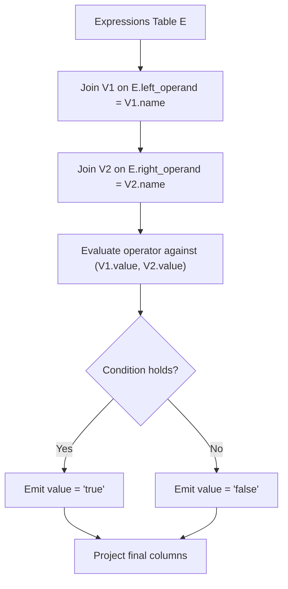

# Guided Example: Evaluate Boolean Expression

We trace the step-by-step evaluation of relational boolean expressions using dual inner joins and relational predicate evaluation on a representative database instance:

- **Input:**
  - Table `Variables`: $x = 66, \, y = 77$
  - Table `Expressions`: Comparisons spanning $(x > y), (x < y), (x = y), (y > x), (y < x), (x = x)$
- **Required Output:** Relational projection mapping each expression tuple to its boolean evaluation string (`"true"` or `"false"`).

---

## 1. Instance & Teaching Goal

We are given a relation $Variables(name, value)$ mapping unique variable identifiers to integer values, and a relation $Expressions(left\_operand, operator, right\_operand)$ where $operator \in \{<, >, =\}$. Each operand is guaranteed to exist in $Variables$. We must evaluate whether each relational comparison holds true or false.

In the provided instance:
- Variable lookup: $x \mapsto 66$, $y \mapsto 77$.
- Expression $x > y \iff 66 > 77 \implies \text{false}$.
- Expression $x < y \iff 66 < 77 \implies \text{true}$.
- Expression $x = y \iff 66 = 77 \implies \text{false}$.
- Expression $y > x \iff 77 > 66 \implies \text{true}$.
- Expression $y < x \iff 77 < 66 \implies \text{false}$.
- Expression $x = x \iff 66 = 66 \implies \text{true}$.

The primary teaching goal is to model multi-lookup relational queries using two joins on the same dimension table (aliased as $V_1$ for the left operand and $V_2$ for the right operand), followed by conditional projection without procedural code.

---

## 2. Conceptual Foundation & Invariants

Let $E$ denote the $Expressions$ relation, and let $V_1$ and $V_2$ denote two instances of the $Variables$ relation. We perform a compound equijoin:

$$J = E \bowtie_{E.left\_operand = V_1.name} V_1 \bowtie_{E.right\_operand = V_2.name} V_2$$

Each resulting tuple in $J$ has access to:
- $E.left\_operand$ and $V_1.value$ (the left numerical value).
- $E.operator$ (the comparison operator).
- $E.right\_operand$ and $V_2.value$ (the right numerical value).

The evaluation function $\phi$ maps the joined tuple to a string literal:

$$\phi(v_1, op, v_2) = \begin{cases} \text{"true"} & \text{if } (op = \text{"<"} \land v_1 < v_2) \lor (op = \text{">"} \land v_1 > v_2) \lor (op = \text{"="} \land v_1 = v_2) \\ \text{"false"} & \text{otherwise} \end{cases}$$

The final result relation $R$ is obtained via relational projection:

$$R = \Pi_{left\_operand, operator, right\_operand, \phi(V_1.value, operator, V_2.value) \to value}(J)$$

```
Relational Join Topology:
Expressions (E)
  |-- left_operand  ======> Variables (V1) [name = left_operand]  --> resolves V1.value
  |-- right_operand ======> Variables (V2) [name = right_operand] --> resolves V2.value
  \-- operator
         |
         v
Predicate Evaluator: phi(V1.value, operator, V2.value)
         |
         +--> evaluates to "true" or "false"
```

We establish tracking parameters across the relational pipeline:

| Parameter | Type & Domain | Role in Algorithm |
|---|---|---|
| Left Value ($V_1.value$) | Integer | Numerical value corresponding to $left\_operand$ |
| Right Value ($V_2.value$) | Integer | Numerical value corresponding to $right\_operand$ |
| Comparison Operator | Enum $\{<, >, =\}$ | Binary relational comparator |
| Result Column ($value$) | String $\{\text{"true"}, \text{"false"}\}$ | Output status of the evaluated expression |

> **Invariant.** For every row in $Expressions$, the primary key guarantee on $Variables.name$ ensures that the dual join produces exactly one joined row, with $V_1.value$ and $V_2.value$ precisely matching the stored definitions.



---

## 3. Step-by-Step Worked Execution

We walk through the representative instance with $Variables = \{ (x, 66), (y, 77) \}$.

### Step 1: Join Left Operand
We join $E$ with $V_1$ on $E.left\_operand = V_1.name$:
- Rows with $left\_operand = \text{"x"}$ attach $V_1.value = 66$.
- Rows with $left\_operand = \text{"y"}$ attach $V_1.value = 77$.

### Step 2: Join Right Operand
We join the intermediate relation with $V_2$ on $E.right\_operand = V_2.name$:
- Rows with $right\_operand = \text{"x"}$ attach $V_2.value = 66$.
- Rows with $right\_operand = \text{"y"}$ attach $V_2.value = 77$.

### Step 3: Compute Predicate Evaluation
For each tuple, we test whether the arithmetic relation between $V_1.value$ and $V_2.value$ matches $operator$:

| Row | $left\_operand$ | $operator$ | $right\_operand$ | $V_1.value$ | $V_2.value$ | Numerical Relation | Evaluated Result |
|---|---|---|---|---|---|---|---|
| 1 | $x$ | $>$ | $y$ | 66 | 77 | $66 > 77$ is False | `false` |
| 2 | $x$ | $<$ | $y$ | 66 | 77 | $66 < 77$ is True | `true` |
| 3 | $x$ | $=$ | $y$ | 66 | 77 | $66 = 77$ is False | `false` |
| 4 | $y$ | $>$ | $x$ | 77 | 66 | $77 > 66$ is True | `true` |
| 5 | $y$ | $<$ | $x$ | 77 | 66 | $77 < 66$ is False | `false` |
| 6 | $x$ | $=$ | $x$ | 66 | 66 | $66 = 66$ is True | `true` |

---

## 4. Complete Execution Trace

```
Input Tuple Resolution:
(x, >, y)  ==> 66 > 77  ==> false
(x, <, y)  ==> 66 < 77  ==> true
(x, =, y)  ==> 66 = 77  ==> false
(y, >, x)  ==> 77 > 66  ==> true
(y, <, x)  ==> 77 < 66  ==> false
(x, =, x)  ==> 66 = 66  ==> true
```

| Expression Index | Left Operand | Operator | Right Operand | Resolved Comparison | Emitted Record |
|---|---|---|---|---|---|
| 1 | $x$ | $>$ | $y$ | $66 > 77$ | $(x, >, y, \text{"false"})$ |
| 2 | $x$ | $<$ | $y$ | $66 < 77$ | $(x, <, y, \text{"true"})$ |
| 3 | $x$ | $=$ | $y$ | $66 = 77$ | $(x, =, y, \text{"false"})$ |
| 4 | $y$ | $>$ | $x$ | $77 > 66$ | $(y, >, x, \text{"true"})$ |
| 5 | $y$ | $<$ | $x$ | $77 < 66$ | $(y, <, x, \text{"false"})$ |
| 6 | $x$ | $=$ | $x$ | $66 = 66$ | $(x, =, x, \text{"true"})$ |

---

## 5. Algorithmic Correctness

**Soundness.** Since $Variables.name$ is a unique primary key, each operand joins with exactly one row from $Variables$, avoiding cartesian duplicates or missing values. The conditional evaluation rules partition the three operators $\{<, >, =\}$ without ambiguity, guaranteeing that each row produces either `"true"` or `"false"`.

**Completeness.** Every row in $Expressions$ possesses valid foreign key references to $Variables$. An inner join retains all rows of $Expressions$ without loss, ensuring full coverage of the input query set.

---

## 6. Traps This Instance Exposes

- **Self-Comparisons:** Expressions where $left\_operand = right\_operand$ (e.g. $x = x$) require referencing the same variable table twice independently. A single join would fail to provide distinct bindings for both sides of the operator.
- **Operator Encoding:** Confusing equality with string assignment; in relational predicates, testing whether $V_1.value = V_2.value$ requires handling equality independently from magnitude comparisons.
- **Output String Literals:** The problem requires lower-case string values `"true"` and `"false"`, rather than binary booleans $1$ or $0$.

---

## 7. Complexity Derivation

- **Time Complexity:** $\mathcal{O}(|E| + |V|)$, where $|E|$ is the number of expressions and $|V|$ is the number of variables. In a database engine, indexing $Variables.name$ with a hash or B-tree index enables $\mathcal{O}(1)$ or $\mathcal{O}(\log |V|)$ lookups for each operand. Thus, joining and evaluating $|E|$ rows requires $\mathcal{O}(|E|)$ operations.
- **Auxiliary Space Complexity:** $\mathcal{O}(|E|)$ to store the joined tuples and project the output relation.
