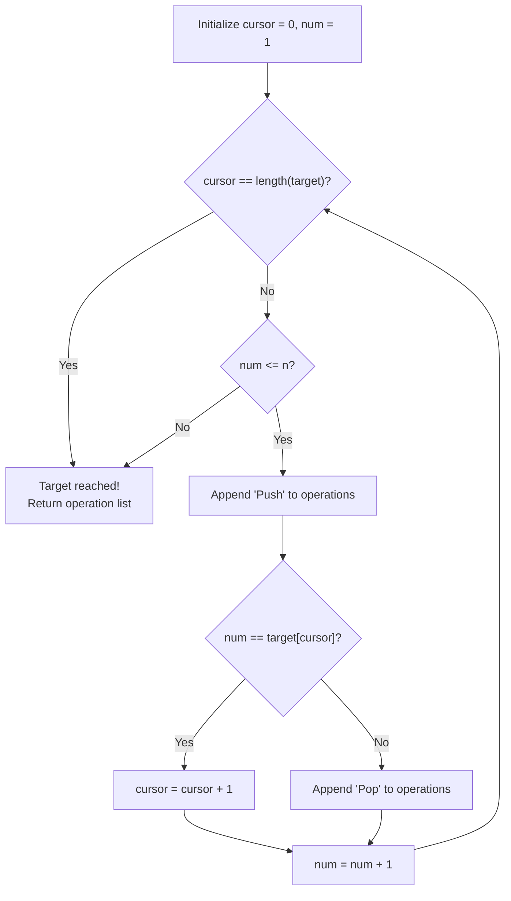

# Guided Example: Build an Array With Stack Operations

We trace the step-by-step generation of push and pop stack commands to synthesize a desired target array from a sequential integer stream:

- **Input:** $target = [1, 3]$, $n = 3$
- **Required Output:** `["Push", "Push", "Pop", "Push"]`

This instance illustrates how elements present in the target array are retained on the stack, while skipped stream values are transiently pushed and immediately discarded using a paired push-pop sequence.

---

## 1. Instance & Teaching Goal

We are given a strictly increasing target array $target$ and a maximum integer $n$. Integers arrive as an ordered stream $1, 2, 3, \dots, n$. We can only perform two stack operations:
- `"Push"`: reads the next integer from the stream and places it onto the top of the stack.
- `"Pop"`: removes the integer currently at the top of the stack.

The goal is to generate an operation sequence such that the stack contains exactly the elements of $target$ in bottom-to-top order, stopping as soon as the stack matches $target$.

In the provided instance:
- Stream value $1$ matches $target[0] = 1$: push $1$ and retain it. Stack: $[1]$.
- Stream value $2$ does not appear in $target$: push $2$, then immediately pop $2$. Stack: $[1]$.
- Stream value $3$ matches $target[1] = 3$: push $3$ and retain it. Stack: $[1, 3]$.
- The stack now matches $target$, so operations cease immediately.
- Result sequence: `["Push", "Push", "Pop", "Push"]`.

The primary teaching goal is to model sequential simulation where unwanted stream elements require a paired $(\text{Push}, \text{Pop})$ cycle, while wanted target elements require only a single $\text{Push}$.

---

## 2. Conceptual Foundation & Invariants

Let $cursor$ be an index pointing to the current element in $target$ that we need to match, starting at $0$.
Let $num$ denote the integer read from the stream, running from $1$ up to $n$.

Because the stream presents integers in strictly increasing order $1, 2, \dots, n$ and $target$ is also strictly increasing:
1. Every integer $num$ from the stream must be read via `"Push"`.
2. If $num == target[cursor]$:
   - The integer is part of the final configuration; we keep it on the stack.
   - We advance $cursor \leftarrow cursor + 1$.
3. If $num < target[cursor]$:
   - The integer is not part of $target$; it must be immediately removed via `"Pop"`.
4. As soon as $cursor == |target|$, the stack matches $target$ completely, and the process terminates without processing further stream numbers.

```
Stream vs. Target Alignment:
Stream:       1        2        3
Action:     Push    Push+Pop   Push
            |          |        |
Stack State: [1]   [1,2]->[1] [1, 3]  ==> Matches target [1, 3]!
Target Ptr:   ^                 ^
```

We establish tracking parameters across the algorithm:

| Parameter | Type & Domain | Role in Algorithm |
|---|---|---|
| Stream Integer ($num$) | Integer $1 \le num \le n$ | Next sequential integer available from stream |
| Target Cursor ($cursor$) | Integer $0 \le cursor \le |target|$ | Index of next required value in $target$ |
| Stack Contents | List of integers | Emulated stack state representing bottom-to-top order |
| Operation Sequence | List of strings | Accumulated list of `"Push"` and `"Pop"` commands |

> **Invariant.** After processing stream integer $num$, the stack contains precisely the prefix $target[0 \dots cursor-1]$, and the next expected target value is $target[cursor]$.



---

## 3. Step-by-Step Worked Execution

We walk through the representative instance $target = [1, 3]$ with $n = 3$.

### Initialization
- $cursor = 0$ ($target[0] = 1$).
- Stack is empty: $S = []$.
- Operations list: $Ops = []$.

### Processing Stream Values

1. **$num = 1$:**
   - Read from stream: Append `"Push"`. Stack becomes $[1]$.
   - Compare with target: $num = 1 == target[0] = 1$.
   - Match confirmed: Keep on stack, increment $cursor \leftarrow 1$.
   - Current $Ops$: `["Push"]`.

2. **$num = 2$:**
   - Read from stream: Append `"Push"`. Stack becomes $[1, 2]$.
   - Compare with target: $num = 2 \ne target[1] = 3$.
   - Unwanted value: Append `"Pop"`. Stack reverts to $[1]$.
   - $cursor$ remains $1$.
   - Current $Ops$: `["Push", "Push", "Pop"]`.

3. **$num = 3$:**
   - Read from stream: Append `"Push"`. Stack becomes $[1, 3]$.
   - Compare with target: $num = 3 == target[1] = 3$.
   - Match confirmed: Keep on stack, increment $cursor \leftarrow 2$.
   - Current $Ops$: `["Push", "Push", "Pop", "Push"]`.

4. **Termination Check:**
   - $cursor = 2 == |target| = 2$.
   - The stack precisely matches $target = [1, 3]$.
   - Halt simulation immediately without reading further from the stream.

| Step | Stream $num$ | Target Target[$cursor$] | Action Taken | Stack State | Appended Command |
|---|---|---|---|---|---|
| 1 | 1 | 1 | Match: Push & Retain | $[1]$ | `"Push"` |
| 2a | 2 | 3 | Stream read | $[1, 2]$ | `"Push"` |
| 2b | 2 | 3 | Discard unwanted | $[1]$ | `"Pop"` |
| 3 | 3 | 3 | Match: Push & Retain | $[1, 3]$ | `"Push"` |

---

## 4. Complete Execution Trace

```
Final Stack State:
Bottom -> [1, 3] <- Top
Target Array: [1, 3] (Equal!)
Recorded Operations: ["Push", "Push", "Pop", "Push"]
```

| Event Sequence | Stream Cursor | Target Expectation | Emitted Token | Stack Representation |
|---|---|---|---|---|
| Initial State | - | $target[0] = 1$ | - | $[]$ |
| Stream Read | $1$ | $target[0] = 1$ | `"Push"` | $[1]$ |
| Match Advance | $1$ | $target[1] = 3$ | - | $[1]$ |
| Stream Read | $2$ | $target[1] = 3$ | `"Push"` | $[1, 2]$ |
| Stream Evict | $2$ | $target[1] = 3$ | `"Pop"` | $[1]$ |
| Stream Read | $3$ | $target[1] = 3$ | `"Push"` | $[1, 3]$ |
| Complete | $3$ | Target satisfied | - | $[1, 3]$ |

---

## 5. Algorithmic Correctness

**Soundness.** Because the stack obeys Last-In-First-Out (LIFO) discipline, an unwanted integer pushed at the top can be immediately removed by `"Pop"` without disturbing any previously retained elements below it. Hence, each matched target prefix remains intact.

**Completeness.** Since both the stream $1 \dots n$ and $target$ are strictly increasing, every element in $target$ will eventually be encountered in the stream (bounded by $target[\text{last}] \le n$). By popping all skipped numbers immediately upon reading, the stack will contain exactly the elements of $target$ in identical order when the final target element is pushed.

---

## 6. Traps This Instance Exposes

- **Continuing Past Target End:** Continuing to iterate stream integers after the stack already matches $target$ produces trailing push/pop operations that violate the problem specification: *"do not read new integers from the stream and do not do more operations on the stack"*.
- **Stream Skipped Count:** Trying to calculate push/pop counts by jump arithmetic ($target[i] - target[i-1] - 1$) is valid, but one must ensure the first element gap is measured against $0$ rather than $target[0]$.
- **Mismatched Order:** Pushing elements out of stream order is prohibited because the stream is read-only and strictly sequential.

---

## 7. Complexity Derivation

- **Time Complexity:** $\mathcal{O}(M)$, where $M = target[\text{last}]$ is the maximum value in $target$ ($M \le n \le 100$). The algorithm reads at most $M$ numbers from the stream. Each stream number produces either $1$ operation (`"Push"`) if retained, or $2$ operations (`"Push"`, `"Pop"`) if discarded. Total operations are bounded by $2M \le 200$, requiring linear time $\mathcal{O}(M)$.
- **Auxiliary Space Complexity:** $\mathcal{O}(M)$ to store the resulting list of operation strings.
