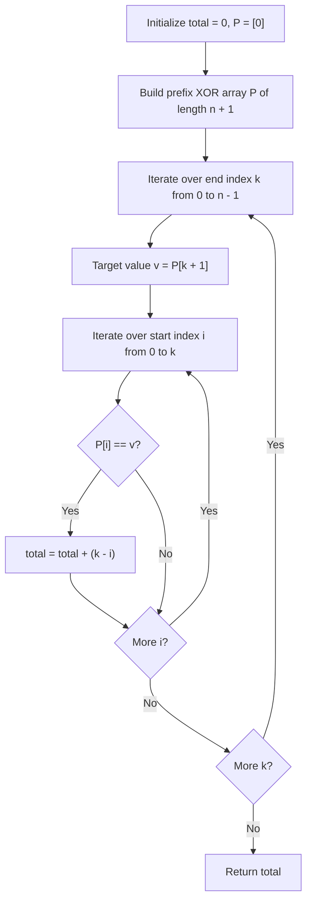

# Guided Example: Count Triplets That Can Form Two Arrays of Equal XOR

We trace the step-by-step reduction of the three-index XOR equality condition to prefix XOR identity and frequency tracking on a representative problem instance:

- **Input:** $arr = [2, 3, 1, 6, 7]$
- **Required Output:** $4$

This instance demonstrates how the equality $a = b$ transforms into a zero-sum XOR interval $arr[i \dots k] = 0$, allowing any internal pivot $j$ to form a valid triplet.

---

## 1. Instance & Teaching Goal

We are given an array of integers $arr$. We must count all integer triplets $(i, j, k)$ with $0 \le i < j \le k < |arr|$ such that:

$$a = arr[i] \oplus arr[i+1] \oplus \dots \oplus arr[j-1]$$
$$b = arr[j] \oplus arr[j+1] \oplus \dots \oplus arr[k]$$
$$a = b$$

In the provided instance:
- At indices $i = 0, k = 2$: $arr[0 \dots 2] = [2, 3, 1]$.
  - Bitwise XOR: $2 \oplus 3 \oplus 1 = 0$.
  - Choice $j = 1$: $a = arr[0] = 2$, $b = arr[1 \dots 2] = 3 \oplus 1 = 2$. $a = b$. Triplet: $(0, 1, 2)$.
  - Choice $j = 2$: $a = arr[0 \dots 1] = 2 \oplus 3 = 1$, $b = arr[2] = 1$. $a = b$. Triplet: $(0, 2, 2)$.
- At indices $i = 2, k = 4$: $arr[2 \dots 4] = [1, 6, 7]$.
  - Bitwise XOR: $1 \oplus 6 \oplus 7 = 0$.
  - Choice $j = 3$: $a = arr[2] = 1$, $b = arr[3 \dots 4] = 6 \oplus 7 = 1$. $a = b$. Triplet: $(2, 3, 4)$.
  - Choice $j = 4$: $a = arr[2 \dots 3] = 1 \oplus 6 = 7$, $b = arr[4] = 7$. $a = b$. Triplet: $(2, 4, 4)$.
- Total valid triplets: $2 + 2 = 4$.

The primary teaching goal is to eliminate the innermost loop index $j$ using the mathematical property that $a = b \iff a \oplus b = 0$, which implies $prefix[k+1] = prefix[i]$. Every matching pair $(i, k)$ contributes exactly $k - i$ valid triplets.

---

## 2. Conceptual Foundation & Invariants

Let $P$ denote the prefix XOR array of length $n + 1$:
$$P[0] = 0, \quad P[x] = arr[0] \oplus arr[1] \oplus \dots \oplus arr[x-1] \quad \text{for } 1 \le x \le n$$

By standard prefix XOR properties:
$$a = P[j] \oplus P[i]$$
$$b = P[k+1] \oplus P[j]$$

Setting $a = b$ is equivalent to:
$$a \oplus b = 0 \iff (P[j] \oplus P[i]) \oplus (P[k+1] \oplus P[j]) = 0$$

Because XOR is commutative, associative, and $x \oplus x = 0$:
$$P[i] \oplus P[k+1] = 0 \iff P[i] = P[k+1]$$

Crucially, the intermediate index $j$ completely cancels out! For any interval $[i, k]$ where $P[i] = P[k+1]$, any choice of $j$ satisfying $i < j \le k$ yields $a = b$. The number of possible values for $j$ in this range is:

$$k - (i + 1) + 1 = k - i$$

```
Interval XOR Cancellation Architecture:
Indices:      i                      j                  k
Elements:     [ arr[i] ... arr[j-1] ] [ arr[j] ... arr[k] ]
                 <------ a ------>       <------ b ------>
                     P[j] ^ P[i]           P[k+1] ^ P[j]

Condition: a = b  <===>  a ^ b = 0  <===>  P[i] == P[k+1]
Any j in (i, k] yields a valid triplet: exactly (k - i) choices!
```

We establish tracking parameters across the algorithm:

| Parameter | Type & Domain | Role in Algorithm |
|---|---|---|
| Prefix Index ($x$) | Integer $0 \le x \le n$ | Tracks cumulative XOR of array elements |
| Cumulative XOR ($P[x]$) | Integer $\ge 0$ | $arr[0] \oplus \dots \oplus arr[x-1]$ with $P[0] = 0$ |
| Occurrence Frequency | Hash map: $\text{val} \to \text{count}$ | Counts prior occurrences of prefix XOR value |
| Index Sum | Hash map: $\text{val} \to \sum i$ | Sum of prior indices where prefix XOR value appeared |
| Triplet Count | Integer $\ge 0$ | Running total of valid triplets $(i, j, k)$ |

> **Invariant.** For any index $k$, every previous prefix occurrence $P[i] = P[k+1]$ with $i < k+1$ contributes $k - i$ valid triplets. Over $m$ prior occurrences at indices $i_1, \dots, i_m$, the contribution is $m \cdot k - \sum_{p=1}^m i_p$.



---

## 3. Step-by-Step Worked Execution

We walk through the representative instance $arr = [2, 3, 1, 6, 7]$ ($n = 5$).

### Step 1: Construct Prefix XOR Array
- $P[0] = 0$
- $P[1] = 0 \oplus 2 = 2$
- $P[2] = 2 \oplus 3 = 1$
- $P[3] = 1 \oplus 1 = 0$
- $P[4] = 0 \oplus 6 = 6$
- $P[5] = 6 \oplus 7 = 1$

Prefix array: $P = [0, 2, 1, 0, 6, 1]$.

### Step 2: Evaluate Matching Prefix Pairs
We scan $k$ from $0$ to $4$ and compare $P[k+1]$ with all earlier $P[i]$ ($0 \le i \le k$):

1. **$k = 0$ ($P[1] = 2$):**
   - $P[0] = 0 \ne 2$. No matches.
2. **$k = 1$ ($P[2] = 1$):**
   - $P[0]=0, P[1]=2$. No matches.
3. **$k = 2$ ($P[3] = 0$):**
   - $P[0] = 0 == P[3]$! Match found at $i = 0$.
   - Contribution: $k - i = 2 - 0 = 2$ triplets.
   - Corresponding triplets: $(0, 1, 2)$ and $(0, 2, 2)$.
4. **$k = 3$ ($P[4] = 6$):**
   - No earlier entry equals $6$.
5. **$k = 4$ ($P[5] = 1$):**
   - $P[2] = 1 == P[5]$! Match found at $i = 2$.
   - Contribution: $k - i = 4 - 2 = 2$ triplets.
   - Corresponding triplets: $(2, 3, 4)$ and $(2, 4, 4)$.

### Summation
$$\text{Total Triplets} = 2 + 2 = 4$$

| Index $k$ | Value $arr[k]$ | Prefix $P[k+1]$ | Matching Prior Index $i$ ($P[i] = P[k+1]$) | Increment ($k - i$) | Generated Triplets | Running Sum |
|---|---|---|---|---|---|---|
| 0 | 2 | 2 | None | 0 | None | 0 |
| 1 | 3 | 1 | None | 0 | None | 0 |
| 2 | 1 | 0 | $i = 0$ ($P[0] = 0$) | $2 - 0 = 2$ | $(0, 1, 2), (0, 2, 2)$ | 2 |
| 3 | 6 | 6 | None | 0 | None | 2 |
| 4 | 7 | 1 | $i = 2$ ($P[2] = 1$) | $4 - 2 = 2$ | $(2, 3, 4), (2, 4, 4)$ | 4 |

---

## 4. Complete Execution Trace

```
Triplets Catalog:
1. (i=0, j=1, k=2): a = arr[0]=2,          b = arr[1]^arr[2]=3^1=2  ==> a == b (2 == 2)
2. (i=0, j=2, k=2): a = arr[0]^arr[1]=2^3=1, b = arr[2]=1          ==> a == b (1 == 1)
3. (i=2, j=3, k=4): a = arr[2]=1,          b = arr[3]^arr[4]=6^7=1  ==> a == b (1 == 1)
4. (i=2, j=4, k=4): a = arr[2]^arr[3]=1^6=7, b = arr[4]=7          ==> a == b (7 == 7)
```

| Interval $[i \dots k]$ | Segment Elements | Total XOR | Possible $j$ Values | Resulting Triplets |
|---|---|---|---|---|
| $[0 \dots 2]$ | $[2, 3, 1]$ | $2 \oplus 3 \oplus 1 = 0$ | $j \in \{1, 2\}$ | $(0, 1, 2), (0, 2, 2)$ |
| $[2 \dots 4]$ | $[1, 6, 7]$ | $1 \oplus 6 \oplus 7 = 0$ | $j \in \{3, 4\}$ | $(2, 3, 4), (2, 4, 4)$ |

---

## 5. Algorithmic Correctness

**Soundness.** Suppose $P[i] = P[k+1]$. Then the XOR sum of the subarray from $i$ to $k$ is $P[k+1] \oplus P[i] = 0$. For any $j$ strictly between $i$ and $k+1$ ($i < j \le k$), splitting at $j$ gives $a = P[j] \oplus P[i]$ and $b = P[k+1] \oplus P[j] = P[i] \oplus P[j] = a$. Hence, every such $j$ yields an identical XOR pair $a = b$.

**Completeness.** Any valid triplet $(i, j, k)$ with $a = b$ must have $a \oplus b = 0$. Since $a \oplus b = P[k+1] \oplus P[i]$, we must have $P[i] = P[k+1]$. Thus, enumerating all pairs where $P[i] = P[k+1]$ and summing $(k - i)$ exhaustively counts every valid triplet without omissions.

---

## 6. Traps This Instance Exposes

- **Brute Force $\mathcal{O}(n^3)$ Enumeration:** Explicitly iterating three nested loops $(i, j, k)$ and calculating subarray XORs from scratch takes $\mathcal{O}(n^4)$ or $\mathcal{O}(n^3)$ time, which is unnecessarily slow.
- **Prefix Boundary Offset:** Forgetting $P[0] = 0$. When the entire prefix from index $0$ to $k$ has an XOR sum of $0$, the start index is $i = 0$. Without $P[0] = 0$, all triplets anchored at the start of the array are missed.
- **Strict Inequality of $j$:** The constraint requires $i < j \le k$. If $j = i$, the array $a$ would be empty, which violates the non-empty subarray requirement.

---

## 7. Complexity Derivation

- **Time Complexity:**
  - **$\mathcal{O}(n^2)$ Pairwise Check:** Computing the $n+1$ prefix values takes $\mathcal{O}(n)$ time. Comparing all pairs $(i, k)$ takes $\sum_{k=0}^{n-1} (k + 1) = \frac{n(n+1)}{2} = \mathcal{O}(n^2)$ time.
  - **$\mathcal{O}(n)$ Frequency Map:** By storing running count and sum of indices for each prefix value in a hash map, each step computes the contribution in $\mathcal{O}(1)$ time, yielding overall $\mathcal{O}(n)$ time.
- **Auxiliary Space Complexity:** $\mathcal{O}(n)$ to store prefix XOR values or frequency maps.
