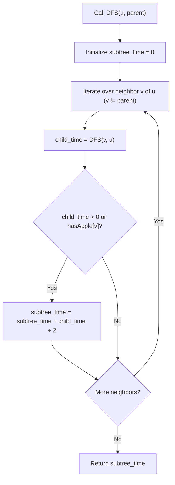

# Guided Example: Minimum Time to Collect All Apples in a Tree

We trace the step-by-step post-order depth-first traversal calculating round-trip tree edge traversal costs on a representative problem instance:

- **Input:** $n = 7$, $edges = [[0,1],[0,2],[1,4],[1,5],[2,3],[2,6]]$, $hasApple = [\text{false}, \text{false}, \text{true}, \text{false}, \text{true}, \text{true}, \text{false}]$
- **Required Output:** $8$

This instance contains apples distributed across different branches and depths (at nodes $2$, $4$, and $5$), requiring selective subtree pruning of barren branches (nodes $3$ and $6$) while fully traversing intermediate non-apple nodes ($1$).

---

## 1. Instance & Teaching Goal

We are given an undirected tree with $n$ vertices numbered $0$ to $n-1$, rooted at vertex $0$. Traversal over any edge costs $1$ second in each direction ($2$ seconds round-trip). We must determine the minimum time needed to start at vertex $0$, visit all vertices that contain apples, and return to vertex $0$.

In the provided instance:
- Vertex $0$ connects to children $1$ and $2$.
- Vertex $1$ connects to children $4$ and $5$. Both $4$ and $5$ contain apples.
- Vertex $2$ contains an apple and connects to children $3$ and $6$. Neither $3$ nor $6$ contains an apple.
- Barren subtrees: Branching into $3$ or $6$ incurs unnecessary cost and is pruned ($0$ seconds).
- Fruiting subtrees:
  - Traversing $1 \leftrightarrow 4$: $2$ seconds.
  - Traversing $1 \leftrightarrow 5$: $2$ seconds.
  - Traversing $0 \leftrightarrow 1$: $2$ seconds. Total for left branch: $2 + 2 + 2 = 6$ seconds.
  - Traversing $0 \leftrightarrow 2$: $2$ seconds. Total for right branch: $2$ seconds.
- Total round-trip time: $6 + 2 = 8$ seconds.

The primary teaching goal is to model bottom-up post-order propagation where a child subtree informs its parent whether any apple exists within it, incurring a $+2$ round-trip penalty for the connecting edge if and only if that child subtree is non-empty.

---

## 2. Conceptual Foundation & Invariants

Let $T_u$ denote the subtree rooted at vertex $u$. A subtree $T_u$ requires traversal if and only if:
$$\text{contains\_apple}(u) = hasApple[u] \lor \bigvee_{v \in \text{children}(u)} \text{contains\_apple}(v)$$

Let $\text{time}(u)$ be the total round-trip time spent collecting all apples strictly within $T_u$, excluding the edge connecting $u$ to its parent.

For each child $v$ of $u$:
- Recursively evaluate $\text{time}(v)$ and whether $T_v$ contains any apple.
- If $T_v$ contains at least one apple (either $hasApple[v] = \text{true}$ or $\text{time}(v) > 0$):
  - We must traverse the directed edge $u \to v$ and return $v \to u$, adding $2$ seconds to $u$'s total time, plus the internal time $\text{time}(v)$.
  - Contribution from child $v$: $\text{time}(v) + 2$.
- If $T_v$ contains no apples, edge $(u, v)$ is never traversed; contribution is $0$.

Thus, the recursive relation is:
$$\text{time}(u) = \sum_{v \in \text{children}(u), \, T_v \text{ has apple}} (\text{time}(v) + 2)$$

```
Tree Topology & Traversal Costs:
             0 (Root)
           /   \
    (+2)  /     \  (+2)
         1       2* (Apple!)
       /   \    / \
 (+2) / (+2)\  3   6 (No apples -> Pruned!)
     4*      5*
 (Apple)   (Apple)

Subtree 1 internal cost: (0 + 2) + (0 + 2) = 4
Left branch (0 -> 1): 4 + 2 = 6
Right branch (0 -> 2): 0 + 2 = 2
Total Time = 6 + 2 = 8 seconds
```

We establish tracking parameters across the algorithm:

| Parameter | Type & Domain | Role in Algorithm |
|---|---|---|
| Vertex ($u$) | Integer $0 \le u < n$ | Current node in depth-first traversal |
| Parent ($p$) | Integer $-1 \le p < n$ | Immediate ancestor to prevent backtracking cycles |
| Subtree Time ($\text{time}(u)$) | Integer $\ge 0$ | Accumulated round-trip traversal seconds within $T_u$ |
| Apple Flag | Boolean | Indicates whether $u$ or any descendant holds an apple |

> **Invariant.** At any node $u$, $\text{time}(u)$ represents the exact minimal cost to collect all apples within $T_u$ starting and ending at $u$. Edge $(p, u)$ is charged $2$ seconds if and only if $u \ne 0$ and $T_u$ contains at least one apple.



---

## 3. Step-by-Step Worked Execution

We walk through the representative instance with $n = 7$, edges as described, and $hasApple = [F, F, T, F, T, T, F]$.

### Bottom-Up Evaluation by Depth

1. **Leaf Nodes $4, 5, 3, 6$:**
   - Node $4$: Has apple ($hasApple[4] = \text{true}$). Internal time: $0$.
   - Node $5$: Has apple ($hasApple[5] = \text{true}$). Internal time: $0$.
   - Node $3$: No apple ($hasApple[3] = \text{false}$). Internal time: $0$. Subtree barren.
   - Node $6$: No apple ($hasApple[6] = \text{false}$). Internal time: $0$. Subtree barren.

2. **Internal Node $1$ (Parent of $4$ and $5$):**
   - Child $4$: Has apple. Incurs edge $(1, 4)$ round-trip ($+2$) + child time ($0$) = $2$.
   - Child $5$: Has apple. Incurs edge $(1, 5)$ round-trip ($+2$) + child time ($0$) = $2$.
   - Total internal time for node $1$: $2 + 2 = 4$.
   - Node $1$'s subtree contains apples.

3. **Internal Node $2$ (Parent of $3$ and $6$):**
   - Child $3$: No apple; contribution $0$.
   - Child $6$: No apple; contribution $0$.
   - Total internal time for node $2$: $0$.
   - But node $2$ itself has an apple ($hasApple[2] = \text{true}$).

4. **Root Node $0$ (Parent of $1$ and $2$):**
   - Child $1$: Subtree contains apples (time $4 > 0$). Incurs edge $(0, 1)$ round-trip ($+2$) + child time ($4$) = $6$.
   - Child $2$: Subtree contains apple ($hasApple[2] = \text{true}$). Incurs edge $(0, 2)$ round-trip ($+2$) + child time ($0$) = $2$.
   - Total time at root $0$: $6 + 2 = 8$.

| Vertex $u$ | $hasApple[u]$ | Children $v$ | Child Times & Apple Flags | Edge Traversal Charged ($+2$ each) | Total Subtree Time $\text{time}(u)$ |
|---|---|---|---|---|---|
| 4 | True | None | None | None | 0 |
| 5 | True | None | None | None | 0 |
| 1 | False | 4, 5 | $v=4$: True (0), $v=5$: True (0) | $(1,4) \to +2, (1,5) \to +2$ | $0 + 2 + 0 + 2 = 4$ |
| 3 | False | None | None | None | 0 |
| 6 | False | None | None | None | 0 |
| 2 | True | 3, 6 | $v=3$: False, $v=6$: False | None | 0 |
| 0 (Root) | False | 1, 2 | $v=1$: True (4), $v=2$: True (0) | $(0,1) \to +2, (0,2) \to +2$ | $4 + 2 + 0 + 2 = 8$ |

---

## 4. Complete Execution Trace

```
Edge Traversal Route:
0 -> 1 -> 4 -> 1 -> 5 -> 1 -> 0 -> 2 -> 0
Total directed steps: 8 edges traversed (8 seconds)
Visited apple nodes: {4, 5, 2}
Avoided barren nodes: {3, 6}
```

| Traversed Segment | Direction | Cumulative Seconds | Rationale |
|---|---|---|---|
| $(0 \to 1)$ | Outward | 1 | Access subtree containing apples at 4 and 5 |
| $(1 \to 4)$ | Outward | 2 | Reach apple at node 4 |
| $(4 \to 1)$ | Return | 3 | Complete collection at node 4 |
| $(1 \to 5)$ | Outward | 4 | Reach apple at node 5 |
| $(5 \to 1)$ | Return | 5 | Complete collection at node 5 |
| $(1 \to 0)$ | Return | 6 | Return to root from node 1 branch |
| $(0 \to 2)$ | Outward | 7 | Reach apple at node 2 |
| $(2 \to 0)$ | Return | 8 | Return to root from node 2 branch |

---

## 5. Algorithmic Correctness

**Soundness.** Every edge traversed connects the root to a component containing at least one apple. Because trees have unique simple paths between any pair of nodes, every edge in the minimal subtree spanning vertex $0$ and all apple nodes must be traversed at least once down and once up to return to $0$.

**Completeness.** Since depth-first search visits every connected subtree, no apple-bearing component is overlooked. Barren components without apples return $0$ and trigger no parent edge additions, ensuring that minimal time is achieved without superfluous traversals.

---

## 6. Traps This Instance Exposes

- **Counting Root Edge Overhead:** Adding $2$ seconds for node $0$ itself. Vertex $0$ is the start and end position; it has no incoming parent edge, so its own presence must never add $2$.
- **Ignoring Intermediate Barren Nodes:** Node $1$ does not hold an apple, but its descendants $4$ and $5$ do. If an algorithm checks only whether the immediate node has an apple ($hasApple[1]$), it would incorrectly prune node $1$ and fail to reach $4$ and $5$.
- **Cycle Formation on Undirected Trees:** Because edges are undirected, traversal must track the caller parent $p$ to prevent oscillating endlessly between parent and child.

---

## 7. Complexity Derivation

- **Time Complexity:** $\mathcal{O}(n)$, where $n$ is the number of vertices. Building the adjacency list from $n-1$ edges takes $\mathcal{O}(n)$ time. The depth-first search visits each vertex and examines each edge exactly twice (once from each endpoint), executing in $\mathcal{O}(n)$ time.
- **Auxiliary Space Complexity:** $\mathcal{O}(n)$ to store the adjacency list representation and accommodate the recursion call stack (bounded by the maximum tree depth $h \le n$).