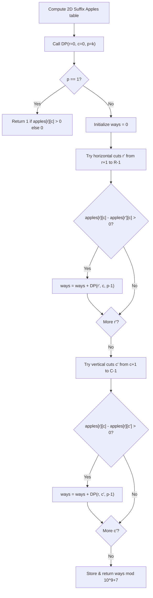

# Guided Example: Number of Ways of Cutting a Pizza

We trace the step-by-step dynamic programming state transitions using 2D suffix apple counts on a representative problem instance:

- **Input:** $pizza = [\text{"A.."}, \text{"AAA"}, \text{"..."}]$, $k = 3$
- **Required Output:** $3$

This instance illustrates how every valid cut produces an active piece given away and leaves a remaining bottom-right rectangular suffix, requiring memoized 3D dynamic programming over $(r, c, \text{rem})$.

---

## 1. Instance & Teaching Goal

We are given an $R \times C$ rectangular pizza containing apples (`'A'`) and empty cells (`'.'`), and an integer $k$. We must cut the pizza into $k$ pieces using $k - 1$ cuts.
- A horizontal cut along row boundary $r'$ gives the top portion (rows $r \dots r'-1$) to a person, leaving the suffix rectangle $[r' \dots R-1, \, c \dots C-1]$.
- A vertical cut along column boundary $c'$ gives the left portion (columns $c \dots c'-1$) to a person, leaving the suffix rectangle $[r \dots R-1, \, c' \dots C-1]$.
- Every piece handed out (including the final remaining piece) must contain at least one apple.
- We must return the number of distinct valid cut sequences modulo $10^9 + 7$.

In the provided instance:
- $R = 3, C = 3$. Apples reside at $(0, 0), (1, 0), (1, 1), (1, 2)$.
- $k = 3$ requires $2$ cuts.
- The $3$ valid cutting sequences are:
  1. Horizontal cut at row $1$, then vertical cut at column $1$.
  2. Horizontal cut at row $1$, then vertical cut at column $2$.
  3. Vertical cut at column $1$, then vertical cut at column $2$.
- Result: $3$.

The primary teaching goal is to recognize that regardless of whether cuts are horizontal or vertical, the remaining pizza is always a contiguous suffix rectangle defined solely by its top-left coordinate $(r, c)$. Precomputing 2D suffix apple sums allows constant-time verification of apple presence for any proposed cut.

---

## 2. Conceptual Foundation & Invariants

Let $apples[r][c]$ be the number of apples in the suffix rectangle spanning from row $r$ to $R-1$ and column $c$ to $C-1$:
$$apples[r][c] = \mathbb{I}(pizza[r][c] = \text{'A'}) + apples[r+1][c] + apples[r][c+1] - apples[r+1][c+1]$$

Let $DP(r, c, p)$ denote the number of ways to cut the suffix rectangle $(r, c)$ into $p$ pieces.

**Base Case ($p = 1$):**
$$DP(r, c, 1) = \begin{cases} 1 & \text{if } apples[r][c] \ge 1 \\ 0 & \text{otherwise} \end{cases}$$

**Inductive Step ($p > 1$):**
1. **Horizontal Cuts:** For each row boundary $r'$ from $r + 1$ to $R - 1$:
   - The top piece has apples: $apples[r][c] - apples[r'][c]$.
   - If $apples[r][c] - apples[r'][c] > 0$ and $apples[r'][c] \ge p - 1$:
     Add $DP(r', c, p - 1)$ to total.
2. **Vertical Cuts:** For each column boundary $c'$ from $c + 1$ to $C - 1$:
   - The left piece has apples: $apples[r][c] - apples[r][c']$.
   - If $apples[r][c] - apples[r][c'] > 0$ and $apples[r][c'] \ge p - 1$:
     Add $DP(r, c', p - 1)$ to total.

All additions are performed modulo $10^9 + 7$.

```
Suffix Geometry & Cut Invariant:
(0,0) +------------------------+
      |  Given away (Top/Left) |
(r,c) +------------+-----------+
      |            | Suffix    |
      |            | (r', c')  |
      |            |           |
      +------------+-----------+ (R-1, C-1)
Remaining pizza is always anchored at bottom-right corner!
```

We establish tracking parameters across the algorithm:

| Parameter | Type & Domain | Role in Algorithm |
|---|---|---|
| Top-Left Row ($r$) | Integer $0 \le r < R$ | Top boundary of remaining suffix pizza |
| Top-Left Column ($c$) | Integer $0 \le c < C$ | Left boundary of remaining suffix pizza |
| Pieces Remaining ($p$) | Integer $1 \le p \le k$ | Target number of pieces to divide $(r, c)$ into |
| Suffix Apples ($apples[r][c]$) | Integer $\ge 0$ | Total count of apples in rectangle $[r \dots R-1, c \dots C-1]$ |

> **Invariant.** For any state $(r, c, p)$, $DP(r, c, p)$ correctly aggregates the number of valid sequences of $p-1$ cuts on the rectangle $[r \dots R-1, c \dots C-1]$ modulo $10^9 + 7$, where each piece contains at least one apple.



---

## 3. Step-by-Step Worked Execution

We walk through the representative instance $pizza = [\text{"A.."}, \text{"AAA"}, \text{"..."}]$, $k = 3$.

### Step 1: Precompute Suffix Apple Matrix
Grid dimensions: $3 \times 3$.
- Row $2$: `...` contains no apples.
  - $apples[2][0] = 0, apples[2][1] = 0, apples[2][2] = 0$.
- Row $1$: `AAA` contains 3 apples.
  - $apples[1][2] = 1$
  - $apples[1][1] = 1 + 1 = 2$
  - $apples[1][0] = 1 + 2 = 3$
- Row $0$: `A..` contains 1 apple at column $0$.
  - $apples[0][2] = 0 + 1 = 1$
  - $apples[0][1] = 0 + 2 = 2$
  - $apples[0][0] = 1 + 3 = 4$

2D Suffix Apple Table:
$$\begin{bmatrix} 4 & 2 & 1 \\ 3 & 2 & 1 \\ 0 & 0 & 0 \end{bmatrix}$$

### Step 2: Dynamic Programming Transitions from $(0, 0, 3)$

We evaluate candidate first cuts from $(0, 0)$ needing $p = 3$ pieces:

1. **Horizontal cut at $r' = 1$:**
   - Upper piece: $apples[0][0] - apples[1][0] = 4 - 3 = 1 > 0$ (Valid).
   - Remaining suffix: $(1, 0)$ with $p = 2$ pieces.
   - We evaluate $DP(1, 0, 2)$:
     - Horizontal cuts on $(1, 0)$:
       - $r'' = 2$: Upper piece has $apples[1][0] - apples[2][0] = 3 - 0 = 3$. Remaining $(2, 0)$ has $apples[2][0] = 0$ (No apples for last person! Invalid).
     - Vertical cuts on $(1, 0)$:
       - $c'' = 1$: Left piece has $apples[1][0] - apples[1][1] = 3 - 2 = 1 > 0$. Remaining $(1, 1)$ has $apples[1][1] = 2 > 0$. Valid! $DP(1, 1, 1) = 1$.
       - $c'' = 2$: Left piece has $apples[1][0] - apples[1][2] = 3 - 1 = 2 > 0$. Remaining $(1, 2)$ has $apples[1][2] = 1 > 0$. Valid! $DP(1, 2, 1) = 1$.
     - Total $DP(1, 0, 2) = 1 + 1 = 2$.
   - Contributes $2$ ways.

2. **Horizontal cut at $r' = 2$:**
   - Upper piece: $apples[0][0] - apples[2][0] = 4 - 0 = 4 > 0$.
   - Remaining suffix $(2, 0)$ has $apples[2][0] = 0$ (Cannot form $2$ pieces). Contributes $0$.

3. **Vertical cut at $c' = 1$:**
   - Left piece: $apples[0][0] - apples[0][1] = 4 - 2 = 2 > 0$ (Valid).
   - Remaining suffix: $(0, 1)$ with $p = 2$ pieces.
   - We evaluate $DP(0, 1, 2)$:
     - Horizontal cuts on $(0, 1)$:
       - $r'' = 1$: Upper piece has $apples[0][1] - apples[1][1] = 2 - 2 = 0$ (No apples in top slice! Invalid).
       - $r'' = 2$: Upper piece has $2$, remaining $(2, 1)$ has $0$ (Invalid).
     - Vertical cuts on $(0, 1)$:
       - $c'' = 2$: Left piece has $apples[0][1] - apples[0][2] = 2 - 1 = 1 > 0$. Remaining $(0, 2)$ has $apples[0][2] = 1 > 0$. Valid! $DP(0, 2, 1) = 1$.
     - Total $DP(0, 1, 2) = 1$.
   - Contributes $1$ way.

4. **Vertical cut at $c' = 2$:**
   - Left piece has $apples[0][0] - apples[0][2] = 4 - 1 = 3 > 0$.
   - Remaining suffix $(0, 2)$ has $apples[0][2] = 1$. It only has $1$ apple, so it cannot be cut into $p = 2$ pieces with $\ge 1$ apple each. Contributes $0$.

Total combinations:
$$DP(0, 0, 3) = DP(1, 0, 2) + DP(0, 1, 2) = 2 + 1 = 3$$

| Cut 1 Type | Cut 1 Position | First Piece Apples | Next Subproblem | Valid Cut 2 Transitions | Subproblem Ways |
|---|---|---|---|---|---|
| Horizontal | $r' = 1$ | $4 - 3 = 1$ | $DP(1, 0, 2)$ | V-cut at $c''=1$, V-cut at $c''=2$ | 2 |
| Horizontal | $r' = 2$ | $4 - 0 = 4$ | $DP(2, 0, 2)$ | None (remaining has 0 apples) | 0 |
| Vertical | $c' = 1$ | $4 - 2 = 2$ | $DP(0, 1, 2)$ | V-cut at $c''=2$ | 1 |
| Vertical | $c' = 2$ | $4 - 1 = 3$ | $DP(0, 2, 2)$ | None (remaining has only 1 apple) | 0 |

---

## 4. Complete Execution Trace

```
Catalog of 3 Successful Cut Sequences:
Path 1: H-Cut at row 1  -->  V-Cut at col 1
  Pieces: [row 0] (apple at 0,0), [col 0, row 1] (apple at 1,0), [cols 1..2, row 1] (apples at 1,1; 1,2)

Path 2: H-Cut at row 1  -->  V-Cut at col 2
  Pieces: [row 0] (apple at 0,0), [cols 0..1, row 1] (apples at 1,0; 1,1), [col 2, row 1] (apple at 1,2)

Path 3: V-Cut at col 1  -->  V-Cut at col 2
  Pieces: [col 0] (apples at 0,0; 1,0), [col 1] (apple at 1,1), [col 2] (apple at 1,2)
```

| Decision Level | State $(r, c, p)$ | Action Chosen | Remaining Suffix | Validation Status |
|---|---|---|---|---|
| 1 | $(0, 0, 3)$ | Cut H at $r'=1$ | $(1, 0, 2)$ | Valid: Top has 1 apple |
| 2a | $(1, 0, 2)$ | Cut V at $c''=1$ | $(1, 1, 1)$ | Valid: Left has 1, Right has 2 $\implies$ **Way 1** |
| 2b | $(1, 0, 2)$ | Cut V at $c''=2$ | $(1, 2, 1)$ | Valid: Left has 2, Right has 1 $\implies$ **Way 2** |
| 1 | $(0, 0, 3)$ | Cut V at $c'=1$ | $(0, 1, 2)$ | Valid: Left has 2 apples |
| 2c | $(0, 1, 2)$ | Cut V at $c''=2$ | $(0, 2, 1)$ | Valid: Left has 1, Right has 1 $\implies$ **Way 3** |

---

## 5. Algorithmic Correctness

**Soundness.** A cut is performed only if the piece severed contains strictly more than zero apples and the remaining piece contains at least the minimum number of apples required for subsequent cuts. Because every terminal piece ($p = 1$) is verified to contain $\ge 1$ apple, every counted sequence produces $k$ valid pieces.

**Completeness.** Suffix rectangles exhaustively represent all possible remaining pizza shapes because every horizontal cut leaves a bottom portion and every vertical cut leaves a right portion. Summing over all valid horizontal boundaries $r'$ and vertical boundaries $c'$ without overlapping partitions enumerates all valid cut trees.

---

## 6. Traps This Instance Exposes

- **Overlapping/Redundant Subproblem Recalculation:** Without memoization, exploring all cut combinations yields exponential complexity $\mathcal{O}((R + C)^k)$. With $R, C \le 50$ and $k \le 10$, caching $(r, c, p)$ limits distinct states to $50 \times 50 \times 10 = 25000$.
- **2D Area Queries Without Prefix Sums:** Counting apples by scanning cells inside each candidate cut takes $\mathcal{O}(R \cdot C)$ per cut attempt. 2D suffix sums answer every query in $\mathcal{O}(1)$ time.
- **Modulo Arithmetic:** Additions must be taken modulo $10^9 + 7$ at each step to prevent arithmetic overflow on large grids.

---

## 7. Complexity Derivation

- **Time Complexity:** $\mathcal{O}(k \cdot R \cdot C \cdot (R + C))$.
  - Precomputing suffix apples takes $\mathcal{O}(R \cdot C)$ time.
  - Number of DP states $(r, c, p)$ is $R \times C \times k \le 50 \times 50 \times 10 = 25000$.
  - From each state, at most $R$ horizontal cuts and $C$ vertical cuts are evaluated, taking $\mathcal{O}(R + C) \le 100$ operations per state.
  - Total operations: $25000 \times 100 \approx 2.5 \times 10^6$, executing well within a fraction of a second.
- **Auxiliary Space Complexity:** $\mathcal{O}(k \cdot R \cdot C)$ to store the DP memoization table and $\mathcal{O}(R \cdot C)$ for the suffix apple array.