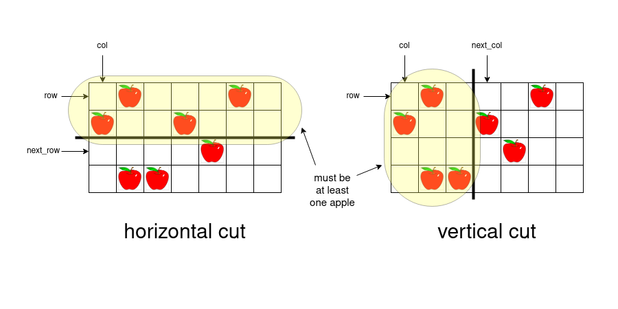

## Solution

---

### Approach 1: Dynamic Programming

#### Intuition

>We highly recommend you solve the problem [304. Range Sum Query 2D - Immutable](https://leetcode.com/problems/range-sum-query-2d-immutable/) before trying this problem.

When one cuts a rectangular part of pizza either vertically or horizontally, the remaining part is also a rectangle but a smaller one. Since we give a person the left or the upper part of the pizza, we always keep the bottom right part of the pizza.

Because we have a smaller rectangle (pizza) after each cut, each cut creates a new subproblem. We will solve the problem using dynamic programming.

What will be the state of dynamic programming? Or in other words, how can we describe the current state of the pizza?

First, we need to know how many cuts are left to make. We will denote this number as `remain`.

Second, we need to know what part of the pizza remains on the table. Let `row` denote its topmost row, and `col` denote its leftmost column. The remaining part is `pizza[row..rows-1][col..cols-1]`, where `rows` and `cols` denote the number of rows and columns in the original pizza respectively.

The state of the DP is the triplet `(remain, row, col)`.

Let $\text{dp}[remain][row][col]$ be the number of ways to cut the rectangular part `pizza[row..rows-1][col..cols-1]` with `remain` cuts modulo $10^9+7$.

The base case of the DP is $remain = 0$ when one does not need to make any more cuts. If `pizza[row..rows-1][col..cols-1]` contains at least one apple, then $\text{dp}[0][row][col] = 1$ – there is one way to make no cuts and give the piece to the last person. Otherwise, `pizza[row..rows-1][col..cols-1]` contains no apples, and there are no ways to give the piece to the person, thus $\text{dp}[0][row][col] = 0$.

Now we need to write down the transitions of the DP.



When one cuts the rectangle `pizza[row..rows-1][col..cols-1]` horizontally, one first chooses the row $\text{next}_{row}$ ($row < \text{next}_{row} < rows$) where to cut. The upper part after the cut will be $pizza[row..\text{next}_{row}-1][col..cols-1]$ and the bottom one – $pizza[\text{next}_{row}..rows-1][col..cols-1]$. Since we give the upper part to a person, the number of apples on $pizza[row..\text{next}_{row}-1][col..cols-1]$ must be greater than zero.

We can consider the vertical cut with the same logic: one first chooses the column $\text{next}_{col}$ ($col < \text{next}_{col} < cols$) and cuts the pizza into two parts $pizza[row..rows-1][cols..\text{next}_{col}-1]$ and $pizza[row..rows-1][\text{next}_{col}..cols-1]$. There must be at least one apple on $pizza[row..rows-1][col..\text{next}_{col}-1]$.

Let's say we want to calculate $\text{dp}[remain][row][col]$ with `remain > 0`.

We have to try all possible options for the first cut: the horizontal one at row $\text{next}_{row}$ or the vertical one at column $\text{next}_{col}$. We iterate over all $\text{next}_{row}$ such that $row < \text{next}_{row} < rows$. If $pizza[row..\text{next}_{row}-1][col..cols-1]$ contains at least one apple, we can make the first cut into pieces $pizza[row..\text{next}_{row}-1][col..cols-1]$ and $pizza[\text{next}_{row}..rows-1][col..cols-1]$ and give the upper part to a person.

After this cut, we have to make $remain - 1$ cuts on the bottom part $pizza[\text{next}_{row}..rows-1][col..cols-1]$. Cutting the part $pizza[\text{next}_{row}..rows-1][col..cols-1]$ with $remain - 1$ cuts is a subproblem. It means, there is a transition from $dp[remain-1][\text{next}_{row}][col]$ to $\text{dp}[remain][row][col]$.

Similarly, for all $\text{next}_{col}$ such that $col < \text{next}_{col} < cols$, if we have at least one apple on $pizza[row..rows-1][col..\text{next}_{col}-1] > 0$, there is a transition from $dp[remain-1][row][\text{next}_{col}]$ to $\text{dp}[remain][row][col]$.

Having all transitions, one can conclude that the value $\text{dp}[remain][row][col]$ equals the sum of $dp[remain-1][\text{next}_{row}][col]$ and $dp[remain-1][row][\text{next}_{col}]$ for all valid values of $\text{next}_{row}$ and $\text{next}_{col}$.

We almost have the solution, but we haven't talked about how to quickly verify if a rectangle has an apple.

Let $\text{apples}[row][col]$ denote the number of apples on `pizza[row..rows-1][col..cols-1]` (so $\text{apples}[0][0]$ will be the number of apples on the original pizza).

The matrix `apples` is the cumulative region sum matrix. One can calculate this matrix using the reccurrence relation $\text{apples}[row][col] = (\text{pizza}[row][col] = 'A') + apples[row + 1][col] + \text{apples}[row][col + 1] - apples[row + 1][col + 1]$. Refer to Approach 4 of the [solution](https://leetcode.com/problems/range-sum-query-2d-immutable/solutions/127813/) of the problem [304. Range Sum Query 2D - Immutable](https://leetcode.com/problems/range-sum-query-2d-immutable/) for details.

Having the matrix `apples` one can find the number of apples on $pizza[row..\text{next}_{row}-1][col..cols-1]$ as $\text{apples}[row][col] - apples[\text{next}_{row}][col]$ and on $pizza[row..rows-1][col..\text{next}_{col}-1]$ as $\text{apples}[row][col] - \text{apples}[row][\text{next}_{col}]$. For each cut, if the piece we are giving away has at least one apple, we can consider the cut.

#### Algorithm

1. Declare the matrices `apples[rows+1][cols+1]` and $\text{dp}[k][rows][cols]$.
2. First, calculate `apples`. Iterate `row` from `rows-1` to `0`.
* Iterate `col` from `cols-1` to `0`.
* Calculate $\text{apples}[row][col]$ as $(\text{pizza}[row][col] = 'A') + apples[row + 1][col] + \text{apples}[row][col + 1] - apples[row + 1][col + 1]$.
* If $\text{apples}[row][col] > 0$, set $\text{dp}[0][row][col] = 1$, otherwise set $\text{dp}[0][row][col] = 0$ (the base case of the DP).
3. Iterate `remain` from `1` to $k - 1$.
* Iterate `row` from `0` to `rows-1`.
* Iterate `col` from `0` to `cols-1`.
* We will now calculate $\text{dp}[remain][row][col]$ by considering all cuts.
* Consider all horizontal cuts. Iterate $\text{next}_{row}$ from `row+1` to `rows-1`.
* If the top piece has an apple, i.e. $\text{apples}[row][col] - apples[\text{next}_{row}][col] > 0$, add $dp[remain-1][\text{next}_{row}][col]$ to $\text{dp}[remain][row][col]$.
* Consider all vertical cuts. Iterate $\text{next}_{col}$ from `col+1` to `cols-1`.
* If the left piece has an apple, i.e. $\text{apples}[row][col] - \text{apples}[row][\text{next}_{col}] > 0$, add $dp[remain-1][row][\text{next}_{col}]$ to $\text{dp}[remain][row][col]$.
4. Return `dp[k-1][0][0]`. This represents the original pizza with $k - 1$ cuts, which is what the original problem is asking for.

#### Implementation

```python
class Solution:
    def ways(self, pizza: List[str], k: int) -> int:
        rows = len(pizza)
        cols = len(pizza[0])
        apples = [[0] * (cols + 1) for row in range(rows + 1)]
        for row in range(rows - 1, -1, -1):
            for col in range(cols - 1, -1, -1):
                apples[row][col] = ((pizza[row][col] == 'A')
                                    + apples[row + 1][col]
                                    + apples[row][col + 1]
- apples[row + 1][col + 1])
        dp = [[[0 for col in range(cols)] for row in range(rows)] for remain in range(k)]
        dp[0] = [[int(apples[row][col] > 0) for col in range(cols)]
             for row in range(rows)]
        mod = 1000000007
        for remain in range(1, k):
            for row in range(rows):
                for col in range(cols):
                    val = 0
                    for next_row in range(row + 1, rows):
                        if apples[row][col] - apples[next_row][col] > 0:
                            val += dp[remain - 1][next_row][col]
                    for next_col in range(col + 1, cols):
                        if apples[row][col] - apples[row][next_col] > 0:
                            val += dp[remain - 1][row][next_col]
                    dp[remain][row][col] = val % mod
        return dp[k - 1][0][0]
```

#### Complexity Analysis

Let $n$ denote the number of rows in `pizza` and $m$ denote the number of columns in `pizza`.

* Time complexity: $O(k \cdot n \cdot m \cdot (n + m))$.

	There are $O(k \cdot n \cdot m)$ states `[remain][row][col]`. $k$ for `remain`, $n$ for `row` and $m$ for `col`. For each state, we iterate over $\text{next}_{row}$ in $O(n)$ and over $\text{next}_{col}$ in $O(m)$.

* Space complexity: $O(n \cdot m \cdot k)$.

	We store the matrix $\text{dp}[k][rows][cols]$.

---

### Approach 2: Dynamic Programming with Optimized Space Complexity

#### Intuition

Note that we calculate $\text{dp}[remain]$ using only the values of `dp[remain-1]`.

It allows us not to store all `k` "layers" in memory at once, but only two at a time to save space. We will keep two layers `dp[remain-1]` and $\text{dp}[remain]$ in two matrices `f` ($f[row][col] = dp[remain-1][row][col]$) and `g` ($g[row][col] = \text{dp}[remain][row][col]$).

#### Algorithm

1. Declare the matrices `apples[rows+1][cols+1]` and $f[rows][cols]$.
2. First, calculate `apples`. Iterate `row` from `rows-1` to `0`.
* Iterate `col` from `cols-1` to `0`.
* Calculate $\text{apples}[row][col]$ as $(\text{pizza}[row][col] = 'A') + apples[row + 1][col] + \text{apples}[row][col + 1] - apples[row + 1][col + 1]$.
* If $\text{apples}[row][col] > 0$, set $f[row][col] = 1$, otherwise set $f[row][col] = 0$ (the base case of the DP).
3. Iterate `remain` from `1` to $k - 1$.
* Declare the matrix $g[rows][cols]$ and initialize it with zeros. (Here $f[row][col] = dp[remain-1][row][col]$ and $g[row][col] = \text{dp}[remain][row][col]$).
* Iterate `row` from `0` to `rows-1`.
* Iterate `col` from `0` to `cols-1`.
* Consider all horizontal cuts. Iterate $\text{next}_{row}$ from `row+1` to `rows-1`.
* If the top piece has an apple, i.e. $\text{apples}[row][col] - apples[\text{next}_{row}][col] > 0$, add $f[\text{next}_{row}][col]$ to $g[row][col]$.
* Consider all vertical cuts. Iterate $\text{next}_{col}$ from `col+1` to `cols-1`.
* If the left piece has an apple, i.e. $\text{apples}[row][col] - \text{apples}[row][\text{next}_{col}] > 0$, add $f[row][\text{next}_{col}]$ to $g[row][col]$.
* Copy the matrix `g` to `f`.
4. Return $f[0][0]$.

#### Implementation

```python
class Solution:
    def ways(self, pizza: List[str], k: int) -> int:
        rows = len(pizza)
        cols = len(pizza[0])
        apples = [[0] * (cols + 1) for row in range(rows + 1)]
        for row in range(rows - 1, -1, -1):
            for col in range(cols - 1, -1, -1):
                apples[row][col] = ((pizza[row][col] == 'A')
                                    + apples[row + 1][col]
                                    + apples[row][col + 1]
- apples[row + 1][col + 1])
        f = [[int(apples[row][col] > 0) for col in range(cols)]
             for row in range(rows)]
        mod = 1000000007
        for remain in range(1, k):
            g = [[0 for col in range(cols)] for row in range(rows)]
            for row in range(rows):
                for col in range(cols):
                    for next_row in range(row + 1, rows):
                        if apples[row][col] - apples[next_row][col] > 0:
                            g[row][col] += f[next_row][col]
                    for next_col in range(col + 1, cols):
                        if apples[row][col] - apples[row][next_col] > 0:
                            g[row][col] += f[row][next_col]
                    g[row][col] %= mod
            f = g
        return f[0][0]
```

#### Complexity Analysis

Let $n$ denote the number of rows in `pizza` and $m$ denote the number of columns in `pizza`.

* Time complexity: $O(k \cdot n \cdot m \cdot (n + m))$.

	There are $O(k \cdot n \cdot m)$ states `[remain][row][col]`. $k$ for `remain`, $n$ for `row` and $m$ for `col`. For each state, we iterate over $\text{next}_{row}$ in $O(n)$ and over $\text{next}_{col}$ in $O(m)$.

* Space complexity: $O(n \cdot m)$.

	We store the matrices `apples[rows+1][cols+1]`, $f[rows][cols]$ and $g[rows][cols]$.