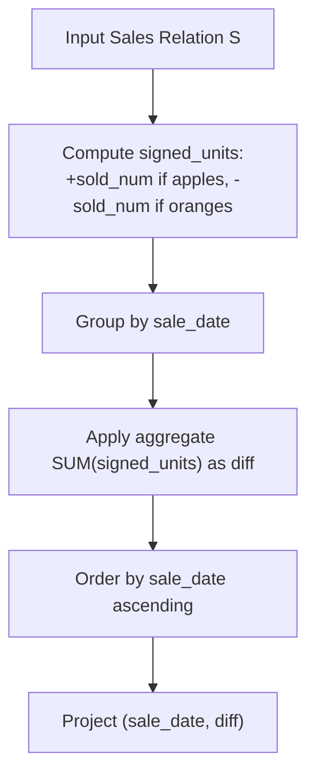

# Guided Example: Apples & Oranges

We trace the step-by-step evaluation of daily sales differences between apples and oranges using signed relational aggregation and temporal sorting on a representative database instance:

- **Input:** Relation $Sales$ containing daily sold units of apples and oranges across four consecutive dates:
  - `2020-05-01`: 10 apples, 8 oranges
  - `2020-05-02`: 15 apples, 15 oranges
  - `2020-05-03`: 20 apples, 0 oranges
  - `2020-05-04`: 15 apples, 16 oranges
- **Required Output:** Daily difference relation ordered by $sale\_date$ ascending.

---

## 1. Instance & Teaching Goal

We are given a database relation $Sales(sale\_date, fruit, sold\_num)$ where $(sale\_date, fruit)$ is the composite primary key and $fruit \in \{\text{"apples"}, \text{"oranges"}\}$. We must compute for each date:

$$\text{diff} = \text{sold\_num}_{\text{apples}} - \text{sold\_num}_{\text{oranges}}$$

and return the results sorted by $sale\_date$ in ascending chronological order.

In the provided instance:
- `2020-05-01`: $10 - 8 = 2$
- `2020-05-02`: $15 - 15 = 0$
- `2020-05-03`: $20 - 0 = 20$
- `2020-05-04`: $15 - 16 = -1$
- Result tuples: $(2020\text{-}05\text{-}01, 2), (2020\text{-}05\text{-}02, 0), (2020\text{-}05\text{-}03, 20), (2020\text{-}05\text{-}04, -1)$.

The primary teaching goal is to model conditional group aggregation by transforming a categorical subtractor into a signed scalar function ($+sold\_num$ for apples, $-sold\_num$ for oranges), reducing a two-table self-join to a single grouped summation $\gamma$.

---

## 2. Conceptual Foundation & Invariants

Let $S$ denote the $Sales$ relation. Rather than executing an inner join between an apples partition $\sigma_{fruit = \text{"apples"}}(S)$ and an oranges partition $\sigma_{fruit = \text{"oranges"}}(S)$, we project an extended relation with signed sales:

$$S' = \Pi_{sale\_date, \, \psi(fruit, sold\_num) \to signed\_units}(S)$$

where the sign assignment function $\psi$ is defined as:

$$\psi(fruit, sold\_num) = \begin{cases} sold\_num & \text{if } fruit = \text{"apples"} \\ -sold\_num & \text{if } fruit = \text{"oranges"} \end{cases}$$

Grouping by $sale\_date$ and applying the summation operator $\sum$ computes the net difference directly:

$$G = \gamma_{sale\_date, \, \sum(signed\_units) \to diff}(S')$$

Finally, the relation is sorted by date:

$$R = \tau_{sale\_date \uparrow}(G)$$

```
Relational Transformation Flow:
Sales Table
  |
  v  [Map fruit to sign: apples -> +1, oranges -> -1]
Signed Sales Relation:
  (2020-05-01, apples, 10)   ===> (2020-05-01, +10)
  (2020-05-01, oranges, 8)   ===> (2020-05-01, -8)
  ...
  |
  v  [Group by sale_date and SUM(signed_units)]
Daily Net Aggregation:
  2020-05-01: (+10) + (-8)  = +2
  2020-05-02: (+15) + (-15) = 0
  2020-05-03: (+20) + (0)   = +20
  2020-05-04: (+15) + (-16) = -1
  |
  v  [Sort by sale_date ascending]
Emitted Sorted Result
```

We establish tracking parameters across the relational pipeline:

| Parameter | Type & Domain | Role in Algorithm |
|---|---|---|
| Sale Date ($sale\_date$) | ISO Date string | Grouping key and sorting criterion |
| Fruit Type ($fruit$) | Categorical $\{\text{"apples"}, \text{"oranges"}\}$ | Determines positive vs. negative sign |
| Sold Count ($sold\_num$) | Integer $\ge 0$ | Raw daily units sold |
| Signed Units | Integer $\mathbb{Z}$ | Signed scalar: $+sold\_num$ or $-sold\_num$ |
| Net Difference ($diff$) | Integer $\mathbb{Z}$ | Aggregated metric: $\sum(signed\_units)$ |

> **Invariant.** For each distinct $sale\_date$, the primary key guarantee ensures at most one row for apples and at most one row for oranges. The summation over signed values exactly yields $\text{apples} - \text{oranges}$.



---

## 3. Step-by-Step Worked Execution

We walk through the representative instance with 4 distinct sales dates.

### Step 1: Signed Projection
For every row in $Sales$, we calculate $signed\_units$:
- `(2020-05-01, apples, 10)` $\implies +10$
- `(2020-05-01, oranges, 8)` $\implies -8$
- `(2020-05-02, apples, 15)` $\implies +15$
- `(2020-05-02, oranges, 15)` $\implies -15$
- `(2020-05-03, apples, 20)` $\implies +20$
- `(2020-05-03, oranges, 0)` $\implies -0 = 0$
- `(2020-05-04, apples, 15)` $\implies +15$
- `(2020-05-04, oranges, 16)` $\implies -16$

### Step 2: Group By Date and Sum
We collapse rows by $sale\_date$:

1. **Date `2020-05-01`:**
   - Values: $\{+10, -8\}$
   - Net: $10 + (-8) = 2$
2. **Date `2020-05-02`:**
   - Values: $\{+15, -15\}$
   - Net: $15 + (-15) = 0$
3. **Date `2020-05-03`:**
   - Values: $\{+20, 0\}$
   - Net: $20 + 0 = 20$
4. **Date `2020-05-04`:**
   - Values: $\{+15, -16\}$
   - Net: $15 + (-16) = -1$

### Step 3: Chronological Sort
Dates are already sorted in ascending order:
`2020-05-01` $<$ `2020-05-02` $<$ `2020-05-03` $<$ `2020-05-04`.

| Row | $sale\_date$ | Fruit Category | Raw $sold\_num$ | Computed $signed\_units$ | Running Daily Group | Group Sum ($diff$) |
|---|---|---|---|---|---|---|
| 1 | 2020-05-01 | apples | 10 | +10 | `2020-05-01` | - |
| 2 | 2020-05-01 | oranges | 8 | -8 | `2020-05-01` | $+10 - 8 = \mathbf{2}$ |
| 3 | 2020-05-02 | apples | 15 | +15 | `2020-05-02` | - |
| 4 | 2020-05-02 | oranges | 15 | -15 | `2020-05-02` | $+15 - 15 = \mathbf{0}$ |
| 5 | 2020-05-03 | apples | 20 | +20 | `2020-05-03` | - |
| 6 | 2020-05-03 | oranges | 0 | 0 | `2020-05-03` | $+20 - 0 = \mathbf{20}$ |
| 7 | 2020-05-04 | apples | 15 | +15 | `2020-05-04` | - |
| 8 | 2020-05-04 | oranges | 16 | -16 | `2020-05-04` | $+15 - 16 = \mathbf{-1}$ |

---

## 4. Complete Execution Trace

```
Final Emitted Daily Differences:
+------------+------+
| sale_date  | diff |
+------------+------+
| 2020-05-01 |  2   |
| 2020-05-02 |  0   |
| 2020-05-03 |  20  |
| 2020-05-04 | -1   |
+------------+------+
Total distinct days evaluated: 4
```

| Output Row | Date Identifier | Apples Count | Oranges Count | Arithmetic Expression | Emitted Tuple |
|---|---|---|---|---|---|
| 1 | `2020-05-01` | 10 | 8 | $10 - 8$ | $(2020\text{-}05\text{-}01, 2)$ |
| 2 | `2020-05-02` | 15 | 15 | $15 - 15$ | $(2020\text{-}05\text{-}02, 0)$ |
| 3 | `2020-05-03` | 20 | 0 | $20 - 0$ | $(2020\text{-}05\text{-}03, 20)$ |
| 4 | `2020-05-04` | 15 | 16 | $15 - 16$ | $(2020\text{-}05\text{-}04, -1)$ |

---

## 5. Algorithmic Correctness

**Soundness.** For any given $sale\_date$, the difference between apples and oranges is linearly additive:
$$\text{diff} = \sum_{\text{row} \in \text{Date}} \psi(fruit, sold\_num) = 1 \cdot sold_{\text{apples}} + (-1) \cdot sold_{\text{oranges}}$$
Because the schema enforces uniqueness on $(sale\_date, fruit)$, at most one apple quantity and one orange quantity exist per date, ensuring algebraic exactness without unwanted duplicate addition.

**Completeness.** Grouping by $sale\_date$ guarantees that every date recorded in $Sales$ appears in the output relation. The subsequent ordering by $sale\_date$ satisfies the chronological presentation contract.

---

## 6. Traps This Instance Exposes

- **Inverted Subtraction Sign:** Subtracting apples from oranges ($\text{oranges} - \text{apples}$) produces negative values instead of positive values (e.g. $-2$ instead of $2$ on Day 1). The formula requires strictly $\text{apples} - \text{oranges}$.
- **Inner Self-Join Row Drops:** Performing an inner join between apples and oranges on $sale\_date$ would omit dates where one fruit has $0$ sales if that zero was represented as a missing record. Grouped summation over signed values avoids row-loss hazards.
- **Missing Temporal Order:** Omitting the final ordering step $\tau_{sale\_date \uparrow}$ violates the requirement to return the table sorted by date.

---

## 7. Complexity Derivation

- **Time Complexity:** $\mathcal{O}(R + D \log D)$, where $R$ is the number of rows in $Sales$ and $D$ is the number of distinct dates ($D \le R$). Projecting signed units and aggregating via a hash or sorted group-by takes $\mathcal{O}(R)$ time. Sorting the $D$ grouped records chronologically requires $\mathcal{O}(D \log D)$ time.
- **Auxiliary Space Complexity:** $\mathcal{O}(D)$ to store the grouped intermediate dates and aggregated differences before output presentation.
