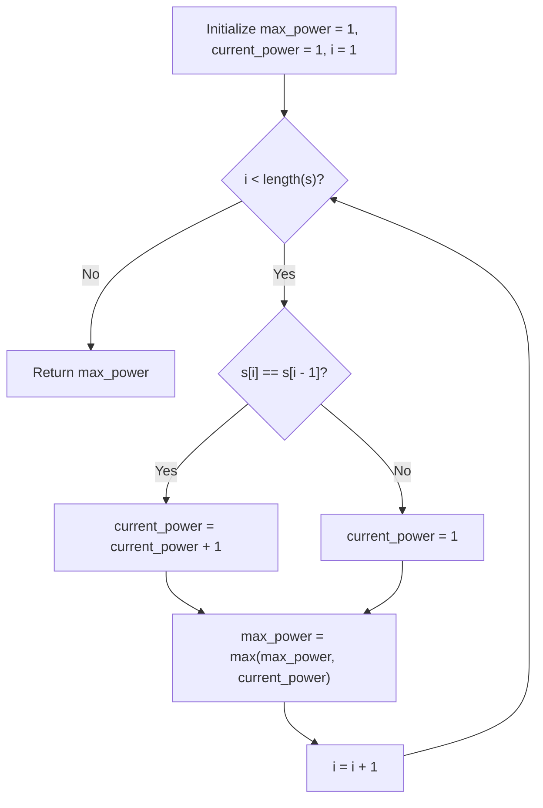

# Guided Example: Consecutive Characters

We trace the step-by-step linear scan and consecutive character run-length tracking on a representative problem instance:

- **Input:** $s = \text{"abbcccddddeeeeedcba"}$
- **Required Output:** $5$

This instance contains increasing and decreasing contiguous character blocks ('a', 'bb', 'ccc', 'dddd', 'eeeee', 'd', 'c', 'b', 'a'), providing clear transitions between ascending run lengths and reset points.

---

## 1. Instance & Teaching Goal

We are given a string $s$ consisting of lowercase English letters. The "power" of $s$ is defined as the maximum length of any non-empty contiguous substring that contains only one unique character.

In the provided instance:
- Substring `"a"` has length $1$.
- Substring `"bb"` has length $2$.
- Substring `"ccc"` has length $3$.
- Substring `"dddd"` has length $4$.
- Substring `"eeeee"` has length $5$.
- Subsequent runs `"d"`, `"c"`, `"b"`, `"a"` each have length $1$.
- The maximum run length across the entire string is $5$.

The primary teaching goal is to model run-length encoding logic using a single pass with two scalar counters: a running streak counter ($current\_power$) and a running maximum ($max\_power$), eliminating nested substring scanning.

---

## 2. Conceptual Foundation & Invariants

Let $s[i]$ denote the character at index $i$ ($0 \le i < |s|$). We partition the string into maximal contiguous uniform blocks:

$$s = B_1 B_2 \dots B_m$$

where each block $B_j = c^{L_j}$ consists of repeated copies of character $c$. The power of the string is:

$$\text{power}(s) = \max_{1 \le j \le m} L_j$$

In a streaming pass starting with base values $max\_power = 1$ and $current\_power = 1$:
- For each index $i$ from $1$ to $|s|-1$:
  - If $s[i] == s[i-1]$: the current uniform block extends, so increment $current\_power \leftarrow current\_power + 1$.
  - If $s[i] \ne s[i-1]$: a block boundary is crossed, so reset $current\_power \leftarrow 1$.
  - Update the overall maximum: $max\_power \leftarrow \max(max\_power, current\_power)$.

```
Run-Length Partitioning Architecture:
Index:   0   1 2   3 4 5   6 7 8 9   10 11 12 13 14   15  16  17  18
Char:    a   b b   c c c   d d d d    e  e  e  e  e    d   c   b   a
Block:  [a] [b b] [c c c] [d d d d]  [ e  e  e  e  e] [d] [c] [b] [a]
Length:  1    2      3       4              5          1   1   1   1
                                            ^
                                    Maximum Power = 5
```

We establish tracking parameters across the algorithm:

| Parameter | Type & Domain | Role in Algorithm |
|---|---|---|
| Scan Index ($i$) | Integer $0 \le i < |s|$ | Active position in single linear traversal |
| Current Character ($s[i]$) | Character `a`-`z` | Character evaluated against predecessor $s[i-1]$ |
| Current Streak ($current\_power$) | Integer $\ge 1$ | Length of active contiguous run of identical characters |
| Maximum Streak ($max\_power$) | Integer $\ge 1$ | Largest uniform run length encountered so far |

> **Invariant.** After processing index $i$, $current\_power$ equals the length of the maximal uniform suffix ending at $s[i]$, and $max\_power$ equals the length of the longest uniform substring in $s[0 \dots i]$.



---

## 3. Step-by-Step Worked Execution

We walk through the representative instance $s = \text{"abbcccddddeeeeedcba"}$.

### Initialization
- At index $0$: character is `'a'`.
- Base state: $current\_power = 1, max\_power = 1$.

### Traversal Across Key Segment Transitions

1. **Indices $1 \dots 2$ (Block `'b'`):**
   - $i=1$: $s[1] = \text{'b'} \ne s[0] = \text{'a'}$. Reset $current\_power = 1$.
   - $i=2$: $s[2] = \text{'b'} == s[1] = \text{'b'}$. Increment $current\_power = 2$. $max\_power \leftarrow 2$.
2. **Indices $3 \dots 5$ (Block `'c'`):**
   - $i=3$: $s[3] = \text{'c'} \ne s[2] = \text{'b'}$. Reset $current\_power = 1$.
   - $i=4$: $s[4] = \text{'c'} == s[3]$. Increment $current\_power = 2$.
   - $i=5$: $s[5] = \text{'c'} == s[4]$. Increment $current\_power = 3$. $max\_power \leftarrow 3$.
3. **Indices $6 \dots 9$ (Block `'d'`):**
   - $i=6$: Transition from `'c'` to `'d'`. Reset $current\_power = 1$.
   - $i=7, 8, 9$: Three matching `'d'`s. $current\_power$ climbs: $2 \to 3 \to 4$. $max\_power \leftarrow 4$.
4. **Indices $10 \dots 14$ (Block `'e'`):**
   - $i=10$: Transition from `'d'` to `'e'`. Reset $current\_power = 1$.
   - $i=11$: Match `'e'`. $current\_power = 2$.
   - $i=12$: Match `'e'`. $current\_power = 3$.
   - $i=13$: Match `'e'`. $current\_power = 4$.
   - $i=14$: Match `'e'`. $current\_power = 5$. $max\_power \leftarrow \max(4, 5) = 5$.
5. **Indices $15 \dots 18$ (Trailing Block `'d'`, `'c'`, `'b'`, `'a'`):**
   - At each subsequent index, the character changes, resetting $current\_power = 1$.
   - $max\_power$ remains unchanged at $5$.

| Transition Step | Substring Slice | Active Char | Preceding Char | Match? | Updated $current\_power$ | Updated $max\_power$ |
|---|---|---|---|---|---|---|
| Init ($i=0$) | `"a"` | `'a'` | - | - | 1 | 1 |
| $i=1$ | `"ab"` | `'b'` | `'a'` | No | 1 | 1 |
| $i=2$ | `"abb"` | `'b'` | `'b'` | Yes | 2 | 2 |
| $i=3$ | `"abbc"` | `'c'` | `'b'` | No | 1 | 2 |
| $i=4 \dots 5$ | `"abbccc"` | `'c'` | `'c'` | Yes | $2 \to 3$ | 3 |
| $i=6 \dots 9$ | `"...dddd"` | `'d'` | `'d'` | Yes | $1 \to 4$ | 4 |
| $i=10 \dots 14$ | `"...eeeee"` | `'e'` | `'e'` | Yes | $1 \to 5$ | **5** |
| $i=15 \dots 18$ | `"...dcba"` | Various | Various | No | 1 | 5 |

---

## 4. Complete Execution Trace

```
Final Summary:
Total Characters: 19
Peak Block: s[10..14] = "eeeee"
Run Length: 5
Resulting Power: 5
```

| Uniform Run Block | Index Span | Character | Run Length | Peak Power Recorded |
|---|---|---|---|---|
| Block 1 | $[0 \dots 0]$ | `'a'` | 1 | 1 |
| Block 2 | $[1 \dots 2]$ | `'b'` | 2 | 2 |
| Block 3 | $[3 \dots 5]$ | `'c'` | 3 | 3 |
| Block 4 | $[6 \dots 9]$ | `'d'` | 4 | 4 |
| Block 5 | $[10 \dots 14]$ | `'e'` | 5 | **5 (Optimal)** |
| Block 6 | $[15 \dots 15]$ | `'d'` | 1 | 5 |
| Block 7 | $[16 \dots 16]$ | `'c'` | 1 | 5 |
| Block 8 | $[17 \dots 17]$ | `'b'` | 1 | 5 |
| Block 9 | $[18 \dots 18]$ | `'a'` | 1 | 5 |

---

## 5. Algorithmic Correctness

**Soundness.** A substring has only one unique character if and only if all adjacent pairs of characters within it are identical. Incrementing the counter on equality and resetting to $1$ on mismatch exactly identifies the contiguous length of identical characters ending at the current position. Tracking the maximum across all positions guarantees that the reported power corresponds to an actual valid uniform substring.

**Completeness.** Every character in the string is visited in sequence. Since every maximal uniform substring starts at some index and ends at some index, the counter $current\_power$ will reach its exact full length at the substring's ending index, ensuring that no maximal run is missed.

---

## 6. Traps This Instance Exposes

- **Failing to Update Max on Terminal Run:** If $max\_power$ is only updated when a character mismatch occurs, a maximal run that extends all the way to the end of the string (e.g. `"aaabbbb"`) would never trigger a mismatch, failing to record the final streak of $4$. Updating $max\_power$ at every step (or an extra check post-loop) prevents this omission.
- **Off-by-One Initialization:** Initializing $max\_power = 0$ or $current\_power = 0$. Since the input length is at least $1$, any single character represents a valid uniform substring of length $1$. Base values must begin at $1$.
- **Quadratic Slicing:** Extracting substrings using string slicing and testing set sizes takes $\mathcal{O}(n^2)$ or $\mathcal{O}(n^3)$ time; adjacent character comparison solves the problem in $\mathcal{O}(n)$ time.

---

## 7. Complexity Derivation

- **Time Complexity:** $\mathcal{O}(n)$, where $n = |s|$ is the length of the string ($n \le 500$). The algorithm performs a single forward pass examining each character once. At each step, a single equality check and scalar updates require $\mathcal{O}(1)$ operations, guaranteeing strictly linear time.
- **Auxiliary Space Complexity:** $\mathcal{O}(1)$. Only two integer variables ($current\_power$ and $max\_power$) and loop indices are stored, consuming constant auxiliary memory.
