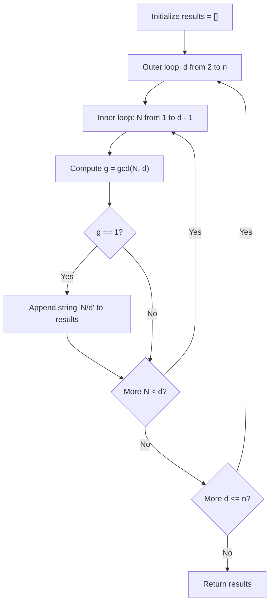

# Guided Example: Simplified Fractions

We trace the step-by-step generation and coprimality filtering of irreducible rational fractions using Euclidean greatest common divisor checks on a representative problem instance:

- **Input:** $n = 4$
- **Required Output:** `["1/2", "1/3", "1/4", "2/3", "3/4"]`

This instance contains both coprime pairs (such as $1/4$ and $3/4$) and reducible pairs (such as $2/4$, which simplifies to $1/2$), providing a clear demonstration of Euclidean division filtering.

---

## 1. Instance & Teaching Goal

We are given an integer $n$. We must find all simplified fractions $\frac{\text{numerator}}{\text{denominator}}$ strictly between $0$ and $1$ ($0 < \frac{\text{numerator}}{\text{denominator}} < 1$) where the denominator does not exceed $n$ ($2 \le \text{denominator} \le n$). A fraction is **simplified** (irreducible) if and only if its numerator and denominator share no common factors other than $1$.

In the provided instance with $n = 4$:
- Denominator $2$:
  - Numerator $1$: $\gcd(1, 2) = 1 \implies \text{"1/2"}$ (Valid).
- Denominator $3$:
  - Numerator $1$: $\gcd(1, 3) = 1 \implies \text{"1/3"}$ (Valid).
  - Numerator $2$: $\gcd(2, 3) = 1 \implies \text{"2/3"}$ (Valid).
- Denominator $4$:
  - Numerator $1$: $\gcd(1, 4) = 1 \implies \text{"1/4"}$ (Valid).
  - Numerator $2$: $\gcd(2, 4) = 2 \ne 1 \implies \text{"2/4"}$ simplifies to $1/2$ (Reducible, Discarded).
  - Numerator $3$: $\gcd(3, 4) = 1 \implies \text{"3/4"}$ (Valid).
- Emitted fractions: `["1/2", "1/3", "1/4", "2/3", "3/4"]`.

The primary teaching goal is to model irreducible fraction enumeration using Euclidean GCD testing: iterating all candidate pairs $(num, denom)$ with $1 \le num < denom \le n$ and retaining only pairs satisfying $\gcd(num, denom) = 1$.

---

## 2. Conceptual Foundation & Invariants

A rational fraction $\frac{a}{b}$ is in lowest terms if and only if $a$ and $b$ are coprime integers:

$$\gcd(a, b) = 1$$

To find $\gcd(a, b)$, we apply the Euclidean algorithm based on modular remainder reduction:
$$\gcd(a, b) = \begin{cases} a & \text{if } b = 0 \\ \gcd(b, a \bmod b) & \text{if } b > 0 \end{cases}$$

Candidate fractions are generated by:
1. Iterating the denominator $d$ from $2$ to $n$.
2. Iterating the numerator $N$ from $1$ to $d - 1$ (ensuring $0 < \frac{N}{d} < 1$).
3. If $\gcd(N, d) = 1$, format as string `N/d` and append to the result list.
4. If $\gcd(N, d) > 1$, skip the fraction because an equivalent fraction with a smaller denominator $\frac{N / g}{d / g}$ has already been enumerated.

```
Candidate Fraction Grid for n = 4:
Denominator d=2: [1/2 (coprime)]
Denominator d=3: [1/3 (coprime),  2/3 (coprime)]
Denominator d=4: [1/4 (coprime),  2/4 (gcd=2 -> Reducible!),  3/4 (coprime)]

Retained Unique Irreducible Set: {"1/2", "1/3", "2/3", "1/4", "3/4"}
```

We establish tracking parameters across the algorithm:

| Parameter | Type & Domain | Role in Algorithm |
|---|---|---|
| Denominator ($d$) | Integer $2 \le d \le n$ | Lower term of candidate fraction |
| Numerator ($N$) | Integer $1 \le N < d$ | Upper term of candidate fraction |
| Greatest Common Divisor ($g$) | Integer $1 \le g \le N$ | Evaluated via Euclidean algorithm $\gcd(N, d)$ |
| Output List | List of formatted strings | Collected simplified fraction literals `"N/d"` |

> **Invariant.** For every generated fraction string `"N/d"`, $1 \le N < d \le n$ and $\gcd(N, d) = 1$, ensuring every output fraction is strictly between $0$ and $1$, irreducible, and uniquely represented.



---

## 3. Step-by-Step Worked Execution

We walk through the representative instance $n = 4$.

### Denominator $d = 2$
- $N = 1$: $\gcd(1, 2) = 1$. Coprime!
  - Emit `"1/2"`.

### Denominator $d = 3$
- $N = 1$: $\gcd(1, 3) = 1$. Coprime!
  - Emit `"1/3"`.
- $N = 2$: $\gcd(2, 3) = \gcd(3 \bmod 2, 2) = \gcd(1, 2) = 1$. Coprime!
  - Emit `"2/3"`.

### Denominator $d = 4$
- $N = 1$: $\gcd(1, 4) = 1$. Coprime!
  - Emit `"1/4"`.
- $N = 2$:
  - Euclidean steps:
    - $\gcd(2, 4) = \gcd(4, 2) = \gcd(2, 4 \bmod 2) = \gcd(2, 0) = 2$.
  - Because $\gcd(2, 4) = 2 > 1$, this fraction is reducible ($\frac{2}{4} = \frac{1}{2}$).
  - Discard.
- $N = 3$:
  - Euclidean steps:
    - $\gcd(3, 4) = \gcd(4 \bmod 3, 3) = \gcd(1, 3) = 1$.
  - Coprime! Emit `"3/4"`.

| Denominator $d$ | Numerator $N$ | Fraction Value | Euclidean Calculation | $\gcd(N, d)$ | Status | Emitted Token |
|---|---|---|---|---|---|---|
| 2 | 1 | 0.500 | $\gcd(1, 2) = 1$ | 1 | Coprime | `"1/2"` |
| 3 | 1 | 0.333 | $\gcd(1, 3) = 1$ | 1 | Coprime | `"1/3"` |
| 3 | 2 | 0.667 | $\gcd(2, 3) = 1$ | 1 | Coprime | `"2/3"` |
| 4 | 1 | 0.250 | $\gcd(1, 4) = 1$ | 1 | Coprime | `"1/4"` |
| 4 | 2 | 0.500 | $\gcd(2, 4) = \gcd(2, 0) = 2$ | 2 | **Reducible** | *Skipped* |
| 4 | 3 | 0.750 | $\gcd(3, 4) = \gcd(1, 3) = 1$ | 1 | Coprime | `"3/4"` |

---

## 4. Complete Execution Trace

```
Final Emitted Simplified Fractions:
Count: 5 fractions
Elements: ["1/2", "1/3", "2/3", "1/4", "3/4"]
All values strictly lie in interval (0, 1)
```

| Denominator Group | Total Candidates ($d - 1$) | Coprime Count | Reducible Count | Emitted Sublist |
|---|---|---|---|---|
| $d = 2$ | 1 | 1 | 0 | `["1/2"]` |
| $d = 3$ | 2 | 2 | 0 | `["1/3", "2/3"]` |
| $d = 4$ | 3 | 2 | 1 ($2/4$) | `["1/4", "3/4"]` |

---

## 5. Algorithmic Correctness

**Soundness.** A fraction $\frac{N}{d}$ is simplified if and only if no integer $g > 1$ divides both $N$ and $d$. The condition $\gcd(N, d) = 1$ is both necessary and sufficient. Because $1 \le N < d$, the decimal value is strictly between $0$ and $1$, satisfying all problem constraints.

**Completeness.** Any simplified fraction with denominator $\le n$ has some denominator $d \in [2, n]$ and numerator $N \in [1, d-1]$ with $\gcd(N, d) = 1$. The nested loops enumerate all integer pairs $(N, d)$ in this domain without exception, ensuring no valid fraction is omitted.

---

## 6. Traps This Instance Exposes

- **Floating-Point Equality for Reducibility:** Using floating-point division `float(N) / float(d)` and checking a set of seen decimal values can lead to rounding errors on irrational fractions (e.g. $1/3$ vs. $2/6$), producing subtle misclassifications. Integer $\gcd(N, d) == 1$ is exact and immune to precision loss.
- **Including Boundary Fractions:** Allowing $N = 0$ (yielding $0/d = 0$) or $N = d$ (yielding $d/d = 1$). The problem requires fractions strictly between $0$ and $1$ exclusive ($0 < \text{val} < 1$).
- **Starting Denominator at $1$:** A denominator of $1$ would require $N < 1 \implies N = 0$, giving no valid fractions. The minimum possible denominator is $2$.

---

## 7. Complexity Derivation

- **Time Complexity:** $\mathcal{O}(n^2 \log n)$.
  - The total number of pairs $(N, d)$ evaluated is $\sum_{d=2}^n (d - 1) = \frac{(n - 1)n}{2} = \mathcal{O}(n^2)$.
  - For each pair, the Euclidean algorithm computes $\gcd(N, d)$ in $\mathcal{O}(\log(\min(N, d))) = \mathcal{O}(\log n)$ time.
  - With $n \le 100$, the total number of operations is $\approx 5000 \times \log_2(100) \approx 3.5 \times 10^4$, running in negligible time.
- **Auxiliary Space Complexity:** $\mathcal{O}(n^2)$ to store the output list of strings (bounded by Euler's totient sum $\sum_{d=2}^n \phi(d) \le \frac{n^2}{2}$).
