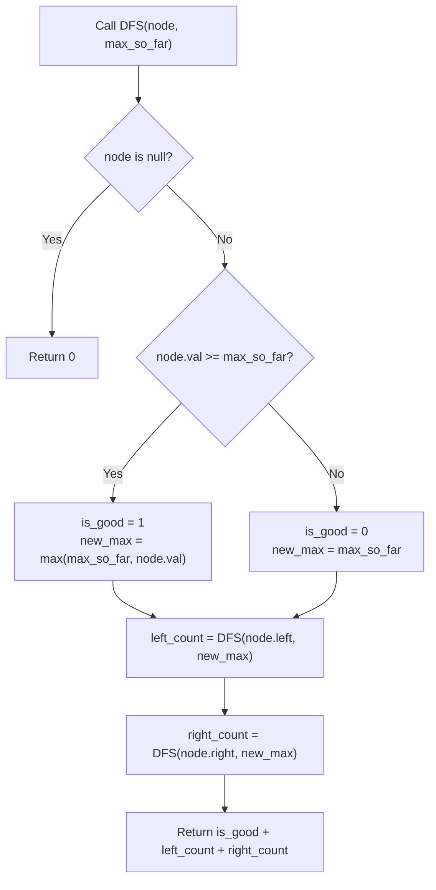

# Guided Example: Count Good Nodes in Binary Tree

We trace the step-by-step depth-first path traversal propagating running ancestor maximums on a representative binary tree instance:

- **Input:** $root = [3, 1, 4, 3, \text{null}, 1, 5]$
- **Required Output:** $4$

This instance contains nodes that restore path dominance after a dip (node $3$ below node $1$), nodes that surpass prior maximums (node $4$ and node $5$), and nodes strictly dominated by ancestor values (both nodes with value $1$).

---

## 1. Instance & Teaching Goal

We are given a binary tree rooted at $root$. A node $X$ is defined as **good** if the path from the root to $X$ contains no nodes with a value strictly greater than $X.val$. Equivalently:

$$X.val \ge \max_{u \in \text{Ancestors}(X) \cup \{X\}} u.val$$

The root node is always a good node by definition because it has no strict ancestors.

In the provided instance:
- Root node $3$: Ancestor path $[3]$. Max is $3$. $3 \ge 3 \implies$ **Good** ($+1$).
- Left child $1$: Ancestor path $[3, 1]$. Max was $3$. $1 < 3 \implies$ Not good.
- Left-Left grandchild $3$: Ancestor path $[3, 1, 3]$. Max along path is $3$. $3 \ge 3 \implies$ **Good** ($+1$).
- Right child $4$: Ancestor path $[3, 4]$. Max was $3$. $4 \ge 3 \implies$ **Good** ($+1$).
- Right-Left grandchild $1$: Ancestor path $[3, 4, 1]$. Max was $4$. $1 < 4 \implies$ Not good.
- Right-Right grandchild $5$: Ancestor path $[3, 4, 5]$. Max was $4$. $5 \ge 4 \implies$ **Good** ($+1$).
- Total good nodes: $1 + 1 + 1 + 1 = 4$.

The primary teaching goal is to model path-dependent tree properties using top-down recursion: propagating a single scalar parameter $max\_val$ representing the maximum value encountered along the ancestral path from the root to the current node.

---

## 2. Conceptual Foundation & Invariants

Let $u$ be the current node being visited, and let $M$ be the maximum value observed on the simple path from the root to $u$'s parent (with $M = -\infty$ or $root.val$ at the root).

Evaluation Rule:
- Node $u$ is good if and only if $u.val \ge M$.
- The updated path maximum passed down to $u$'s children is:
  $$M_{\text{next}} = \max(M, u.val)$$

Recursion Decomposition:
$$\text{count}(u, M) = \mathbb{I}(u.val \ge M) + \text{count}(u.left, M_{\text{next}}) + \text{count}(u.right, M_{\text{next}})$$

with base case $\text{count}(\text{null}, M) = 0$.

```
Tree Topology & Path Maximum Flow:
                 [3]  (M = 3) -> GOOD! (3 >= 3)
                /   \
       M=3     /     \     M=3
             [1]     [4]  (M = 3) -> GOOD! (4 >= 3)
             /       / \
    M=3     /  M=4  /   \  M=4
          [3]     [1]   [5]  (M = 4) -> GOOD! (5 >= 4)
        GOOD!     Bad   GOOD!
        (3 >= 3) (1 < 4) (5 >= 4)
```

We establish tracking parameters across the recursive traversal:

| Parameter | Type & Domain | Role in Algorithm |
|---|---|---|
| Node ($u$) | Tree node reference | Active vertex in depth-first search |
| Ancestor Maximum ($M$) | Integer $[-10^4, 10^4]$ | Maximum node value along path from root to $u$ |
| Good Node Indicator | Integer $\{0, 1\}$ | $1$ if $u.val \ge M$, else $0$ |
| Child Upper Bound ($M_{\text{next}}$) | Integer $[-10^4, 10^4]$ | $\max(M, u.val)$ propagated to subtrees |

> **Invariant.** When visiting any tree node $u$, $M$ strictly equals the maximum node value among all proper ancestors of $u$. Therefore, testing $u.val \ge M$ is a sound and complete check for whether $u$ is a good node.



---

## 3. Step-by-Step Worked Execution

We walk through the representative instance $root = [3, 1, 4, 3, \text{null}, 1, 5]$.

### Node-by-Node Traversal Walkthrough

1. **Root Node $3$ (`val = 3`, initial $M = 3$):**
   - Condition: $3 \ge 3$ holds.
   - Status: **Good Node** ($+1$).
   - Propagated maximum: $M_{\text{next}} = \max(3, 3) = 3$.

2. **Left Subtree of Root:**
   - **Visit Node $1$ (`val = 1`, inherited $M = 3$):**
     - Condition: $1 \ge 3$ is false.
     - Status: Not good ($+0$).
     - Propagated maximum: $M_{\text{next}} = \max(3, 1) = 3$.
   - **Visit Left Child of Node $1$: Grandchild $3$ (`val = 3`, inherited $M = 3$):**
     - Condition: $3 \ge 3$ holds.
     - Status: **Good Node** ($+1$).
     - Propagated maximum: $M_{\text{next}} = \max(3, 3) = 3$.
   - Node $1$ has no right child.
   - Left branch total: $0 + 1 = 1$ good node.

3. **Right Subtree of Root:**
   - **Visit Node $4$ (`val = 4`, inherited $M = 3$):**
     - Condition: $4 \ge 3$ holds.
     - Status: **Good Node** ($+1$).
     - Propagated maximum: $M_{\text{next}} = \max(3, 4) = 4$.
   - **Visit Left Child of Node $4$: Grandchild $1$ (`val = 1`, inherited $M = 4$):**
     - Condition: $1 \ge 4$ is false.
     - Status: Not good ($+0$).
   - **Visit Right Child of Node $4$: Grandchild $5$ (`val = 5`, inherited $M = 4$):**
     - Condition: $5 \ge 4$ holds.
     - Status: **Good Node** ($+1$).
     - Propagated maximum: $M_{\text{next}} = \max(4, 5) = 5$.
   - Right branch total: $1 + 0 + 1 = 2$ good nodes.

### Total Good Nodes
$$\text{Total} = \text{Root}(1) + \text{Left Subtree}(1) + \text{Right Subtree}(2) = 4$$

| Tree Path Traversed | Current Node | Inherited $M$ | Comparison ($val \ge M$) | Evaluation Result | Updated $M_{\text{next}}$ |
|---|---|---|---|---|---|
| $[3]$ | Node $3$ (Root) | $3$ | $3 \ge 3$ (True) | **Good Node (+1)** | 3 |
| $[3 \to 1]$ | Node $1$ | $3$ | $1 \ge 3$ (False) | Dominated (+0) | 3 |
| $[3 \to 1 \to 3]$ | Node $3$ | $3$ | $3 \ge 3$ (True) | **Good Node (+1)** | 3 |
| $[3 \to 4]$ | Node $4$ | $3$ | $4 \ge 3$ (True) | **Good Node (+1)** | 4 |
| $[3 \to 4 \to 1]$ | Node $1$ | $4$ | $1 \ge 4$ (False) | Dominated (+0) | 4 |
| $[3 \to 4 \to 5]$ | Node $5$ | $4$ | $5 \ge 4$ (True) | **Good Node (+1)** | 5 |

---

## 4. Complete Execution Trace

```
Execution Log:
Root 3:         Ancestors: []            Max: 3  ==> Good (1)
  Left 1:       Ancestors: [3]           Max: 3  ==> Not Good (0)
    Left 3:     Ancestors: [3, 1]        Max: 3  ==> Good (1)
  Right 4:      Ancestors: [3]           Max: 3  ==> Good (1)
    Left 1:     Ancestors: [3, 4]        Max: 4  ==> Not Good (0)
    Right 5:    Ancestors: [3, 4]        Max: 4  ==> Good (1)
Sum of Good Nodes: 1 + 0 + 1 + 1 + 0 + 1 = 4
```

| Node Identity | Node Value | Simple Path from Root | Path Maximum | Is Node Value $\ge$ Path Maximum? |
|---|---|---|---|---|
| Root | 3 | $[3]$ | 3 | Yes $\implies$ Good |
| Left Child | 1 | $[3, 1]$ | 3 | No $\implies$ Not Good |
| Left-Left Child | 3 | $[3, 1, 3]$ | 3 | Yes $\implies$ Good |
| Right Child | 4 | $[3, 4]$ | 4 | Yes $\implies$ Good |
| Right-Left Child | 1 | $[3, 4, 1]$ | 4 | No $\implies$ Not Good |
| Right-Right Child | 5 | $[3, 4, 5]$ | 5 | Yes $\implies$ Good |

---

## 5. Algorithmic Correctness

**Soundness.** A node is good if no ancestor exceeds it in value. By passing down the cumulative maximum $M$ of all ancestors along the tree branch, testing $u.val \ge M$ precisely verifies this condition. If $u.val \ge M$, no ancestor could have a value strictly greater than $u.val$.

**Completeness.** Binary tree traversal (DFS or BFS) visits every node exactly once. Because the path from the root to any node in a tree is unique, the inherited maximum along that path is uniquely determined and evaluated for each node, guaranteeing no good nodes are missed or double counted.

---

## 6. Traps This Instance Exposes

- **Parent-Only Comparison:** Checking only whether $u.val \ge parent.val$. In path $[3 \to 1 \to 3]$, the grandchild $3$ has parent $1$. Since $3 \ge 1$, parent-only comparison would think it is greater than its parent, but fails to account for root $3$. Here it happens that $3 \ge 3$, but if the root had been $10$ (path $[10 \to 1 \to 3]$), $3$ would be dominated by $10$ despite being larger than $1$. The comparison must evaluate the entire ancestor path maximum.
- **Strict vs. Non-Strict Inequality:** The problem states *"there are no nodes with a value greater than X"*. If an ancestor equals $X.val$, the condition is not violated ($X.val \ge ancestor.val$). Using strict inequality ($>$) would falsely disqualify duplicate equal maximums.
- **Initializing Path Maximum:** Initializing $M$ with $0$ fails when node values are negative (constraints permit node values down to $-10^4$). Initializing $M = root.val$ or $-\infty$ avoids underflow bugs.

---

## 7. Complexity Derivation

- **Time Complexity:** $\mathcal{O}(N)$, where $N$ is the number of nodes in the binary tree ($N \le 10^5$). The recursion visits each tree node exactly once. At each node, computing the maximum of two numbers and checking an inequality takes $\mathcal{O}(1)$ time.
- **Auxiliary Space Complexity:** $\mathcal{O}(H)$, where $H$ is the height of the tree ($H \le N$ in the worst-case skewed tree, and $H = \mathcal{O}(\log N)$ in a balanced tree), required for the depth-first search call stack.
