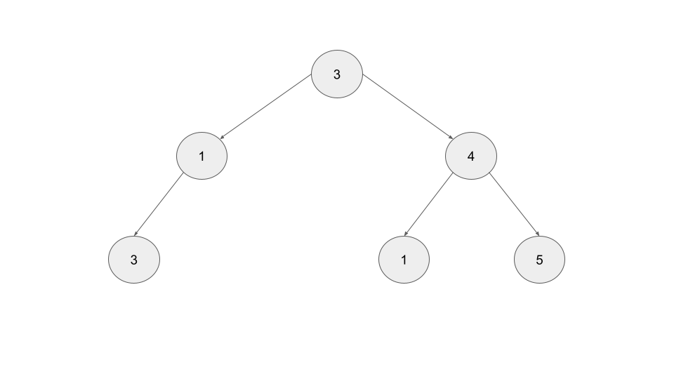
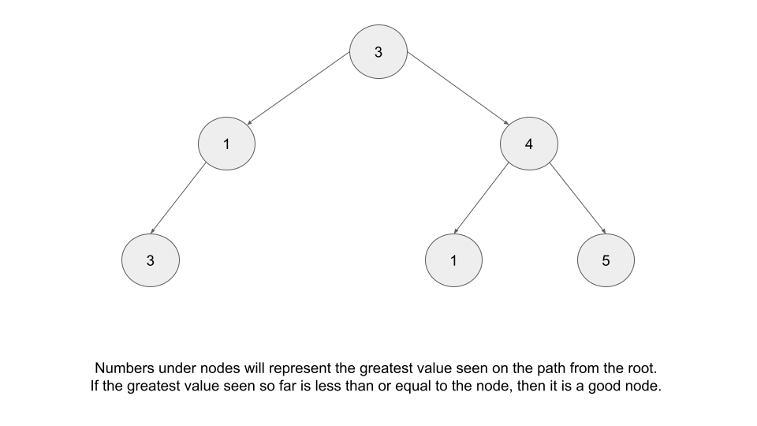
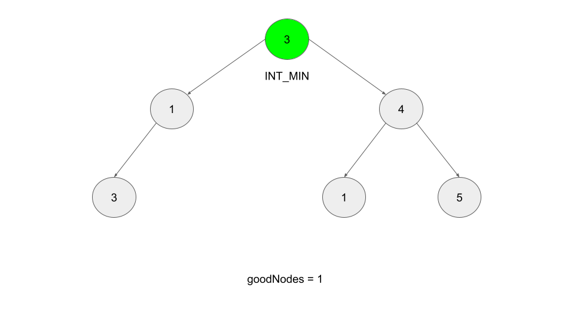
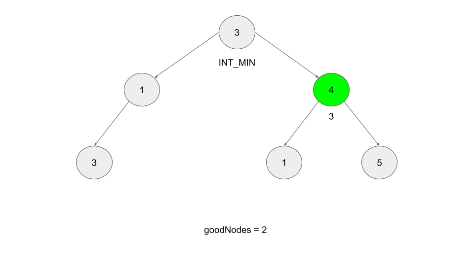
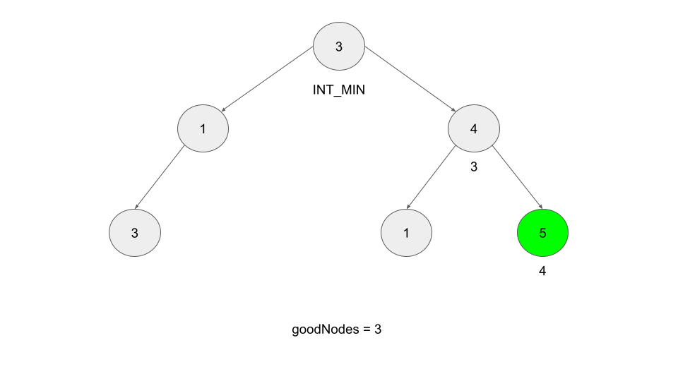
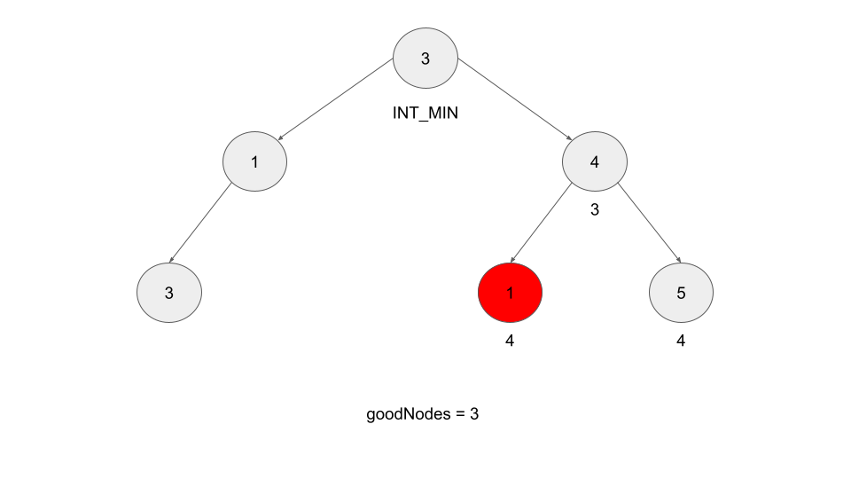
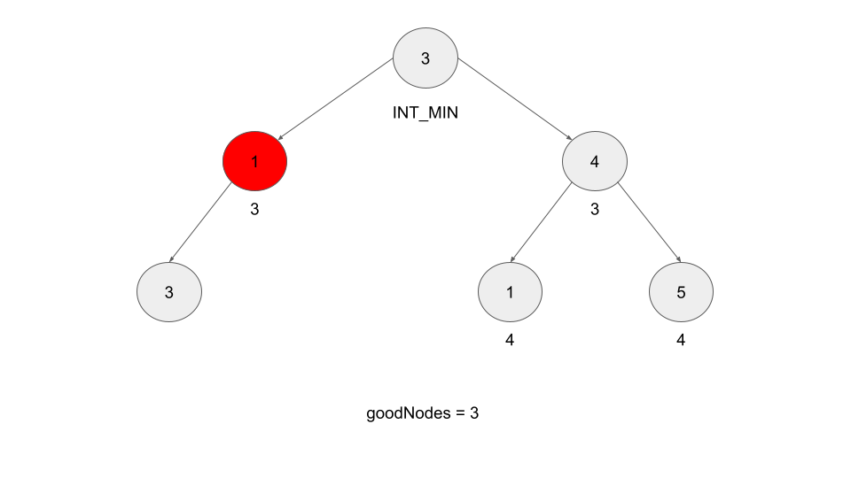
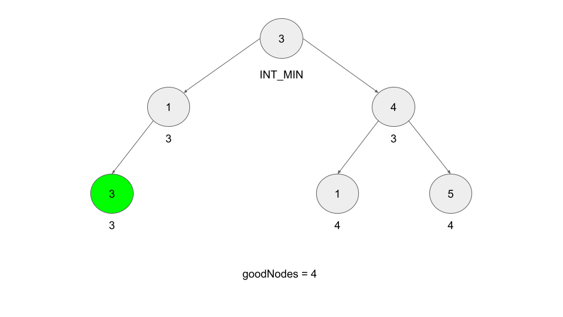

[TOC]

## Video Solution

---

<div>
    <div class="video-container">
        <iframe src="https://player.vimeo.com/video/644132580" width="640" height="360" frameborder="0" allow="autoplay; fullscreen" allowfullscreen></iframe>
    </div>
</div>

<div>
</div>

## Solution Article

---

### Approach 1: Depth First Search, Recursion

**Intuition**

Whenever you see a tree or graph problem, your first instinct should be Breadth First Search (BFS) or Depth First Search (DFS). For this approach, we'll start with DFS. If you aren't familiar with trees and traversal algorithms, check out this [explore card](https://leetcode.com/explore/learn/card/data-structure-tree/). With tree traversals, algorithms usually follow the same pattern:

1. Do something with the current node
2. Add the current node's children to the stack or queue being used for the traversal
3. Move on to the next node

A powerful idea for any tree or graph problem involving BFS/DFS that everybody should learn has to do with the second step - instead of just adding nodes to the stack or queue, we can store extra data to represent state. Depending on the language you're using, this might be something like a tuple or custom object which includes the current node and some information about the current state.

In this first approach, we'll be using recursion. For this problem, we're concerned about the **greatest value seen**, so instead of the recursive function only taking nodes as an input, such as `dfs(node)`, let's also have each call take an integer as well like `dfs(node, integer)`. This integer will represent the **greatest value on the path from the root to the associated node**. This means that at each node, we can simply check if it is "good" by comparing this integer to the node's value.

How do we calculate this number? For the root, the path from the root contains no other nodes, so we can initially set this value to a very small value (such as INT_MIN). For every call afterwards, we should compare this number with the current node's value. If the current node's value is greater, then set this value equal to the current node's value before visiting this node's children.

<br>

Using the above tree as an example, we will start our DFS by calling $dfs(root, \text{INT}_{MIN})$. At the root, because the root's value (3) is not less than INT_MIN, the root counts as a good node. Next, we call `dfs` for each of the root's children, passing $max(3, \text{INT}_{MIN})$ as the second argument. This is because, for both children, the path from the root to the child contains only the root, which means to be considered a good node, they only need to have a value greater than or equal to the root's value.

As we continue to traverse downwards through the tree, the number that we pass along with each node will increase every time it finds a new max value, which allows us to easily check when a node is "good".

The below animation plays through the entire example:















 <br>

**Algorithm**

1. Initialize a function `dfs`, as well as a variable `numGoodNodes` that keeps track of how many good nodes are in the tree. The function should take two arguments: a node `node`, and an integer representing the greatest value in the path leading from the root to the current node `maxSoFar`.

2. For each call to the function, first check if $maxSoFar \le \text{node.val}$. If so, increment `numGoodNodes`. Next, call `dfs(child, max(node.val, maxSoFar))` for all children of the current node.

3. Call $dfs(root, \text{INT}_{MIN})$ and return `numGoodNodes`.

**Implementation**

```python
class Solution:
    def goodNodes(self, root: TreeNode) -> int:

        def dfs(node, max_so_far):
            nonlocal num_good_nodes
            if max_so_far <= node.val:
                num_good_nodes += 1
            if node.right:
                dfs(node.right, max(node.val, max_so_far))
            if node.left:
                dfs(node.left, max(node.val, max_so_far))

        num_good_nodes = 0
        dfs(root, float("-inf"))
        return num_good_nodes
```

**Complexity Analysis**

Given $N$ as the number of nodes in the tree,

* Time complexity: $O(N)$

    With DFS we visit every node exactly once and do a constant amount of work each time.

* Space complexity: $O(N)$

    Because DFS prioritizes depth, our call stack can be as large as the height $H$ of the tree. In the worst case scenario, $H = N$, if the tree only has one path.

<br/>

---

### Approach 2: Depth First Search, Iterative

**Intuition**

DFS can also be implemented iteratively. You may be thinking at this point: what kind of DFS should we use, preorder, postorder, or inorder? The answer is that, for this problem, it doesn't matter. For each node, there is only one path from the root to that node, so regardless of the order of our traversal, the integer we use to track the greatest value will always be the largest value between the current node and the root.

The algorithm works the same as in the previous approach, but we will be using our own stack instead of recursion. We can implement the tracking integer by pairing the nodes with the integer when we push elements onto the stack. Depending on the language you're using, this might be done with a tuple or a custom object.

**Algorithm**

1. Initialize a stack to use for DFS, as well as a variable `numGoodNodes` that keeps track of how many good nodes are in the tree. The stack should initially contain the root and a very small value (like INT_MIN).

2. Execute DFS: while the stack is not empty, pop from the stack.

3. At each node, first check if `node.val` is greater than or equal to the number associated with it `maxSoFar`. If it is, then increment `numGoodNodes`. Next, push the children onto the stack, along with the greater value between `maxSoFar` and `node.val`.

4. Return `numGoodNodes`.

**Implementation**

```python
class Solution:
    def goodNodes(self, root: TreeNode) -> int:
        stack = [(root, float("-inf"))]
        num_good_nodes = 0
        while stack:
            node, max_so_far = stack.pop()
            if max_so_far <= node.val:
                num_good_nodes += 1
            if node.left:
                stack.append((node.left, max(node.val, max_so_far)))
            if node.right:
                stack.append((node.right, max(node.val, max_so_far)))

        return num_good_nodes
```

**Complexity Analysis**

Given $N$ as the number of nodes in the tree,

* Time complexity: $O(N)$

    With DFS we visit every node exactly once and do a constant amount of work each time.

* Space complexity: $O(N)$

    In the worst case scenario, where every right child has 2 children and every left child has no children (or vice-versa), our stack will contain $N / 2$ nodes at max depth.

<br/>

---

### Approach 3: Breadth First Search

**Intuition**

As stated in the previous approach, the order in which we perform DFS does not matter, because the extra state we pass along on each iteration will be correct regardless of traversal order. For this same reason, BFS and DFS are both valid approaches.

**Algorithm**

The algorithm is identical to the iterative DFS approach, except we are using a queue instead of a stack.

1. Initialize a queue to use for BFS, as well as a variable `numGoodNodes` that keeps track of how many good nodes are in the tree. The BFS should initially contain the root and the a very small value (like INT_MIN).

2. Execute BFS: while the queue is not empty, pop from the front of the queue.

3. At each node, first check if `node.val` is greater than or equal to the value of its largest ancestor `maxSoFar`. If it is, then increment `numGoodNodes`. Next, push the children onto the queue, along with the greater value between `maxSoFar` and `node.val`.

4. Return `numGoodNodes`.

**Implementation**

```python
class Solution:
    def goodNodes(self, root: TreeNode) -> int:
        num_good_nodes = 0

        # Use collections.deque for efficient popping
        queue = deque([(root, float("-inf"))])
        while queue:
            node, max_so_far = queue.popleft()
            if max_so_far <= node.val:
                num_good_nodes += 1
            if node.right:
                queue.append((node.right, max(node.val, max_so_far)))
            if node.left:
                queue.append((node.left, max(node.val, max_so_far)))

        return num_good_nodes
```

**Complexity Analysis**

Given $N$ as the number of nodes in the tree,

* Time complexity: $O(N)$

    With BFS we visit every node exactly once and do a constant amount of work each time.

* Space complexity: $O(N)$

    The worst case scenario for space with BFS is when the tree is full. In this scenario, the final level contains $N / 2$ nodes, and our queue will hold all the nodes in the final level at some point.

<br/>

---