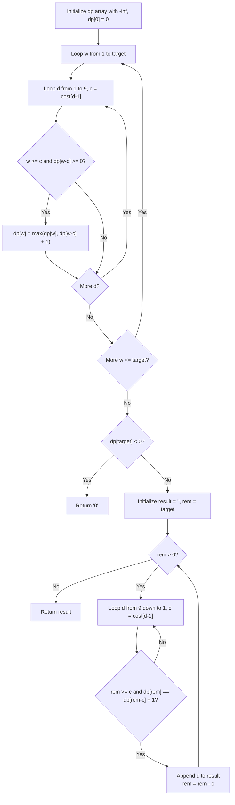

# Guided Example: Form Largest Integer With Digits That Add Up to Target

We trace the step-by-step unbounded knapsack dynamic programming and greedy backward reconstruction on a representative problem instance:

- **Input:** $cost = [4, 3, 2, 5, 6, 7, 2, 5, 5]$, $target = 9$
- **Required Output:** `"7772"`

This instance illustrates how numerical magnitude is governed first by digit length (a 4-digit number like "7772" strictly exceeds any 3-digit number like "977") and second by descending greedy digit choices among equal-length paths.

---

## 1. Instance & Teaching Goal

We are given an integer array $cost$ of length $9$, where $cost[i]$ represents the painting cost of digit $(i + 1)$, and an integer $target$. We must construct the largest possible positive integer using non-zero digits ($1 \dots 9$) whose individual costs sum to exactly $target$. If no valid combination exists, return `"0"`.

In the provided instance:
- Costs: $1 \mapsto 4, 2 \mapsto 3, 3 \mapsto 2, 4 \mapsto 5, 5 \mapsto 6, 6 \mapsto 7, 7 \mapsto 2, 8 \mapsto 5, 9 \mapsto 5$.
- Using 3 digits: e.g. digit $9$ (cost $5$) and two digit $7$s (cost $2 \times 2 = 4$) yields total cost $5 + 4 = 9$, forming `"977"`.
- Using 4 digits: three digit $7$s (cost $3 \times 2 = 6$) and one digit $2$ (cost $3$) yields total cost $6 + 3 = 9$, forming `"7772"`.
- Because $7772 > 977$, the 4-digit number is strictly greater.
- The maximal integer string is `"7772"`.

The primary teaching goal is to decouple the problem into two efficient phases:
1. **Length Maximization:** An unbounded knapsack DP to find the maximum number of digits $dp[w]$ achievable for each exact cost $w \le target$.
2. **Greedy Reconstruction:** Backward path recovery scanning digits from $9$ down to $1$ to place the largest available digit at each position without losing optimal length.

---

## 2. Conceptual Foundation & Invariants

Let $dp[w]$ be the maximum digit length of an integer whose painting costs sum to exactly $w$.

**Base Case:**
$$dp[0] = 0, \quad dp[w] = -\infty \quad \text{for } 1 \le w \le target$$

**DP Recurrence:**
For each cost $w$ from $1$ to $target$:
$$dp[w] = \max_{1 \le d \le 9, \, w \ge cost[d-1]} (dp[w - cost[d-1]] + 1)$$

**Greedy Reconstruction Invariant:**
Once $dp[target]$ is computed:
- If $dp[target] < 0$, no exact configuration exists; return `"0"`.
- Otherwise, while $target > 0$, examine digit $d$ in descending order from $9$ down to $1$:
  - Let $c = cost[d-1]$.
  - If $target \ge c$ and $dp[target] == dp[target - c] + 1$:
    - Append digit $d$ to the result string.
    - Decrement $target \leftarrow target - c$.
    - Break inner loop and repeat for the new remaining target.

Because larger digits are examined first, the most significant position receives the maximum possible digit that still allows completing an optimal-length sequence.

```
Unbounded Knapsack & Greedy Reconstruction Flow:
Forward DP (Length Optimization):
dp[0]=0, dp[2]=1 (dig 7), dp[3]=1 (dig 2), dp[4]=2 (7,7), dp[5]=2 (7,2), dp[7]=3 (7,7,2), dp[9]=4 (7,7,7,2)

Backward Greedy Reconstruction (target = 9, length = 4):
Step 1: target=9, try d=9,8..7: cost=2, dp[9-2]=dp[7]=3 == 4-1  --> Pick '7', rem=7
Step 2: target=7, try d=9,8..7: cost=2, dp[7-2]=dp[5]=2 == 3-1  --> Pick '7', rem=5
Step 3: target=5, try d=9,8..7: cost=2, dp[5-2]=dp[3]=1 == 2-1  --> Pick '7', rem=3
Step 4: target=3, try d=9..3..2: cost=3, dp[3-3]=dp[0]=0 == 1-1 --> Pick '2', rem=0
Result String: "7772"
```

We establish tracking parameters across the algorithm:

| Parameter | Type & Domain | Role in Algorithm |
|---|---|---|
| Target Cost ($w$) | Integer $0 \le w \le target$ | Budget consumed in DP table |
| Digit ($d$) | Integer $1 \le d \le 9$ | Candidate digit symbol to append |
| Digit Cost ($c$) | Integer $1 \le c \le 5000$ | $cost[d-1]$ required to paint digit $d$ |
| Max Length ($dp[w]$) | Integer $\ge 0$ (or $-\infty$) | Maximum digit count for exact total cost $w$ |

> **Invariant.** During backward reconstruction, choosing the largest digit $d \in [9, 1]$ satisfying $dp[w] == dp[w - cost[d-1]] + 1$ guarantees that the resulting prefix digit is maximal among all solutions achieving the global optimal length.



---

## 3. Step-by-Step Worked Execution

We walk through the representative instance $cost = [4, 3, 2, 5, 6, 7, 2, 5, 5]$ with $target = 9$.

### Forward DP Table Computation

- $dp[0] = 0$.
- $w = 2$: Digit $3$ ($c=2$) and Digit $7$ ($c=2$) $\implies dp[2] = dp[0] + 1 = 1$.
- $w = 3$: Digit $2$ ($c=3$) $\implies dp[3] = dp[0] + 1 = 1$.
- $w = 4$: With $c=2$, $dp[4] = dp[2] + 1 = 2$.
- $w = 5$: With $c=2$, $dp[5] = dp[3] + 1 = 2$.
- $w = 7$: With $c=2$, $dp[7] = dp[5] + 1 = 3$.
- $w = 9$: With $c=2$, $dp[9] = dp[7] + 1 = 4$.

Total optimal digit length: $dp[9] = 4$.

### Backward Greedy Reconstruction from $rem = 9$

1. **Step 1 ($rem = 9$, target length $4$):**
   - Check $d = 9$ ($c = 5$): $rem - c = 4$. $dp[4] = 2 \ne 4 - 1 = 3$. Skip.
   - Check $d = 8$ ($c = 5$): $dp[4] = 2 \ne 3$. Skip.
   - Check $d = 7$ ($c = 2$): $rem - c = 7$. $dp[7] = 3 == 4 - 1$. Match!
   - Append `'7'`. $rem \leftarrow 9 - 2 = 7$.

2. **Step 2 ($rem = 7$, target length $3$):**
   - Check $d = 9, 8$ ($c = 5$): $rem - c = 2$. $dp[2] = 1 \ne 2$. Skip.
   - Check $d = 7$ ($c = 2$): $rem - c = 5$. $dp[5] = 2 == 3 - 1$. Match!
   - Append `'7'`. $rem \leftarrow 7 - 2 = 5$.

3. **Step 3 ($rem = 5$, target length $2$):**
   - Check $d = 9, 8$ ($c = 5$): $rem - c = 0$. $dp[0] = 0 \ne 1$. Skip.
   - Check $d = 7$ ($c = 2$): $rem - c = 3$. $dp[3] = 1 == 2 - 1$. Match!
   - Append `'7'`. $rem \leftarrow 5 - 2 = 3$.

4. **Step 4 ($rem = 3$, target length $1$):**
   - Check $d = 7, 6, 5, 4, 3$: none satisfy $dp[rem - c] = 0$.
   - Check $d = 2$ ($c = 3$): $rem - c = 0$. $dp[0] = 0 == 1 - 1$. Match!
   - Append `'2'`. $rem \leftarrow 3 - 3 = 0$.

Constructed string: `"7772"`.

| Reconstruction Step | Remaining Cost | Required Length | Tested Digit $d$ | Cost $c$ | Subproblem Length $dp[rem - c]$ | Decision |
|---|---|---|---|---|---|---|
| Step 1 | 9 | 4 | 9 | 5 | $dp[4] = 2$ | Length mismatch ($2 \ne 3$) |
| Step 1 | 9 | 4 | 7 | 2 | $dp[7] = 3$ | **Select '7'** ($rem \to 7$) |
| Step 2 | 7 | 3 | 7 | 2 | $dp[5] = 2$ | **Select '7'** ($rem \to 5$) |
| Step 3 | 5 | 2 | 7 | 2 | $dp[3] = 1$ | **Select '7'** ($rem \to 3$) |
| Step 4 | 3 | 1 | 7 | 2 | $dp[1] = -\infty$ | Invalid remainder |
| Step 4 | 3 | 1 | 2 | 3 | $dp[0] = 0$ | **Select '2'** ($rem \to 0$) |

---

## 4. Complete Execution Trace

```
Optimal Reconstruction Summary:
Target: 9
Maximum Digits: 4
Selected Digits: '7' (cost 2) + '7' (cost 2) + '7' (cost 2) + '2' (cost 3) = cost 9
Emitted Integer String: "7772"
```

| Budget State $w$ | $dp[w]$ Value | Optimal Predecessor State | Valid Transition Digit |
|---|---|---|---|
| 0 | 0 | Base Anchor | None |
| 2 | 1 | $dp[0]$ | Digit 7 ($c=2$) |
| 3 | 1 | $dp[0]$ | Digit 2 ($c=3$) |
| 4 | 2 | $dp[2]$ | Digit 7 ($c=2$) |
| 5 | 2 | $dp[3]$ | Digit 7 ($c=2$) |
| 7 | 3 | $dp[5]$ | Digit 7 ($c=2$) |
| 9 | 4 | $dp[7]$ | Digit 7 ($c=2$) |

---

## 5. Algorithmic Correctness

**Soundness.** Every step in backward reconstruction transitions to a state $rem - c$ whose DP value confirms that an optimal suffix of length $dp[rem] - 1$ exists. Because the base case $dp[0] = 0$ corresponds to cost balance, the concatenated digits are guaranteed to sum to exactly $target$.

**Completeness.** Any decimal number with more digits is strictly greater than a number with fewer digits. By first maximizing $dp[target]$, all shorter numbers are eliminated from consideration. Among numbers of maximum length, prioritizing larger digits $d \in [9 \dots 1]$ at earlier positions guarantees lexicographical optimality, ensuring the globally largest integer is found.

---

## 6. Traps This Instance Exposes

- **Storing Big Integer Strings in DP:** Storing string values directly in the $dp$ array causes repeated string concatenation and copy operations, leading to $\mathcal{O}(target^2 \cdot 9)$ time and high memory consumption. DP over integer lengths followed by backward reconstruction takes strictly $\mathcal{O}(target)$ time.
- **Picking Highest Value Without Length Maximization:** Greedily selecting digit $9$ because $9 > 7$ produces `"977"` with $3$ digits, which is far smaller than $7772$ ($977 \ll 7772$). Length always trumps digit value.
- **Identical Costs for Different Digits:** Both digit $3$ and digit $7$ cost $2$. When choosing which digit to append, testing $d$ descending from $9$ down to $1$ correctly picks `'7'` instead of `'3'`, preventing sub-optimal digit choices.

---

## 7. Complexity Derivation

- **Time Complexity:** $\mathcal{O}(target \cdot D)$, where $D = 9$ is the number of available digits ($target \le 5000$).
  - Filling the 1D DP table takes $target \times 9 = 45000$ operations.
  - Backward reconstruction takes at most $target \times 9$ steps.
  - Total runtime is strictly bounded by $9 \times 10^4$ operations, executing in under $10$ milliseconds.
- **Auxiliary Space Complexity:** $\mathcal{O}(target)$ to store the 1D DP length array and output string buffer.