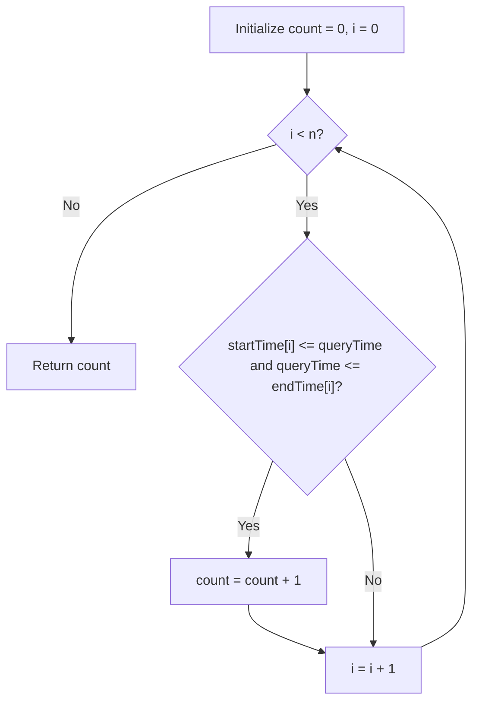

# Guided Example: Number of Students Doing Homework at a Given Time

We trace the step-by-step point-in-interval evaluation over student homework durations on a representative problem instance:

- **Input:** $startTime = [1, 2, 3]$, $endTime = [3, 2, 7]$, $queryTime = 4$
- **Required Output:** $1$

This instance includes students whose study interval ends strictly before $queryTime$ (Student 0), students with instantaneous single-point study sessions before $queryTime$ (Student 1), and a student whose active study interval covers $queryTime$ (Student 2).

---

## 1. Instance & Teaching Goal

We are given two integer arrays $startTime$ and $endTime$ of length $n$, representing the start and finish times of $n$ students doing homework, and a target timestamp $queryTime$. We must determine how many students were actively studying at time $queryTime$. A student $i$ is actively studying if and only if:

$$startTime[i] \le queryTime \le endTime[i]$$

In the provided instance with $queryTime = 4$:
- Student $0$: Active on $[1, 3]$. Since $4 > 3$, Student $0$ had already finished.
- Student $1$: Active on $[2, 2]$. Since $4 > 2$, Student $1$ had already finished.
- Student $2$: Active on $[3, 7]$. Because $3 \le 4 \le 7$, Student $2$ was actively studying at time $4$.
- Active student count: $1$.

The primary teaching goal is to model 1D geometric range queries where a discrete query point is tested against closed intervals $[L_i, R_i]$ in a single linear pass with inclusive boundary handling.

---

## 2. Conceptual Foundation & Invariants

Each student $i$ defines a closed continuous time interval on the integer timeline:

$$I_i = [startTime[i], \, endTime[i]]$$

Point containment of $queryTime$ within interval $I_i$ is evaluated by the conjunction of two inequalities:
$$\mathbb{I}(queryTime \in I_i) = \begin{cases} 1 & \text{if } startTime[i] \le queryTime \land queryTime \le endTime[i] \\ 0 & \text{otherwise} \end{cases}$$

The total number of active students is the summation across all students:

$$\text{active\_students} = \sum_{i=0}^{n-1} \mathbb{I}(queryTime \in I_i)$$

```
Timeline Point Containment Architecture (queryTime = 4):
Time:       1    2    3    4    5    6    7
Student 0: [=========]                          (Interval [1, 3] -> Finished before 4)
Student 1:      [*]                             (Interval [2, 2] -> Finished before 4)
Student 2:           [=============*===========] (Interval [3, 7] -> Contains 4!)
                           |
                           v
                       queryTime = 4
                       Active Count = 1
```

We establish tracking parameters across the algorithm:

| Parameter | Type & Domain | Role in Algorithm |
|---|---|---|
| Student Index ($i$) | Integer $0 \le i < n$ | Current student under inspection |
| Start Timestamp ($startTime[i]$) | Integer $1 \le \text{start} \le 1000$ | Left interval endpoint |
| Finish Timestamp ($endTime[i]$) | Integer $\text{start} \le \text{end} \le 1000$ | Right interval endpoint |
| Target Time ($queryTime$) | Integer $1 \le queryTime \le 1000$ | Point probe to test for containment |
| Active Count | Integer $0 \le \text{count} \le n$ | Running total of covering intervals |

> **Invariant.** After checking student $i$, the accumulator holds the exact count of students among $0 \dots i$ whose study interval contains $queryTime$.



---

## 3. Step-by-Step Worked Execution

We walk through the representative instance $startTime = [1, 2, 3]$, $endTime = [3, 2, 7]$, $queryTime = 4$.

### Initialization
- Active student counter: $count = 0$.

### Inspection of Student Intervals

1. **Student $0$ ($startTime[0] = 1, endTime[0] = 3$):**
   - Interval: $[1, 3]$.
   - Test start bound: $1 \le 4$ (True).
   - Test end bound: $4 \le 3$ (False).
   - Conjunction fails: Student $0$ is inactive at time $4$.
   - $count$ remains $0$.

2. **Student $1$ ($startTime[1] = 2, endTime[1] = 2$):**
   - Interval: $[2, 2]$.
   - Test start bound: $2 \le 4$ (True).
   - Test end bound: $4 \le 2$ (False).
   - Conjunction fails: Student $1$ is inactive at time $4$.
   - $count$ remains $0$.

3. **Student $2$ ($startTime[2] = 3, endTime[2] = 7$):**
   - Interval: $[3, 7]$.
   - Test start bound: $3 \le 4$ (True).
   - Test end bound: $4 \le 7$ (True).
   - Both bounds hold! Student $2$ was actively doing homework at time $4$.
   - Increment: $count \leftarrow 0 + 1 = 1$.

Total active students: $1$.

| Student $i$ | Interval $[startTime[i], endTime[i]]$ | $startTime[i] \le 4$ | $4 \le endTime[i]$ | Interval Contains $4$? | Running Active Count |
|---|---|---|---|---|---|
| 0 | $[1, 3]$ | True ($1 \le 4$) | False ($4 > 3$) | No | 0 |
| 1 | $[2, 2]$ | True ($2 \le 4$) | False ($4 > 2$) | No | 0 |
| 2 | $[3, 7]$ | True ($3 \le 4$) | True ($4 \le 7$) | **Yes** | **1** |

---

## 4. Complete Execution Trace

```
Final Evaluation Summary:
Query Timestamp: 4
Total Students: 3
Covering Intervals: {[3, 7]} (Student 2)
Non-covering Intervals: {[1, 3], [2, 2]} (Students 0, 1)
Final Active Student Count: 1
```

| Traversal Step | Student Evaluated | Start Time | End Time | Temporal Relation to $queryTime = 4$ | Incremental Action |
|---|---|---|---|---|---|
| 1 | Student 0 | 1 | 3 | Finished before query ($3 < 4$) | Maintain count at 0 |
| 2 | Student 1 | 2 | 2 | Finished before query ($2 < 4$) | Maintain count at 0 |
| 3 | Student 2 | 3 | 7 | Active during query ($3 \le 4 \le 7$) | Increment count to 1 |

---

## 5. Algorithmic Correctness

**Soundness.** For any student $i$, the definition of actively doing homework is that their work started on or before $queryTime$ and ended on or after $queryTime$. Because intervals are inclusive, checking $startTime[i] \le queryTime \le endTime[i]$ is necessary and sufficient to determine whether student $i$ is active.

**Completeness.** Traversal visits each student $0 \le i < n$ exactly once. Since each student's interval is evaluated independently without short-circuiting or skipping, every covering student is accounted for in the final sum.

---

## 6. Traps This Instance Exposes

- **Strict vs. Inclusive Inequality:** Using strict inequality ($startTime[i] < queryTime < endTime[i]$). If a student starts or finishes homework exactly at $queryTime$ (e.g. $startTime[i] = 4$ or $endTime[i] = 4$), they are still actively studying. The check must be inclusive ($\le$).
- **Mismatched Array Indices:** Concurrently reading $startTime[i]$ and $endTime[j]$ with disparate index cursors. Both arrays must be indexed with the exact same pointer $i$.
- **Sorting Overhead:** Sorting the intervals or building segment trees is unnecessary when answering a single point query. A single $\mathcal{O}(n)$ linear scan evaluates the intervals directly with minimal constant factor.

---

## 7. Complexity Derivation

- **Time Complexity:** $\mathcal{O}(n)$, where $n$ is the number of students ($n \le 100$). The algorithm iterates through the two parallel arrays once, performing two integer comparisons per student.
- **Auxiliary Space Complexity:** $\mathcal{O}(1)$. Memory is restricted to a single integer accumulator and loop index, allocating no auxiliary data structures.
