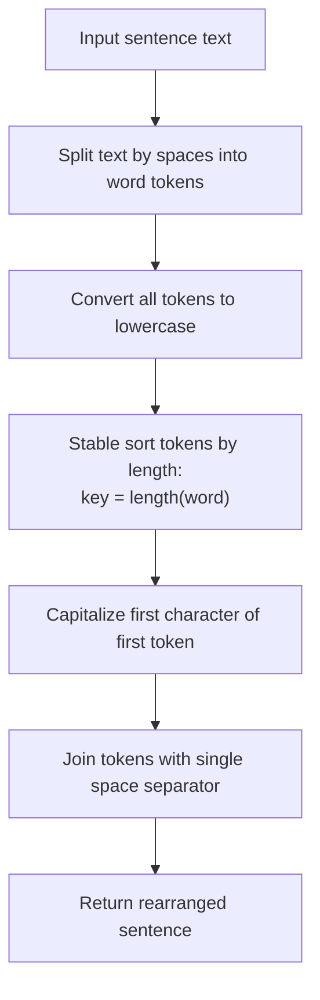

# Guided Example: Rearrange Words in a Sentence

We trace the step-by-step tokenization, case normalization, stable length sorting, and sentence-case reconstruction on a representative problem instance:

- **Input:** $text = \text{"Keep calm and code on"}$
- **Required Output:** `"On and keep calm code"`

This instance demonstrates stable sorting across multiple words of identical length (`"keep"`, `"calm"`, `"code"` all have length $4$), requiring preservation of their relative original order while promoting shorter words (`"on"` of length $2$, `"and"` of length $3$).

---

## 1. Instance & Teaching Goal

We are given a sentence $text$ where the first character is capitalized and words are delimited by single spaces. We must rearrange the words in strictly non-decreasing order of their lengths. If two words share the same length, their relative order from the original sentence must be preserved (**stable sort**). The output must follow standard sentence capitalization: the first letter of the newly rearranged sentence must be uppercase, while all other letters must be lowercase.

In the provided instance:
- Tokenization yields $5$ words: `["Keep", "calm", "and", "code", "on"]`.
- Converting all words to lowercase: `["keep", "calm", "and", "code", "on"]`.
- Word lengths:
  - `"keep"`: length $4$, original index $0$.
  - `"calm"`: length $4$, original index $1$.
  - `"and"`: length $3$, original index $2$.
  - `"code"`: length $4$, original index $3$.
  - `"on"`: length $2$, original index $4$.
- Sorted order by length:
  - Length $2$: `"on"`.
  - Length $3$: `"and"`.
  - Length $4$: `"keep"`, `"calm"`, `"code"` (tie broken by original indices $0 < 1 < 3$).
- Capitalizing the new first word `"on"` $\implies$ `"On"`.
- Emitted sentence: `"On and keep calm code"`.

The primary teaching goal is to model stable sorting via composite key ordering $(length, original\_index)$ and ensure case normalization preserves lowercase letters across intermediate words.

---

## 2. Conceptual Foundation & Invariants

Let $W = [w_0, w_1, \dots, w_{m-1}]$ be the list of words obtained by splitting $text$ on spaces.

1. **Case Normalization:** Because the first word $w_0$ starts with a capital letter, leaving it capitalized would improperly retain uppercase letters if $w_0$ moves to an interior position. Thus, all words are normalized to lowercase:
   $$w_i' = \text{lowercase}(w_i) \quad \text{for } 0 \le i < m$$

2. **Stable Sorting Criterion:** Each word $w_i'$ is mapped to a comparison tuple:
   $$\text{key}(w_i') = (|w_i'|, \, i)$$
   Sorting by this key guarantees:
   - Shorter words strictly precede longer words ($|w_a'| < |w_b'|$).
   - Equal-length words maintain their initial order ($|w_a'| = |w_b'| \implies a < b$).

3. **Re-capitalization:** After sorting $W'$ into $S = [s_0, s_1, \dots, s_{m-1}]$:
   - Capitalize the initial character of $s_0$: $s_0 \leftarrow \text{capitalize}(s_0)$.
   - Concatenate all words with single space separators.

```
Transformation Pipeline:
Original:       "Keep"     "calm"     "and"     "code"     "on"
Original Index:    0          1         2         3         4
Length:            4          4         3         4         2
Lowercase:       "keep"     "calm"    "and"     "code"     "on"
                   |          |         |         |         |
                   +----------+---------+---------+---------+
                                        |
                                Stable Sort by (Length, Index)
                                        v
Sorted Tokens:   "on"       "and"     "keep"    "calm"     "code"
Lengths:          (2)        (3)       (4)       (4)        (4)
Indices:          [4]        [2]       [0]       [1]        [3]  (Preserved!)
                   |
Capitalize First: "On"
Joined Output:   "On and keep calm code"
```

We establish tracking parameters across the algorithm:

| Parameter | Type & Domain | Role in Algorithm |
|---|---|---|
| Original Index ($i$) | Integer $0 \le i < m$ | Tie-breaking secondary key guaranteeing stability |
| Word Token ($w_i$) | String | Textual word extracted from sentence |
| Normalized Token ($w_i'$) | String (lowercase) | Case-standardized word representation |
| Word Length ($\lvert w_i' \rvert$) | Integer $\ge 1$ | Primary sorting criterion |
| Rearranged Sentence | String | Final joined text with sentence capitalization |

> **Invariant.** For any two words $w_a'$ and $w_b'$ with equal length ($|w_a'| = |w_b'|$), $w_a'$ appears before $w_b'$ in the final sequence if and only if $a < b$.



---

## 3. Step-by-Step Worked Execution

We walk through the representative instance $text = \text{"Keep calm and code on"}$.

### Step 1: Tokenization and Normalization
- Splitting by space: `["Keep", "calm", "and", "code", "on"]`.
- Converting all words to lowercase:
  - $w_0' = \text{"keep"}$, index $0$.
  - $w_1' = \text{"calm"}$, index $1$.
  - $w_2' = \text{"and"}$, index $2$.
  - $w_3' = \text{"code"}$, index $3$.
  - $w_4' = \text{"on"}$, index $4$.

### Step 2: Key Assignment and Sorting
Each word receives a primary key (length) and secondary key (original index):
- `"on"`: $(2, 4)$
- `"and"`: $(3, 2)$
- `"keep"`: $(4, 0)$
- `"calm"`: $(4, 1)$
- `"code"`: $(4, 3)$

Sorted token order:
1. `(2, 4)` $\to$ `"on"`
2. `(3, 2)` $\to$ `"and"`
3. `(4, 0)` $\to$ `"keep"`
4. `(4, 1)` $\to$ `"calm"`
5. `(4, 3)` $\to$ `"code"`

Notice that among the three 4-letter words, `"keep"` (index 0) strictly precedes `"calm"` (index 1), which strictly precedes `"code"` (index 3).

### Step 3: Capitalization and Reassembly
- The first word is `"on"`. Capitalizing the initial letter gives `"On"`.
- Remaining words remain lowercase: `"and"`, `"keep"`, `"calm"`, `"code"`.
- Joining with spaces: `"On and keep calm code"`.

| Rank | Sorted Token | Word Length | Original Position | Tie-break Invariant | Status |
|---|---|---|---|---|---|
| 1 | `"on"` $\to$ `"On"` | 2 | 4 | Unique minimum length | Initial capitalized word |
| 2 | `"and"` | 3 | 2 | Unique middle length | Lowercase |
| 3 | `"keep"` | 4 | 0 | Earliest of length 4 | Lowercase |
| 4 | `"calm"` | 4 | 1 | Second of length 4 | Lowercase |
| 5 | `"code"` | 4 | 3 | Third of length 4 | Lowercase |

---

## 4. Complete Execution Trace

```
State Evolution Trace:
Raw Input:       "Keep calm and code on"
Tokens (Lower):  ["keep", "calm", "and", "code", "on"]
Length Map:      [  4,      4,      3,      4,     2  ]
Sorted Array:    ["on", "and", "keep", "calm", "code"]
Capitalized:     "On" + " and keep calm code"
Final Result:    "On and keep calm code"
```

| Processing Phase | Token Sequence Snapshot | Lengths Vector | Action Description |
|---|---|---|---|
| Split & Lowercase | `["keep", "calm", "and", "code", "on"]` | $[4, 4, 3, 4, 2]$ | Strip initial capital, isolate words |
| Stable Sort | `["on", "and", "keep", "calm", "code"]` | $[2, 3, 4, 4, 4]$ | Ascending length with stable index order |
| Sentence Case | `["On", "and", "keep", "calm", "code"]` | $[2, 3, 4, 4, 4]$ | Uppercase first character of index 0 |
| Final Join | `"On and keep calm code"` | - | Emit space-delimited string |

---

## 5. Algorithmic Correctness

**Soundness.** Every word in the original sentence is preserved exactly once. Since the sort key uses length as the primary metric, the lengths of words in the resulting sentence form a non-decreasing sequence: $|s_0| \le |s_1| \le \dots \le |s_{m-1}|$.

**Completeness.** By using a stable sorting algorithm (or explicitly including original indices as the secondary comparison key), words with equal lengths never invert their initial relative order. Formatting ensures only the very first letter of the reconstructed sentence is capitalized, satisfying all formatting constraints.

---

## 6. Traps This Instance Exposes

- **Unstable Sorting:** Using an unstable sort (like standard quicksort without index tie-breaking) may scramble `"keep"`, `"calm"`, and `"code"` arbitrarily, producing outputs like `"On and code calm keep"` that fail the stability requirement.
- **Retaining Mid-Sentence Capitals:** Forgetting to lowercase the original first word `"Keep"` before sorting. If `"Keep"` moves to position 3, outputting `"On and Keep calm code"` violates the sentence casing rule where only the first character is capitalized.
- **Trailing Spaces:** Appending trailing spaces when joining words. Using standard space-join idioms avoids superfluous whitespace.

---

## 7. Complexity Derivation

- **Time Complexity:** $\mathcal{O}(N \log M)$, where $N$ is the total character length of $text$ ($N \le 10^5$) and $M$ is the number of words ($M \le N$). Splitting and lowercasing takes $\mathcal{O}(N)$ time. Stable sorting $M$ words by integer lengths takes $\mathcal{O}(M \log M)$ comparisons. Reassembling the string takes $\mathcal{O}(N)$ time. The overall runtime is bounded by $\mathcal{O}(N + M \log M) = \mathcal{O}(N \log N)$.
- **Auxiliary Space Complexity:** $\mathcal{O}(N)$ to store the array of word tokens and the reconstructed output string.
