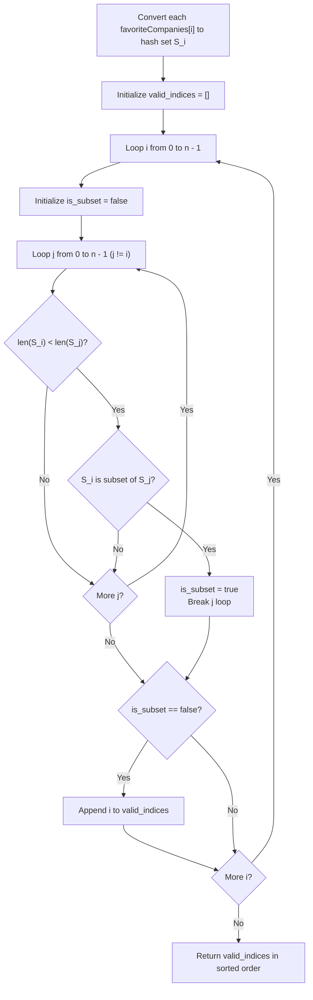

# Guided Example: People Whose List of Favorite Companies Is Not a Subset of Another List

We trace the step-by-step set conversion and pairwise subset verification on a representative problem instance:

- **Input:** $favoriteCompanies = [[\text{"leetcode"},\text{"google"},\text{"facebook"}], [\text{"google"},\text{"microsoft"}], [\text{"google"},\text{"facebook"}], [\text{"google"}], [\text{"amazon"}]]$
- **Required Output:** $[0, 1, 4]$

This instance illustrates proper subset subsumption ($2 \subset 0$ and $3 \subset 0$), partial overlap without containment ($1$ and $0$ both share `"google"`, but `"microsoft"` is disjoint), and completely disjoint singletons ($4$).

---

## 1. Instance & Teaching Goal

We are given an array $favoriteCompanies$ where $favoriteCompanies[i]$ is the list of favorite company names for person $i$ ($0 \le i < n$). We must return all indices $i$ such that person $i$'s set of favorite companies is **not** a subset of any other person's list:

$$\forall j \ne i, \quad favoriteCompanies[i] \not\subseteq favoriteCompanies[j]$$

The output indices must be returned in increasing numerical order.

In the provided instance:
- Person $0$: $\{\text{"leetcode"}, \text{"google"}, \text{"facebook"}\}$ (cardinality $3$).
- Person $1$: $\{\text{"google"}, \text{"microsoft"}\}$ (cardinality $2$).
- Person $2$: $\{\text{"google"}, \text{"facebook"}\}$ (cardinality $2$).
- Person $3$: $\{\text{"google"}\}$ (cardinality $1$).
- Person $4$: $\{\text{"amazon"}\}$ (cardinality $1$).

Evaluations:
- Person $2$'s set is strictly contained in Person $0$'s set ($\{ \text{"google"}, \text{"facebook"} \} \subset \{ \text{"leetcode"}, \text{"google"}, \text{"facebook"} \}$). Disqualified.
- Person $3$'s set is strictly contained in Person $0$'s set (and also in Person $1$'s set). Disqualified.
- Person $0$ is maximal (cardinality $3$; no set is larger).
- Person $1$ contains `"microsoft"`, which is not in Person $0$. Valid.
- Person $4$ contains `"amazon"`, which is in no other set. Valid.
- Retained indices: $[0, 1, 4]$.

The primary teaching goal is to model subset testing using hash sets and size-based pruning: a set $S_i$ can only be a subset of $S_j$ if $|S_i| < |S_j|$. If $|S_i| \ge |S_j|$, the subset check can be skipped immediately.

---

## 2. Conceptual Foundation & Invariants

Let $S_i = \text{Set}(favoriteCompanies[i])$ denote the hash set representation of person $i$'s favorites.

For person $i$ to be disqualified:
$$\exists j \ne i \quad \text{such that} \quad |S_i| < |S_j| \quad \land \quad S_i \subseteq S_j$$

If any element $x \in S_i$ satisfies $x \notin S_j$, then $S_i \not\subseteq S_j$. If this condition holds for all $j \ne i$, index $i$ belongs to the solution set.

```
Set Containment Hierarchy:
Person 0: {leetcode, google, facebook} (Size 3)
           ^                     ^
           | (subset)            | (subset)
Person 2: {google, facebook}  Person 3: {google}  --> Both Disqualified!

Person 1: {google, microsoft} (Size 2) --> microsoft not in Person 0 --> KEPT!
Person 4: {amazon} (Size 1)           --> amazon not in any other set --> KEPT!
```

We establish tracking parameters across the algorithm:

| Parameter | Type & Domain | Role in Algorithm |
|---|---|---|
| Candidate Person ($i$) | Integer $0 \le i < n$ | Person being evaluated for non-subsumption |
| Comparison Person ($j$) | Integer $0 \le j < n, j \ne i$ | Potential superset candidate |
| Candidate Set ($S_i$) | Hash set of strings | Favorite companies of person $i$ |
| Target Set ($S_j$) | Hash set of strings | Favorite companies of person $j$ |
| Disqualification Flag | Boolean | Marked true if $S_i \subseteq S_j$ for any $j$ |

> **Invariant.** An index $i$ is retained in the result if and only if there is no other person $j$ whose set contains every company present in $S_i$.



---

## 3. Step-by-Step Worked Execution

We walk through the representative instance $favoriteCompanies$ with $n = 5$.

### Step 1: Precompute Sets and Cardinalities
- $S_0 = \{\text{"leetcode"}, \text{"google"}, \text{"facebook"}\}$, $|S_0| = 3$.
- $S_1 = \{\text{"google"}, \text{"microsoft"}\}$, $|S_1| = 2$.
- $S_2 = \{\text{"google"}, \text{"facebook"}\}$, $|S_2| = 2$.
- $S_3 = \{\text{"google"}\}$, $|S_3| = 1$.
- $S_4 = \{\text{"amazon"}\}$, $|S_4| = 1$.

### Step 2: Evaluate Each Person $i$

1. **Evaluate Person $i = 0$ ($|S_0| = 3$):**
   - Candidate supersets must have size $> 3$. No such sets exist.
   - Person $0$ cannot be a subset of anyone.
   - **Retain $0$**.

2. **Evaluate Person $i = 1$ ($|S_1| = 2$):**
   - Larger candidate: Person $0$ ($|S_0| = 3$).
   - Probe elements of $S_1$ in $S_0$:
     - `"google"` $\in S_0$ (True).
     - `"microsoft"` $\in S_0$ (False).
   - $S_1 \not\subseteq S_0$. No other candidate with size $> 2$ exists.
   - **Retain $1$**.

3. **Evaluate Person $i = 2$ ($|S_2| = 2$):**
   - Larger candidate: Person $0$ ($|S_0| = 3$).
   - Probe elements of $S_2$ in $S_0$:
     - `"google"` $\in S_0$ (True).
     - `"facebook"` $\in S_0$ (True).
   - $S_2 \subseteq S_0$ confirmed!
   - Person $2$ is disqualified.

4. **Evaluate Person $i = 3$ ($|S_3| = 1$):**
   - Larger candidate: Person $0$ ($|S_0| = 3$).
   - Probe `"google"` in $S_0$: True.
   - $S_3 \subseteq S_0$ confirmed!
   - Person $3$ is disqualified.

5. **Evaluate Person $i = 4$ ($|S_4| = 1$):**
   - Larger candidates: Person $0$ ($|S_0| = 3$), Person $1$ ($|S_1| = 2$), Person $2$ ($|S_2| = 2$).
   - Probe `"amazon"`:
     - In $S_0$: False.
     - In $S_1$: False.
     - In $S_2$: False.
   - $S_4$ is not a subset of any set.
   - **Retain $4$**.

Final retained indices: $[0, 1, 4]$.

| Index $i$ | Set $S_i$ | Size $\lvert S_i \rvert$ | Potential Supersets ($\lvert S_j \rvert > \lvert S_i \rvert$) | Containment Outcome | Status |
|---|---|---|---|---|---|
| 0 | `{"leetcode", "google", "facebook"}` | 3 | None | Cannot be subset | **Retained** |
| 1 | `{"google", "microsoft"}` | 2 | $j=0$ | `"microsoft"` missing from $S_0$ | **Retained** |
| 2 | `{"google", "facebook"}` | 2 | $j=0$ | All elements in $S_0$ ($S_2 \subset S_0$) | Disqualified |
| 3 | `{"google"}` | 1 | $j=0, 1, 2$ | All elements in $S_0$ ($S_3 \subset S_0$) | Disqualified |
| 4 | `{"amazon"}` | 1 | $j=0, 1, 2$ | `"amazon"` not in any superset | **Retained** |

---

## 4. Complete Execution Trace

```
Final Evaluation Matrix:
Candidate 0: Subsumed? NO  ==> Output [0]
Candidate 1: Subsumed? NO  ==> Output [0, 1]
Candidate 2: Subsumed? YES (by 0)
Candidate 3: Subsumed? YES (by 0, 1)
Candidate 4: Subsumed? NO  ==> Output [0, 1, 4]
Result: [0, 1, 4]
```

| Candidate $i$ | Test Target $j$ | Missing Element Discovered | Containment Status |
|---|---|---|---|
| 0 | - | - | Maximal |
| 1 | 0 | `"microsoft"` | $S_1 \not\subseteq S_0$ |
| 2 | 0 | None (all present) | $S_2 \subseteq S_0 \implies$ Subsumed |
| 3 | 0 | None (all present) | $S_3 \subseteq S_0 \implies$ Subsumed |
| 4 | 0 | `"amazon"` | $S_4 \not\subseteq S_0$ |
| 4 | 1 | `"amazon"` | $S_4 \not\subseteq S_1$ |
| 4 | 2 | `"amazon"` | $S_4 \not\subseteq S_2$ |

---

## 5. Algorithmic Correctness

**Soundness.** For an index $i$ to be excluded, there must exist at least one $j \ne i$ such that every company in $S_i$ is present in $S_j$. By directly testing set inclusion $S_i \subseteq S_j$, only provably subsumed lists are eliminated.

**Completeness.** Every candidate $i$ is compared against all potential supersets $j$. Because a subset must have size strictly less than or equal to its superset, and all company lists are distinct, any superset must satisfy $|S_j| > |S_i|$. Pruning comparisons where $|S_j| \le |S_i|$ preserves mathematical equivalence while reducing unnecessary work.

---

## 6. Traps This Instance Exposes

- **Comparing Equal-Sized Sets:** All input lists are distinct. Therefore, two lists with equal size $|S_i| = |S_j|$ cannot be subsets of each other. Attempting subset checks when $|S_j| \le |S_i|$ wastes cycles.
- **Linear List Search vs. Hash Set:** Testing element inclusion via linear search over array $favoriteCompanies[j]$ takes $\mathcal{O}(|S_i| \cdot |S_j|)$ time per pair. Hash set lookups reduce each element test to $\mathcal{O}(1)$ average time.
- **Sorting Output Indices:** Testing candidates out of index order would require a final sort. Iterating $i$ sequentially from $0$ to $n-1$ naturally produces sorted indices.

---

## 7. Complexity Derivation

- **Time Complexity:** $\mathcal{O}(n \cdot \sum |S_i| + n^2 \cdot \min(|S_i|, |S_j|))$.
  - Converting all $n$ lists to hash sets takes $\mathcal{O}(\sum |S_i| \cdot L)$ time, where $L \le 20$ is maximum string length.
  - Pairwise subset checks occur between $n$ candidates. For each candidate $i$, checking subset against $j$ checks at most $|S_i| \le 500$ elements with $\mathcal{O}(1)$ set lookups.
  - With $n \le 100$, total pair checks are $\le 100 \times 100 / 2 = 5000$, running effortlessly within milliseconds.
- **Auxiliary Space Complexity:** $\mathcal{O}(\sum |S_i| \cdot L)$ to store the hash sets for all $n$ people.
