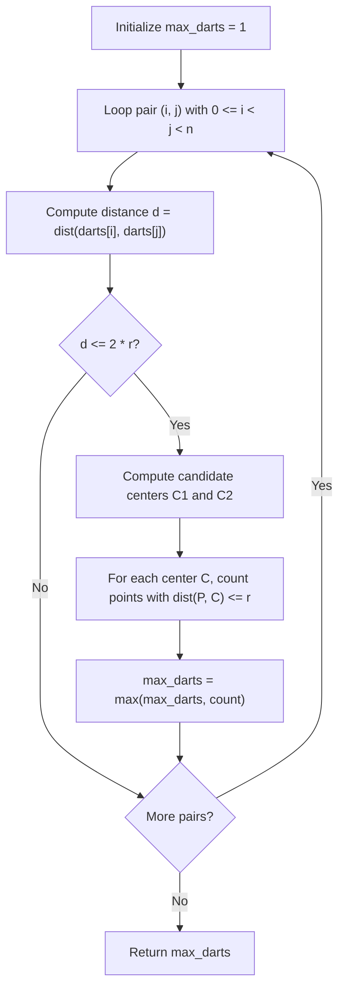

# Guided Example: Maximum Number of Darts Inside of a Circular Dartboard

We trace the step-by-step two-point boundary circle anchoring and geometric containment testing on a representative planar instance:

- **Input:** $darts = [[-2, 0], [2, 0], [0, 2], [0, -2]]$, $r = 2$
- **Required Output:** $4$

This instance features four points symmetrically distributed along the circumference of a circle of radius $2$, demonstrating how pairs of points determine candidate disk centers that enclose maximal subsets.

---

## 1. Instance & Teaching Goal

We are given $n$ distinct points $darts[i] = [x_i, y_i]$ on a 2D plane and a radius $r$. We must position a closed circular disk of radius $r$ anywhere on the plane to maximize the number of points contained within or on its boundary.

In the provided instance:
- Four points: $A = (-2, 0)$, $B = (2, 0)$, $C = (0, 2)$, $D = (0, -2)$.
- Radius $r = 2$.
- The distance from origin $(0, 0)$ to each point is:
  $$\|A - (0,0)\| = \sqrt{(-2)^2 + 0^2} = 2 \le r$$
  $$\|B - (0,0)\| = \sqrt{2^2 + 0^2} = 2 \le r$$
  $$\|C - (0,0)\| = \sqrt{0^2 + 2^2} = 2 \le r$$
  $$\|D - (0,0)\| = \sqrt{0^2 + (-2)^2} = 2 \le r$$
- All $4$ points lie on or inside the circle centered at $(0, 0)$.
- Maximum contained darts: $4$.

The primary teaching goal is to apply the geometric boundary theorem: if an optimal disk contains two or more points, it can be continuously shifted and rotated until at least two points lie exactly on its perimeter without decreasing the number of enclosed points. Thus, testing circles defined by pairs of points $(P_i, P_j)$ guarantees finding the global maximum.

---

## 2. Conceptual Foundation & Invariants

Let $P_1 = (x_1, y_1)$ and $P_2 = (x_2, y_2)$ be two distinct points with Euclidean distance:

$$d = \sqrt{(x_2 - x_1)^2 + (y_2 - y_1)^2}$$

If $d > 2r$, no circle of radius $r$ can touch both points simultaneously. If $d \le 2r$, there exist up to two circles of radius $r$ passing through both $P_1$ and $P_2$:

1. **Midpoint of Chord:**
   $$M = \left( \frac{x_1 + x_2}{2}, \, \frac{y_1 + y_2}{2} \right)$$
2. **Sagitta (Distance from $M$ to Center):**
   $$h = \sqrt{r^2 - \left(\frac{d}{2}\right)^2}$$
3. **Unit Perpendicular Vector:**
   $$\vec{u} = \left( -\frac{y_2 - y_1}{d}, \, \frac{x_2 - x_1}{d} \right)$$
4. **Candidate Centers:**
   $$C_1 = M + h\vec{u}, \quad C_2 = M - h\vec{u}$$

For each candidate center $C$, we count points $P_k \in darts$ satisfying:
$$\|P_k - C\|^2 \le r^2 + 10^{-7}$$

```
Geometric Center Construction:
        P1 (-2, 0) o
                    \
                     \ d/2 = 2
                      \
       C (0, 0) o------M (0, 0)   (h = sqrt(r^2 - (d/2)^2) = 0)
                      /
                     / d/2 = 2
                    /
        P2 (2, 0)  o

Distance between P1 and P2 is d = 4 = 2r.
Midpoint M is (0, 0), sagitta h = 0.
Candidate Center is exactly (0, 0).
Disk with center (0, 0) encloses {-2,0}, {2,0}, {0,2}, {0,-2}.
```

We establish tracking parameters across the algorithm:

| Parameter | Type & Domain | Role in Algorithm |
|---|---|---|
| Point Pair $(P_i, P_j)$ | Point indices $0 \le i < j < n$ | Pair determining chord of candidate circle |
| Chord Distance ($d$) | Real number $> 0$ | Euclidean distance between $P_i$ and $P_j$ |
| Candidate Center ($C$) | 2D coordinate $(x_c, y_c)$ | Potential center of radius-$r$ disk |
| Contained Count | Integer $1 \le \text{count} \le n$ | Number of points within distance $r$ from $C$ |
| Global Maximum | Integer $1 \le \text{max} \le n$ | Best containment count found across all pairs |

> **Invariant.** For any configuration containing at least two points, there exists a disk of radius $r$ passing through at least two input points whose containment count equals the global optimal count.



---

## 3. Step-by-Step Worked Execution

We walk through the representative instance $darts = [[-2, 0], [2, 0], [0, 2], [0, -2]]$ with $r = 2$.

### Evaluation of Pair $P_0 = (-2, 0)$ and $P_1 = (2, 0)$

1. **Distance Computation:**
   $$d = \sqrt{(2 - (-2))^2 + (0 - 0)^2} = \sqrt{16} = 4$$
   Check diameter feasibility: $d = 4 \le 2r = 4$. Valid chord.

2. **Center Derivation:**
   - Midpoint: $M = \left(\frac{-2 + 2}{2}, \frac{0 + 0}{2}\right) = (0, 0)$.
   - Offset: $h = \sqrt{2^2 - (4/2)^2} = \sqrt{4 - 4} = 0$.
   - Since $h = 0$, both candidate centers coincide: $C_1 = C_2 = (0, 0)$.

3. **Containment Count from Center $(0, 0)$:**
   - Distance to $P_0 (-2, 0)$: $\sqrt{(-2)^2 + 0^2} = 2 \le 2$. (Contained)
   - Distance to $P_1 (2, 0)$: $\sqrt{2^2 + 0^2} = 2 \le 2$. (Contained)
   - Distance to $P_2 (0, 2)$: $\sqrt{0^2 + 2^2} = 2 \le 2$. (Contained)
   - Distance to $P_3 (0, -2)$: $\sqrt{0^2 + (-2)^2} = 2 \le 2$. (Contained)
   - Total contained darts: $4$.
   - Update $max\_darts = \max(1, 4) = 4$.

### Verification of Other Pairs
- Pair $(P_0, P_2)$: $(-2, 0)$ and $(0, 2)$.
  - $d = \sqrt{2^2 + 2^2} = \sqrt{8} \approx 2.828 \le 4$.
  - Midpoint: $(-1, 1)$, $h = \sqrt{4 - 2} = \sqrt{2} \approx 1.414$.
  - Candidate center $C_1 = (0, 0)$ encloses all $4$ points.
- No configuration can exceed $n = 4$ points.

| Evaluated Pair | Chord Length $d$ | Feasible ($d \le 4$)? | Sagitta $h$ | Center Candidate | Contained Points Set | Contained Count |
|---|---|---|---|---|---|---|
| $(P_0, P_1)$ | 4.000 | Yes | 0.000 | $(0.0, 0.0)$ | $\{P_0, P_1, P_2, P_3\}$ | **4** |
| $(P_0, P_2)$ | 2.828 | Yes | 1.414 | $(0.0, 0.0)$ | $\{P_0, P_1, P_2, P_3\}$ | **4** |
| $(P_0, P_3)$ | 2.828 | Yes | 1.414 | $(0.0, 0.0)$ | $\{P_0, P_1, P_2, P_3\}$ | **4** |
| $(P_1, P_2)$ | 2.828 | Yes | 1.414 | $(0.0, 0.0)$ | $\{P_0, P_1, P_2, P_3\}$ | **4** |
| $(P_1, P_3)$ | 2.828 | Yes | 1.414 | $(0.0, 0.0)$ | $\{P_0, P_1, P_2, P_3\}$ | **4** |
| $(P_2, P_3)$ | 4.000 | Yes | 0.000 | $(0.0, 0.0)$ | $\{P_0, P_1, P_2, P_3\}$ | **4** |

---

## 4. Complete Execution Trace

```
Final Maximum Verification:
Total Points: 4
Radius: 2
Optimal Circle Center: (0.0, 0.0)
Point Distances from (0, 0):
  P0 (-2, 0): dist = 2.0 <= 2 (Boundary)
  P1 ( 2, 0): dist = 2.0 <= 2 (Boundary)
  P2 ( 0, 2): dist = 2.0 <= 2 (Boundary)
  P3 ( 0,-2): dist = 2.0 <= 2 (Boundary)
Total Enclosed Darts: 4
```

| Dart Identifier | Coordinates | Vector from Center $(0, 0)$ | Euclidean Distance | Within Radius $r = 2$? |
|---|---|---|---|---|
| $P_0$ | $(-2, 0)$ | $(-2, 0)$ | $2.000$ | Yes (Boundary) |
| $P_1$ | $(2, 0)$ | $(2, 0)$ | $2.000$ | Yes (Boundary) |
| $P_2$ | $(0, 2)$ | $(0, 2)$ | $2.000$ | Yes (Boundary) |
| $P_3$ | $(0, -2)$ | $(0, -2)$ | $2.000$ | Yes (Boundary) |

---

## 5. Algorithmic Correctness

**Soundness.** For any candidate center $C$ constructed from a valid chord, every point whose Euclidean distance to $C$ is $\le r$ geometrically lies within the closed disk. Counting these points precisely reflects the number of darts captured.

**Completeness.** Suppose the optimal placement contains $k$ points. If $k = 1$, returning $1$ is trivial. If $k \ge 2$, by continuously shifting the disk until it touches one point, and then pivoting until it touches a second point, we obtain a disk of radius $r$ passing through at least two points that encloses all original $k$ points. Testing all pairs $(P_i, P_j)$ and their associated candidate circles exhaustively visits this canonical orientation.

---

## 6. Traps This Instance Exposes

- **Floating-Point Precision Loss:** Due to precision limits in square roots, comparing $\|P - C\|^2 \le r^2$ strictly can drop boundary points due to tiny inaccuracies (e.g. $4.000000000000001 \le 4$). Incorporating a small tolerance $\epsilon \approx 10^{-7}$ ensures boundary points are accurately counted.
- **Missing Single-Point Fallback:** If all pairs of points have separation $d > 2r$, no two points can fit in the disk simultaneously. The algorithm must default to $max\_darts = 1$.
- **Ignoring Both Circle Orientations:** For any chord with $d < 2r$, there are two distinct centers on opposite sides of the chord ($C_1 = M + h\vec{u}$ and $C_2 = M - h\vec{u}$). Testing only one center misses valid configurations.

---

## 7. Complexity Derivation

- **Time Complexity:** $\mathcal{O}(n^3)$, where $n$ is the number of dart points ($n \le 100$).
  - There are $\frac{n(n - 1)}{2} = \mathcal{O}(n^2)$ point pairs $(P_i, P_j)$.
  - Each pair generates at most $2$ candidate centers.
  - Testing each candidate center against all $n$ points takes $\mathcal{O}(n)$ distance evaluations.
  - Total operations: $2 \times \binom{100}{2} \times 100 \approx 10^6$, executing smoothly well under $0.1$ seconds.
- **Auxiliary Space Complexity:** $\mathcal{O}(1)$ beyond storing the input coordinates, as only scalar coordinate vectors and counters are maintained.
