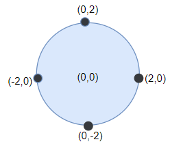
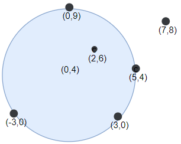

### 1. Description

Alice is throwing `n` darts on a very large wall. You are given an array `darts` where $\text{darts}[i] = [x_{i}, y_{i}]$ is the position of the $i^{\text{th}}$ dart that Alice threw on the wall.

Bob knows the positions of the `n` darts on the wall. He wants to place a dartboard of radius `r` on the wall so that the maximum number of darts that Alice throws lie on the dartboard.

Given the integer `r`, return *the maximum number of darts that can lie on the dartboard*.

### 2. Function Contract

**Inputs**

- `darts`: Input parameter (`List[List[int]]`).
- `r`: Input parameter (`int`).

**Return value**

- Returns `int`.

### 3. Examples

#### Example 1

- **Input:** $darts = [[-2,0],[2,0],[0,2],[0,-2]], r = 2$
- **Output:** `4`
- **Explanation:** Circle dartboard with center in (0,0) and radius = 2 contain all points.

#### Example 2

- **Input:** $darts = [[-3,0],[3,0],[2,6],[5,4],[0,9],[7,8]], r = 5$
- **Output:** `5`
- **Explanation:** Circle dartboard with center in (0,4) and radius = 5 contain all points except the point (7,8).

### 4. Constraints

- $1 \le \text{darts.length} \le 100$

- $\text{darts}[i].length = 2$

- $-10^{4} \le x_{i}, y_{i} \le 10^{4}$

- All the `darts` are unique

- $1 \le r \le 5000$
