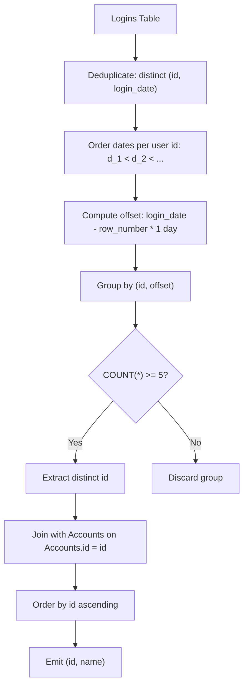

# Guided Example: Active Users

We trace the step-by-step identification of users with five or more consecutive login days using relational deduplication, temporal sequence offsets, and dimension joins on a representative database instance:

- **Input:**
  - Table `Accounts`: Users Winston ($id = 1$) and Jonathan ($id = 7$).
  - Table `Logins`: Login dates across May and June 2020.
- **Required Output:** Relation with columns $(id, name)$ containing Jonathan ($id = 7$).

---

## 1. Instance & Teaching Goal

We are given an `Accounts(id, name)` table and a `Logins(id, login_date)` table. A user may log in multiple times on the same date. An **active user** is defined as an account that logged in on at least five consecutive calendar days. We must return the $(id, name)$ of all active users, ordered by $id$ ascending.

In the provided instance:
- User $1$ (Winston): Logged in on `2020-05-30` and `2020-06-07`. Only $2$ distinct dates; maximum streak is $1$. Not an active user.
- User $7$ (Jonathan): Distinct login dates are `2020-05-30`, `2020-05-31`, `2020-06-01`, `2020-06-02`, `2020-06-03`, `2020-06-10`.
  - The sub-sequence `2020-05-30`, `2020-05-31`, `2020-06-01`, `2020-06-02`, `2020-06-03` forms $5$ uninterrupted consecutive calendar days.
  - Active user criterion is satisfied.
- Result: $(7, \text{"Jonathan"})$.

The primary teaching goal is to model consecutive sequence detection in relational algebra by first projecting distinct $(id, login\_date)$ pairs, then applying the date-difference sequence invariant ($login\_date - \text{rank} \times 1\text{ day} = \text{constant}$), or matching an offset of $4$ positions with a date difference of exactly $4$ days.

---

## 2. Conceptual Foundation & Invariants

Let $L$ denote the $Logins$ relation. Multiple logins on the same day must be collapsed into a single calendar event:

$$D = \Pi_{id, login\_date}(L)$$

To identify $5$ consecutive days for a user $id$, consider the ordered sequence of distinct login dates:
$$d_1, d_2, d_3, \dots, d_m$$

A block of $5$ consecutive calendar days starting at index $k$ satisfies:
$$d_{k+4} - d_k = 4\text{ days}$$

Relational self-join formulation:
Let $D_1$ and $D_5$ be aliases of $D$. We test whether there exists an unbroken chain of $5$ days by joining $D_1$ with four subsequent days, or alternatively computing a temporal lead function:

$$\text{Consecutive}_5 = \sigma_{d_{k+4} = d_k + 4\text{ days}}(D)$$

Joining the identified active IDs with $Accounts$ attaches the user names:

$$R = \tau_{id \uparrow} \left( \Pi_{Accounts.id, Accounts.name} (Accounts \bowtie_{Accounts.id = Consecutive_5.id} Consecutive_5) \right)$$

```
Consecutive Sequence Alignment for User 7:
Distinct Dates:   2020-05-30   2020-05-31   2020-06-01   2020-06-02   2020-06-03   2020-06-10
Sequence Rank:        1            2            3            4            5            6
Offset Anchor:     5/30-1d      5/31-2d      6/01-3d      6/02-4d      6/03-5d      6/10-6d
Group Date:        5/29         5/29         5/29         5/29         5/29         6/04
                     ^                                                  ^
                     |----------------- 5 Consecutive Days! ------------| (Count >= 5)
```

We establish tracking parameters across the relational pipeline:

| Parameter | Type & Domain | Role in Algorithm |
|---|---|---|
| User ID ($id$) | Integer | Partitioning key grouping login history per account |
| Login Date ($login\_date$) | Calendar Date | Individual daily activity event |
| Deduplicated Event ($D$) | Set of $(id, login\_date)$ | Eliminates intraday duplicate logins |
| Sequence Window Span | Integer (days) | Calendar span between $d_k$ and $d_{k+4}$ |
| Active User Set | Set of $(id, name)$ | Qualified accounts joined with user metadata |

> **Invariant.** An account $id$ has five consecutive login days if and only if within its deduplicated, sorted login sequence $d_1 < d_2 < \dots < d_m$, there exists some index $k$ such that $d_{k+4} - d_k = 4\text{ days}$.



---

## 3. Step-by-Step Worked Execution

We walk through the representative instance with Winston ($id = 1$) and Jonathan ($id = 7$).

### Step 1: Distinct Calendar Day Filtering
Raw $Logins$ rows for User $7$ contain a duplicate on `2020-06-02`. Deduplication yields:
- User $1$: `2020-05-30`, `2020-06-07` ($2$ days).
- User $7$: `2020-05-30`, `2020-05-31`, `2020-06-01`, `2020-06-02`, `2020-06-03`, `2020-06-10` ($6$ days).

### Step 2: Consecutive Sequence Verification

#### User 1 ($id = 1$):
- Sorted dates: `[2020-05-30, 2020-06-07]`.
- Total distinct dates is $2 < 5$. Cannot satisfy $5$ consecutive days.
- Winston is disqualified.

#### User 7 ($id = 7$):
We evaluate 5-day windows $[d_k, d_{k+4}]$:
- **Window 1 ($k = 1$):**
  - Start date $d_1$: `2020-05-30`.
  - 5th date $d_5$: `2020-06-03`.
  - Calendar difference:
    - May 30 $\to$ May 31 ($1$ day)
    - May 31 $\to$ June 1 ($1$ day)
    - June 1 $\to$ June 2 ($1$ day)
    - June 2 $\to$ June 3 ($1$ day)
    - Total span: `2020-06-03` $-$ `2020-05-30` = $4$ days.
  - Because $5$ distinct dates span exactly $4$ days, all $5$ days are consecutive!
  - User $7$ is confirmed active.

### Step 3: Relational Join with Accounts
- Joining User $7$ with `Accounts` on $id = 7$:
  $$(7) \bowtie (7, \text{"Jonathan"}) \implies (7, \text{"Jonathan"})$$
- Order by $id$ ascending: $(7, \text{"Jonathan"})$.

| Account $id$ | Login Date $login\_date$ | Intra-user Rank | Group Offset ($date - rank$) | Consecutive Group Count | Active? |
|---|---|---|---|---|---|
| 1 | 2020-05-30 | 1 | 2020-05-29 | 1 | No |
| 1 | 2020-06-07 | 2 | 2020-06-05 | 1 | No |
| 7 | 2020-05-30 | 1 | 2020-05-29 | 5 (Group 1) | **Yes** |
| 7 | 2020-05-31 | 2 | 2020-05-29 | 5 (Group 1) | **Yes** |
| 7 | 2020-06-01 | 3 | 2020-05-29 | 5 (Group 1) | **Yes** |
| 7 | 2020-06-02 | 4 | 2020-05-29 | 5 (Group 1) | **Yes** |
| 7 | 2020-06-03 | 5 | 2020-05-29 | 5 (Group 1) | **Yes** |
| 7 | 2020-06-10 | 6 | 2020-06-04 | 1 (Group 2) | Disjoint |

---

## 4. Complete Execution Trace

```
Summary of Output Generation:
Deduplicated Logins Processed: 8 events
Accounts Analyzed: 2 accounts
Qualified Accounts: { id: 7, name: "Jonathan", streak: 5 days (2020-05-30 to 2020-06-03) }
Final Result Table:
+----+----------+
| id | name     |
+----+----------+
| 7  | Jonathan |
+----+----------+
```

| Account ID | Name | Distinct Login Dates Count | Max Consecutive Days | Meets Criteria ($\ge 5$)? | Output Emitted |
|---|---|---|---|---|---|
| 1 | Winston | 2 | 1 | No | No |
| 7 | Jonathan | 6 | 5 | Yes | $(7, \text{"Jonathan"})$ |

---

## 5. Algorithmic Correctness

**Soundness.** Subtracting an integer rank $r$ from an increasing calendar date $d_r$ produces a constant baseline date $d_r - r = C$ if and only if every step in the rank advances the date by exactly one day ($d_{r+1} - d_r = 1$). Therefore, grouping by $(id, d_r - r)$ and asserting $\text{count} \ge 5$ mathematically guarantees that the user logged in on at least five unbroken consecutive calendar days.

**Completeness.** Deduplication prevents multiple logins on a single day from inflating the streak count. Evaluating every distinct login date per account ensures that streaks crossing calendar month boundaries (e.g. May 31 to June 1) are accurately tracked without omitting any active user.

---

## 6. Traps This Instance Exposes

- **Intraday Multiple Logins:** User $7$ logged in twice on `2020-06-02`. Without distinct deduplication, a user logging in $5$ times on a single day would be falsely classified as an active user. Deduplicating on $(id, login\_date)$ is essential.
- **Month-End Boundary Crossing:** The streak spans `2020-05-31` to `2020-06-01`. Date difference logic must use standard calendar day arithmetic rather than simple day-of-month integer subtractions ($1 - 31 \ne 1$).
- **Duplicate Output Rows:** If a user achieves multiple 5-day streaks, joining without deduplication could emit their name multiple times. Projecting distinct $id$ values ensures each account appears exactly once.

---

## 7. Complexity Derivation

- **Time Complexity:** $\mathcal{O}(L \log L + A \log A)$, where $L$ is the number of rows in $Logins$ and $A$ is the number of rows in $Accounts$.
  - Deduplicating and sorting $Logins$ takes $\mathcal{O}(L \log L)$ time.
  - Window evaluation or offset grouping takes linear $\mathcal{O}(L)$ time.
  - Joining the resulting qualified IDs with $Accounts$ takes $\mathcal{O}(A)$ time via hash or merge join.
  - Sorting the final output by $id$ requires $\mathcal{O}(K \log K)$ where $K \le A$.
- **Auxiliary Space Complexity:** $\mathcal{O}(L + A)$ to store deduplicated login events and join hashes.
