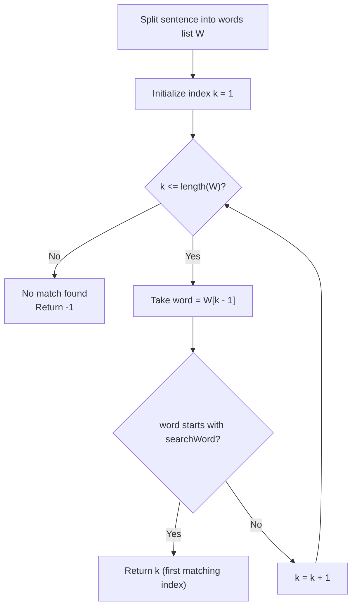

# Guided Example: Check If a Word Occurs as a Prefix of Any Word in a Sentence

We trace the step-by-step tokenization, prefix matching, and early exit search on a representative problem instance:

- **Input:** $sentence = \text{"this problem is an easy problem"}$, $searchWord = \text{"pro"}$
- **Required Output:** $2$

This instance contains multiple occurrences of words matching the search prefix (`"problem"` appears as both the 2nd and 6th word), highlighting the minimum 1-indexed word position requirement.

---

## 1. Instance & Teaching Goal

We are given a string $sentence$ consisting of lowercase English words separated by single spaces, and a target prefix string $searchWord$. We must determine whether $searchWord$ occurs as a leading substring of any word in $sentence$.
- If matches exist, return the **1-based index** of the first matching word (minimum index).
- If no word in $sentence$ begins with $searchWord$, return $-1$.

In the provided instance:
- Tokenizing by spaces yields $6$ words:
  1. `"this"`
  2. `"problem"`
  3. `"is"`
  4. `"an"`
  5. `"easy"`
  6. `"problem"`
- Word 1 (`"this"`): Does not start with `"pro"`.
- Word 2 (`"problem"`): Starts with `"pro"` because the first $3$ characters match `"pro"`.
- Although Word 6 (`"problem"`) also matches, Word 2 is the earliest occurrence.
- Result: $2$.

The primary teaching goal is to model sequential prefix testing where candidate words are checked in 1-indexed order, enabling immediate early termination upon the very first prefix match.

---

## 2. Conceptual Foundation & Invariants

Let $W = [w_1, w_2, \dots, w_m]$ be the 1-indexed list of words in $sentence$.
A word $w_k$ has $searchWord$ as a prefix if and only if:

$$|w_k| \ge |searchWord| \quad \land \quad w_k[0 \dots |searchWord|-1] = searchWord$$

The search algorithm iterates $k$ from $1$ to $m$:
- If $w_k$ satisfies the prefix condition, terminate immediately and return $k$.
- If the loop finishes without finding any match, return $-1$.

```
Token Prefix Alignment (searchWord = "pro", len = 3):
k = 1: "this"     --> prefix = "thi"  != "pro"  (No match)
k = 2: "problem"  --> prefix = "pro"  == "pro"  (MATCH! Early exit with k = 2)
k = 3: "is"       --> skipped
k = 4: "an"       --> skipped
k = 5: "easy"     --> skipped
k = 6: "problem"  --> would match, but minimal index 2 already returned!
```

We establish tracking parameters across the algorithm:

| Parameter | Type & Domain | Role in Algorithm |
|---|---|---|
| Word Position ($k$) | Integer $1 \le k \le m$ | 1-based index of current word in sentence |
| Active Word ($w_k$) | String | Word token under prefix evaluation |
| Target Prefix ($searchWord$) | String of length $L$ | Reference string of length $L = \lvert searchWord \rvert$ |
| Leading Substring | String of length $L$ | Slice $w_k[0 \dots L-1]$ tested for equality |

> **Invariant.** If the algorithm reaches word $w_k$ without returning, no word $w_j$ with $1 \le j < k$ has $searchWord$ as a prefix. Thus, the first word that matches is guaranteed to have the minimum 1-based index.



---

## 3. Step-by-Step Worked Execution

We walk through the representative instance $sentence = \text{"this problem is an easy problem"}$ with $searchWord = \text{"pro"}$ ($L = 3$).

### Step 1: Tokenization
Splitting $sentence$ by space yields:
- $w_1 = \text{"this"}$
- $w_2 = \text{"problem"}$
- $w_3 = \text{"is"}$
- $w_4 = \text{"an"}$
- $w_5 = \text{"easy"}$
- $w_6 = \text{"problem"}$

### Step 2: Sequential Prefix Testing

1. **Word $k = 1$ (`"this"`):**
   - Length check: $|w_1| = 4 \ge 3$.
   - Extract prefix: $w_1[0 \dots 2] = \text{"thi"}$.
   - Compare: $\text{"thi"} \ne \text{"pro"}$.
   - Mismatch; advance to $k = 2$.

2. **Word $k = 2$ (`"problem"`):**
   - Length check: $|w_2| = 7 \ge 3$.
   - Extract prefix: $w_2[0 \dots 2] = \text{"pro"}$.
   - Compare: $\text{"pro"} == \text{"pro"}$.
   - Match found!
   - Terminate traversal immediately and return $k = 2$.

Words $3, 4, 5, 6$ are not evaluated.

| Word Index $k$ | Word Token $w_k$ | Token Length $\lvert w_k \rvert$ | Slice $w_k[0 \dots 2]$ | Target Prefix | Match? | Control Flow |
|---|---|---|---|---|---|---|
| 1 | `"this"` | 4 | `"thi"` | `"pro"` | No | Advance to $k = 2$ |
| 2 | `"problem"` | 7 | `"pro"` | `"pro"` | **Yes** | **Early Exit: Return 2** |
| 3 | `"is"` | 2 | - | `"pro"` | - | Unreached |
| 4 | `"an"` | 2 | - | `"pro"` | - | Unreached |
| 5 | `"easy"` | 4 | - | `"pro"` | - | Unreached |
| 6 | `"problem"` | 7 | - | `"pro"` | - | Unreached |

---

## 4. Complete Execution Trace

```
Final Search Report:
Sentence: "this problem is an easy problem"
Search Prefix: "pro"
Evaluated Words: ["this", "problem"]
Match Discovered at Word 2
Subsequent Tokens Pruned: ["is", "an", "easy", "problem"]
Output: 2
```

| Traversal Step | 1-Based Rank | Word Examined | Prefix Comparison Result | Action Taken |
|---|---|---|---|---|
| Step 1 | 1 | `"this"` | `"thi"` $\ne$ `"pro"` | Continue |
| Step 2 | 2 | `"problem"` | `"pro"` $==$ `"pro"` | **Halt and emit 2** |

---

## 5. Algorithmic Correctness

**Soundness.** A word $w$ has prefix $p$ if and only if the characters of $w$ at indices $0 \dots |p|-1$ are identical to $p$. Comparing character by character confirms that $w_2 = \text{"problem"}$ indeed starts with `"pro"`.

**Completeness.** Traversal starts at word $1$ and examines each word in sequential order. Since the problem requires the minimum index of all matching words, halting on the very first match guarantees that no earlier matching word was bypassed.

---

## 6. Traps This Instance Exposes

- **0-Indexed vs. 1-Indexed Output:** Standard array indices are 0-based ($0, 1, 2, \dots$), but the problem explicitly requires 1-based indexing ($1, 2, 3, \dots$). Returning index $1$ instead of $2$ is a classic off-by-one error.
- **Substring vs. Prefix:** Matching $searchWord$ anywhere inside a word (e.g. `"pro"` inside `"reprogram"`) is invalid. The match must strictly start at index $0$ of the word.
- **Word Length Underflow:** Slicing or checking characters without verifying that $|w_k| \ge |searchWord|$ can cause index errors on words shorter than the prefix (such as `"is"` or `"an"` when tested against length 3).

---

## 7. Complexity Derivation

- **Time Complexity:** $\mathcal{O}(N)$, where $N$ is the length of $sentence$ ($N \le 100$). Tokenizing the sentence takes $\mathcal{O}(N)$ time. Testing whether $w_k$ starts with $searchWord$ takes at most $|searchWord| \le 10$ character comparisons. Overall, at most $\mathcal{O}(N)$ characters are visited.
- **Auxiliary Space Complexity:** $\mathcal{O}(N)$ to store the array of word tokens, or $\mathcal{O}(1)$ auxiliary space if scanning the string with pointers without allocating an intermediate token list.
